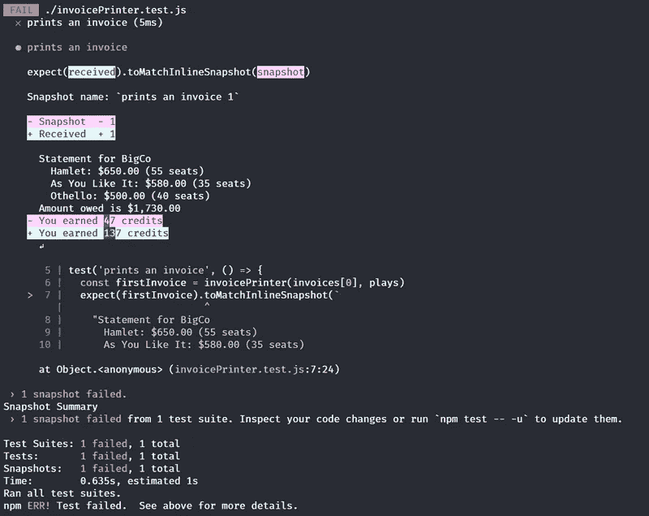

# 二分法作为一种故障排除技术，以及 Git 如何使它变得更好

> 原文：<https://levelup.gitconnected.com/bisecting-as-a-troubleshooting-technique-and-how-git-makes-it-even-better-af9dc5b565b6>

如果你更喜欢视觉学习，我有一个配套的视频，涵盖了本文的要点:

你也可以在我的博客:[https://blog.jimmydc.com/git-bisect/](https://blog.jimmydc.com/git-bisect/)上查看这篇文章以及更多更好的语法高亮

当一个 bug 显示出自己特别难以定位或复制时，我有这个方法来找到它。我称之为“二分搜索法方法”已经有一段时间了，因为我从来没有费心想出一个实际上很好的名字，这个名字描述得很好，但前提是你知道什么是二分搜索法。

二分搜索法可以简化为将一个排序列表切成两半，并查看中间部分是否是您要寻找的，或者它是否大于或小于您要寻找的。你不断重复这个过程，把你刚刚砍成两半的东西砍成两半，直到你得到你想要的东西。您可以随意查找，以获得更准确、更全面的描述，但我认为这对于本文来说已经足够了。

在我继续之前，如果你喜欢直接跳到代码示例，我已经创建了一个[示例库](https://github.com/Jimmydalecleveland/git-bisect-practice-example)，在自述文件中有试用说明。本文的其余部分将是我对我的调试技术 git 二分法的详细解释，以及它何时有用的一个例子。在文章的最后，我还得到了一些很酷的东西。

# 名不副实的“二分搜索法”查找漏洞的方法

所以我所做的非常简单，但是当我用尽了寻找 bug 的“简单”方法时，却非常有效。我在代码中放了一堆日志，然后删除/注释掉了大约一半的代码。我运行我的代码，检查日志，看看错误是否消失了。有时这就像删除页面的下半部分，或者删除文件的整个导入一样简单。有时这需要一点技巧，因为代码可能没有被编写成足够小的单元/函数。

我不打算说我是这种方法的先驱，因为我确信许多其他人也想到了这一点。不过，我确实经常向其他程序员介绍它，所以我想向不熟悉它的人简单描述一下。现在你有了背景，让我们继续讨论文章的真正主题。

# 在野外发现方法

当我每天晚上在 twitter 上巡视的时候，我发现了丹·阿布拉莫夫的一条有趣的推文:

平分螺纹原点

这引起了我的注意，尽管我不熟悉代码中的短语“二分法”,但我立即从上下文中想到了我的二分搜索法错误查找方法。当我通读这些回复时，我发现[王若伊·哈吉吉](https://twitter.com/rhagigi)发来的这条后续推文证实了我的怀疑，并给了我一个令人震惊的时刻:

哇哦。不仅意识到这是一种常规做法，而且发现其他人使用相同的术语来解释这是超现实的。然后看到一堆各种各样的回复都在说`git bisect`。我很难入睡，因为我现在很好奇`git`是否有一些自动化的方法来做到这一点，我的大脑开始想象那会是什么样子。

早上我做的第一件事就是做了一个储存库来试用，这就是结果。

[Git 二等分练习示例](https://github.com/Jimmydalecleveland/git-bisect-practice-example)

# 示例存储库简介

自从 Martin Fowler 的书《重构》第二版推出 JavaScript 示例以来，我一直在重读这本书。他这样做真的很酷；这有助于新开发人员更容易接触到内容，因为 JavaScript 近年来一直处于上升趋势，并且[非常受欢迎](https://insights.stackoverflow.com/survey/2019#most-popular-technologies)(至少自 2015 年以来，它一直处于堆栈溢出调查的首位，但这显然不是唯一要遵循的指标)。

这一次，在这本书里，我一直跟着例子，在每个重构步骤后用 [jest 快照](https://jestjs.io/docs/en/snapshot-testing)运行我的代码。这看起来像是一个测试 git 二分法的可靠的示例场景，并且出于示例目的，在现实和简单之间取得了良好的平衡。

每次提交都有前缀“refactor”，refactor 的类型(来自书中)，以及被重构的内容(如果可能的话)。像这样:

```
refactor: Extract Function -> amountFor
```

通常，重构需要由多个步骤和提交组成。在这些情况下，我使用术语`prev`来表示“这是之前重构的一部分”，就像这样:

```
refactor: prev -> renaming variables
```

在所有这些步骤的最后，当一个重构完成并运行时(希望通过测试)，你可以将所有这些提交重新组合成一个重构提交。目前，您希望许多小步骤能够隔离您引入的任何问题。git 二等分示例的完美设置。

# 虫子

在提交时，我在重构过程中故意引入了一个 bug，改变了最终的计算结果。以下是提交消息:

```
commit c12489cca6cffbee4998bd3c45bfb36a387fb128
Author: Jimmy DC <jimmydalecleveland@gmail.com>
Date: Wed Apr 8 08:48:23 2020 -0600refactor: Extract Function -> volumeCreditsFor( )
! ! I introduced a bug here ! !
```

我已经尽力使这成为一个微妙的错误，所以我将向你展示我们运行程序的输出。

```
*# Here's the original correct output:* > $ node index.js
'Statement for BigCo\n' +
'  Hamlet: $650.00 (55 seats)\n' +
'  As You Like It: $580.00 (35 seats)\n' +
'  Othello: $500.00 (40 seats)\n' +
'Amount owed is $1,730.00\n' +
'You earned 47 credits\n*# Here is the output with the bug:* > $ node index.js
'Statement for BigCo\n' +
'  Hamlet: $650.00 (55 seats)\n' +
'  As You Like It: $580.00 (35 seats)\n' +
'  Othello: $500.00 (40 seats)\n' +
'Amount owed is $1,730.00\n' +
'You earned 137 credits\n'
```

老实说，如果不测试的话，很容易漏掉这个错误，因为所有改变的只是从“47”到“137”的学分。在重构过程中，我“不小心”弄乱了学分计算的数学。我们假装没有注意到，并继续进行重构提交。

现在，在多次提交之后，我们意识到我们有一个错误。这是`bisect`大放异彩的时候了！

# 使用 git 二分查找我们的 bug

`git bisect`的目的是从一个已知的坏的/新的提交和一个好的/旧的提交开始，找到你的 git 历史中错误的来源，坏的/新的提交是我们知道错误存在的最早时间点，好的/旧的提交是我们知道错误不存在的最早时间点。然后 Git 会“一分为二”,或者像我前面用二分搜索法描述的那样，将历史切成两半，看看 bug 是否存在。我在这里使用的 bug 相当普遍，它可能是性能退化或任何不必要的行为。因此，我们将从运行符合该标准的相关命令开始。

您将从跑步开始:

```
git bisect bad
```

然后告诉它错误的提交，这通常是您当前正在进行的提交。如果是，请输入:

```
git bisect good 7ace8
```

然后我们将告诉 git 什么提交工作正常。我通常在 git 日志中查找特性提交中断的原因，并以此为起点。如果你愿意，当然可以进一步缩小范围。复制提交散列并运行:

在声明好的和坏的提交之后，git 将在两者之间检查提交。您将看到如下输出:

```
Bisecting: 5 revisions left to test after this (roughly 3 steps) [3f09766487e142c2d16e26268244b59e0ec63c61] refactor: Change Function Declaration
```

此时，您应该运行代码，看看它是否中断。对于我的例子，您可以简单地运行:

```
node index.js
```

它将输出:

```
'Statement for BigCo\n' +
'  Hamlet: $650.00 (55 seats)\n' +
'  As You Like It: $580.00 (35 seats)\n' +
'  Othello: $500.00 (40 seats)\n' +
'Amount owed is $1,730.00\n' +
'You earned 47 credits\n'
```

这是一个很好的提交，代码按预期工作，因为输出中有“47 个学分”。我们将把这个提交标记为好提交:

```
git bisect good
```

Git 将自动检查我们刚刚标记为好的提交和我们的起点坏提交之间的下一个提交:

```
Bisecting: 2 revisions left to test after this (roughly 2 steps) [c12489cca6cffbee4998bd3c45bfb36a387fb128] refactor: Extract Function -> volumeCreditsFor( )
```

当我们在这个提交上运行`node index.js`时，我们得到一个错误的提交输出:

```
'Statement for BigCo\n' +
'  Hamlet: $650.00 (55 seats)\n' +
'  As You Like It: $580.00 (35 seats)\n' +
'  Othello: $500.00 (40 seats)\n' +
'Amount owed is $1,730.00\n' +
'You earned 137 credits\n
```

由于我们得到了错误的数字，“137 个信用点”，我们将此标记为错误提交:

```
git bisect bad
```

我们将继续这个过程，直到我们到达终点。Git 将检查一个新的提交，我们将告诉它是好是坏，它将把剩余的提交列表分成两半进行检查。在此过程中的任何时候，您都可以通过运行以下命令来查看您检查过的所有提交以及您是如何标记它们的:

```
git bisect log*# bad: [99f5d6cff41e34be56b87ca833d23dfd87dbb4e1] Add simple readme* git bisect bad 99f5d6cff41e34be56b87ca833d23dfd87dbb4e1
*# good: [7ace8bed2d59a8189e939a21c5651ec52293ecf7] initial working commit with test* git bisect good 7ace8bed2d59a8189e939a21c5651ec52293ecf7
*# good: [3f09766487e142c2d16e26268244b59e0ec63c61] refactor: Change Function Declaration* git bisect good 3f09766487e142c2d16e26268244b59e0ec63c61
```

标准的`git log`还将包括提交标签旁边的“好”和“坏”信息。

最终您将到达终点，git 将输出如下内容:

```
c12489cca6cffbee4998bd3c45bfb36a387fb128 is the first bad commit commit c12489cca6cffbee4998bd3c45bfb36a387fb128 Author: Jimmy DC <jimmydalecleveland@gmail.com> Date: Wed Apr 8 08:48:23 2020 -0600 refactor: Extract Function -> volumeCreditsFor( ) 
! ! I introduced a bug here ! ! :100644 100644 50a8a5efa226292347b33cd806d52fbd70010f95 6ee577b57c0d6f3433c7ed10b0b77a07d54d158b M invoicePrinter.js bisect run success
```

我在提交中留下了这条额外小消息，这样我们就可以确定在找到 bug 的来源时，二等分是正确的。很神奇，是吧？现在，如果我们有一个测试来加速这个过程，并使它不容易出错就好了。

# 创建一个测试来更容易地对分

现在我将添加一个测试，就像我在开始重构之前应该做的那样。在现实世界中，我也对此深感内疚，如果你正在重构除了最简单的代码库之外的所有代码，你应该认真地一直进行测试。除了显而易见的好处之外，当你有一个围绕你正在改变的代码的彻底的测试套件时，它确实解除了你的一些焦虑。所以让我们做一个最简单的测试！

测试 invoice 函数的输出是内联快照的一个很好的场景:

```
test('prints an invoice', () => {
  const firstInvoice = invoicePrinter(invoices[0], plays)
  expect(firstInvoice).toMatchInlineSnapshot(`
    "Statement for BigCo
      Hamlet: $650.00 (55 seats)
      As You Like It: $580.00 (35 seats)
      Othello: $500.00 (40 seats)
    Amount owed is $1,730.00
    You earned 47 credits
    "
  `)
})
```

大多数情况下，快照太大，无法包含在我的测试文件中，但有时它们足够短，通过将它们内联，确实有助于测试可读性。Jest 将输出直接写到您的测试文件中，我喜欢它！随着所有这些令人惊叹的开源项目不断涌现并投入使用，这确实是一个开发人员的黄金时代。

我们应该做更多的测试来进一步隔离潜在的 bug，但是即使是这个简单且容易编写的测试也会让我们走很长的路。现在我们可以打开一个新的终端并运行:

```
npm t -- --watch
```

额外的`--`是将额外的标志传递给我们的测试脚本，这对于 yarn 来说是不必要的(`yarn test --watch`工作正常)。在这种情况下，我们希望打开监视模式，这样我们的测试就可以在代码更改时运行。这是魔法开始的地方。如果我们在这一点上开始一个`git bisect`，每次一个新的提交被签出，测试将会重新运行，我们将会收到自动的反馈。

这是我们发现第一个错误提交时的样子。



*注:这种新的快照差分格式来自* [*Jest v25*](https://jestjs.io/blog/2020/01/21/jest-25#colors-of-differences-when-snapshot-tests-fail) *。它看起来非常酷和可爱。他们真的为这个决定投入了一些时间和研究，这太棒了。它目前确实有一个情绪化的 bug——jest，如果你遇到的话，但是他们正在努力。(*[*Facebook/jest PR*](https://github.com/facebook/jest/pull/9863)*，*[*emotion-js PR*](https://github.com/emotion-js/emotion/pull/1850)*)*

现在我们不必每次都运行`node index.js`,如果我们只是暂时这样做，并且只是部分地关注，那么我们就不太可能错过错误的提交。我们需要做的就是观察测试，并以“坏”和“好”的形式告诉 git 它是通过了还是失败了。

或者我们真的必须这么做…？

# 用测试脚本自动化二分

我希望你留下来，或滚动到底部，这一部分。它非常雄伟，我今天在写这篇文章的时候才知道。当我返回并链接到这些推文时，我发现自从我阅读原文以来，已经发生了更多的讨论，有一些非常令人兴奋的事情在等着我:

这听起来好得令人难以置信。好吧，这是你怎么做的。开始一个二等分，声明你最初的好和坏，然后像这样运行:

```
git bisect run npm test
```

测试通过或失败的退出代码会自动告诉 git 哪些提交是好的或坏的。这简直酷毙了，看看这张 gif(。webm)出来看完整版:

[https://blog . jimmydc . com/242830 a 66 ef 4 bbeeb 8 b 8746 b 39348789/git-biquite-automated . webm](https://blog.jimmydc.com/242830a66ef4bbeeb8b8746b39348789/git-bisect-automated.webm)

# 结论

我知道这是一篇很长的文章，但我花了一段时间才发现如何正确使用这个特性，并有一些例子来尝试它，所以我希望这对像我一样对这个想法完全陌生的人来说足够全面。

在我的项目中，我将测试包含在第一次提交中，这使得整个示例有些不切实际，因为如果您像应该的那样在 CI 中运行测试，bug 将如何进入您的代码库呢？好吧，这只是为了演示，但这并不影响用 git 二等分运行测试的有用性。如果您发现一个 bug，您可以检查代码工作的提交，并为它编写一个测试。如果您不提交它，而是将它保存在 staging 中，那么您可以运行完整的二等分过程，在每个签出的提交上运行测试。

我实际上已经试过了，效果很好。我甚至在我们的一个盖茨比网站上用`git bisect`来对付一个讨厌的 bug，效果非常好。我所要做的就是每次都运行`gatsby build`,看看构建是否工作正常。如果有客户端动作，你没有测试它可能会多花一点时间，但是二分法仍然可以快速找到错误。

我很高兴能继续使用和完善这一过程，我相信你也会发现它的一些甜蜜的用途。

*原载于*[](https://blog.jimmydc.com/git-bisect/)**。**