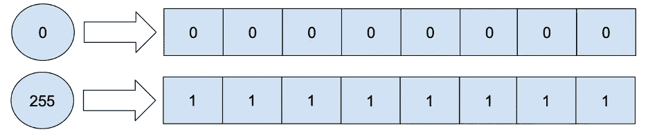
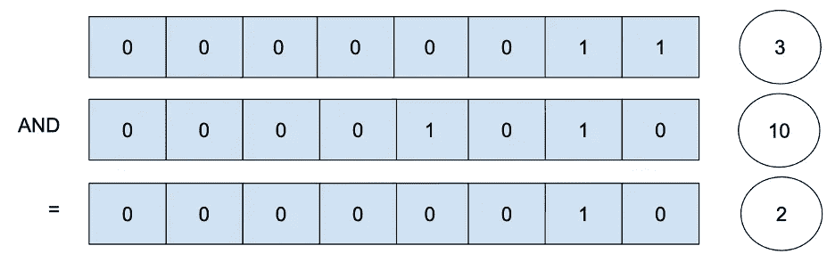
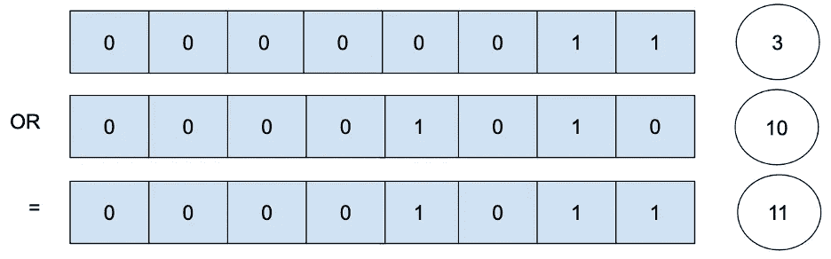
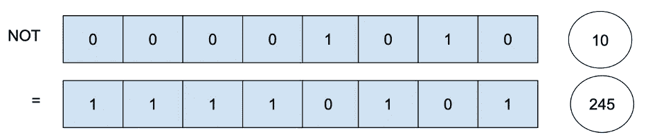
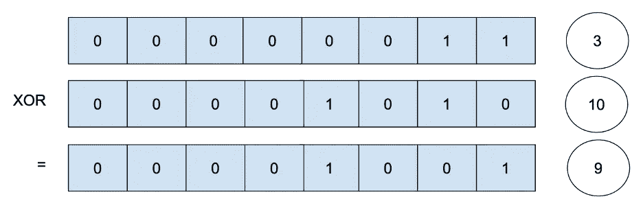
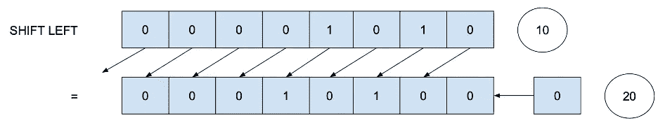
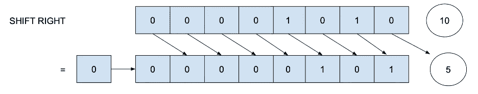
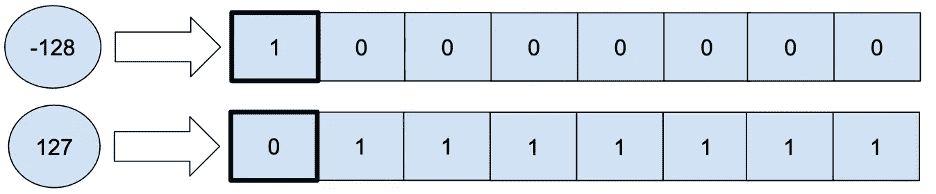
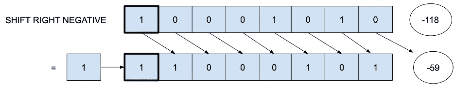
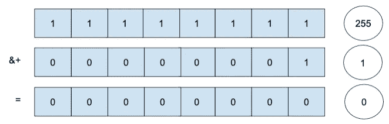

# 位操作

> 原文：<https://levelup.gitconnected.com/bit-manipulation-2bb98208832e>

## 在我们的机器中，我们使用的所有数字都用比特(0 和 1)来表示；

**整数 255 对应二进制格式**的 11111111，为“1”的 8 位(1 字节)，用于快速处理或节省内存；**我们可以直接对那些比特使用运算。**

**有六个位运算**、与、或、非、异或、左移、右移；让我们全部看看。让我们定义两个无符号整数:

# 和

and 运算符“&”比较两位，如果两位都是 1，则返回 1；否则返回 0。

这里要看到的一点是“和”数将等于或小于最小数。

# 或者

or 运算符“|”比较这些位，如果至少有一位是 1，则返回 1；否则返回 0。

这里要看到的一点是“或”数等于或超过最大数。

# 不

not 运算符“~”反转这些位，如果该位为 0，则返回 1，如果该位为 1，则返回 0。

这里要看到的一点是“非”数将是补数(两者相加等于 255，0b11111111 的最大值)。

# 异或运算

xor 运算符“^”比较这些位，如果有且仅有一位为 1，则返回 1；否则返回 0。

这里要注意的一点是,“异或”数将是“或”减去“与”

# 左移位

左移运算符"<将所有位向左移动。

**这里要看到的一点是“左移”数会乘以 2，直到出现溢出**(位 1 移出极限)。之后，左移会在弹出最后一位 1 时将数字减为 0。

# 右移

右移运算符" > > "**将所有位向右移动。**

**这里要看到的一件事是,“右移”数将被除以 2，直到我们达到值 0**(所有位 1 都已弹出)。

# 带符号整数

上面所有的例子都是用无符号整数创建的。**有符号整数用最后一位来标记符号**。对于无符号 8 位整数 UInt8，值的范围是从 0 (0000'0000)到 255 (1111'1111)，但是对于有符号 8 位整数 Int8，值的范围是从-128 (1000'0000)到 127 (0111'1111)。

对于无符号和有符号整数，所有的按位操作都以相同的方式工作(除了右移，右移之后将返回)，但是如果影响最后一位(用于确定符号)，那么**的结果可能会有所不同。**

主要区别在于有符号整数的右移；我们将使用符号位来填充，而不是不断地用 0 填充。换句话说，一个正整数将填充 0；如果是负数，我们就用 1 来填充。

# 值溢出

因为整数有一个下限和上限(对于 Int8 为-128 -> 127)，到达将引发“溢出”错误。

新运算符(&+、&-和&*)允许溢出，并且不会引发错误。

以下是如何使用按位运算的示例:

[< <贝尔曼-福特](/bellman-ford-6bd907c6c4c0) | [书](https://medium.com/@jbstevenard/learn-data-structures-and-algorithms-with-swift-5-6-d9f36a4027dd) | [递归 VS 迭代>>](https://medium.com/@jbstevenard/recursion-vs-iteration-552f00c61758)

 [## 通过我的推荐链接加入 Medium—JB stevenard

### 阅读 jb stevenard 的每一个故事(以及媒体上成千上万的其他作家)。你的会员费直接支持 jb…

medium.com](https://medium.com/@jbstevenard/membership) 

# 分级编码

感谢您成为我们社区的一员！在你离开之前:

*   👏为故事鼓掌，跟着作者走👉
*   📰查看[升级编码出版物](https://levelup.gitconnected.com/?utm_source=pub&utm_medium=post)中的更多内容
*   🔔关注我们:[Twitter](https://twitter.com/gitconnected)|[LinkedIn](https://www.linkedin.com/company/gitconnected)|[时事通讯](https://newsletter.levelup.dev)

🚀👉 [**将像你这样的开发人员安置在顶级创业公司和科技公司**](https://jobs.levelup.dev/talent/welcome?referral=true)