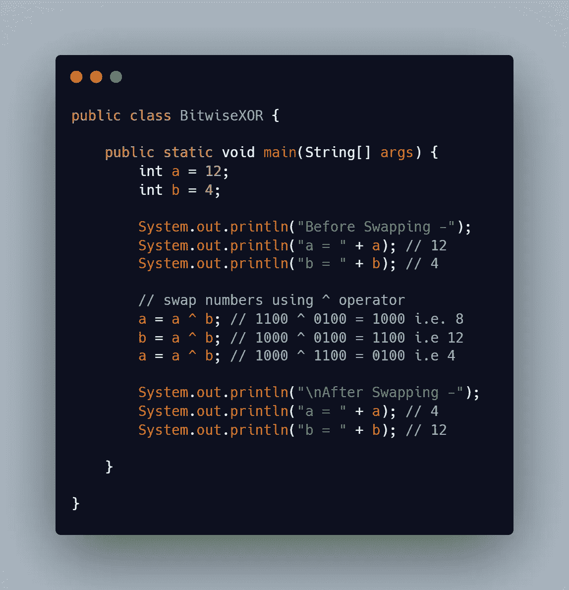
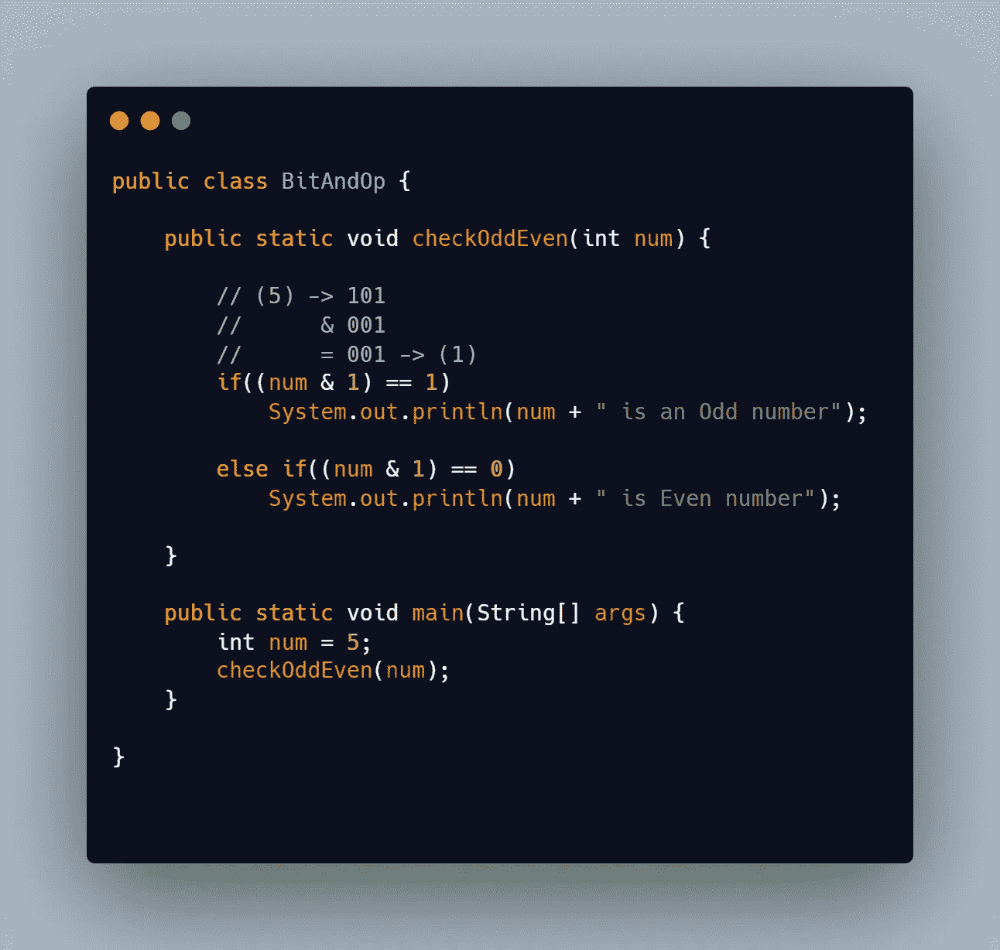
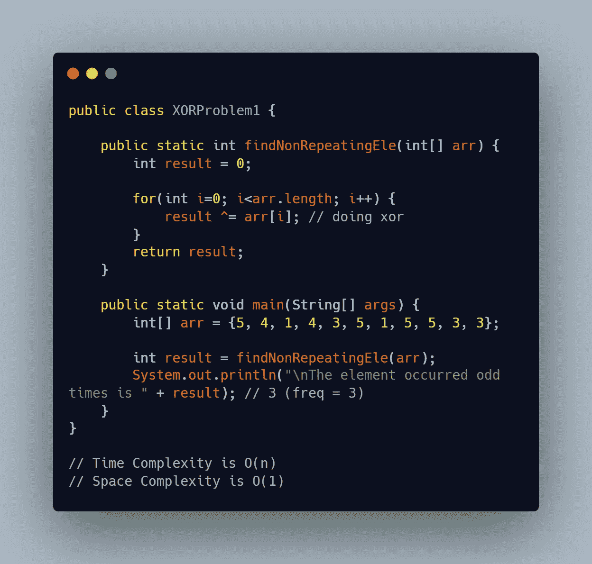
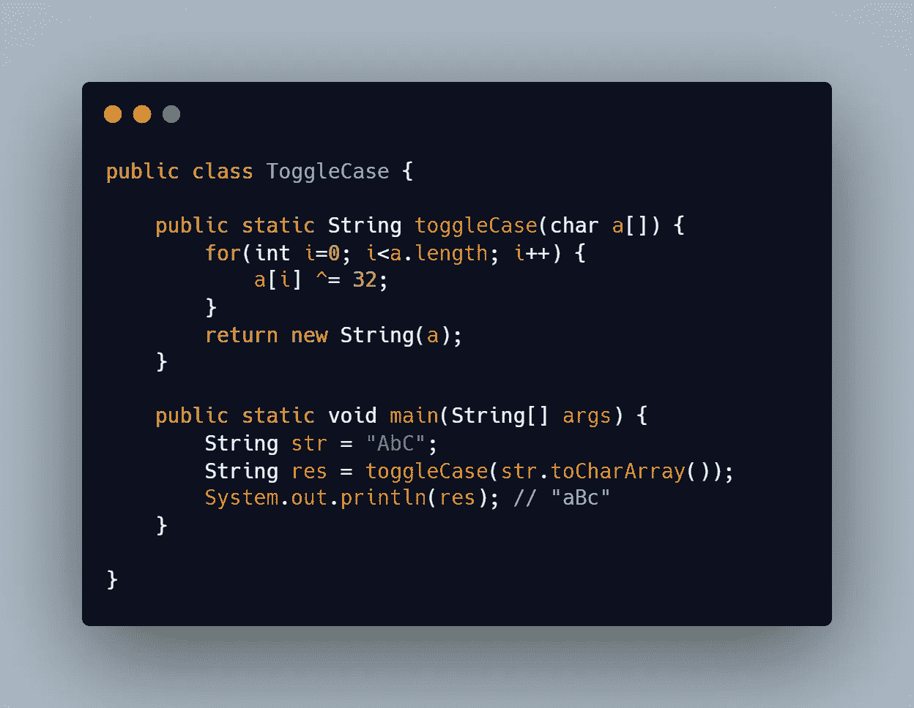

# 你应该知道的钻头操作技巧和窍门

> 原文：<https://levelup.gitconnected.com/bit-manipulation-tips-and-tricks-you-should-know-3848a9019139>

嘿大家好👋,

在本文中，我将带您了解一个最重要也是最有趣的话题——位操作！

比特是数据或信息的最小单位。一个位只有一个二进制值 0 或 1。

位操作是一种对位序列应用逻辑运算以获得所需结果的技术。

但是为什么位运算很重要呢？


我们认为位操作的主要用途是代替算术运算。但这不是真的。

位运算有许多应用。**密码学、计算机图形学、哈希函数、数字图像处理、压缩算法和网络协议**只是位运算非常有用的一些例子。

位操作技巧和诀窍也将帮助你在竞争编程以及。在竞争性编程中使用按位运算符有助于提高代码速度。比特操作具有恒定的时间复杂度。

直接在位上执行的计算非常快，因此提高了系统性能。

现在，让我们来看看一些钻头操作技巧和诀窍。您可以在日常编码任务中应用这些技巧😉。

要知道二进制数制和与、或、非、异或、右移左移(&、|、~、^、>>、<

*   **等按位运算符交换两个数的最快方法。**

我们经常遇到这种需要交换的编码问题。在这种情况下，我们通常会使用一个临时变量来交换数字。

您可以使用 XOR 完成同样的工作。让我们看看如何:



*   **快速检查一个数是奇数还是偶数。**

通常，我们做的是将这个数除以 2，如果它的余数是 0，那么这个数可以被 2 整除，否则这个数不能被 2 整除。

但是你认为这是检验一个数被 2 整除的最快方法吗？不不是的！

下面是我们使用按位运算符可以做的事情。只需对一个数字执行 1 的按位与运算。如果(n & 1)得出 1，那么这个数不能被 2 整除。否则，是的，它是可分的。



*   **神奇的异或运算符。**

按位异或运算符用于许多编码问题。一个简单的例子可以是“给定一组数字，其中除了一个数字之外，所有元素都出现偶数次，找到奇数出现的数字”。

你可以很容易地解决这个问题，只要对所有的数字进行异或运算。



如果我们对零和某个位进行异或运算，它将返回该位:`**a ^ 0 = a**`

如果我们对两个相同的位进行异或运算，它将返回 0: `**a ^ a = 0**`

对于 n 个数字，可以应用下面的数学:`**a ^ b ^ a = (a ^ a) ^ b = 0 ^ b = b**`

*   **将大写字母转换成小写字母，反之亦然。**

英文字母的位表示法

```
**A -> 01000001          a -> 01100001
B -> 01000010          b -> 01100010
C -> 01000011          c -> 01100011
........               ........
Y -> 01011001          y -> 01111001
Z -> 01011010          z -> 01111010**
```

小写和大写字母的二进制表示几乎相同，只有 **1** 位的区别。

通过进行 XOR 运算，我们切换该单个位，并将其交换为相反的值。它会将大写字母转换成小写字母，反之亦然。

你可以通过`**ch ^= 32**`将任意字符`**ch**`转换成相反的大小写。



*   **使用右移和左移操作符你能做什么？**

将整数的位左移一位相当于将该数乘以 2，而将它们右移一位相当于将该数除以 2。

将整数‘a’左移一个整数‘b’(a<< b) is equivalent to multiplying x with 2 ^ b (2 raise to power b).

Similarly, (a >> b)相当于将 x 除以 2 ^ b

我希望你在这篇文章结束时学到了一些新东西。在你的日常编码中使用这些技巧😉。

如果你觉得这篇文章很有见地，请鼓掌。

快乐学习！

# 分级编码

感谢您成为我们社区的一员！更多内容见[升级编码出版物](https://levelup.gitconnected.com/)。
跟随:[推特](https://twitter.com/gitconnected)，[领英](https://www.linkedin.com/company/gitconnected)，[通迅](https://newsletter.levelup.dev/)
**升一级正在改造理工大招聘➡️** [**加入我们的人才集体**](https://jobs.levelup.dev/talent/welcome?referral=true)