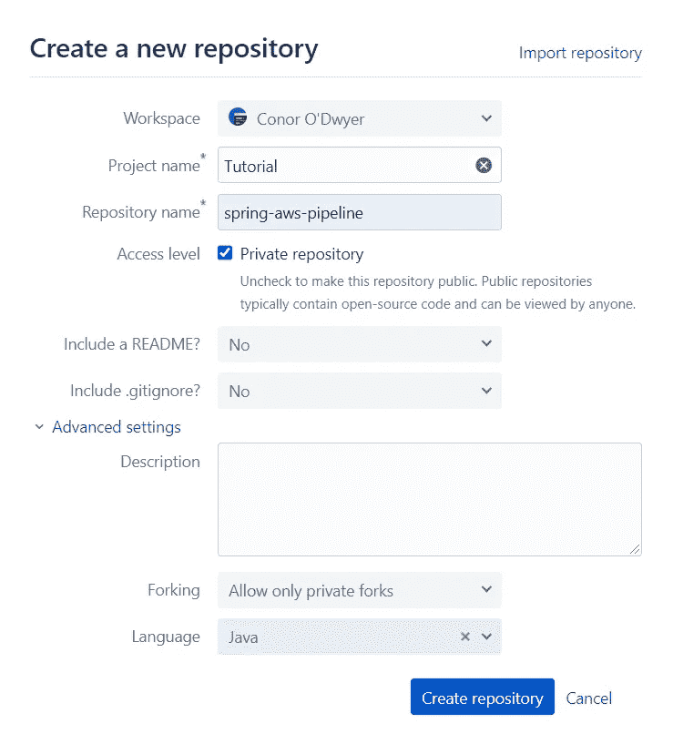
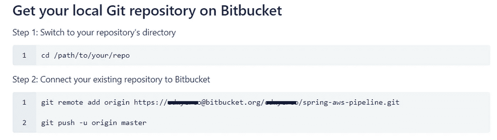
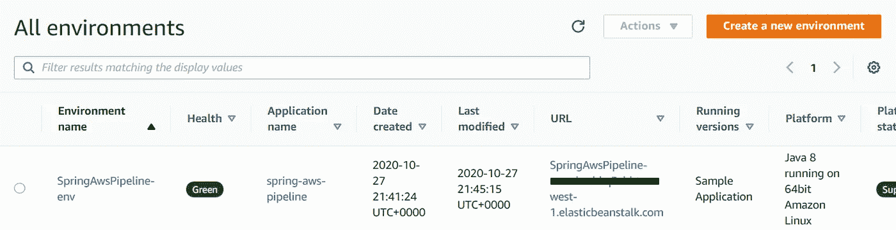
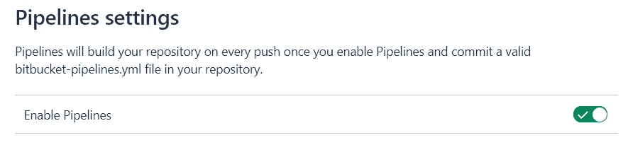
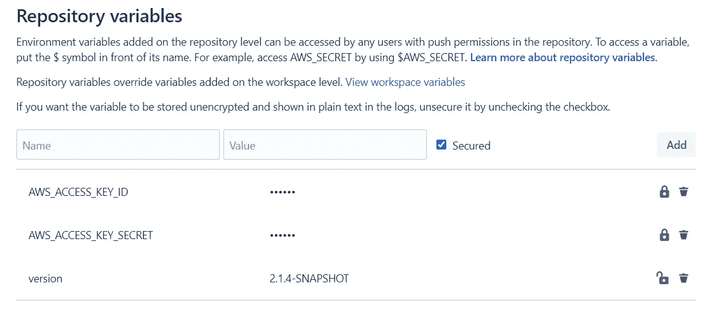

# AWS 弹性豆茎斗形管道

> 原文：<https://levelup.gitconnected.com/bitbucket-pipelines-with-aws-elastic-beanstalk-9ca71ac13ca3>

在本教程中，我将演示如何在提交代码时使用 Bitbucket 管道来自动更新 AWS Elastic Beanstalk 的部署。一个简单的 Spring Boot 应用程序将被用作部署在 Elastic Beanstalk 上的示例应用程序。

本教程假设您对 Git、AWS 有基本的了解，并且您有一个 Spring Boot 项目，希望使用 Bitbucket 管道在 Elastic Beanstalk 上进行部署。

# 1.位存储库设置

如果您还没有 Bitbucket 帐户，您需要在这里创建一个[。如果您的存储库已经托管在 Bitbucket 上，您可以跳到下一节，否则您将需要为您的 Spring Boot 应用程序创建一个新的存储库，如下所示。](https://bitbucket.org/)



如果您有一个现有的本地存储库，但尚未将其链接到远程存储库，您可以按照新的 Bitbucket 存储库中的说明进行操作。



如果您有一个现有的 Git 存储库，但是它托管在一个不同的存储库(比如 GitHub)上，那么您可以从您的本地存储库目录使用以下命令将它更改为指向您新创建的 Bitbucket 存储库。

```
git remote set-url origin [https://*username*@bitbucket.org/*username*/*repository_name*.git](https://username@bitbucket.org/username/repository_name.git)
```

# 2.在弹性豆茎上展开 Spring Boot

如果你还没有 AWS 账户设置，你需要在这里创建一个账户[。本教程中的所有内容都在自由层使用限制范围内。](https://portal.aws.amazon.com/billing/signup#/start)

如果您已经在 Elastic Beanstalk 上部署了 Spring Boot 应用程序，那么可以跳到下一节。

您首先需要使用 mvn package 命令将您的 Spring Boot 应用程序打包成一个. jar 文件。这将创建您的。根据 pom.xml 文件中的 artifactId 和版本，将 jar 文件放在/target 目录中。

在 AWS 控制台中，导航到 Elastic Beanstalk 并选择 Create Application。输入应用程序名称(通常与您的 Spring Boot 项目/存储库名称相匹配),并选择适用于您的应用程序的 Java 平台分支和版本。在应用程序代码部分选择“上传您的代码”,然后上传您的。jar 文件在源代码源部分。文件上传后，单击创建应用程序。这将创建您的弹性 Beanstalk 环境和应用程序。

一旦部署了您的应用程序，您将看到运行状况为绿色。您还可以从该窗口中看到环境名称和应用程序名称，稍后您会用到它们。



您现在可以配置位桶管道了。

# 3.启用位桶管道

既然您已经在 Elastic Beanstalk 上运行了 Bitbucket 存储库设置和应用程序，那么您将需要启用 Bitbucket 管道。从您的存储库中，单击菜单中的存储库设置，滚动到管道部分并选择设置。您将需要启用管道。



然后，您需要为您的存储库创建一个 bitbucket-pipelines.yml。您可以直接在 Bitbucket 上创建它，也可以在您的本地存储库中创建它，然后将新文件推送到 Bitbucket。这个文件应该在项目的根目录下，在 pom.xml 文件的旁边。下面是一个 bitbucket-pipelines.yml 文件的例子，用于更新您的 Elastic Beanstalk 应用程序。

```
image: maven:3.6.1pipelines:
  default:
    - step:
        caches:
          - maven
        script:
          - mvn clean package
        artifacts:
          - target/*
    - step:
        caches:
          - maven
        script:
          - pipe: atlassian/aws-elasticbeanstalk-deploy:0.6.6
            variables:
              AWS_ACCESS_KEY_ID: '$AWS_ACCESS_KEY_ID'
              AWS_SECRET_ACCESS_KEY: '$AWS_ACCESS_KEY_SECRET'
              AWS_DEFAULT_REGION: 'eu-west-1'
              APPLICATION_NAME: 'spring-aws-pipeline'
              ENVIRONMENT_NAME: 'SpringAwsPipeline-env'
              ZIP_FILE: 'target/spring-aws-pipeline-$version.jar'
```

文件开头的图像指定了用于管道的 Docker 图像。在这种情况下，它是一个 maven 映像，因为它是打包我们的 Spring Boot 应用程序所必需的。在管道部分，指定了要执行的步骤。

第一步是使用“mvn clean package”命令打包您的应用程序(如果您在打包应用程序时运行了任何其他命令，请将它们放在这里),并创建一个目标/目录工件，您的。jar 文件被打包。

第二步使用[AWS-elastic beanstalk-deploy](https://bitbucket.org/atlassian/aws-elasticbeanstalk-deploy/src/master/)管道来部署新创建的。jar 文件添加到您的弹性 Beanstalk 应用程序中。在 bitbucket-pipelines.yml 文件中使用$符号指定将在 bitbucket 中设置的环境变量。这用于$AWS_ACCESS_KEY_ID，$AWS_ACCESS_KEY_SECRET 和$version 以上。您需要为您的 AWS 环境创建一个拥有对 Elastic Beanstalk 的完全权限的[访问密钥 ID 和秘密](https://docs.aws.amazon.com/general/latest/gr/aws-sec-cred-types.html)，如果您还没有的话。AWS_DEFAULT_REGION、APPLICATION_NAME 和 ENVIRONMENT_NAME 应该替换为您的 Elastic Beanstalk 应用程序的值。ZIP_FILE 中的“spring-aws-pipeline”部分应该替换为您的 Spring Boot 应用程序名称。

然后，您需要在 Bitbucket 上设置$AWS_ACCESS_KEY_ID、$AWS_ACCESS_KEY_SECRET 和$version 变量。从存储库中，单击菜单中的“存储库设置”,滚动到“管道”部分并选择“存储库变量”。version 变量必须与应用程序的 pom.xml 文件中的版本相匹配(每次为 pom.xml 文件更新该变量时，您需要在 Bitbucket 上手动更新它)。



# 4.结论

现在，您已经成功地配置了 Spring Boot 应用程序和 Bitbucket，以便在每次提交到存储库的主分支时自动部署到 Elastic Beanstalk。当您推送 bitbucket-pipelines.yml 文件的更新时，您将能够通过单击菜单中的 pipelines 部分来查看管道执行状态。您应该看到您的管道已经“成功”了。