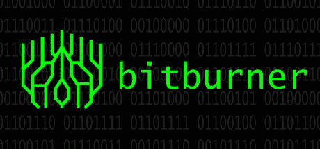
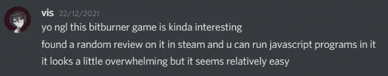
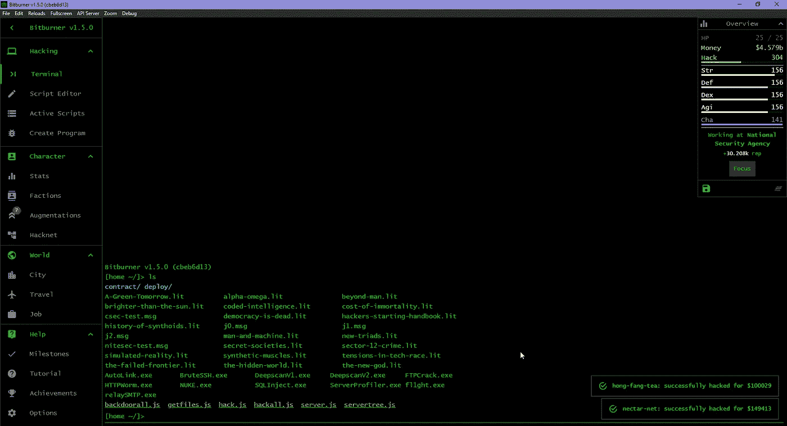
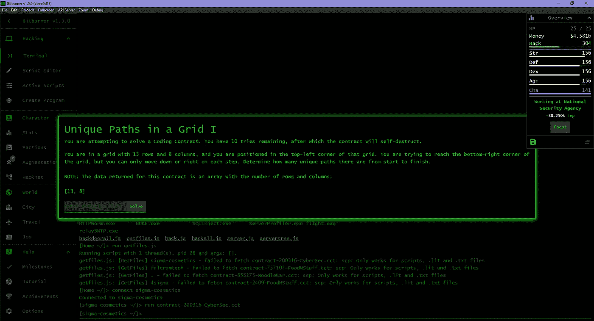

# bitburner——一个编程 RPG

> 原文：<https://levelup.gitconnected.com/bitburner-a-programming-rpg-2daa6e7b6444>

## 角色扮演游戏符合编码

[钻头|蒸汽](https://store.steampowered.com/app/1812820/Bitburner/)

我从来没有听说过这种游戏会在游戏中包含编码，我也没有想过。直到有一天，我的朋友，他也编码，开始提到一个这样的游戏:

作为一名计算机科学专业的学生，这引起了我的兴趣。在这个游戏中投入了将近 19 个小时之后，我不得不说 Bitburner 真的很适合那些对编程知之甚少甚至没有编程知识的人去**学习编程**。

# 什么是 Bitburner？

**Bitburner** 是一款**闲置、基于文本的角色扮演游戏**，于 2021 年 12 月 18 日发布(Steam)。你在一个赛博朋克反乌托邦世界中扮演一名黑客，这个游戏有你使用**代码**进行互动的元素。推荐有编程背景，但是**玩这个游戏不需要什么知识**。

# 游戏部分

末端的

基本玩法主要是黑服务器和抢文件，可以用代码**自动化**。你可以使用 **NetScript** ，一种专为这个游戏设计的语言，或者 **JavaScript** ，一种人们实际使用的语言。

为了在服务器和文件之间导航，主要使用**命令行**。大多数命令类似于 Linux 终端命令，这在我切换到 Linux 工作时非常有用。

除此之外，你还可以解决在你入侵的服务器中发现的**合同**(编码问题)。这对初学者非常有帮助，因为他们学习为合同编写解决方案。

契约

此外，别忘了你身处一个世界，这意味着你可以得到一份工作，在健身房训练你的统计数据，甚至渗透到商业领域。

当你玩这个游戏时，你还会遇到邀请你的**派系**，一旦你加入了一个派系，你就可以解锁**增强功能**，这将允许你加快你的进程。

派别

# 我的经历

这个游戏一开始看起来很强大，但是在编辑器中玩了一段时间并阅读了文档之后，我逐渐习惯了这个游戏。这只是一个普通的闲置角色扮演游戏，以编码为工具**解决问题**和**自动化游戏**。而且我在这个游戏中做的编码量是**很多**，因为我会忙于尝试改进我的黑客程序使其更有效，或者编写一个脚本来与游戏中可用的某些**API**进行交互。

# 结论

玩 Bitburner 对我的大学假期真的很有帮助，让我在一个**有趣的环境**中**练习编码**。我肯定会**向每个对编程有**兴趣**，或者有**背景**的人推荐**这款游戏。

Bitburner 可以在浏览器 或者 Steam 免费下载的 [**中播放**](https://store.steampowered.com/app/1812820/Bitburner/)**[。](https://danielyxie.github.io/bitburner/)**