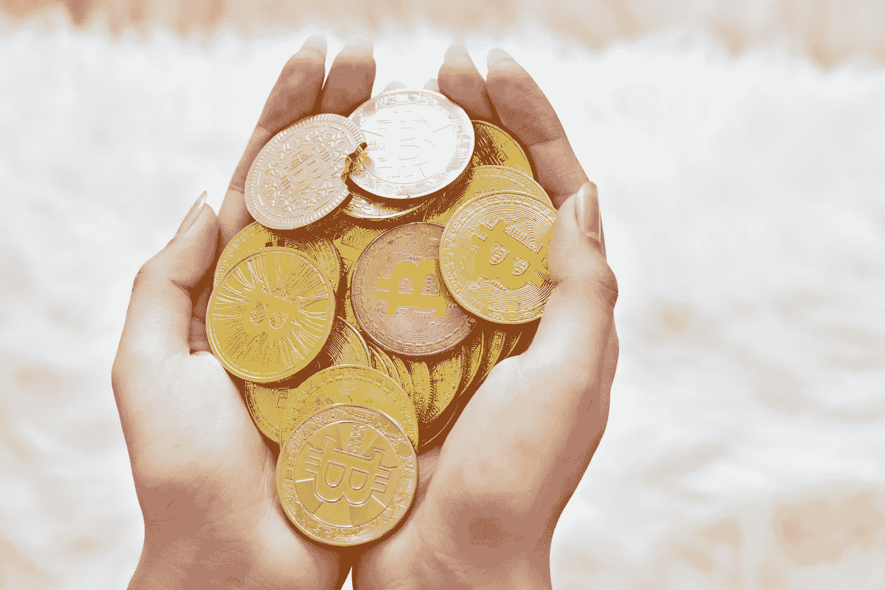

# 比特币可能成为一股有益于社会的力量——以下是具体方法。

> 原文：<https://levelup.gitconnected.com/bitcoin-could-be-a-force-for-social-good-heres-how-2a4150f2a1e>

## 把权力带给人民(全体人民)

[行政长官](https://unsplash.com/@executium?utm_source=unsplash&utm_medium=referral&utm_content=creditCopyText)在[广场](https://unsplash.com/s/photos/coins-in-hands?utm_source=unsplash&utm_medium=referral&utm_content=creditCopyText)拍照

抛开一些人对比特币表达的彻底怀疑，更实质性的担忧往往归结于环境、社会和治理因素——投资界统称为 ESG。

当怀疑者谴责比特币是一个精心设计的技术庞氏骗局，或认为比特币天生一文不值，因为它无法触摸，也没有支持，这相当于观点问题。

我们可以整天争论这些想法的优点和事实准确性，许多人在 Twitter 上花时间做这些事情:

内森·惠特莫尔在[推特](https://twitter.com/nlw/status/1366722002153836549?s=20)

当谈到比特币及其 ESG 证书时，情况变得有点复杂。

当主流媒体想要对比特币的长期前景发出警告时，环境问题往往是他们的首选。像 BBC 的[这样的懒惰故事是这种类型的好例子——它们预示着比特币泡沫即将破裂，这将通过其糟糕的环境证书引发。这个故事是肤浅的，忽略了对主题进行任何有意义的深度调查，或者提供除了一点旨在抓住注意力的证据之外的证据。](https://www.bbc.co.uk/news/science-environment-56215787)

另一个例子是，最近的新闻报道称，中国禁止在内蒙古开采比特币，因为该地区未能达到政府降低能源使用量的目标。鉴于中国约占所有比特币开采的 65%,内蒙古约占其中的 8%,怀疑论者可能会宣称这是环境的胜利。

然而，比特币人士也会宣称同样的胜利，指出内蒙古是中国两个最大的燃煤能源消费者之一。参与比特币开采的中国其他地区支持使用清洁和可持续的能源，如水电——这一举动表明，比特币正在推动向更清洁能源的转变，以满足其巨大的电力需求。

辩论仍在继续。

我试图在另一篇文章中尽可能平衡地总结一下关于比特币和环境的情况——这是我非常感兴趣的事情，将来可能会写更多。

出于这篇文章的目的，我想看看比特币的社会因素。

# 社会困境

在互联网上，甚至只是在 Medium 上快速搜索一下，就会发现一些人的观点，他们认为比特币是富人用来变得更富的另一种工具——在这个过程中，穷人处于底层。[杰西卡·野火](https://medium.com/swlh/if-you-ride-a-bubble-youre-likely-to-get-eaten-by-a-whale-79b4c834dcd9)的这篇优秀作品就是这样一个例子，她是我最喜欢的作家之一。郑重声明，我喜欢杰西卡的作品，并将继续阅读和欣赏她对与我自己的世界观相冲突的论点的陈述——这有助于挑战我的想法，并促进思考。我鼓励你也这样做。

在我看来，比特币的社会影响不在于它是否能满足所有人的所有需求——显然这是不可能的。

*   **不是每个投资比特币的人都会变得同样富有或者血本无归**——通过远见或者纯粹的好运，一些人会低买高卖，或者持有财富。其他人会在买入炒作后失去农场。相对成功是关于时机、你承担多大风险以及你的投资是否多样化。这不是资产本身是否不公平地向富人或穷人倾斜的函数。同样的规则适用于所有的投机性投资。
*   并非每一种资产类别、货币或价值储存手段都会被比特币取代——它已经定义了使用案例和特定方面，使其具有吸引力和实用性。它几乎不可能取代已经存在并发展了几个世纪的传统全球货币体系。比特币是否被认为对所有人都一样有用，一样容易获得，不应该用它是否会征服整个金融和经济基础设施的标准来判断。
*   为了保护和增加财富，比特币并不是人们唯一应该投资的东西。即使是最坚定的比特币投资者也建议将其作为平衡投资组合中相对较小的一部分。仅用你能承受损失的资金进行投机的建议得到了广泛认同和普遍接受。

考虑到这些因素，从根本上判断比特币是否有利于社会的某一部分似乎更为明智:

*   它真的对所有人都一样有用吗(或者它有可能有用)？
*   所有人都能轻松访问和使用它吗？
*   在不同的用例中，它是否为所有人提供了相同的潜力？

这些问题的答案决定了比特币是否有潜力消除社会中的机会障碍，或者仅仅是强化这些障碍。

不可否认的是，比特币最大的投资者和最有发言权的粉丝包括那些已经很富有的人(举两个例子，埃隆·马斯克和保罗·都铎-琼斯)。这不是比特币仅限于精英阶层的功能。比特币不是富人对穷人的场景。

当你更全面地了解比特币和加密货币时，很明显，这些边缘案例被加密生态系统以外的人视为常态，因为它们是新闻中转播的高调例子。但还有许多其他案例表明，比特币为许多更贫困的社会成员带来了真正的价值和效用。

比特币作为一种技术，被设想和设计为开源、去中心化、对所有人平等可用和有用。有许多迹象表明，它在继续成功地实现这些目标。

# 微不足道的进入壁垒

批评人士称，贫困阶层获得比特币存在根本性障碍。这种说法很容易做出，并能引起那些受社会平等驱使的人的深刻情感反应。

例如，一个常见的误解是，你需要有巨大的家庭计算能力才能访问或拥有比特币。这是错误的。

有了基本的互联网接入，无需专业硬件，你就可以购买、拥有和出售比特币。它存储在一个加密钱包中，可以像智能手机上的免费应用程序一样简单。如果你想让你的硬币完全离线(这是推荐的最佳做法)，你可以花不到 100 美元买一个硬件钱包。

为了更真实地了解拥有比特币的相对障碍，也许可以体验一下购买比特币的速度，然后将其与投资其他资产——实物黄金、公开交易股票或交易所交易基金(ETF)——所需的时间进行比较。我

当我第一次[购买一个微不足道的少量比特币](/the-exact-process-i-used-to-buy-my-first-bitcoin-in-under-an-hour-bee2df1ee001)时，花了不到一个小时(包括观看一些基本的 YouTube 教程和在一个流行的加密交易所开户)。

投资实物黄金、基金或股票并不迅速(或容易)。首先，你需要银行账户、身份证和地址历史证明。这些东西并不像我们试图让自己相信的那样随处可得。

英国金融行为管理局估计，英国有 130 万成年人“没有银行账户”——他们没有银行账户。[在美国，联邦存款保险公司估计没有银行账户的成年人数量为 1410 万，占总人口的 6.5%。根据联邦存款保险公司的数据，这个群体的构成也是不均衡的:](https://www.businessinsider.com/coronavirus-stimulus-check-payment-no-bank-account-waiting-2020-5?r=US&IR=T)

> “在低收入家庭、受教育程度较低的家庭、较年轻的家庭、黑人和西班牙裔家庭、工作年龄的残疾人家庭和收入不稳定的家庭中，无银行账户和银行服务不足的比率较高，”

对于那些希望参与传统金融体系的人来说，缺乏基本的银行账户是一个根本性的重大障碍，更不用说投资*任何*资产了。例如，尝试在没有银行账户的情况下，将 Covid 刺激计划支票存入银行。

我们面临着误入金融不平等领域的风险，以及那些没有银行账户的人是否会担心投资比特币或其他任何东西——在许多情况下，他们可能只能勉强度日。但这不平等不是比特币的功能，也不会因为比特币的存在而变得更好或更坏。

的确，银行账户无论如何都不是投资比特币的必要条件。当我开设加密交易账户时，我必须提交 ID 以验证我的身份，如果我真的只想拥有比特币，这一步可能会被绕过。我可以为我的智能手机下载一个免费的加密钱包应用程序，并从柜台(OTC)供应商那里购买。

或者，我可以从其他愿意给我送比特币的人那里收到比特币，或许是为了换取商品或服务。如果你想持有比特币，不存在法律或结构上的障碍。

# 无最低投资额

在我使用的交易所，我对比特币的最低投资是 10 英镑。当然，你不会因为那笔钱而得到很多，但是在你进入这个游戏之前，你不需要有最低的积累。

每次我多买一点感觉都很好(我已经做了很多不到 100 美元的小投资来建立我的持股)。我的目标是逐渐积累更多，并长期持有。按照许多人的标准，我在价格高的时候买了，但随着时间的推移，我相信平均成本会使事情变得平稳。

如果你真的想拥有比特币，现在有合法的途径。你不需要积累足够的钱来购买一整金衡盎司的黄金。你不需要足够的钱来买一整股脸书股票(加上交易费)。

当人们听说一枚比特币价值 4 万美元以上时，一个常见的误解是他们负担不起这样的价格——谁能负担得起？

事实上，基础协议的设计是每个比特币由 1 亿个 Satoshi(以比特币的假名创始人命名)组成。虽然许多比特币投资者梦想拥有一整枚(或更多)比特币，但我们可以一次拥有一枚。

比特币没有最低投资额的限制。

# 平等参与数字交易

一旦个人持有比特币，通过拥有与他们的硬币相关联的私有密钥，他们就准备好发送和接收比特币作为价值交换。这就是货币用例发挥作用的地方。

人们仍然普遍认为，与作为价值储存手段相比，比特币作为交换手段(严格来说，是对 Visa 交易的对等替代)的用例并不是最成熟或最广泛的用法。

比特币*今天可以用来*通过一笔比特币的方式将*价值从一个人转移到另一个人(它的点对点方面)。这种产品的吸引力在某种程度上受到其价格波动和频繁变动的限制。今天被派去买一束花的几个 Satoshis 可能足够在一个月后买一卡车的花。*

尽管如此，对于一个人来说，同意将一笔钱寄给另一个人，然后迅速、容易且无可辩驳地从一个人寄给另一个人，这是可行的*。从社会角度来看，在人们持有或兑换传统货币受到限制的文化或环境中，这种吸引力变得更加重要。*

以生活在阿富汗的博主 Parisa Ahmadi 为例。她已经能够绕过家长制的社会规则，否则这些规则会阻止她作为一个女人赚钱或拥有银行账户。能够建立一个加密钱包使她能够接收比特币付款，并最终用自己的工作收入购买自己的笔记本电脑——这一切都是因为她能够在一个本来不允许的社会中接收比特币付款。

# 防范传统货币的通货紧缩

比特币帮助缓解社会问题的最后一个方法是，让货币处于恶性通胀的国家的公民拥有一些储存和保护财富的手段。

在像委内瑞拉和阿根廷这样的国家，传统货币的过度通货膨胀正在使公民的储蓄贬值，推高主要商品的价格，许多人求助于比特币作为储存他们积累的财富的手段，并在必要时用它来购买必需品。

[尼日利亚是另一个例子](https://www.bbc.co.uk/news/world-africa-56169917)，在尼日利亚，货币贬值鼓励公民投资比特币，作为对冲本币奈拉通胀的一种手段。按交易量计算，尼日利亚是仅次于俄罗斯和美国的第三大比特币交易商，该国许多公民认识到，当比特币相对于美元标准每天都在贬值时，赚钱并希望将价值储存在奈拉是注定要失败的。

从长远来看，继续这样做可能会有问题，因为尼日利亚央行正在寻求立法，以阻止金融机构允许货币交易比特币——时间当然会证明这是否会生效，或者它是否会在实质上阻止公民利用比特币的好处。

尽管在一些政府缺乏严格可靠的货币政策的情况下，公民似乎已经适应了比特币带来的机会，这有助于他们为自己控制货币体系。

# 争取平等

我提供的例子可能只是触及了比特币社会层面的皮毛。再多的证据也无法动摇这位顽固的批评家，但同样我也注意到，我是从一个坚定支持比特币概念的人的角度来看待这些问题的。我也不公正。

不过，我确实看到了它带来的机遇——不是解决所有的社会问题，甚至是现有金融体系中固有的问题，而是为世界各地的人们提供一种新的经营方式，储存他们的财富，并有可能增加财富。世界上所有公民都可以平等地获得这些机会，金融机构的现有基础设施也是如此。除此之外，比特币还带来了许多好处——这些已经被描述过了。

最后一句话是留给最近的一个慈善例子，该例子集中在提高比特币在技术普及程度较低的国家的可及性和实用性。

Twitter 和 Square 的首席执行官杰克·多西和说唱歌手 Jay-Z 共同出资 500 比特币(约 2500 万美元)资助项目，以提高比特币在这些国家作为首选互联网货币的认知度。印度是另一个国家，其政府目前正在探索禁止通过央行使用比特币，转而支持国有的发达加密货币。

尽管如此，多尔西和 Jay-Z 建立的盲目信托展示了领先企业家和科技公司首席执行官被驱使帮助比特币融入世界的方式，这不仅是为了增加他们自己的财富或形象，也是为了帮助贫困国家的人们推进这项事业。

比特币似乎为弥合社会分歧提供了巨大的潜力，而不仅仅是让富人中饱私囊。时间会证明一切！

如果你喜欢阅读这样的故事，并且愿意支持 Medium 上的作家，考虑注册成为 Medium 会员。一个月 5 美元，给你无限的故事。如果你注册使用我的链接，我会赚一小笔佣金。

 [## 阅读托比·黑兹伍德(以及媒体上成千上万的其他作家)的每一个故事

### 作为一个媒体会员，你的会员费的一部分会给你阅读的作家，你可以完全接触到每一个故事…

tobyhazlewood.medium.com](https://tobyhazlewood.medium.com/membership) 

## [***如果你喜欢这篇文章，我希望你能加入我的邮件列表。***](http://bit.ly/TobyHazlewoodList)