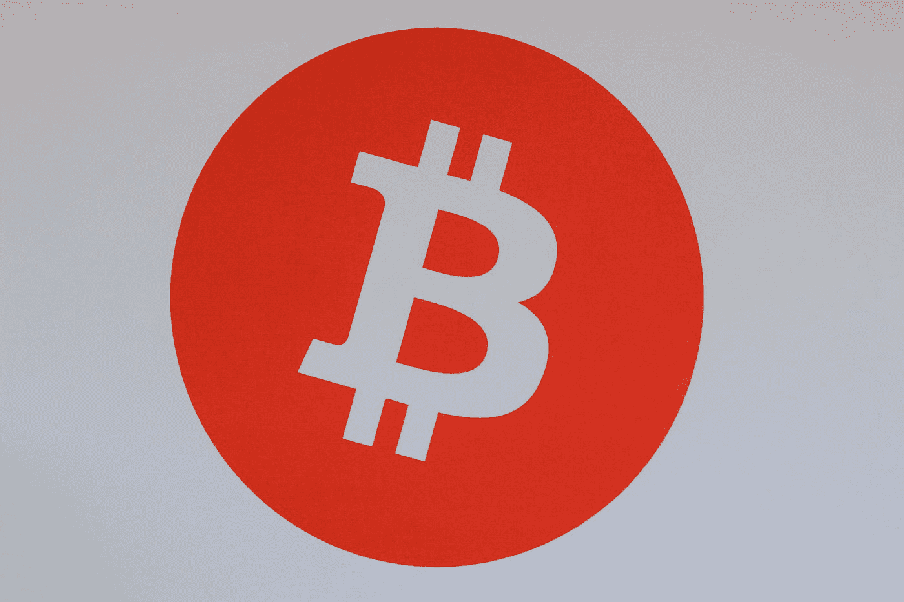

# 比特币下跌！收到刺激支票。是时候购买了…

> 原文：<https://levelup.gitconnected.com/bitcoin-down-stimulus-check-received-time-to-buy-29ab05232347>

## 恐慌不是你的朋友。关注基本面。别忘了通货膨胀。

米歇尔·汉德森在 [Unsplash](https://unsplash.com?utm_source=medium&utm_medium=referral) 上的照片

今天早上醒来，我收到了银行发来的一条非常好的消息。我的刺激支票到了。哇，这一次政府的行动比我预期的要快！

然后我查了加密图表。WTH？比特币下跌 6%？

猜猜我用我的支票做了什么？我把一部分投入了比特币。

这是一个好的举动吗？

只有时间能证明一切。

然而，当你投资时，重要的是要着眼于大局。出于各种原因，总体情况对比特币非常乐观。其中一个和我的刺激计划有关。

早在 1 月份，美国美联储主席杰罗姆·鲍威尔(Jerome Powell)表示，央行欢迎 2021 年的通胀，认为这是疫情之后经济复苏的迹象。

## 那么什么是通货膨胀呢？

奥地利经济学将通货膨胀定义为通过货币和信贷的增加来增加货币供给。然而，联邦政府将其定义为随着时间的推移，商品和服务的一般价格的增长。政府使用的一个指标是 CPI，即消费者价格指数。这是根据城市消费者为一篮子产品支付的价格计算出来的。

迷茫？

不是要诽谤我们优秀的政府，但是 CPI 是以一种特殊的方式计算的，这有什么理由吗？例如，社会保障提供与通货膨胀挂钩的生活费用增长。

如果我们使用其他通胀指标，而不是官方 CPI(2019 年为 2.3%，通常每年在 1-2%之间)，会怎么样？例如，[“卷饼指数”。按照这一标准，实际通胀率可能接近 7%。](https://www.businessinsider.com/if-people-knew-the-actual-inflation-rate-it-would-crash-the-economy-2016-8#:~:text=Unbiased%20private%2Dsector%20efforts%20to,of%20around%201%25%20per%20year.)

这是一个更现实的通货膨胀衡量标准吗？经济政策研究所 2019 年[的一份分析](https://www.epi.org/publication/congress-has-never-let-the-federal-minimum-wage-erode-for-this-long/)暗示这可能是真的。研究发现，2019 年联邦最低工资的购买力比 2009 年低 17%，比 1968 年的最低工资低 31%。难怪我们看到美国的收入不平等日益加剧。当工薪阶层看到他们的实际收入下降时，富人投资于更有可能跟上“玉米煎饼指数”的项目——股票、房地产等。

作为一个倾向于同意奥地利经济学家的人，我认为我们收到的刺激支票加剧了通货膨胀趋势…

## 这对你我意味着什么？

这意味着，如果我拿着我的刺激支票，把它存入我的储蓄账户，我就是个白痴。

不要误解我。每个人都应该有一个应急基金。Dave Ramsey 建议每个人在应急基金中储存 3-6 个月的费用。我的印度父母在他们的账户里存有一年的开销。当我读研究生的时候，如果我在任何时候都有 2 个月的储蓄，那我就很幸运了。正确的数字是多少？这取决于各种因素，但重要的是你确实有一笔应急基金，以防万一。

然而，除此之外，仅仅把钱存在银行里是没有意义的。考虑到利率有多低，而实际通胀率可能有多高，这在金融上相当于被削减一千次。

## 你应该如何处理你的刺激计划？

我不是财务顾问。然而，如果你是我的朋友，我会建议你还清任何高息债务。如果需要的话，为你的应急基金提供资金。除此之外…真的要看情况。

也许你或你的伴侣因为疫情经历了一段艰难的时光。也许你的孩子正在与抑郁症作斗争。

所以，如果需要的话，尽情挥霍吧。去吧。

如果你还有钱可以投资……用能战胜通货膨胀的方式投资。

一个简单的策略是买入指数基金。房地产是另一个选择。贵金属是一种传统的通胀对冲工具，这就是为什么一些理财规划师建议将少量资金投资于黄金或白银。

然后，还有加密货币。

这些是非常不稳定的。

但如果你像我一样认为加密货币处于牛市，那么逢低买入是有意义的。谢天谢地，我的刺激计划出台的时间恰逢比特币价格下跌。

我可能错了吗？当然了。加密货币仍然是一项新生的技术，很难建立模式。所以永远不要在加密上投资超过你能承受的损失。如果你承担不起这个风险，那就买蓝筹股吧。或者用你的刺激检查和你的孩子一起创造回忆。那是会持续一生的东西。