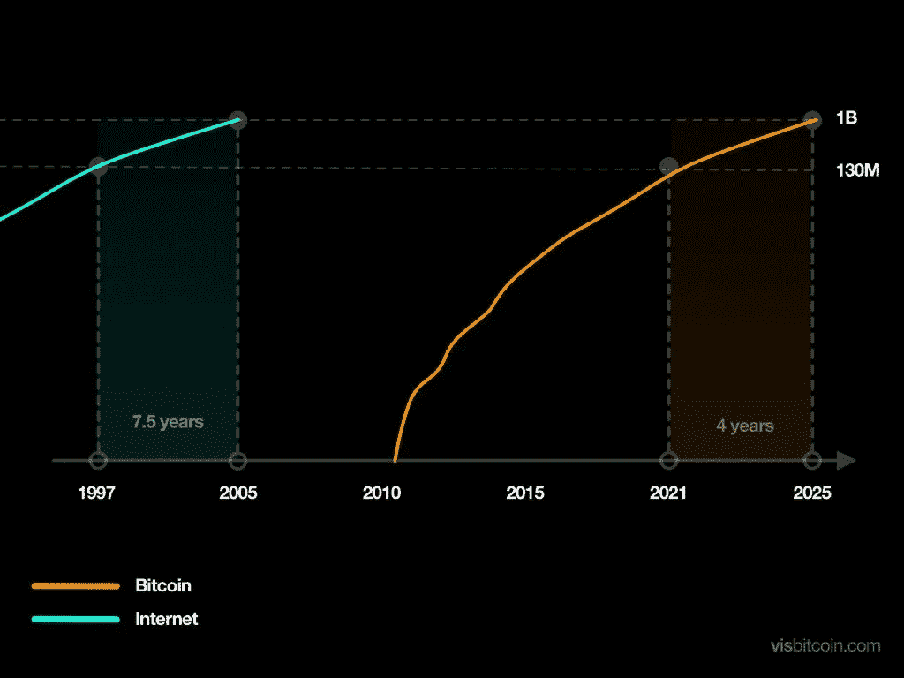
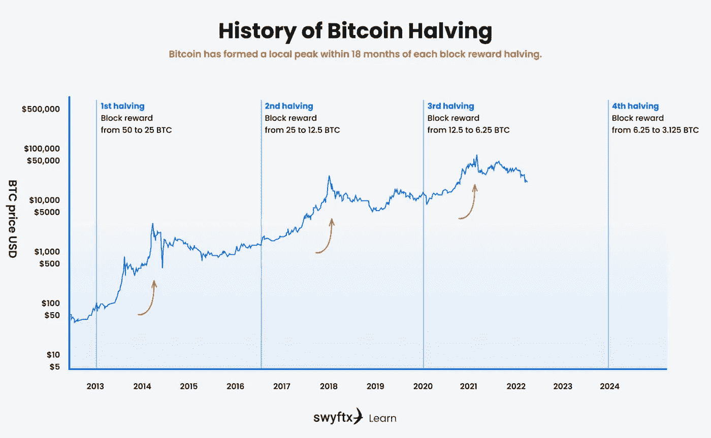

# 比特币被采用的速度比互联网还快——你必须注意了，否则就太晚了。

> 原文：<https://levelup.gitconnected.com/bitcoin-is-being-adopted-faster-than-the-internet-you-must-pay-attention-before-its-too-late-9dcb0057a505>

你不想被落下。

Jaanus jagomgi 在 [Unsplash](https://unsplash.com/s/photos/robber?utm_source=unsplash&utm_medium=referral&utm_content=creditCopyText) 上拍摄的照片

在大规模采用互联网之前，人们说了一些令人难以置信的短视的话。

类似于目前对比特币的看法。

克利夫·斯托尔是《T4 新闻周刊》的记者，他在 1995 年写了一篇关于互联网的最狭隘的文章，直到今天，他对写这篇文章感到非常后悔。

谁能责怪他呢？

人们不知道互联网是什么，也不知道我们会如何使用它。

我们知道互联网将如何影响这个世界，但猫并没有完全从袋子里出来，许多人倾向于他们所知道的，否认互联网会影响我们的生活。

斯托尔的文章驳斥了互联网的每一个使用案例——我们今天接受为规范的东西几乎被视为不值得相信的幻想。

这一切听起来与比特币反对者的言论极其相似。

这是他文章的一个片段

> “他们谈到了电子城镇会议和虚拟社区。商业将从办公室和商场转向网络和调制解调器。数字网络的自由将使政府更加民主。胡扯。”
> 
> “我们的计算机专家缺乏常识吗？
> 
> 事实是，任何在线数据库都无法取代你的日报，任何光盘都无法取代一名合格的教师，任何计算机网络都无法改变政府的工作方式”。

虽然这只是近 30 年前的一篇文章和一个人的观点，但它确实完美地凸显了我们对新技术的持续犬儒主义。

斯托尔对这篇文章做了评论。

> "在我的许多错误、失误和失误中，很少有像我 1995 年的失误那样被公之于众."
> 
> “当时，我试图反对互联网将如何解决我们的问题的未来主义评论潮流。”

如今，围绕比特币也存在着许多同样的困惑，对能源消耗的关注，对其价值所在的质疑，以及它是否是一个真正的庞氏骗局。

无论你赞同什么观点，不可否认的是，比特币和区块链是人类历史上被采用最快的技术。

比互联网还快。

# **比特币价值在哪里？**

比特币的价值在于它的网络。

同理，如果我问你脸书的价值在哪里？它存在于人际网络中。

同样，如果我问你电话的价值在哪里？它存在于使用它的人们的网络中。

如果你有一部手机，科技是没有用的，但是没有一个拥有手机的人的网络。

[梅特卡夫定律](https://en.wikipedia.org/wiki/Metcalfe%27s_law)最能理解互联网的运作，并与比特币及其网络效应有关。

该法律经常用[传真机](https://en.wikipedia.org/wiki/Fax)的例子来证明自己的观点。

一台传真机是没有用的，但是这台传真机的价值随着网络中其他传真机的总数而增加。

如果每个人都有一台传真机，它的价值是指数级的，因为用户可以发送和接收文件的人数增加了。

同样，在社交网络中，使用该服务的用户数量越多，该服务对社区的价值就越大。

这就是比特币网络效应的表现。

# **比特币正在抢占黄金的市场份额。**

[高盛](https://www.bloomberg.com/news/articles/2022-01-04/goldman-says-bitcoin-100-000-a-possibility-by-taking-on-gold?leadSource=uverify%20wall)最近报告称，随着数字资产被更广泛地采用，比特币很有可能继续夺走黄金的市场份额。

与价值约 2.6 万亿美元的黄金投资相比，比特币的市值为 3160 亿美元，高盛(Goldman Sachs)的报告显示，比特币目前在“价值储存”市场中占据 12.5%的份额。

在其预测列表中，这家全球投资巨头将比特币视为“最有可能”随着时间的推移变得比黄金更重要的资产类别。

# **这是采用的速度**

比特币的用户数量和 1997 年互联网的用户数量差不多。

然而，最显著的区别是，比特币的采用率远高于互联网。

如果比特币继续沿着同样的轨迹发展，它将在未来四年拥有约 10 亿用户。

随着加密用户以每年 80%的速度增长，这使得它成为人类历史上最快的技术采用率。

以下是 1997 年比特币与互联网的历史采用曲线:

来源— [Visbitcoin](http://visbitcoin)

1997 年，比特币的采用曲线与互联网相同。

然而，比特币的采用速度更快，加入比特币的新地址数量没有放缓的迹象。

# 比特币减半

比特币减半事件每四年发生一次，挖掘比特币交易的奖励减半。

即使需求增加，减半也会降低新硬币的创造速度，降低新硬币的供应量。

这些事件总是与大幅上涨和价格暴跌相关联，但总是在事件发生后以更高的低点和更高的历史高点结束。

下一次减半事件是在 2024 年，届时矿工的大宗奖励将从 6.25 比特币降至 3.125 比特币。

# 最后的想法。

用克利夫·斯托尔的话来说，把昨天放在基座上，否认我们越来越重视的技术现状:

> “反对未来主义评论的潮流”。

> 如果你想在 Web3 上阅读更多我的观点，可以考虑成为会员。你的会员费直接支持你读的作家。如果你用我的链接 [*注册，我会赚一小笔佣金。点击这里*](https://medium.com/@jayden_levitt/membership) *。*

*本文仅供参考；不应将其视为财务、税务或法律建议。在做出任何重大财务决定之前，请咨询财务专家。*