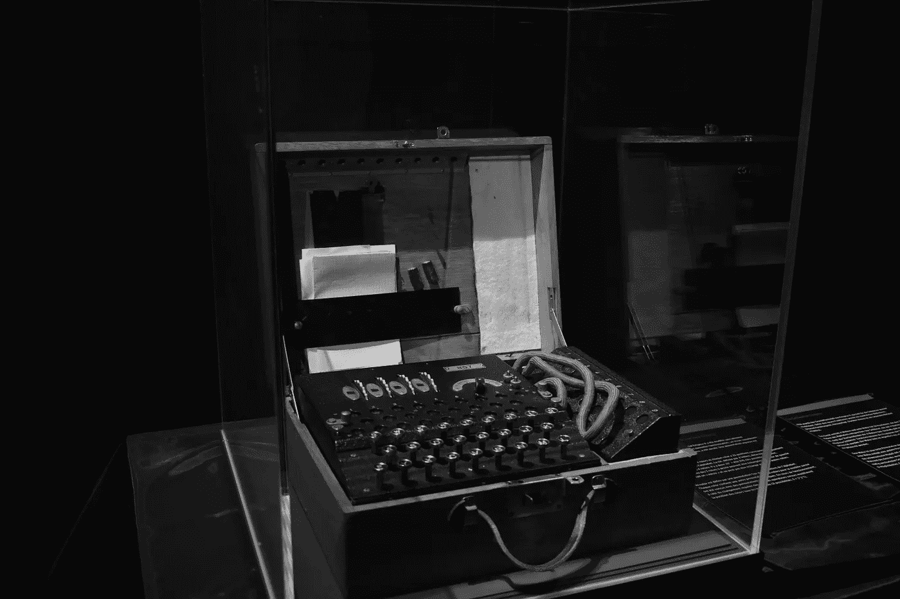

# 比特币不是第一个区块链

> 原文：<https://levelup.gitconnected.com/bitcoin-is-not-the-first-blockchain-a54b183fd57c>

## 两者都不是最安全的

Mauro Sbicego 在 [Unsplash](https://unsplash.com?utm_source=medium&utm_medium=referral) 上拍摄的照片(由作者修改)

隐秘的世界充满了神秘。

单单比特币就很可能让你大脑过热。不仅技术新，而且很复杂。

这很复杂，因为:

*   首先，大多数区块链力学所强调的密码学并不是每个人都喜欢的。
*   第二，相关教育内容往往不准确。

其中一个不准确之处(以及其他)是比特币引入了区块链，或者比特币的作者 Satoshi Nakomoto 发明了区块链。

看一看:

> “比特币是最著名的加密货币的名字，区块链技术就是为它而发明的”——[普华永道](https://www.pwc.com/us/en/industries/financial-services/fintech/bitcoin-blockchain-cryptocurrency.html)

或者这里有一个更好的。在一篇研究论文中发现的。

> 区块链技术早在 2008 年就由一个名为“中本聪”的个人或开发团队引入。” [SSRN](https://papers.ssrn.com/sol3/papers.cfm?abstract_id=3288059)

如果比特币不是第一个区块链。到底是哪个？

## 为什么是区块链？

谁说比特币，就说区块链。

比特币通常被称为召唤区块链的魔鬼——一项即将彻底改变我们做生意方式的技术。

区块链是透明的。区块链就是正义。区块链就是隐私。区块链就是安全。

我们都听说过这些乌托邦式的目标。

也许 Satoshi 在设计比特币——货币互联网时，就已经考虑到了这些(或其中一些)目标。

然而，第一个区块链的目标肯定没有说明任何问题。更确切地说，从一开始，区块链就只寻求提供一种计算上可靠的解决方案来给数字文档加时间戳——证明文档的创建和修改时间。

与数字文件不同，实体文件更容易打上时间戳。一种方法是把一份文件拿到市政办公室或时间戳服务机构，盖上湿戳。另一种方法是给自己寄一封信，并保持密封。

然而，这些方法很难应用于存储在电子设备中的文档。随着我们对数字时代的深入研究，我们可以随意复制、粘贴或修改文档而不会留下蛛丝马迹的事实带来了一个问题。

当我们考虑给文档加时间戳时，许多应用程序都会浮现出来。在知识产权领域，当两种观点受到挑战时，先出现的观点会胜出。在刑事司法中，拍摄照片或录制视频的时间可能是有罪与无罪的区别。

## 第一个不变的账本

1991 年，贝尔通信研究所的两位密码学家 Stuart Haber 和 Scott Storneta 发表了一篇论文，*如何给数字文档加时间戳，*详细介绍了一种“计算上实用的”时间戳解决方案。

事实上，数字时间戳在出版时并不是前所未有的。由于之前引入的加密[哈希函数](https://en.wikipedia.org/wiki/Cryptographic_hash_function)，文档认证成为可能。

然而，缺失的拼图是**不可信的**认证。

这让我们想起了比特币白皮书中的一个流行说法。

> “我们需要的是一个基于密码证明而不是信任的电子支付系统。”——中本聪。

事实证明，这种类型的认证可以通过不可变的总账来实现，这是斯科特和斯图尔特提出的开创性发明。

> “我想说的是……我们如何创建不可变的分类账？我们如何创建数字记录，让你从本质上知道它们没有被修改过？”— [斯科特·斯托纳塔](https://www.youtube.com/watch?v=WWVoPBkPd6g&ab_channel=CoinGeek)

由于区块链只不过是一个数字账本，我们得出的结论是，这项迷人的技术实际上早于比特币。

事实上，哈伯和斯托纳塔早在 1995 年就开始了区块链之路，将他们的时间戳想法付诸实践。并且至今仍在运行。

[来源](https://twitter.com/ittaia/status/1032435659665862657?lang=en-GB)

由于开放区块链旨在通过达成全球共识来确保系统的完整性，Haber 博士和 Stornetta 博士决定计算前一周发生的操作的指纹，并将其发表在每周纽约时报周日版的分类广告中。

还记得吗，1995 年，互联网巨兽在冬眠。因此，利用报纸进行宣传更有意义。

## 最安全的区块链

区块链运行在迄今为止尚未被破解的加密算法的基础上。每次向链中添加新的块时，这种安全性都会得到加强。

因此，比特币是最安全的加密货币。

现在，我们可能会无休止地争论其他加密货币(如 Kadena)可能提供更好的安全性这一事实。然而，在我看来，一个协议存在的时间越长，它就越安全。

由于哈伯和斯托纳塔的区块链比比特币起步早，它是最安全的区块链。至少在我看来是这样。

区块链的安全也与信任有关。链条越长，我们就越趋向于一个不可信的生态系统。

Haber 和 Stornetta 引入的无信任约定的美妙之处在于它来自于现实生活中的信任场景。

> “如果两个人试图证明某件事，但他们串通好了，那么你需要有第三个人来监督他们。但是如果他们把那个人拉进来串通呢。那么你需要第四个人，如此等等。”— [斯科特·斯托纳塔](https://www.youtube.com/watch?v=WWVoPBkPd6g&ab_channel=CoinGeekhttps://www.youtube.com/watch?v=WWVoPBkPd6g&ab_channel=CoinGeekhttps://www.youtube.com/watch?v=WWVoPBkPd6g&ab_channel=CoinGeek)

例如，在法律事务中，判决在很大程度上受到证词的影响。目击者越多，证据就越有力。

同样，在区块链，我们用木块作为见证。链条越长越安全。

当然，如果我们的证人愿意勾结，整个生态系统就会崩溃。

## 离别的思绪

乍一看，似乎哈伯和斯托纳塔做了所有的跑腿工作，只是为了比特币获得信贷。

然而，Satoshi 公正地对待了这两位伟大的科学家，并在比特币白皮书中三次引用了他们的工作。

此外，在[的采访](https://www.youtube.com/watch?v=WWVoPBkPd6g&ab_channel=CoinGeek)中，两位密码专家被问及对此的感受。

> 记者:“你认为他们在多大程度上拿走了我们所做的”
> 
> 斯托内塔:“我从来不觉得有东西被偷了。一旦你把它放到科学界，这就是一个群体的全部概念。我们都把东西放进锅里，然后看看其他高智商的人会怎么做。”
> 
> 哈伯:“聪把这些(区块链的想法)放在一起并增加激励的方式是整个事情成功的原因。”

毕竟，一个人不能指望从零开始改变世界。

> “最好的发明是最好地结合和补充其他发明的发明”

*如果你觉得这很有见地，可以考虑成为* [*高级*](https://ayarmohammed96.medium.com/membership) *会员来支持我的工作。如果用这个* [*链接*](http://ayarmohammed96.medium.com/membership) *，我得到一个小切。*

 [## 通过我的推荐链接加入媒体-穆罕默德·阿亚尔

### 作为一个媒体会员，你的会员费的一部分会给你阅读的作家，你可以完全接触到每一个故事…

ayarmohammed96.medium.com](https://ayarmohammed96.medium.com/membership)