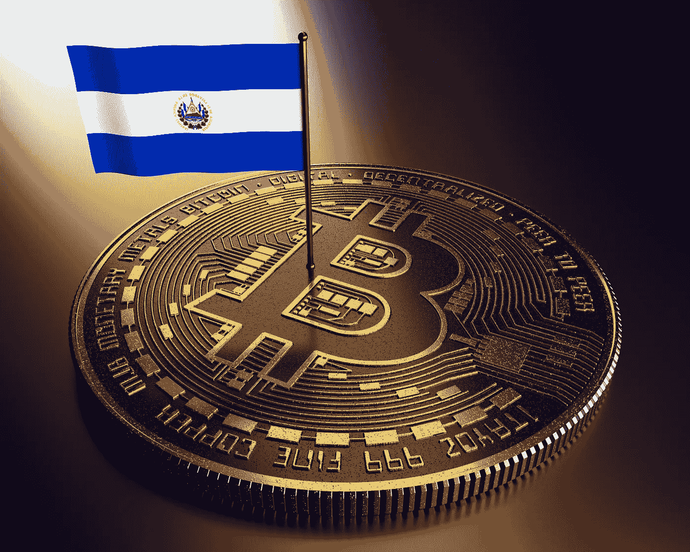

# 比特币现在是萨尔瓦多的法定货币——这意味着什么？

> 原文：<https://levelup.gitconnected.com/bitcoin-is-now-legal-tender-in-el-salvador-what-does-this-mean-bbaee4634057>

## 对国家、世界和比特币的潜在影响

图片来自 [Shutterstock](https://www.shutterstock.com/image-illustration/bitcoin-el-salvador-makes-cryptocurrency-legal-1989475475)

9 月 7 日——就在萨尔瓦多总统宣布他打算让比特币成为该国法定货币的 3 个月后，这一天终于到来了。

萨尔瓦多政府一致批准的立法已经颁布。这意味着商店可以接受比特币或美元支付，人们现在也可以用这两种货币支付商品和服务。

在比特币社区，总统纳伊布·布克勒是当天的英雄。

随着 9 月 7 日的到来，萨尔瓦多的比特币爱好者在网上分享视频和帖子，他们在星巴克支付咖啡，在麦当劳支付早餐。他们只是热衷于将加密货币作为国家经济体系不可或缺的一部分的企业和公民的早期例子。

来源:[推特](https://twitter.com/maguiluz301/status/1435267945412890631?s=20)

无论如何，这一天并没有获得普遍的成功——大约 1000 名市民在首都圣萨尔瓦多举行了[抗议活动](https://www.reuters.com/world/americas/salvador-street-protest-breaks-out-against-bitcoin-adoption-2021-09-07/)。抗议者反对这种货币对整个国家的适用性，以及该倡议实施的速度。

Chivo [数字钱包应用](https://www.independent.co.uk/life-style/gadgets-and-tech/bitcoin-el-salvador-chivo-wallet-b1915627.html)由政府发布以配合发布，并得到补贴以降低用户的交易成本，由于难以应对需求和交易量，不得不暂时关闭。

当天，比特币的价格也大幅波动，从最近超过 53，000 美元的高价跌至刚刚超过 43，000 美元。后来回升到 46000 美元以上。这些举措虽然并不罕见，而且与萨尔瓦多采用比特币有些不相关，但却没有给人们带来多少信心。这让媒体对比特币和加密货币的老生常谈的攻击火上浇油。

这注定是一个多事的一天，结果就是这样。但从中长期来看，比特币现在成为萨尔瓦多合法接受的货币形式，未来可能会有什么影响？

# 对萨尔瓦多及其公民来说

可能引发反对比特币抗议的一些担忧源于该国在 2001 年迅速采用美元作为其主要货币。毫无疑问，有些人认为他们的前一种货币遭受了财务损失——当时美元取代了克朗。

其他人很可能是出于对比特币的优点缺乏理解或欣赏而提出抗议——作为一种技术和价值工具，它在技术上很复杂，而且仍然被广泛误解，甚至在世界各地的[政府最高级别](/why-are-governments-choosing-to-remain-ignorant-and-short-sighted-about-bitcoin-e2e62bfcb71e)也是如此。

还有其他人抗议，只是因为他们不同意布克勒总统发起的任何倡议。如果他在这个国家取缔了比特币(通过世界领先的“[比特币海滩](https://www.bitcoinbeach.com)”项目，这个国家已经有了一个蓬勃发展的比特币用户群体)，那么一些人可能会提出抗议。

对其公民和国家有什么可能的影响？

## **获得金融服务是一件好事**

比特币有许多好处，其中许多源于它让人们能够在一个基本上没有银行账户的国家使用金融基础设施。

大多数公民无法获得基本的金融产品或基础设施，这迫使他们以现金交易，并剥夺了他们以电子方式支付商品或接收和持有资金的机会。

通过使用免费的数字钱包应用程序(由政府推出的 Chivo wallet 或其他程序)，萨尔瓦多公民现在可以安全、放心、轻松地做所有这些事情。其他衍生金融服务也可能在萨尔瓦多出现，比如通过区块链发行和管理的贷款。

居住在世界各地的萨尔瓦多人现在可以使用比特币跨境电子汇款和收款。这一点尤其重要，因为随着时间的推移，许多中国公民已经移民到美国，并仍在向国内的家人寄钱。

[2016 年，约有 120 万](https://borgenproject.org/remittances-to-el-salvador/)萨尔瓦多移民生活在美国。他们向萨尔瓦多汇款 46 亿美元，占该国国内生产总值(GDP)的 17%。

这些汇款中有一些很可能是以现金形式进行的，当然是为那些家庭没有银行账户的人。这可能是萨尔瓦多经济中美元盛行的原因。

随着比特币成为法定货币，并且可以轻松、快速、廉价地跨境传送，萨尔瓦多人之间的财富流动可以无缝实现。

# 关注和争议

仇恨者总会找到方法去仇恨。

## 机构异议

正如政府和传统金融机构对待比特币的典型情况一样，萨尔瓦多将比特币作为法定货币的决定遭到了相当大的反对。

世界银行[迅速拒绝了](https://www.bbc.co.uk/news/business-57507386)萨尔瓦多要求帮助实施其比特币法律的请求，理由是不愿与它所描述的比特币的“[环境](/is-bitcoin-an-environmental-disaster-waiting-to-happen-d770e4bea5e9)和透明度缺点”联系在一起——这是两个更老套的反对意见，通过一点研究就可以轻易揭穿。

国际货币基金组织表示，它认为萨尔瓦多的提议存在“宏观经济、金融和法律问题”。他们后来发表了一篇题为“[作为国家货币的加密资产——走得太远了](https://blogs.imf.org/2021/07/26/cryptoassets-as-national-currency-a-step-too-far/)”的文章。那篇博文也依赖于陈腐的言辞和不明智的观点。

7 月，信用评级服务公司穆迪在萨尔瓦多发布声明后下调了该国的信用评级，再次提到了对宏观经济稳定的风险。

不幸的是，这种反对背后的情绪是传统金融机构处理比特币时的常态。

这一次重要的是，萨尔瓦多正在开辟一条道路——它的通过所产生的影响可能会增加反对意见的实质内容。尽管如此，希望积极的影响将大大有助于反驳他们。

## 萨尔瓦多人会被迫使用比特币吗？

我们无意阻止萨尔瓦多接受美元，如果用户愿意，Chivo 应用程序可以让用户立即将收到的比特币兑换成美元。

尽管如此，许多评论者(包括铁杆比特币狂热分子)对萨尔瓦多政府的比特币法律第 7 条表示担忧，该条规定所有供应商*必须*愿意接受比特币支付:

来源:[推特](https://twitter.com/nic__carter/status/1434988756361166848?s=20)

这可以被视为政府强迫人民使用比特币。

立法中还有其他一些警告和条款对这一法律条款进行了调整，包括那些为那些无法获得必要技术的人提供豁免的条款(第 12 条)，以及那些规定政府将提供替代方案，允许用户获得比特币交易手段，并在他们希望的情况下立即将其兑换成美元的条款(第 8 条)。

这些条款是积极的——更好的办法是没有任何条款强制要求采用比特币，而是让人们有机地采用比特币。

## 布克勒总统可信吗？

在某些圈子里，有人怀疑萨尔瓦多总统是否完全值得信任。一些人猜测，比特币作为货币的实施是否是他以专制方式推动个人议程的又一个例子。

当然，他是一个有争议的角色——积极主动，善于通过传统和社交媒体塑造形象和有效沟通。Bukele 的行为似乎有些极端——例如，在一次关于武装部队经费的辩论中，他将 40 名武装士兵带入议会。这被描述为一种恐吓行为，即使是最温和的比特币制造者也很容易这么认为。

或许这个世界应该将各种问题分开，不要让布克勒作为一个人与他关于比特币的行为有内在联系。这一倡议是善意的，有很大的潜力造福于他的国家，而不仅仅是那些在政府中身居高位的人。

如果布克莱在其他问题上的行为是一个国家领导人所不能接受的，那么这将通过其他机制和全球机构来处理。这不一定会减损他的国家采用比特币可能取得的成就。

图片来自 [Unsplash](https://unsplash.com/photos/QiPe0UpC0_U)

# 对更广阔世界的影响

许多其他国家发现自己处于与萨尔瓦多类似的境地——本币不稳定或贬值，过度依赖美元，或者基本上没有银行账户——可能正饶有兴趣地关注着事态的发展。如果萨尔瓦多的倡议成功，那么类似的国家似乎也可能走上类似的道路。

比特币的正常化及其在世界范围内的广泛接受可能会产生其他连锁效应。对许多人来说，加密货币的概念毫无意义——这个想法根本不能被理解为有任何现实世界的应用或价值。

如果整个国家能够证明它可以被成功采用并用作价值交换手段，那么这无疑将成为比特币(或任何货币)的主要用途之一。它一劳永逸地证明了可行性。

# 对比特币的影响

萨尔瓦多正在显著扩大世界上接触、理解和欣赏比特币的人口。它大规模地证明了加密货币可以被采纳并用作一种实现交易的手段，并允许公民进入消费金融的轨道。

这是一个真实的试点，将展示好处和机会，同时也毫无疑问地提出比特币用户社区、区块链开发者和金融机构可以解决和克服的问题。

还有一种前景是，现在被视为并接受为法定货币的比特币可能会被金融机构和政府机构恰当地归类为[货币，而不是财产](https://www.cnbc.com/2021/07/14/irs-new-rules-on-bitcoin-ethereum-dogecoin-trading.html)(这是美国国税局目前对待加密的方式)。

比特币最大化主义者推测，萨尔瓦多的新法律可能会推翻国税局的裁决，该裁决指定比特币持有的收益应缴纳资本利得税。时间会证明这种情况是否会改变。

# 接下来呢？

我们正处于萨尔瓦多比特币之旅的早期，根据第一天的事件来宣布它的成功或失败是错误的。

会有技术问题。
比特币的价格将会出现剧烈波动。
毫无疑问，会有金融方面的成功案例。
比特币可能会引发丑闻、问题和骗局。

接下来会发生什么，很大程度上取决于萨尔瓦多人民，就像取决于比特币本身一样。

从根本上说，该计划可能会产生大量积极和有益的影响。包括我在内的许多人都将带着兴趣、乐观和希望观看这场比赛。

*如果你喜欢阅读这样的故事，并愿意支持 Medium 上的作家，考虑注册成为 Medium 会员。一个月 5 美元，给你无限的故事。如果你注册使用我的链接，我会赚一小笔佣金。*

 [## 通过我的推荐链接加入灵媒——托比·黑兹伍德

### 作为一个媒体会员，你的会员费的一部分会给你阅读的作家，你可以完全接触到每一个故事…

tobyhazlewood.medium.com](https://tobyhazlewood.medium.com/membership) 

注意:*本文仅供参考。不应将其视为财务或法律建议。在做任何重大财务决定之前，先咨询财务专家。*

## 如果你喜欢这篇文章，我希望你能加入我的邮件列表。