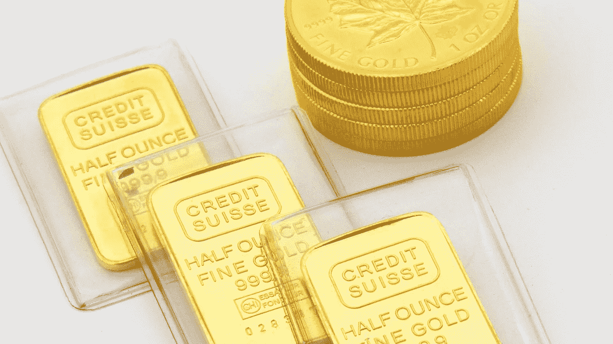

# 比特币挖矿 vs 金矿 vs 印钞

> 原文：<https://levelup.gitconnected.com/bitcoin-mining-vs-gold-mining-vs-money-printing-9bbf6152e533>

## 并非所有的价值创造都是平等的

德米特里·德米德科在 [Unsplash](https://unsplash.com/s/photos/gold?utm_source=unsplash&utm_medium=referral&utm_content=creditCopyText) 上拍摄的照片

T4:比特币经常被吹捧的好处之一是，与传统货币不同，它可以为持有者提供一些抵御通胀的手段。

在危机和相关的经济衰退时期，如全球疫情(如果你能想象这样的事情)，政府诉诸于印刷新的货币来刺激支出，并满足支持企业和公民的额外成本——这一过程被称为量化宽松。

短期影响可能是积极的，增加经济中的资金流动。但长期后果可能是灾难性的。流通中的货币的购买力被削弱，现存纸币的假定储存价值减少。随着新发行的货币在供应链中产生连锁反应，通胀有推高价格的危险。

由于我自学了比特币的所有知识，我不禁注意到比特币的供应也在每天增加——比特币开采，即名义上铸造新数字硬币的过程，以大约每十分钟一枚的速度继续进行。即使该协议设定了 2100 万个比特币的上限，其中 1860 万个在流通，我仍然觉得比特币似乎与传统货币没有太大区别？

如果比特币自身的供应量也在稳步增长，它怎么能真正对冲由量化宽松导致(或至少加剧)的通胀呢？

满足我好奇心的唯一方法似乎是更深入地理解相关的过程。下面我尽可能简单地概述了我对比特币挖矿和量化宽松的了解。我还额外加入了金矿开采，因为比特币通常被描述为数字黄金。我想知道与黄金开采和创造的比较是否也与比特币开采有相似之处？

# 比特币——一种有限的资源？

总共只会有 2100 万枚比特币存在。该限制被设计到协议中，并且永远不会增加。

鉴于这一点，比特币开采——创造新比特币的过程——仍在进行中。目前有 1860 万枚比特币在流通，这一数字将持续增长，直到 2140 年左右，届时总数将达到 2100 万枚。

随着单个比特币的价格在 2021 年初达到 40，000 美元，即使价格大幅下降，新铸造的比特币仍有大量新价值可创造。

# 比特币挖矿

比特币挖矿是指创造新的比特币。

要理解这个过程，需要对比特币的技术有一个基本的了解。我已经尽可能简单地描述了这一点。如果你想了解更多，可以查看来自 Investopedia 的[更详细的描述，比如这篇](https://www.investopedia.com/tech/how-does-bitcoin-mining-work/)或者阅读《*比特币标准》*一书的第 8 章——这是任何希望更全面地了解比特币和货币的人的必读之作。

比特币本身就是全球计算机互联网络的代名词(被称为节点或矿工)。每个都托管和维护一份完全相同的比特币交易分类账(区块链)。该网络允许比特币持有者之间的交易在区块链完成并记录。没有网络就没有比特币。

比特币本身存在于这个网络或离线存储设备(被称为硬件钱包)上，但本质上比特币只“生活”在网络上。

随着比特币在交易所的买卖或从一个用户发送到另一个用户，交易不断由节点处理。这些节点会不断处理这些事务，并在将事务写入区块链和复制到所有其他分类帐之前相互竞争以验证和鉴定事务。

成功验证 1Mb 交易(也称为块)并成功解决复杂数字代码(哈希问题)的第一个节点(或矿工)将获得一笔比特币，称为*块补贴*。

> *第一个验证 1Mb 交易并解决哈希问题的矿工将获得矿工奖励(比特币)*

最快满足这些标准的矿商可能会获得新的比特币，这将激励他们托管和运营这些节点。验证交易的过程也是必不可少的—所有分类账都保持同步，避免了监督或监管的需要，并保证了安全性和完整性。

挖掘新比特币的速度基本上与既定时间表保持一致，大约每四年，每多挖掘 21 万个比特币，矿工的奖励就会减半。

2020 年 5 月，奖励减半至每块 6.25 比特币。2009 年，这一数字开始时为每块 50 个比特币(自那以来已经减半三次)。这也是比特币协议中不可改变的规则。

根据开采新硬币的速度，通过向上或向下改变散列问题的复杂程度，可以进一步控制铸造的速度。这种变化也在比特币协议中得到管理。

所有这些内在参数的净效应是，大约每 10 分钟就有一枚新硬币被铸造出来，使发行总数接近 2100 万枚。

在 2140 年左右，一旦所有的硬币都被开采出来，这些节点将完全通过交易费获得回报，作为他们维护比特币网络和账本的回报。

在这一点上，比特币作为一种货币和价值交换手段的交易性质很可能已经成为它的主要用例。但那是 120 年后的事了，我推测。

在通货膨胀的背景下，至关重要的是这个时间表*不能被改变*——在这种程度上，流通中的硬币数量基本上是固定的，并符合一个渐进和有节制的增长时间表。它当然不能因政府或中央控制机构的一时兴起而改变——比特币不存在这种情况。

## 比特币铸造总结

1.  流通中的比特币数量正趋于一个永远不会增加的最大值。
2.  截至今天，大约 89%的比特币已经被挖掘出来(包括我们在新闻中读到的硬件钱包丢失或钱包密码丢失的比特币)
3.  没有人有能力、自由或权力通过选择创造更多的比特币来降低流通中的比特币的价值——新的比特币被开采出来，奖励给承担网络维护成本的人，然后这些比特币通过贸易逐渐被释放到更广泛的比特币生态系统中。
4.  对挖掘比特币的奖励是保持比特币网络自身活力的重要组成部分。它还确保了使用比特币进行的交易被准确记录和安全。

Infrarate.com 在 [Unsplash](https://unsplash.com/s/photos/gold?utm_source=unsplash&utm_medium=referral&utm_content=creditCopyText) 上[的照片](https://unsplash.com/@infrarate?utm_source=unsplash&utm_medium=referral&utm_content=creditCopyText)

# 采金

我想了解金矿开采，以便更好地比较黄金和比特币——所谓的数字黄金。

黄金是通过开采矿石从地下提取的，各种机械和化学过程提取和提炼贱金属。

在黄金生产过程的每一个阶段都存在困难，这些困难导致了黄金的相对稀缺性和内在价值。根据世界黄金协会的数据，世界上被发现的金矿床中，只有不到 0.1%会成为生产性金矿。建立一个矿山和加工厂的成本和复杂性是如此之高，以至于不到 10%的全球储量需要开采和提取。一旦找到合适的地点，开矿需要数年时间。

简而言之，金矿开采从一开始就昂贵、复杂且耗时。

也就是说，值得注意的是，在 1912 年至 2014 年的 102 年间，由于采矿和加工技术的进步，全球[黄金年产量从每年 705 公吨增加到每年 2860 公吨。它的相对稀缺性可能是限制行业内供应的承诺和协议的结果，也可能是地壳中它的物理稀缺性的结果。](https://en.wikipedia.org/wiki/Gold_mining#/media/File:World_Gold_Production_1900-2014.png)

经过提炼和加工的黄金不仅可以作为价值储存手段(以金块的形式，或者铸造成硬币，或者由实物黄金支持的交易证券)使用，还可以用于电子产品和制作珠宝。

虽然新的黄金一直在生产，工业化使大规模开采黄金变得更加容易，但开采速度不断与黄金的相对价格和需求保持平衡。像任何商品一样，过度供应只会压低价格。

开采无限量的黄金(即使这是可能的)并不符合黄金开采公司的利益，因为这将降低今天流通中的黄金的价值。

## 金矿开采综述

作为一种天生稀缺且供应有限的自然资源，很容易理解为什么黄金几个世纪以来一直被用作象征性的价值储存手段。

1.  黄金的价值部分源于其相对稀缺性，以及定位、提炼和加工黄金的相关成本。
2.  它的价值还在于它在电子产品和珠宝方面的固有特性。
3.  至关重要的是，它的价值还通过矿业公司和管理机构之间有意识的决定和协议来维持，以管理和限制供应，保护流通中的黄金价值。在过去的一个世纪里，开采量的稳步增长表明，人类可以开采和利用更多的资源——它没有被更积极地开采，这似乎是一种有意识和有意识的保护价格的行动。

# 印钞——量化宽松

当政府需要刺激经济、为不可预见的支出提供资金(如战争成本或救助受疫情影响的公民和企业)时，最容易的选择是凭空创造新的货币，并通过其金融系统注入经济。

作为对新冠肺炎的回应，美国政府宣布了 7000 亿美元的量化宽松政策，作为增加货币供应和刺激经济中货币流动的一种手段。额外的纸币代表了更多的政府债务，并与长期债券或其他形式的从其他国家和中央银行的借款挂钩。

很难想象如此大规模的债务会真的被还清，也很难想象政府在什么条件下有能力偿还这些债务。几乎不可能像我们普通公民看待我们的抵押贷款、学生贷款或信用卡那样看待这样的债务。

量化宽松是一个相对短期的解决方案，但会带来长期后果。

首先，考虑到大多数国家发行的大部分钞票不再由黄金或任何其他可能赋予其真正价值的标准支持。它们实际上只是我们都认为具有名义价值的纸片或聚合物。

通过向公民发放刺激支票或鼓励银行更自由地向公民放贷，向经济注入更多资金的效果，是让已经存在的资金的内在价值降低。

这实际上是通货膨胀在起作用。

通货膨胀降低了现有货币的购买力，有效地稀释了其价值。此外，随着通胀的影响通过供应链传递，它最终会推高商品和服务的价格。

由于政府可以印刷的新钞数量实际上没有限制，而且它们也没有内在价值，印刷新钞票与开采新黄金或比特币并不完全相同——印刷新钞票不会创造新价值，就像流通中的钞票没有内在价值一样。

## 货币印刷总结

1.  政府不会轻率地使用量化宽松，它是应对极端措施的一种极端工具。但是 T2 政府很容易随心所欲地创造更多的现金，作为刺激经济的手段和帮助国家度过困难时期的短期刺激。
2.  通过这样做，流通中的现有货币的价值减少了，公民认为他们储存在储蓄和投资中的价值也减少了。
3.  新印刷的货币也是由债务支持的，这些债务必须在长期内偿还。这种债务可以更好地被视为对后代的税收，当国家寻求恢复其金融实力时，后代将被要求通过未来的经济措施偿还债务。

# 比较货币

随着货币之间的相对相似性和差异以及与它们的创造相关的过程变得清晰，某些结论变得显而易见。

目前，全球经济需要现有的所有金融工具，每种工具都扮演着重要的角色。

日常交易仍然需要现金，尽管随着电子支付的激增，现金逐渐变得越来越不相关或不必要。

黄金作为投资工具和价值储存手段，以及在社会和工业中的许多其他用途，都将保持其价值和相关性。但很明显，它的内在价值和保存这种东西不仅仅是因为它真正的稀缺性。相反，似乎在开采石油的人和控制石油供应的人之间，存在着勾结和价格操纵或价格保护的因素。这保存了它的内在价值，并保护它作为一种普遍接受的价值储存手段。

比特币将继续赢得其作为电子交换手段的地位，这种手段有助于在没有中介的情况下进行数字交易，但前提是其价格波动性较小——随着它变得更加成熟和被普遍接受，这种情况可能会发生。

它也可能获得作为一种受信任的价值储存手段的地位，[，人们将他们的钱作为一种资产类别投资于此，但这只会在它的价格开始表现出较少的波动性时才会出现。](/the-exact-process-i-used-to-buy-my-first-bitcoin-in-under-an-hour-bee2df1ee001)

最根本的是，在这篇文章的背景下，似乎很明显，比特币本身*确实提供了*内在的保护和通胀隔离，并可能被用作长期增长的避风港，作为一种投资工具。其供应的逐步和有限度的增长受到所有投资者的限制、控制和理解。我不认为即使是最坚定的黄金投资者也能对未来的黄金供应有如此确定的看法，不是吗？

黄金和比特币都很好地避免了价值损失和政府引发的通胀，因为它们的供应都不会在需求时那么容易增加。但是对于比特币来说，这个限制是绝对的。再多的开采也不能改变或削弱这个方面。

如果你喜欢阅读这样的故事，并且愿意支持 Medium 上的作者，考虑注册成为 Medium 会员。一个月 5 美元，给你无限的故事。如果你注册使用我的链接，我会赚一小笔佣金。

 [## 阅读托比·黑兹伍德(以及媒体上成千上万的其他作家)的每一个故事

### 作为一个媒体会员，你的会员费的一部分会给你阅读的作家，你可以完全接触到每一个故事…

tobyhazlewood.medium.com](https://tobyhazlewood.medium.com/membership) 

注意:*本文仅供参考。不应将其视为财务或法律建议。在做任何重大财务决定之前，先咨询财务专家。*

## [***如果你喜欢这篇文章，我希望你能加入我的邮件列表。***](http://bit.ly/TobyHazlewoodList)