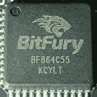
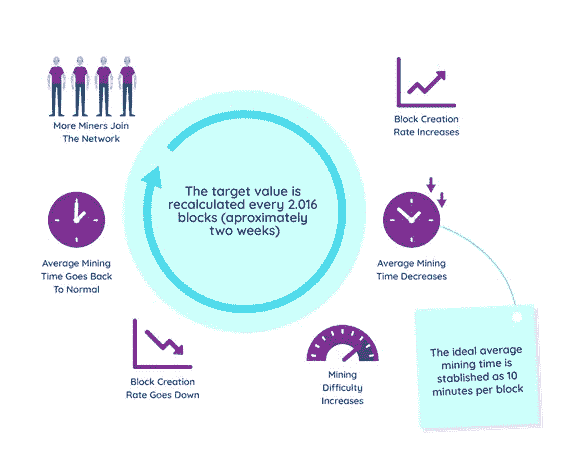
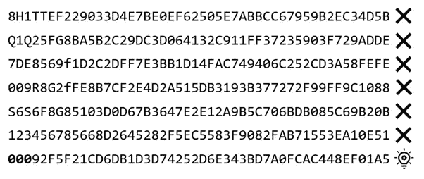
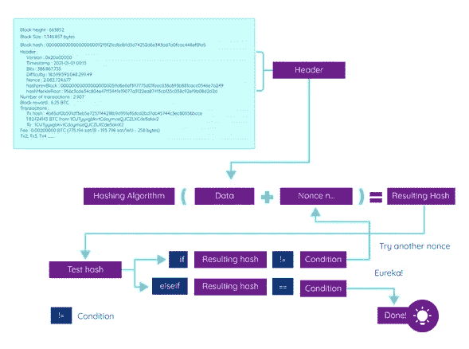
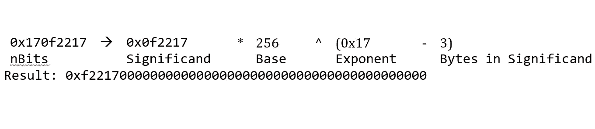
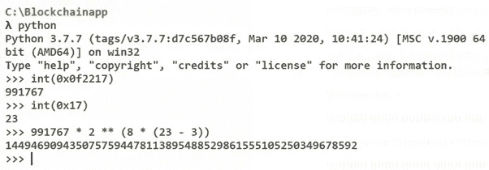
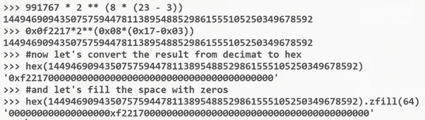
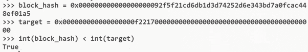

# 比特币工作证明——你必须阅读的唯一一篇文章

> 原文：<https://levelup.gitconnected.com/bitcoin-proof-of-work-the-only-article-you-will-ever-have-to-read-4a1fcd76a294>

## 工作证明挖掘到底是如何工作的？嗯，其实很简单。让我给你一个提示:矿工不需要解决一个“复杂”的数学问题。爱因斯坦过去常常解决复杂的数学问题。矿工们只是在猜彩票。

如果你一直在看我的文章，你就知道我喜欢直奔主题。这不是小说，我不想浪费读者的时间。尽管如此，这篇文章还是很长，请多包涵！

# 工作证明挖掘

挖掘是区块链中使用的方法，用于将事务分组到一个块中，将该块附加到区块链，并将新块广播到网络。采矿确保共识机制得以维持，并保持区块链的分散化。


在本文中，我们将深入了解挖掘是如何工作的。这将是你唯一需要阅读的关于工作共识证明的文章。真的。都在这里了。

# 挖掘算法

工作证明区块链具有挖掘算法或加密哈希函数，将数据块作为输入，并创建一个小输出。散列函数的设计使得挖掘者必须不断地散列块，直到他得到想要的输出。继续阅读，我会告诉你这是如何发生的。为了完成这项任务，矿工需要尝试同样的任务一百万或十亿次，需要硬件、电力和时间。

对于比特币，挖掘哈希函数是 SHA256，比特币应用双 SHA256 过程来提高安全性。以太坊用的是 Ethash 或者 Dagger-Hashimoto Keccak。不同的工作证明区块链使用不同的算法，但最著名的是:

*   sha 256–256 位“安全哈希算法”可以被通用 CPU 挖掘，并被比特币、字节币、Peercoin、Namecoin 等加密货币使用。SHA256 是一个非常简单的函数，即它是一个简单的布尔运算和 32 位加法。像这样的简单功能可以在 ASIC 芯片中的数字逻辑中实现，从而创建非常高效的采矿硬件。



*   Ethash — Ethash 是以太坊的工作证明挖掘算法。因为它更占用内存，所以 GPU 提供了更高效的哈希速率。ASIC 矿机也被开发出来开采 Ethash。一些区块链使用这种算法，包括 Etehreum 和 Ethereum 经典。
*   X11——Dash 开发人员创建了 X11 算法，它被认为是最安全的算法之一。ASIC 矿机也是为 X11 矿开发的。使用它的一些加密货币是 Dash、Karmacoin 和 MonetaryUnit。
*   Scrypt — Scrypt 也是一种广泛使用的挖掘算法。它比 SHA256 更快，使用它的领先区块链是🐶、莱特币、波特币、中银币和居尔登币。说到剧本，我制作了[第一个 Dogecoin 课程](https://www.udemy.com/course/-dogecoin-course-the-first-complete-dogecoin-course/?referralCode=9416B1408224CE309DD8)。看看吧！
*   crypto night——这是另一个名字很酷的工作证明算法。它被设计成通过 CPU 挖掘来提高效率。使用它的加密货币有 [Monero](https://medium.datadriveninvestor.com/rings-stealth-and-monero-awesomeness-99bcab969676) ，Dashcoin，DigitalNote，Bytecoin 等等。

## CPU 挖掘、GPU 挖掘和 ASIC 挖掘

CPU、GPU 和 ASIC 挖掘以不同的方式响应不同的区块链算法。一些算法更容易被 CPU 挖掘(即具有更好的哈希速率),更通用的 GPU 对简单计算来说资源更密集，对内存密集型算法或 ASIC 来说更好，它们是为特定目的而设计的。ASIC 矿工，虽然效率很高，但是也有一些缺点。一些区块链开发者一直在试图更新协议，以使它们具有 ASIC 抗性，即不可能使用 ASIC 设备来开采。当这种情况发生时，ASIC 挖掘器就变得毫无用处，因为它们是按照特定的算法设计的，不能执行任何其他任务。一些区块链开发者认为 ASIC 设备可能会增加集中化。

请注意，这仅适用于工作证明区块链，而不是[股权证明](https://medium.com/nerd-for-tech/proof-of-stake-what-is-and-how-does-it-work-1c8bd7f00303)或许可区块链。

# 工作证明

让我们先来看看工作证明，比特币的共识机制，以及大多数第一代区块链。工作证明是一种基于领导的共识机制。顺便说一句，如果你想解码比特币的 genesis block coinbase 交易，[查看这篇文章](https://medium.com/geekculture/decoding-bitcoins-first-block-coinbase-transaction-aeefe87ceec0)。

矿工需要使用工作共识机制的证明，在比特币区块链和其他区块链中计算一个具有挑战性的彩票或数学问题。这有点像猜测彩票的号码🎲。一旦一个节点解决了彩票，他将结果广播给其他节点，一个新的块被附加到区块链。

彩票的难度进行了调整，以确保所有矿工的计算能力平均每 10 分钟产生一个比特币块。假设网络中的矿工数量或计算能力增加，计算数学问题的难度将增加，以保持硬币分配/供应和块生产的可预测性。在这种情况下，当更多的人加入或离开网络时，工作难度的证明会进行调整。

在其他区块链，如以太坊，块可以添加不同的频率。例如，在以太坊中，每 15 秒增加一个新块。

你可以把工作证明看成是一串难以产生(既费时又耗资源)但一旦被发现，又很容易被别人核实的数据。

向区块链添加新区块需要一些工作的原因之一是为了使其更加安全。每个矿工需要解决一个困难的彩票来添加一个新的区块，但如果太容易，那么任何黑客都可以轻松地尝试添加新的区块或改变区块链对他有利。工作共识的证明是比特币成为人类历史上最安全的公共网络的原因。

数学问题只不过是猜测一个**随机数**，一长串经过数百万或数十亿次试错的数字。换句话说，暴力破解的结果。挖掘器必须猜测一个 nonce，将其添加到当前头的散列中，重新散列该值，并将结果与目标散列进行比较。

我相信你也听说了采矿的困难。挖掘难度主要是衡量在区块链中找到一个新块的难度，或者换句话说，矿工需要强行找到一个小于目标哈希的哈希的概率有多低。

我一直认为，当人们说矿工们正在做的事情是“解决一个非常复杂的数学问题”时，他们实际上正在做的事情是试图猜测一个“彩票”号码，这是非常有趣的。矿工不是爱因斯坦！他们不是在试图寻找宇宙的数学奇迹。🌌


在大多数公开的/未经许可的区块链，矿工们会因为他们的工作而得到一笔固定的报酬。这种奖励可能会支付他们与硬件和电力相关的费用，并且是继续运行网络的一种激励。2021 年，比特币块奖励为 6.25 BTC，并将持续到 2024 年再次减半(大约每 4 年减半，或者更准确地说，每 21 万块)。所以在 2024 年，比特币块奖励将是 3.125 BTC。2028 年将是 1.5625 BTC，依此类推。因为这个区块奖励减半，比特币最高供应量上限为 2100 万比特币，2140 年就要达到了。

工作证明主要由无需许可的区块链使用，任何人都可以向区块链添加节点，而区块链的节点身份未知。因此，有必要建立一种共识机制，允许节点以不信任的方式进行协作。

工作证明占现有加密货币总市值的 90%。它需要参与验证块的节点做一些困难的工作。矿工需要一定的激励来完成这项工作。我们还将看到，在比特币网络中挖掘一个区块需要许多万亿次计算。这就是为什么在所有的区块链工作证明中，矿工会得到一笔奖励，交易费或两者兼而有之。


工作证明背后的经济激励是如何在一个完全分散的网络中保持共识的完美例子。要成为工作证明区块链中的节点/矿工，需要硬件资源、电力和时间，但是如果节点遵守规则，即根据共识机制，则它们会获得奖励。如果节点试图攻击区块链，篡改数据或执行双重消费，他们将不会得到奖励，他们只会浪费资源。

2020 年，矿工们获得了价值约 70 亿美元的比特币作为集体奖励，以及用户支付的约 8 亿美元的比特币费用。不错吧。虽然当矿工是一项艰苦的工作。

工作证明的优点:

*   网络的可扩展性(就节点数量而言)
*   安全性随着节点数量的增加而增加，即挖掘社区越大，安全性越高
*   矿工因其对网络的计算能力贡献而获得激励
*   大多数情况下非常安全

工作证明的缺点:

*   易受 51%的攻击(在小型工作证明区块链)
*   采矿难度通常会变得更难，采矿硬件很快就会过时(盈利能力仅在 3 年内就会变为零)
*   采矿成本高昂，通常需要专门的硬件才能盈利
*   它需要大量的电力
*   工作证明区块链通常具有较低的吞吐量(研究表明，工作证明区块链可以在不影响安全性的情况下实现每秒 60 个事务)
*   根据使用的区块链协议，在区块链验证交易需要时间，这就是为什么建议等待 10 到 20 分钟，直到比特币网络(1 或 2 个区块)或以太坊区块链(约 20 个区块)验证/提交交易。另一方面，Dogecoin 区块每 1 分钟开采一次。

## 哈希速率

哈希速率是硬件可以执行的计算哈希数。不同的硬件有不同的哈希速率。从 CPU 到 GPU 或 ASIC 芯片(专用集成电路)，采矿者试图拥有最高效的硬件，以便尽可能获得最佳散列率，这将增加他们在区块链开采区块并获得回报的可能性。

## 困难

这种困难表明，在区块链的工作证明中找到开采区块链新区块所需的散列值有多困难。难度表示矿工猜测散列的可能性/组合的数量。难度越大，挖掘者需要执行的工作就越多，以便猜测散列并创建新的块。比特币区块链调整了难度，平均每 10 分钟就有一个新的区块产生。如果更多的矿工加入比特币网络，从而贡献更多的哈希能力，难度将增加并调整，以便矿工平均每 10 分钟发现一次哈希。



开采难度每 2016 个区块调整一次，考虑到每个区块平均 10 分钟，这大约需要两周时间。比特币算法非常容易提供这种调整。如果先前的 2016 块花费了多于或少于两周的时间来寻找，则难度以时间差的量与两周的量的比例来增加或减少。

**工作证明挖掘过程如何工作**

开采比特币比开采黄金还难。想象一下，你必须重复散列千万亿次，直到你找到正确的！

不同的区块链可能有不同的机制，但让我们看看我们的创世区块链，比特币，作为一个例子。

在比特币挖矿中，矿工需要想出一个满足一定要求的块 hash。为了得到这个散列，他们需要改变块中的一段数据，称为 nonce，并且他们需要做很多次。这就是彩票猜测过程。听起来很复杂？别担心，让我们简单点。



全球比特币矿工平均要进行多少次哈希运算才能开采一个区块？嗯，我说过很多次了:

```
hashes per bitcoin
= (network hash rate) / (6.25 BTC per 10 minutes)
= (140 * Th / s) / (6.25 * BTC / (600 * s) )
= 140 * 600 / 6.25 * Th / s / BTC * s
= 13,440 Th / BTC
= **13,440,000,000,000,000 h/BTC**
```

我们将当前网络每秒哈希速率除以 6.25(每 10 分钟 BTC 区块奖励)，我们得到一个非常大的数字。

截至 2021 年 1 月，矿工平均需要计算 13.44 万亿次哈希才能生成一个比特币。如果我们把它乘以 6.25，就需要 84 万亿次散列来挖掘一个单独的块！矿工们需要重复上图中的计算，确切地说是千万亿次，直到一个区块开采完毕。这就是为什么比特币挖矿耗费如此多的电力，但另一方面，却给了我们有史以来最安全的区块链。

假设你正试图独自找到我的比特币，而你拥有的是市场上最好的 CPU，AMD 锐龙 9 3900X 12 核处理器。以目前的难度，你需要 **225 730 年**才能开采出一个比特币区块。

可惜用普通电脑挖矿比特币是蛮没用的。这在 2009 年和 2010 年时是可能的，当时网络中的哈希能力仍然很低，但目前只有非常强大的硬件，如专业的 ASIC 矿工才能完成这项工作。当时，没有多少人对开采比特币感兴趣，BTC 价格也只有几分钱。

早期挖掘比特币的比特币早期信徒能够购买兰博基尼🚗。

**但是……为什么挖掘比特币如此困难？？而挖掘过程是如何完成的？**

正如我们之前看到的，当更多的散列能力被添加到网络中时，工作证明的难度增加。块的难度和比特字段表示目标散列具有的零的数量。哈希开头的零的数量是挖掘者需要满足的条件。为了生成符合这一条件的散列，挖掘者必须遵循下面的过程，尝试不同的随机数，直到他们创建所需的散列。



要创建块哈希(即挖掘块)，需要满足工作证明中的某些条件。根据所使用的算法，可能会有一些小的变化，但条件通常是找到一个值符合特定要求的散列。换句话说，散列需要以多个零开始。

这个过程非常简单，但非常重复(正如我们所看到的，矿工重复了数十亿或数万亿次)。

我画的图表非常清楚。根据该图，为了执行必要的工作来挖掘块并获得块散列，挖掘器将执行该任务。这就是块头中的一个字段 nonce 发挥作用的地方。nonce 是一个 32 位的数字，挖掘器需要猜测，以便根据目标创建散列。

1.  挖掘器将创建块头，将其转换成一串数据
2.  挖掘器向数据添加一个随机数，并将其提供给哈希算法(随机数是挖掘器可以自由更改的块的唯一部分)
3.  获取结果哈希
4.  运行测试以检查是否满足条件，即目标哈希
5.  如果满足条件，这意味着挖掘器找到了根据目标生成散列的 nonce
6.  如果不满足条件(最有可能)，挖掘器将尝试不同的现时，即，他返回到点 2，尝试新的现时，直到它产生满足目标的散列

矿工们很可能不得不执行这些计算千万亿次，直到他们得到正确的值。

一旦一个挖掘者找到正确的散列，他将把该块广播到网络，并且其他挖掘者可以容易地验证该随机数根据目标产生散列。挖掘该块的矿工也将在该块中包括 coinbase 事务。该交易对应于他将获得的整体奖励。

# 骰子、比特和目标

在挖掘中，挖掘者试图找到低于**目标**值的哈希值(这是每个区块链块中的一个字段)。哈希值必须低于块头中的位字段所代表的值。这也意味着目标散列必须以多个零开始。这个零的数量将很难增加。难度越大，挖掘一个块就越难，因为找到一个满足所需目标的 hash 就越难。

为什么散列中的这些“零”会对难度产生如此大的影响？如果你认为散列一个有 20 个直 0 的块的概率是非常低的。这就像试图在千万亿张彩票中找到一张以 20 个 0 开头的彩票。或者和掷骰子一样，连续 15 次得到相同的数字。这是一个非常非常低的概率，这就是为什么它如此困难。

为了说明概率以及获得比目标散列值低的具有大量零的散列值有多难，让我们想象我们正在玩骰子。投掷 15 个骰子并得到相同价值的概率是多少？

pⁿ = (1/s)ⁿ

假设我们的骰子是 6 面骰子:

1 骰子:(1/6) = 0.16 或 16%的概率

2 个骰子:(1/6) = 0.02(7)或 2.77%的概率

4 个骰子:(1/6)⁴ = 0.00077160493827 或 0.077160493827%概率

6 个骰子:(1/6)⁶ = 0.00002143347050 或 0.002143347050%概率

15 个骰子:(1/6)⁵= 0.0000000000212682249 或 0.0000000212682249%

这个概率意味着你需要平均投掷 15 个骰子 470 184 984 737 次才能让它们都面对相同的值。**那是 4700 亿次！**

你现在明白了吧，要让所有的骰子都有相同的值，或者让一个散列有这么多的“T4”零，这比看起来要困难得多。

现在我们理解了这个概念，让我们用实际的公式来看看，看看矿工如何根据难度找到散列。

难度=最大目标/当前目标

所以 MAX_TARGET 是为第一块设置的难度，基本上就是难度= 1，写成 1d00ffff 十六进制值。

如果我们将 386，867，735 块的位值转换为十六进制，我们将得到值 0x170f2217。该值分为四个字节。第一个是索引，后面是 3 个字节。这种情况下，位是 0x17 的索引和 0x0f2217 的系数。在这里，0x 意味着我们正在谈论一个十六进制数，又名 hex，一个用于计算的数字系统。

目标阈值是一个 256 位整数，哈希需要等于或小于该整数才能满足目标哈希。这是我们在挖掘过程中提到的目标散列。



我们还可以将这个目标值与哈希值进行比较，遵循一个简单的等式:

目标=系数* 2 ^(8 *(索引— 3))

我们首先需要将我们的比特值转换成十六进制:

386，867，735±0x 170 f 2217

然后，我们用我们的值代替等式，

0x0f 2217 * 2^(0x08 *(0x 17–0x 03))

您可以使用 Python 计算器来帮助进行十进制到十六进制和十六进制到十进制的转换:



从十六进制转换成十进制，我们得到，

991767 x 2 ^(8 x(23–3))= 1449469094350757594478113895488529861555105250349678592

十六进制的意思是

0x**0000 0000 0000 0000 00**f 22170 000 000 000 000 000 000 000 000 000 000

与数据块的哈希相比，我们看到我们的数据块哈希更低:

0x**0000 0000 0000 0000 0000 000**92 F5 f 21 CD 6 db 1d 374252 d6e 343 BD 7 a 0 fcac 448 ef 01 a 5

简单对吗？

我们还可以使用 Python 计算器直接到达目标点，检查散列值是否低于目标值。

让我们使用以下等式来计算目标值:

目标=系数* 2 ^(8 *(指数-3)



如你所见，我们得到了完全相同的结果，这是一个目标值。如果你想自己试试，可以通过你的命令提示符下载 python。

我们还可以检查块哈希是否低于目标值:



这最后一个函数显示块散列整数低于目标整数，意味着散列满足目标，即条件为真。**耶！🤯🤠🦄🚀**

**🚀请关注我，并查看我的🧱区块链课程:**

**🐶** [**有史以来第一次 Dogecoin 课程**](https://www.udemy.com/course/-dogecoin-course-the-first-complete-dogecoin-course/?referralCode=9416B1408224CE309DD8)

**👨‍🎓** [**金融科技、云和网络安全课程**](https://www.udemy.com/course/fintech-technologies-cloud-and-cybersecurity/?referralCode=F1D4EA005A2881735A36)

**📖**[](https://www.amazon.com/dp/B091CYTX37/ref=sr_1_1?dchild=1&keywords=unblockchain&qid=1617186443&s=digital-text&sr=1-1)**[**完整的 NFTs 教程**](https://www.udemy.com/course/the-complete-nft-course-learn-everything-about-nfts/?referralCode=AAEE908D13D0E2276B19)**

****👨‍🎓** [**Unblockchain 课程**](https://www.udemy.com/course/blockchain-deep-dive-from-bitcoin-to-ethereum-to-crypto/?referralCode=B8463EE382E6D313304B) **—脑洞大开的区块链课程****