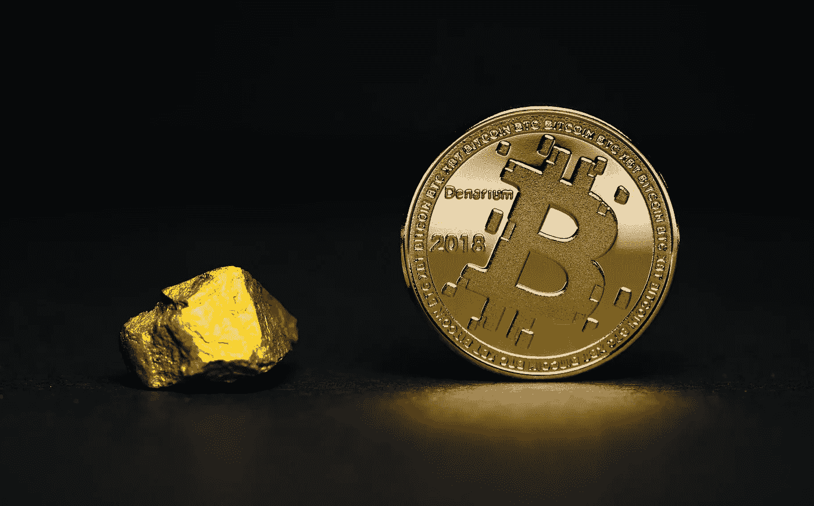
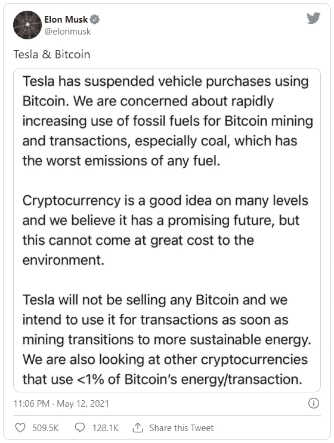
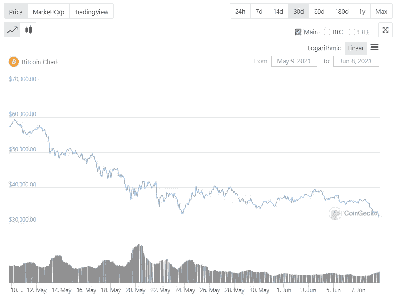
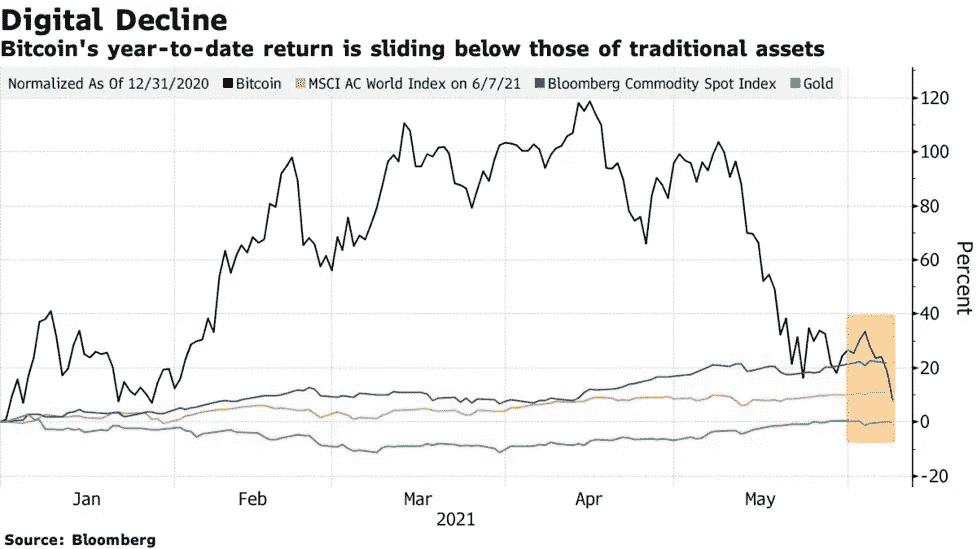
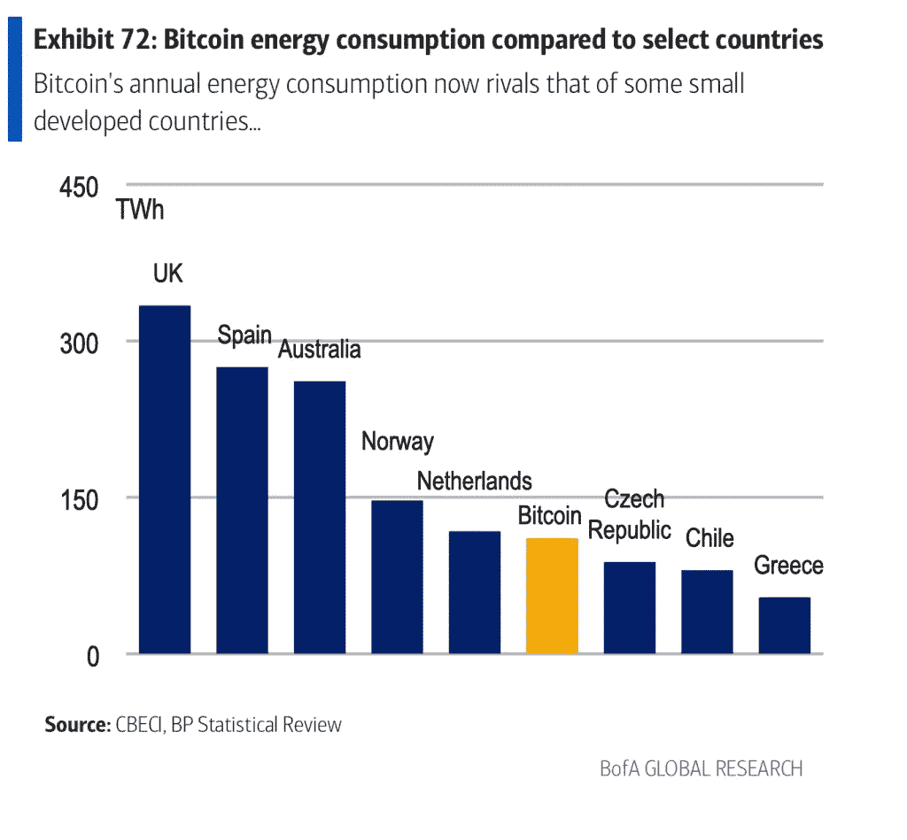
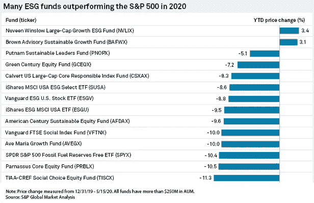

# 比特币灾难性的几个月表明，可持续性是世界上最受追捧的资产

> 原文：<https://levelup.gitconnected.com/bitcoins-disastrous-few-months-show-that-sustainability-is-the-world-s-most-sought-after-asset-f43e0ba24e40>

不溅

到目前为止，对于比特币和更广泛的加密货币来说，2021 年是动荡的一年。进入 1 月份后，在常规的历史新高中，迎来了特斯拉的 15 亿美元投资，并在世界各地获得了新的采用水平，Q2 出现了积极的回调，抹去了加密货币的大部分价值。这场崩溃似乎始于埃隆·马斯克(Elon Musk)关于比特币碳足迹的推文，在一个注重可持续发展的投资环境中，这种世界上最著名的加密货币会崩溃吗？

社交媒体的力量可能令人恐惧——尤其是对受投机和情绪严重影响的加密货币市场而言。

*(图片:* [*BBC*](https://www.bbc.co.uk/news/business-57096305) *)*

当埃隆·马斯克(Elon Musk)宣布他的公司特斯拉(Tesla)将暂停使用比特币购买汽车时，影响深远。尽管马斯克后来证实特斯拉对加密货币[的投资仍然存在，但 BTC 的价值——加上中国收紧的监管——暴跌。](/crypto-is-crashing-8c8c333cf403)

*(图片:***)**

*在接下来的一个月里，比特币下跌了 45.2%，抵消了 2021 年 1 月和 2 月期间比特币价格的大部分累积。*

**

**(图片:* [*彭博*](https://www.bloomberg.com/news/articles/2021-06-08/bitcoin-drops-more-than-5-in-renewed-cryptocurrency-selloff) *)**

*令比特币的问题进一步复杂化的是，与一些传统资产相比，比特币的年回报率表现不佳——这是自加密货币减半事件一年后出现的不同寻常的情况。*

*然而，埃隆·马斯克关于比特币可持续性的推特引发了对加密货币可持续性的全新关注。虽然比特币在一个月内贬值了 45%，但更注重可持续性的加密货币，如卡尔达诺(ADA) [仅下跌了 8.6%](https://www.coingecko.com/en/coins/cardano)——很大程度上是由于 BTC 主导的市场支配地位。*

# *碳排放增加的成本*

*随着比特币的价格在 2021 年回升，一份[美国银行的报告](https://davidgerard.co.uk/blockchain/2021/03/22/bank-of-america-bitcoins-dirty-little-secrets-full-report/)开始更好地理解比特币对环境的影响。华尔街似乎同意，有大量证据表明比特币开采对环境产生了深远的负面影响，但事情到底变得有多糟糕呢？*

*根据美国银行的报告，比特币最近的价格飙升导致了与比特币相关的碳排放“天文数字”的增长。在过去的两年里，BTC 的崛起导致相关排放量增加了 4000 多万吨，相当于道路上增加了 890 万辆汽车。*

**

**(图片:* [*运势*](https://fortune.com/2021/05/13/musk-bitcoin-mining-bad-planet-heres-how-bad/) *)**

*根据该报告，比特币的能耗已经超过了希腊、智利和捷克等发达国家的总排放量。*

# *可持续投资的兴起*

*继新冠肺炎疫情之后，可持续投资和 ESG 股票已经成为一件大事——这是理所当然的。*

*根据 E.ON 的[调查结果，自健康危机到来以来，消费者正在积极寻找更可持续的产品和服务，同时对环保企业给予更多奖励。](https://www.circularonline.co.uk/news/consumers-demand-greener-products-in-wake-of-pandemic/)*

*数据显示，多达 36%的英国居民有意识地从拥有强大环保资质的公司购买产品。与此同时，80%的人声称计划从明显寻求环保的企业购买商品和服务。*

*疫情帮助消费者和投资者提高了对气候危机的关注，这一运动有助于更加重视公司的碳足迹。*

*E.ON 的可再生能源回报报告探讨了疫情之后绿色经济复苏的潜力，该研究似乎指向了更加关注环境的广泛努力。*

*在报告中接受调查的消费者中，约 72%的人声称会关注企业的行为是否有利于环境，而 65%的人认为他们购买的产品或服务不会对环境造成损害是很重要的。*

**

**(图片:* [*想顾问*](https://www.thinkadvisor.com/2020/05/21/esg-focused-funds-are-outperforming-during-pandemic/) *)**

*正如上述数据所示，这种情绪已经开始蔓延到投资领域，环境、社会和治理(ESG)基金在疫情高峰期的表现超过了标准普尔 500。*

*这也导致了在公开市场赢得新投资的可持续公司的增加。最近，OAT-LY，一家可持续饮料公司，以 130 亿美元的估值在纽约证券交易所上市。最近，其他公司也在寻求加入这一行动，以适应新一波投资者情绪。*

*我们只需看看眼镜世界就能明白可持续发展的价值。由于 75%的成年人需要某种形式的视力矫正治疗，克里斯多佛·克洛斯与美国橄榄球联盟明星汤姆·布拉迪合作推广一系列新的可生物降解太阳镜，这表明市场吸引力牢牢掌握在可持续产品手中。*

# *比特币能变得可持续吗？*

*让比特币更加可持续的努力正在进行中，此举可能有助于保护数字资产的未来和整个环境。今年 3 月，挪威第二大富豪、油田服务亿万富翁谢尔·英格·罗克(Kjell Inge rk ke)[创办了 Seetee](https://qz.com/1982209/how-bitcoin-can-become-more-climate-friendly/)——一家旨在“在不需要稳定的本地需求——风能、太阳能、水能——的情况下，将输送或输送帐篷电的阿尔项目设计成可在任何地方使用的经济型机组”的公司洛克声称比特币是“一种负载平衡的经济电池，电池对于实现巴黎协议目标所需的能源转型至关重要。”*

*洛克并不是唯一一个努力让开采比特币成为更可持续的行为的人，但在一个需要大量能源、昼夜不停的过程中实现环境友好可能是一项艰巨的任务。*

*每当比特币价格飙升时，其碳足迹就会持续上升，因此最近的调整可能是加密货币景观反思其功能的理想时机。加密货币世界的未来肯定是光明的，尽管比特币等低效的[资产正处于动荡时期，但该货币最近的飙升赢得了新的崇拜者。如果围绕加密货币的下一项创新能够限制其不断蔓延的碳足迹，我们可能会看到主导 2020 年底和 2021 年初的牛市的响亮回归。](/is-warren-buffett-secretly-buying-bitcoin-101147fcd45c)*