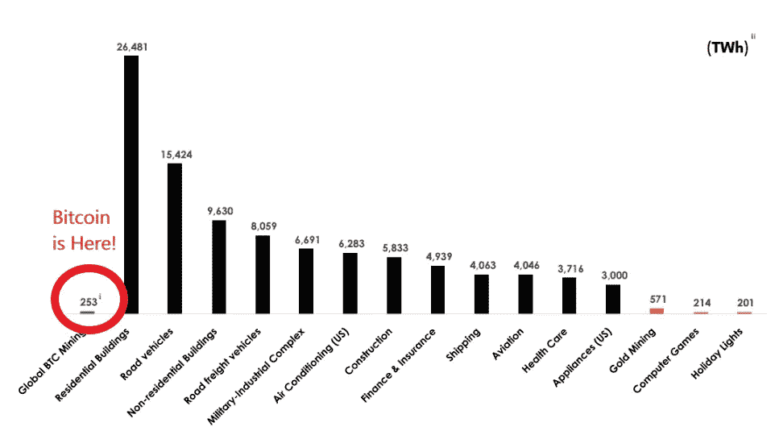
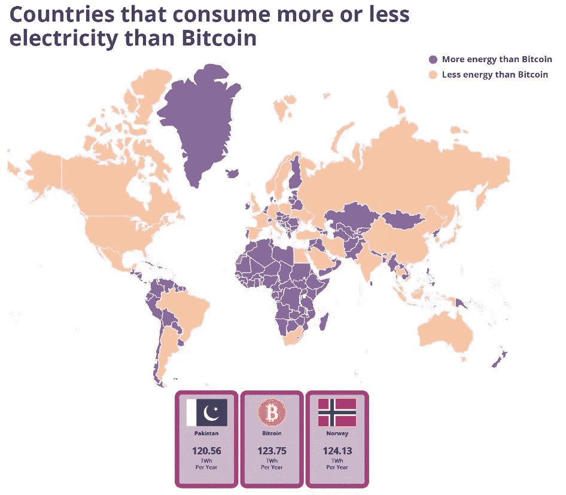

# 比特币最终的老板将会击败回声战士——这是你投资比特币的最大威胁。

> 原文：<https://levelup.gitconnected.com/bitcoins-final-boss-will-be-defeating-echo-warriors-its-your-biggest-threat-to-investing-in-deed47ff13c1>

你必须知道所有的事实。

[Ehimetalor Akhere Unuabona](https://unsplash.com/@theeastlondonphotographer?utm_source=unsplash&utm_medium=referral&utm_content=creditCopyText) 在 [Unsplash](https://unsplash.com/s/photos/extinction-rebellion?utm_source=unsplash&utm_medium=referral&utm_content=creditCopyText) 拍摄的照片

比特币的最后一个障碍很可能是政府。

政府政策被环境回声战士劫持，他们会躺在迎面而来的车流前，以表明他们的观点，即驾驶汽车是对人类的威胁。

很讽刺，不管你站在哪一边。

人们现在比以往任何时候都更关心环境。技术的采用理所当然地将男性心理健康、[我也是](https://en.wikipedia.org/wiki/MeToo_movement)运动和 [BLM](https://blacklivesmatter.com/) 等主题带到了社会的前沿。

最近，轮到比特币在公众舆论的法庭上受到一些批评。

在这里，我们将解开事实，看看比特币的隧道尽头是否有光明。

或者我们是否需要彻底禁止它。

# 比特币专家称环境因素是茶杯里的风暴。

比特币 twitter 社区的共识是，比特币提供了经济价值和全球产出，因此它应该使用能源。

在你来找我之前，推特是可靠的二手意见。

来听听所谓的专家怎么说。

全球投资巨头[高盛](https://www.bloomberg.com/news/articles/2022-01-04/goldman-says-bitcoin-100-000-a-possibility-by-taking-on-gold?leadSource=uverify%20wall)最近的预测称，随着数字资产继续被广泛采用，比特币是未来十年最有可能取代黄金的资产类别。

相比黄金 2.6 万亿美元的投资，比特币 3160 亿美元的市值使其在“价值储存”市场中占有 12.5%的份额。

根据高盛的一份报告，比特币正在蚕食黄金的市值；将它的产出与其他工业能源使用进行比较是完全有道理的。

这是比特币产出与其他工业能源使用的对比数据。

来源— [比特币矿业委员会](https://bitcoinminingcouncil.com/wp-content/uploads/2022/07/2022.07.19-BMC-Presentation-Q2-22-Presentation.pdf)

# 不是每个人都相信。

[金钱超市](https://www.moneysupermarket.com/gas-and-electricity/features/crypto-energy-consumption/#_this_map_shows_which_countries_consume_more_or_less_electricity_than_bitcoin_)根据矿工在 12 个月内收到的区块奖励进行了一项研究——研究人员估计比特币的总能耗约为 123 太瓦时(TWh)或 1230 亿千瓦时。

仅比特币一项就比世界上大多数国家消耗的能源都多，相当于 T2 的年能耗，比拥有 2 . 3 亿人口的 T4 和巴基斯坦的年能耗都多。

研究发现，单笔比特币交易平均使用**1173 千瓦时(kWh)。**

相比之下，英国家庭的平均月用电量为 350 千瓦时，这足以为一个典型的英国家庭供电三个多月，成本约为 125 英镑(141 美元)

在美国，根据每月 877 千瓦时的平均家庭用电量，这相当于六周的电力(美国能源信息管理局)。

下面的图表概述了比比特币使用更多和更少能源的国家。

紫色=比比特币更有能量

杏子=比比特币能量小

*(作者编辑-颜色正好相反)*

来源— [货币超级市场](https://www.moneysupermarket.com/gas-and-electricity/features/crypto-energy-consumption/#:~:text=Based%20on%20the%20number%20of,annual%20energy%20consumption%20of%20Norway.)

# 下面是最后一位老板要说的话——白宫。

美国政府表示，他们正在跟踪数字资产对环境的影响。

在一份报告中，他们巧妙地提到了比特币的工作证明模型的负面环境影响，这种模型现在占据了 95%的市场。

乔·拜登表示，他是加密技术的倡导者，希望它成为美国经济未来的重要组成部分，不仅仅是富裕的投资者，还有中产阶级和工薪阶层。

但如果你是比特币爱好者，每一个积极的说法都会让你陷入困境，并给你一个消极的回应。

白宫表示，如果让采矿变得更加绿色的措施不起作用，能源密集型加密采矿，即比特币采矿，可能会被完全禁止。

> “如果这些措施被证明在减少影响方面无效，政府应该探索行政措施，国会可以考虑立法限制或取消使用高能耗共识机制进行秘密资产开采。”

他们进一步说；

> *“为加密资产供电会消耗大量电力——排放温室气体，使电网紧张，并通过噪音和水污染损害一些当地社区”。*

# **比特币如何克服环境压力？**

当没有首席执行官或核心人物时，很难直接指责或让任何人承担责任。

围绕比特币的能源消耗，三个领域继续受到关注，主要是由社区成员进行的。

1.  比特币采矿使用 59%的可再生能源。
2.  与能源的其他工业用途相比，它是高效的。
3.  采矿奖励每四年减半。

基本上是否认。

而我相信这也是比特币脆弱的地方。

# **最终想法**

如果你将比特币与其他资产类别相比较，它似乎是一种高效的能源利用方式。

如果你把它与回声系统中的其他区块链或人口众多国家的能源输出相比，它看起来很可怕。

如果你是比特币最大化主义者，它就是房间里的大象。你也将有所有手指和脚趾交叉，它在某种程度上解决了环境的耻辱。

事实上，不管奖励减半，采矿只会增加，因为价格和利润会相对增加。

唯一实际的角度是，大众是否承认比特币是一种数字黄金，并比较对待它的能源使用。

除了经济上的授权，它给了第三世界的人们。全球关心环境的人比数字货币还多。

在大规模采用到来之前，这只是你必须接受的事情。

它来了。

> 如果你想在 Web3 上阅读更多我的观点，可以考虑成为会员。你的会员费直接支持你读的作家。如果你用我的链接 [*注册，我会赚一小笔佣金。点击这里*](https://medium.com/@jayden_levitt/membership) *。*

*本文仅供参考；不应将其视为财务、税务或法律建议。在做出任何重大财务决定之前，请咨询财务专家。*