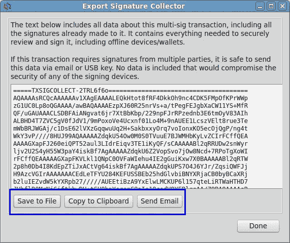

# 比特币价格下跌。所以…什么？

> 原文：<https://levelup.gitconnected.com/bitcoins-price-fell-so-what-a2f1f73bbe19>

比特币是一项非常新的技术，尽管它给生活带来的概念已经有几十年的历史了。双重支出问题已经解决；这意味着有可能使用数字证书来代替金钱，并确保只要您持有该证书，除了您之外没有其他人可以使用它。这是一个前所未有的范式转变，其影响尚未被完全理解，也没有工具来充分利用这一新思想。

这项新技术在发展基于它的业务时需要一些新的思维。正如电子邮件的先驱供应商多年来没有正确理解他们所销售的服务一样，比特币需要新的正确思维，这种思维将会出现，这样它才能发挥出全部潜力，变得无处不在。

原始的 Hotmail 界面

Hotmail 使用熟悉的技术(浏览器、电子邮件)来创建更好的访问和发送电子邮件的方式；使用 Outlook Express 这样的电子邮件客户端的想法已经被网络界面和“云中”电子邮件所取代，与将邮件存储在本地的专用客户端相比，它提供了许多优势。

比特币将改变你转账的方式，我们需要从比特币自身的角度来理解它，而不仅仅是把它视为一种在线货币形式。将比特币视为货币，就像将电子邮件视为邮寄信件的另一种形式一样荒谬；一个不仅取代了另一个，而且深刻地改变了人们发送和消费信息的方式。它不是对现有理念或服务的简单替代或一维改进。

前面我已经解释过， [**比特币不是货币**](http://irdial.com/blogdial/?p=3135) 。比特币是 [**一个协议**](http://irdial.com/blogdial/?p=3166) 。如果你以这种方式对待它，在正确的假设下，你可以开始将比特币置于适当的环境中，让你对基于比特币可能盈利的服务种类提出理性建议。

比特币的每一部分都是文本。它永远是文本，而且在任何时候都不会停止是文本。这是一个事实，作为文本，它受到文明国家宪法中言论自由条款的保护，享有有保证的、不可撤销的权利。

当你在 Gmail 账户上输入电子邮件时，你就是在输入你的“信”。你按下发送，它通过你的 ISP，在互联网上，进入你的收件人的 ISP，然后在你的收件人的机器上输出。比特币也是如此；你通过服务在一端输入钱，然后将比特币发送给你的接收者，没有中介来处理转账。一旦比特币完成了将你的[价值在全球](http://www.weusecoins.com/globe-Bitcoin/)传递给收件人的工作，它就需要被‘读出’，即把*变回金钱*，就像你的信在电子邮件中显示给收件人一样。

在电子邮件的情况下，一旦发生了传输，并且您收到的电子邮件向您传达了其信息，它除了作为发送信息的记录(会计)之外没有其他用途，并且您将该信息存档。比特币在区块链为你做这种记账，基于它的良好服务将在本地为你存储扩展的交易细节，但作为比特币的接收者，你需要的是*钱*或*货*而不是比特币本身。

> 比特币是一种数字货币，没有像银行一样的中央存储位置，交易记录在那里。取而代之的是，数据分类帐分布在世界各地的计算机网络上。当矿工的计算机验证并记录网络交易时，他们会得到 BTC 的奖励。

尽管事实上你不能花两次钱，而且每一枚都是独一无二的，但比特币没有内在价值，不像一本书或任何实物。关于比特币的错误想法已经蔓延开来，因为它的行为就像钱一样，因为它不能被双重花费。然而，这一事实掩盖了比特币的双重性质，即数字化、可复制和不可重复消费。

Razzles。它们以糖果开始，然后以口香糖结束。在你咀嚼它们之前，它们是什么？一块糖，还是一块口香糖？

比特币是数字的，具有使信息不稀缺的所有信息品质。它坐落在一个新的地方，在物理世界的商品和无限丰富的数字信息世界之间摇摆，只属于数字世界*，但具有两者的特征*。这就是为什么它被广泛误解，为什么需要一种新的方法来围绕它设计业务。

所有这些都在某种程度上解释了为什么在交易所购买比特币的价格并不重要。如果购买一枚比特币的成本变为 1 英镑，这不会改变转账另一端流出的金额。只要你在转换成商品或货币后立即赎回你的比特币，无论你在开始这个过程时为比特币支付了多少钱，在另一端都会出现相同的价值。

这么想吧。让我们假设你想发送一个长文本文件给另一个人。你可以原样发送，也可以用 zip 压缩。文档文件压缩后的大小可以比原始文件小 87%。当我们把这个想法转置到比特币上，压缩比就是比特币在一个交易所的价格。如果一个比特币是 100 美元，你想用 100 美元从印度的某人那里买东西，你需要买 1 个比特币才能把这 100 美元带到印度。如果比特币的价格是 1，那么你需要 10，000 个比特币来向印度发送 100 美元。这些将分别表示为 1:1 和 10，000:1 的压缩比。

同样的 100 美元价值寄到印度，不管你用 1 万还是 1 个比特币。比特币的价格*与正在传输的价值*无关，就像 zip 文件不‘关心’里面有什么一样；比特币和 zip 是完成工作的愚蠢协议。

只要比特币的价值不归零，它就有着和价值非常‘高’一样的效用。

考虑到所有这些，很明显[需要新的服务来促进比特币快速、无摩擦的转换，以允许它以真正符合其本质的方式运行。](https://medium.com/@beautyon_/azteco-bitcoin-for-the-masses-fc17f8ca1df0)

想象一下。您收到一封来自世界各地的电子邮件，并通过在您的浏览器中显示主题行得到通知。然后*向你的 ISP 申请*将这封邮件发送给你，你必须等待七天，邮件才会到达你的邮箱。

这个想法完全是荒谬的，然而，这正是比特币正在发生的事情，没有任何技术原因。

很明显，我们需要重新思考围绕比特币发展的服务，以及比特币的真正本质。重新思考服务是企业家精神的一个正常部分，我们应该预料到商业模式会失败，随着不断的迭代和旋转进展，早期进入者会半途而废。

考虑到这一点，在交易所使用不适合这项技术的商业模式来关注比特币的价格是不理智的；这就像把一只呼吸甲烷的金丝雀放在一个充满呼吸氧气的人类的矿井里作为探测器。即使空气没有问题，鸟儿还是会死去；矿工们匆忙撤离，留下暴露的金矿层，以为他们都将被消灭，而实际上一切都很好。

日内交易者在家投机比特币导致价格振荡。这是一个人为的信号，与比特币的需求及其作为促进商业的经济工具的流通无关。

比特币及其背后的理念将会一直存在。像 Hotmail 一样，随着下载客户端、应用钱包和工具的人数增加，它将最终达到临界质量，然后在互联网上呈指数级传播。当这种情况发生时，正确的商业模式将会自然而然地出现，因为它们会变得显而易见，就像 Hotmail、Gmail、脸书、手机和即时通讯似乎是第二天性一样。

在未来。我想很少有人会猜测比特币的价值，因为即使这是可能的，甚至是有利可图的，但提供易于使用的比特币服务，充分利用比特币的优势，将会赚更多的钱。

有一点是肯定的；速度将是任何未来比特币商业模式的关键。在交易的两端提供即时满足的创业公司将会获得成功。尽管比特币价格的波动性肯定会稳定下来，但由于它本身没有任何用途，立即回到货币或商品将是任何基于比特币的业务所追求的特征。

比特币业务的需求在性能、安全性和新思维方面带来了许多挑战。随着这些挑战的出现，新的实践和软件将会出现，我们只能想象它们的出现。

在 Twitter 上关注 [Beautyon](https://medium.com/u/e6958b5742d2?source=post_page-----a2f1f73bbe19--------------------------------) 。