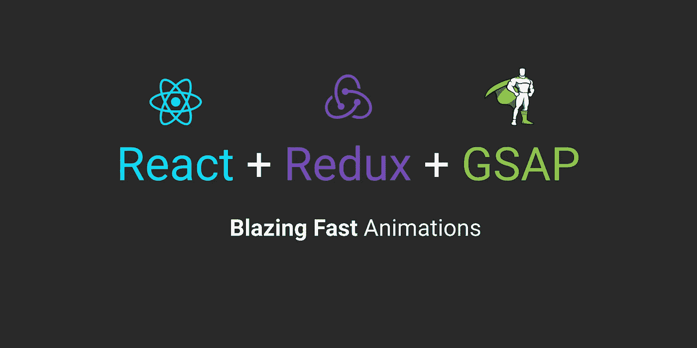
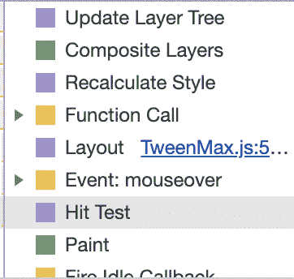

# 超快的反应动画，有(和没有)Redux

> 原文：<https://levelup.gitconnected.com/blazing-fast-react-animations-with-and-without-redux-762b6152b8ef>



构建 React 应用程序时，制作快速复杂动画的秘诀是什么？我给你一个提示…解决方案实际上是*避免* React，但是我们可以利用 Redux。

# 目标

我们希望将一个简单的圆圈动画到鼠标所到之处。您可以在这里试用完整的工作版本:

[](https://codesandbox.io/s/reactredux-y70v1?fontsize=14) [## react+redux - CodeSandbox

### 为 web 应用程序定制的在线代码编辑器

codesandbox.io](https://codesandbox.io/s/reactredux-y70v1?fontsize=14) 

我包括了 redux 和非 redux 解决方案，以及一个在动画`top` / `left`属性和转换属性之间切换的按钮，这样您就可以在 Chrome dev tools 的 performance 面板中看到不同之处。

# 我们的包裹

为了让事情顺利进行，我们需要安装以下软件:

*   反应
*   反应 DOM
*   冗余(或不冗余)
*   GSAP(动画图书馆的金鹅)

所以基本上只要运行`npm install react react-dom redux gsap`，你应该有你需要的一切。

# 基本设置

让我们为我们的动画组件创建一个名为`AnimatedComponent.js`的文件。

这基本上是相当标准的，但是我想在这里指出一些事情:

1.  在这个例子中，我们通过窗口对象来监听全局的移动，但是您也可以很容易地将监听器附加到某个元素上。
2.  我们使用 React 钩子是因为它们太棒了。这与在`componentDidMount`上添加事件监听器并在`componentWillUnmount`上移除它是一样的，但是要短得多。
3.  不用担心`setTargetPosition`功能。现在让我们假设它存在，并神奇地在某个全局状态中为我们的圆设置目标位置。我们以后会充实它。

# 我们负责任的反应动画的黄金法则

所以…准备好…我们将使用 React 之外的状态。我知道我知道……这是巫术，令人厌恶。因此，为了有效地做到这一点，我们需要制定一些规则:

1.  如果我们每秒要更新状态很多次，我们只使用 React 外部的状态。
2.  如果你的动画很简单(例如带有活动/非活动状态的 CSS 转场)，只需使用 React 状态，无需动画库。没有必要引入开销和复杂性。
3.  如果是做 JavaScript 动画的话，*不要自己写。使用诸如 GSAP 之类的库，并让它在 React 之外做它自己的事。像 GSAP 这样的图书馆被比你我聪明得多的人极大地优化了，它会让你的生活轻松 1000 倍。此外，它将减少外部状态管理。*

请注意，这个例子很简单，可以用 CSS 转换来完成(没有 GSAP)，但是它不满足活动/非活动状态行为要求，所以我们将使用全局状态。另外，我想向你们介绍 GSAP 的力量，这是一个很好的借口。

# 更新我们圈子的目标位置

好吧，让我们想想我们的情况。我们将在每次鼠标移动时更新目标位置，这将是每秒多次(规则 1)。这需要大量的状态更新，所以我们可能需要在 React 之外处理这个问题。

我将为我的 redux 用户举一个例子，然后为那些没有使用 Redux 的用户举一个简短的例子。

# Redux:我们的行动和减速器

当我们移动鼠标时，我们需要一个动作来更新我们正在制作动画的圆圈的位置。这是我们的`actions.js`文件:

太好了，很简单。我们在这里直接向商店发货，但是正如 Mark Erikson 在评论中指出的(再次感谢！)，没必要。你可以将动作创建者传递给你的连接函数，例如`AnimatedComponent.js`中的`export default connect(null, {setTargetPosition})(AnimatedComponent)`。我认为直接针对存储进行调度在连接到 Redux 的组件和不受状态变化影响的组件之间创建了一个很好的视觉区别，但这取决于您。现在我们的减速器:

Tada！我们现在有了外部状态。

# 非冗余解决方案

我们也可以在`state.js`中用一些辅助函数建立一个非常简单的全局状态对象

我不会介绍如何实现带有自定义状态的实际示例，但是您可以查看完整示例的 CodeSandbox。应该很清楚在哪里把 redux 的东西换成上面的函数。

# 回到我们的动画部分

不算太差！让我们回到`AnimatedComponent.js`，在那里做一些更新。

让我们走完每一行。首先，我们使用`useRef`钩子创建了一个 ref，这样我们就可以指向我们的 div:

`const compRef = useRef(null);`

然后我们将它附加到我们的 div:

`<div style={animatedCompStyle} ref={compRef} />`

我们还需要监听状态变化。典型的 React Redux 方法是使用`mapStateToProps`，但是在我们的例子中，我们不希望它在 React 级别触发组件更新。幸运的是，我们可以利用`store.subscribe()`函数来完成这个任务。

```
store.subscribe(() => {   
  const state = store.getState(); 
});
```

这是*而不是*最佳实践，因为这将在状态的任何部分改变时触发。我建议使用像 redux-subscribe 这样的库，它们被优化为只监听特定状态片段的变化。对于我们的例子，这就足够了。

现在我们可以进入 GSAP 了！

# GSAP 到底是什么？

GSAP (Greensock 动画库)是 JavaScript 动画库的金鹅。它速度快得要命，易于使用，而且极其强大。我将单独写一篇关于这个库的文章，但是现在只要看看这里的[文档](https://greensock.com/timelinelite) 就知道它有多强大了。

我们将利用它来平稳地将 div 移动到鼠标位置。下面是代码:

```
// TweenLite at a minimum takes an element, duration, and properties // to animate as input TweenLite.to(compRef.current, 1, { x: state.x, y: state.y });
```

`TweenLite.to()`是一个用指定属性触发动画的函数。事情是这样的:

1.  我们将一个引用传递给我们正在制作动画的 div 元素
2.  我们以秒为单位传递动画的持续时间
3.  我们指定想要动画化的属性，在我们的例子中，x 和 y 是我们存储在 state 中的目标鼠标位置
4.  我们还可以传递不同的放松函数(GSAP 有一吨)，延迟，链接多个补间，传递回调到时间轴中的特定点，等等。这超出了本教程的范围。

就是这样！我们现在有了使用 React 和 Redux 的快速动画(特别感谢 GSAP)。我们设法将我们的状态与应用程序的其他部分分开，但仍然利用了我们用来利用的相同框架和工具。

# 关于动画属性的重要说明

虽然我们*可以*动画任何我们想要的属性，但我们不想。以下例子的区别是**大规模**在性能方面。

但是为什么呢？答案在于浏览器如何更新屏幕。浏览器在呈现网页时会经历一个多步骤的过程，最后(也是最快的)步骤是合成步骤。在内容已经被绘制到屏幕上之后，它处理页面元素的排序。

# 避免顶部和左侧 CSS 属性

当我们使用 x 和 y 制作动画时，我们不会触发任何布局更改，因为我们使用的是 transform 属性，它不受布局的影响。这意味着当浏览器呈现更新时，它不需要再次绘制元素，因为它不担心布局变化。

当我们使用 top 和 left 制作动画时，这是相对于页面上的其他元素而言的。浏览器被迫在每次更新时重新绘制动画元素，这就是导致 janky 动画的原因。

结论是尽可能只使用平移、旋转和缩放。

# 特性试验

我在示例中包含了一个按钮，可以在使用 x / y 和 top / left 之间切换。您可以进入 chrome dev 工具，单击“性能”面板，单击“录制”按钮，查看使用顶部和左侧火焰合成和绘制事件的动画与使用变换的动画有何不同:



请注意，使用 top + left 时会触发绘画和复合层

# 结论

我想指出的是，这里还可以进一步提高性能(消除鼠标移动事件调用的反跳，使用 redux-subscribe 只监听特定属性的更新，等等)。这将为您在 React 中制作一些很酷的动画打下良好的基础，而不会影响性能。

在 CodeSandbox 中，我也包含了一个非 redux 的例子，所以如果你没有使用 Redux，请检查一下！

# 关于作者的随机事实

*   我是一名前端开发人员**正在寻找新项目**
*   我有一只异常大的斗犬，它害怕风
*   我喜欢旅行，这个世界绝对迷人
*   我用吉他弹奏指弹编曲，但我的歌声会杀死一只小动物
*   你可以[在 linkedin](https://www.linkedin.com/in/kristopher-guzman-2615b19b/) 上联系我！

[](https://gitconnected.com/learn/react) [## 学习 React -最佳 React 教程(2019) | gitconnected

### 排名前 51 的 React 教程-免费学习 React。课程由开发人员提交并投票，使您能够…

gitconnected.com](https://gitconnected.com/learn/react)