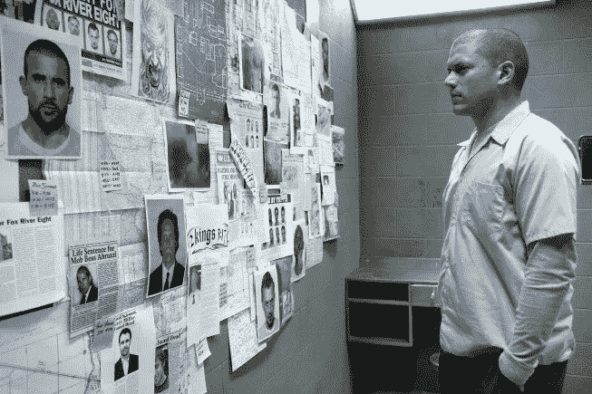
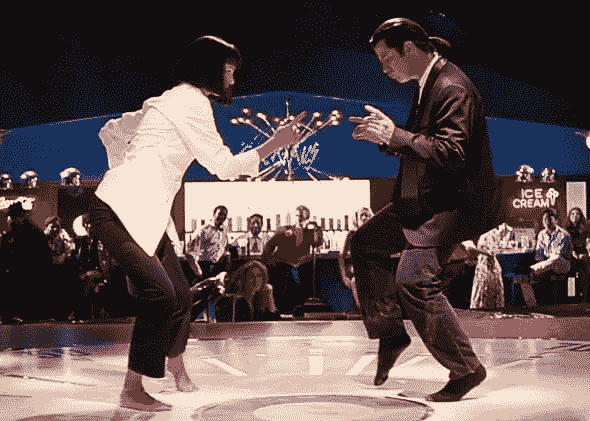

# 相亲:软件工程师招聘过程的现实

> 原文：<https://levelup.gitconnected.com/blind-date-the-reality-of-software-engineers-hiring-process-f89754b5a1d4>

## 我们能更好地找到合适的匹配吗？

我觉得我们已经认识很多年了

你参加过相亲吗？如果你有，我肯定你还记得“*我在这里做什么的感觉？*“在约会期间”，接下来是“*在回家的路上，当我说好的时候我在想什么*”。我能听到你说“一些伟大的爱情故事是从相亲开始的”。是的，我知道。但是相亲是一种寻找爱情的有效方式吗？

> 效率是软件工程中的核心概念。我们有复杂的方法和新奇的工具，帮助我们在几乎每一个过程中有效地驱动。招聘是个例外。

我想我们都同意，建立一个强大的团队对我们的成功至关重要，雇佣合适的人是建立一个强大的工程团队的核心要素。

> 不知何故，当涉及到我们的招聘过程时，分析方法、效率和直觉就被抛到了一边。

从候选人的角度来看，形势**不太合理**。你将做出一个非常重要的决定，这个决定将影响你的职业道路。在更直接的层面上，你将要做的决定将决定你在醒着的大部分时间里将做什么，以及你将与谁共度这段美好时光。

> 基本上双方都是**在找好的搭配**。对于什么是好的匹配，双方都有自己的标准，但招聘过程并没有真正调整为提供对匹配标准的信心。

在这篇文章中，我将根据我作为求职者和招聘经理的 20 年经验，深入探讨这个话题。我们将从描述期望的匹配标准开始，这基本上是双方在招聘过程中想要得到的信号。然后我将描述现实，意思是通常会发生什么，距离满足双方的需求还有多远。最后，我会试着想象一个更好的世界会是什么样子，一个我们开始新工作的第一天不会感觉像是相亲的世界。

Ruby on Rails？

## 候选人在寻找什么？

见见大卫。大卫是一名 32 岁的软件工程师。他拥有一所名牌大学的计算机科学学位，外加 6 年的开发实践经验。他的第一份工作是在一家大型企业，在那里他花了 4 年时间开发一款 B2B SaaS 产品。在他的第一份工作中，David 有机会与经验丰富的工程师一起工作，学习他仍然认为是以正确的方式构建软件的基础的东西。

四年后，大卫觉得是时候继续前进了。他想去一家小公司工作，他相信在那里他可以产生更大的影响。他还觉得自己的薪酬有点低，而且他感到沮丧的是，这是由公司的职位平衡系统驱动的，而不是由他的实际表现驱动的(顺便说一句:长期工程师的薪酬将是我下一篇文章的主题)。

所以大卫归还了他的徽章，在 LinkedIn 上发布了一条友好的告别消息，并继续他的下一个挑战。他加入了一家**小型创业公司**，该公司的目标是“*永远改变电子商务世界*”。这位首席执行官的推销非常有意义(带有“ [*民主化*](https://www.forbes.com/sites/benzingainsights/2012/05/24/10-overused-startup-buzzwords/?sh=538fb39441be) ”)，大卫觉得作为第 25 名员工加入一家“*火箭般发展的公司不会是一个糟糕的决定。特别是考虑到他被授予了“1 *0K 股票期权*”,这很可能很快就会成为独角兽，甚至是下一个亚马逊/Shopify/某个名字打错的大公司。*

在这家小型创业公司工作的现实与大卫的预期大相径庭。他加入了一个由 9 名开发人员组成的团队，所有人都直接向 CTO 汇报，CTO 也是创始人之一。每个人都一直很忙，赶着完成大卫一无所知的项目。总的来说，团队中的沟通和合作很少。像他的队友一样，大卫被分配去领导一个项目(他也是这个项目中唯一的一个人)。项目的背景和商业需求是模糊的，但他确实得到了一个非常明确的期限，即一个月的时间来“将这个东西投入生产”。

建筑(照片由[克拉拉·库里科娃](https://unsplash.com/@kkalerry?utm_source=medium&utm_medium=referral)在 [Unsplash](https://unsplash.com?utm_source=medium&utm_medium=referral) 上拍摄)

David 试图通过进入源代码来获得一些上下文并了解产品，但这被证明是一个坏主意，因为他在那里发现的是一大堆意大利面。事实证明，技术栈、架构和设计模式在这里并不重要，或者至少没有快速交付特性重要。该团队真正擅长的一件事是产生技术债务。这些只是一个更广泛问题的早期迹象。没过多久，大卫就明白了**接受这份工作可能是个错误。在试图充分利用这种情况近两年后，大卫最终决定他必须继续前进，找到一份新工作。**

这一次，大卫决定用不同的方法来找工作。他列出了对他下一份工作最重要的 12 个**方面**。对于他将面试的每个职位，他将根据招聘过程中收集的**信号**对这些方面进行评分(从 1 到 10)。以下是大卫的清单:

1.  技术
2.  队友
3.  直接经理
4.  影响能力
5.  显色法
6.  学习机会
7.  文化
8.  产品
9.  公司
10.  补偿
11.  工作生活平衡
12.  个人成长机会

逃跑很容易；不知道下一步该做什么是困难的部分

## 招聘经理想要什么？

见见莎拉。萨拉是 SaaS 一家成功公司的研发团队领导。她的团队负责构建和运行一个应用程序，用于分析 web &移动应用程序中的用户行为。这款应用主要处理数百万用户的点击流数据，将这些数据转化为可操作的见解，并通过性感的 web GUI 和 GraphQL API 提供这些见解。云原生，大数据，AI 驱动。越酷越好。

像工程组织中的大多数团队一样，Sara 的团队是由[功能团队](https://medium.com/swlh/fighting-conways-law-the-reality-of-feature-teams-9fcdf96fb1a1)组成的。她领导的团队包括 4 名全栈开发人员、1 名测试自动化开发人员和 1 名 DevOps 工程师。根据下一年的战略计划和预算计划，Sara 获准增加 HC，并为她的团队增加一名全栈开发人员**。好消息。**

什么是好的雇佣？这是一个很好的问题。Sara 想到了她当前的团队。什么样的工程师会让我们变得更好？当然，梦想是引进一名 [10x 工程师](https://medium.com/swlh/playmaker-the-reality-of-10x-engineer-8af96abce74)，这将提升整个团队，但这说起来容易做起来难。像大多数团队经理一样，Sara 最终根据她目前在团队中的人员建立了匹配档案。“*如果我们能雇佣像本*这样的人就太好了，”她告诉招聘人员。他是一名优秀的程序员，但更重要的是，他积极主动、真诚。

 [## 你会在每个团队中发现 3 种类型的软件开发人员

### 了解他们的特点以及这些特点如何影响他们的职业发展。

levelup.gitconnected.com](/3-types-of-software-developer-you-will-find-in-every-team-5cf7d4702127) 

与 David 的列表非常相似，Sara 也有一个 12 个方面的列表，这些方面定义了将**与她的团队**很匹配的开发人员。对于每个候选人(包括我们的朋友大卫)，Sara 将根据招聘过程中收集的**信号**对这些方面进行评分(从 1 到 10)。这是莎拉的清单:

1.  技术
2.  通力合作者
3.  协同性
4.  产生影响的热情
5.  了解 SDLC
6.  学习和改进的热情
7.  文化契合度
8.  通讯技能
9.  关注细节
10.  责任和所有权
11.  应对压力
12.  增长潜力

git 克隆？(图片由[克雷顿·埃韦尔顿](https://unsplash.com/@cleytonewerton?utm_source=medium&utm_medium=referral)在 [Unsplash](https://unsplash.com?utm_source=medium&utm_medium=referral) 上拍摄)

## 现实中会发生什么？

简短的回答是**现实烂**。大卫(候选人)和莎拉(招聘经理)都知道他们在寻找什么。他们甚至有一个评级系统来衡量每个机会，并找出它是否是一个好的匹配。

> 令人惊讶的是，他们创建的两个列表**几乎是** **完美的反映**。因此，我们所要做的就是创建一个招聘流程，让他们每个人都能为他们清单上的每个方面收集到清晰的信号。听起来微不足道，对吗？

原来不是小事。事实上，我参与的大多数软件工程师招聘过程(作为候选人和招聘经理)至少有 7 个阶段，涉及招聘公司的至少 5 个利益相关者:

1.  **初步筛选:**由招聘人员完成，基于她对匹配档案的理解
2.  团队领导面试:招聘经理进行的技术面试
3.  **技术家庭任务:**由招聘经理&一名高级开发人员/系统架构师解释和审查。
4.  **工程总监面试:**由招聘经理的经理完成
5.  **人力资源面试:**由工程机构人力资源合作伙伴完成
6.  **推荐电话:**由人力资源部&招聘经理完成
7.  **工作邀请:**由人力资源部完成

这是最低限度。我见过有额外阶段的公司，或者将第二阶段(团队领导面试)分成多个技术面试的公司。但过程的长短并不是问题所在。

> 真正的问题是在招聘过程的不同阶段和每一方想要验证的匹配标准方面之间缺乏映射。

在招聘公司方面，并不总是清楚应该在哪个阶段、如何以及由谁来评估每个匹配标准。在不同的面试中，大多数被问到的问题都不是为了获得特定匹配标准的强烈信号而精心设计的。我也见过在多次面试中被多人问到同一个问题(“告诉我更多关于你在以前的角色中建立的那个系统”)的情况，以及初级和高级开发人员都被问到相同问题的情况。在这个过程的最后，经过这 7 个漫长的阶段，招聘经理**还没有收集到足够的信号**来评估候选人名单上的大量匹配标准。

候选人方面也存在同样的问题。通常不清楚他应该在招聘过程的哪个阶段获得评估匹配标准列表上每个不同项目所需的数据。在大多数情况下，招聘过程的预期轮廓并不清晰。许多求职者(尤其是经验不足的求职者)都在努力收集面试过程中不同面试官与他们分享的信息片段，以及他们在像 [Glassdoor](https://medium.com/better-marketing/im-so-over-the-obviously-fake-glassdoor-reviews-b2a79a4fc79) 这样的应用程序上读到的东西，然后尝试利用这些信息片段来构建他们正在面试的工作的完整画面。

> 让我告诉你一个秘密:这张照片可能不是现实的伟大代表。

“重复多次的错误是一个决定”(保罗·柯艾略)

## 我们能做些什么来修复它？

这是一个棘手的问题。我的意思是，如果有一个简单的“一刀切”的答案，我想我们都已经采用了。尽管如此，仍有 8 个我认为既有价值又可行的共同改进领域:

1.  所有权:让这么多人参与招聘过程会产生所有权问题。具体来说，在工程&人力资源之间有一个灰色地带。在我看来，招聘经理(工程团队领导，他将成为直接经理)是整个招聘过程的唯一负责人，从定义个人资料的那一刻起，直到签署合同的那一刻。所有其他利益相关者(招聘人员、架构师、工程总监、人力资源)都应由招聘经理协调，并向她提供反馈。她拥有整个过程，并对结果负责。
2.  **计划:**招聘过程的每个阶段都必须有一个明确的目标。一个阶段的目标应该由一组匹配标准(上面列出的 Sara 的 12 个匹配标准的子集)来定义，我们需要获得强信号。招聘流程需要以这样一种方式进行规划，即每个匹配标准至少在一个阶段中涵盖。在每个阶段之后，招聘经理必须确保我们确实得到了足够强的信号，可以根据计划涵盖的标准对候选人进行评级。
3.  **准备:**为流程中的每个阶段做好准备。这适用于招聘经理和候选人。从招聘经理的角度来看:在面试前 10 分钟浏览应聘者的简历并不能算作是有备而来。最起码要查看 LinkedIn、Medium 和 GitHub。你可能会找到和你一起工作过的人，以及候选人参与过的有趣的项目。这可能会推动对面试流程的一些适应。对于应聘者来说也是如此:在公司网站上花 5 分钟，在 Glassdoor 上花 5 分钟是不够的。搜索工程博客、GitHub 上的公开报告、 [stackshare](https://stackshare.io/stacks) 上关于技术堆栈的信息，以及 [G2](https://www.g2.com/) 上关于产品的评论。
4.  **透明:**尽可能透明。创造一种环境，让候选人尽早获得尽可能多的细节，并在你没有涵盖某些他认为是其匹配标准之一的重要信号的情况下，轻松询问更多细节。首先分享一下招聘过程的大纲:有多少次面试？和谁？每次面试的目的是什么？。然后分享尽可能多的关于公司、团队和具体职位的细节。在某些情况下，我甚至会让候选人与职位与我们招聘职位相似的团队成员相处一段时间。这不是面试，而是可能很快成为队友的人之间的非正式谈话。
5.  **个性化:**为每位候选人选择合适的问题。我不反对建立一个固定的问题库，并将其用于多个候选人，只要这个库足够大，并且你能为你面试的候选人挑选出正确的问题。我认为什么是“正确的问题”？通常情况下，我会问候选人在过去工作中关注的领域的问题，或者走极端，问一些他没有经验的领域。
6.  **配对:**面试配对很棒。这不是 2 对 1 的采访。我的意思是，房间里有两个招聘公司的人，但其中一个实际上是在进行面试，另一个只是一个旁观者。观察者的角色是仔细检查和记录匹配标准的信号，该匹配标准被定义为特定访谈的目标。面试结束后，面试官和观察者应该立即讨论观察者记录的信号，并据此对候选人进行评分。结对也是分享面试知识和不断调整&优化提问的好方法。
7.  尊重:招聘涉及很多压力。对大多数人来说，求职面试并不是一个舒适的场合。软件工程师更是如此。非常尊重候选人。他们是专业人士，他们在这个过程中投入了时间和精力。尊重主要意味着高效的沟通和直接的反馈。举个例子:在每个阶段之后，你必须告诉候选人你需要多长时间才能做出决定，并确保你(面试官)给他回电话提供决定。而不是 HR 发一封冷冰冰的邮件之类的。
8.  **测量:**不测量就不可能改善。记录你招聘过程的每一个阶段。有多个系统可以做到这一点(在 [WalkMe](https://www.walkme.com/) 我们目前使用的是[杠杆](https://www.lever.co/))，但老实说，即使是一个简单的电子表格也可以。为你认为的好员工定义一套 KPI。通常，这些 KPI 应该与被雇佣员工在新职位上任~6 个月后的绩效相关。坚持这样做将为你提供分析和优化招聘流程所需的数据。

“现在，我想跳舞，我想赢。我想要那个奖杯，所以好好跳舞吧

## 结论

在软件工程中，没有其他领域像招聘一样对改进率有影响。良好招聘的影响是巨大的，过去几年的改善是微小的。说到雇佣软件工程师，我们仍然在使用 20 年前几乎完全相同的方法。是时候我们开始用专业的心态来优化招聘流程了，就像我们优化开发流程、质量流程、发布流程等一样。

这同样适用于候选人。你在学习技术和成为一名伟大的工程师上投入了如此多的时间和精力。投资一些努力来改善你选择下一份工作的方式，这样你的第一天就不会感觉像是相亲了，怎么样？

我们都可以做得更好，现在就是改进的时候！