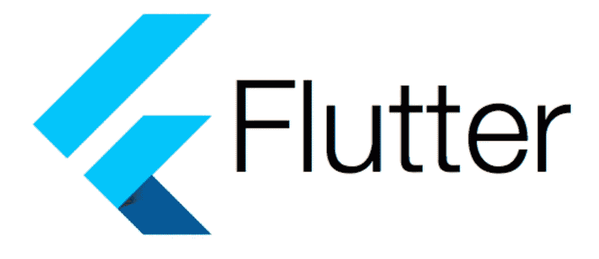

# 在没有任何外部库情况下，颤振中的阻塞模式

> 原文：<https://levelup.gitconnected.com/bloc-pattern-in-flutter-without-any-external-library-3efd330ff224>

你们都遇到过使用诸如 rxdart、flutter_bloc 等库实现 bloc 的各种方法。在本文中，我们将看到如何使用简单的计数器应用程序在没有任何库的情况下实现 BLoC 模式。



**让我们使用块模式**创建一个示例项目

1.  *创建一个新的颤振项目，改变你的 main.dart 如下。*

```
**import** 'package:flutter/material.dart';
**import** 'src/my_app.dart';void main(){
  runApp(MyApp());
}
```

*2。在 lib 包中创建一个名为 my_app.dart 的文件。复制粘贴下面的代码在里面。*

```
import 'package:flutter/material.dart';

class MyApp extends StatelessWidget {
  const MyApp({Key? key}) : super(key: key);

  @override
  Widget build(BuildContext context) {
    return MaterialApp(
      title: 'Flutter Bloc',
      theme: ThemeData(primarySwatch: Colors.*blue*,),
      home: const MyCounter(),
    );
  }
}}
}
```

3.让我们现在创建我们的块部分。创建一个名为 counter_bloc.dart 的文件，并在其中添加 StreamController 和 Stream。StreamController 将向我们的流添加值/数据，流将向我们的小部件(即 StreamBuilder)公开数据。还要添加一个变量 count 来存储计数器的当前值，并将其初始化为零。

```
import 'dart:async';class CounterBloc{int count = 0;// Sending value to Stream
final StreamController<int> _counterController = StreamController<int>();

// Expose value to StreamBuilder
Stream<int> get counterStream => _counterController.stream;}
```

现在我们将实现增量逻辑。在这一部分中，我们可以根据需要进行任何复杂的计算或进行网络调用。为了让这个例子简单易懂，我们正在做一个简单的增量运算。

```
incrementCounter(){
  _counterController.sink.add(count++);
}
```

我们不得不在溪流不使用时将其关闭。否则就是内存泄漏。让我们在 CounterBloc 类中添加一个 dispose 方法。

```
void dispose(){
  _counterController.close();
}
```

counter_bloc.dart 的最终代码如下所示:

```
import 'dart:async';

class CounterBloc{

  int count = 0;

  // Sending value to Stream
  final StreamController<int> _counterController = StreamController<int>();

  // Expose value to StreamBuilder
  Stream<int> get counterStream => _counterController.stream;

  incrementCounter(){
    _counterController.sink.add(count++);
  }

  void dispose(){
    _counterController.close();
  }

}

final counterBloc = CounterBloc();
```

4.我们已经完成了块零件的创建。现在让我们在应用程序中实现它。打开 my_app.dart 文件，并在其中创建一个有状态的小部件，如下所示。

```
class MyCounter extends StatefulWidget {
  const MyCounter({Key? key}) : super(key: key);

  @override
  State<MyCounter> createState() => _MyCounterState();
}

class _MyCounterState extends State<MyCounter> {
  @override
  Widget build(BuildContext context) {
    return Scaffold();
  }
}
```

现在实际的交互开始了，让我们看看如何通过点击按钮从我们的小部件与我们的 bloc 进行通信。

我们不需要在小部件中为我们的块创建一个实例。因为我们在 counter_bloc.dart 文件中使用 final 关键字创建实例的单例模式本身为`final counterBloc = CounterBloc();`，所以我们可以在 my_app.dart 中导入 counter_bloc.dart 文件后直接使用 counter _ bloc . dart 变量调用函数/访问变量

```
FloatingActionButton(
  onPressed: (){
    counterBloc.incrementCounter();
  },
  tooltip: 'Increment',
  child: const Icon(Icons.*add*),
)
```

现在，让我们根据从 bloc 收到的数据流来更新 UI/小部件。我们有 StreamBuilder 小部件，当一个新数据被添加到它观察的流中时，它会自动改变它持有的小部件的状态。StreamBuilder 正在观察我们集团的逆流。

```
StreamBuilder(
  initialData: counterBloc.count,
  stream: counterBloc.counterStream,
  builder: (BuildContext context, AsyncSnapshot<int> snapshot){
    return Text(
      '${snapshot.data}',
      style: Theme.*of*(context).textTheme.headline4,
    );
})
```

你注意到了吗，我们错过了一件事。我们忘记调用我们的块的 dispose 方法。这是非常重要的，如果我们错过了它，那么它将是一个内存泄漏。我们必须通过覆盖有状态小部件的 dispose 方法来调用 bloc 的 dispose 方法。就看下面怎么做吧。

```
@override
void dispose() {
  counterBloc.dispose();
  super.dispose();
}
```

我们 my_app.dart 的最终代码如下。

```
import 'package:flutter/material.dart';
import 'package:flutter_bloc_sample/counter_bloc.dart';

class MyApp extends StatelessWidget {
  const MyApp({Key? key}) : super(key: key);

  @override
  Widget build(BuildContext context) {
    return MaterialApp(
      title: 'Flutter Bloc',
      theme: ThemeData(primarySwatch: Colors.*blue*,),
      home: const MyCounter(),
    );
  }
}

class MyCounter extends StatefulWidget {
  const MyCounter({Key? key}) : super(key: key);

  @override
  State<MyCounter> createState() => _MyCounterState();
}

class _MyCounterState extends State<MyCounter> {

  @override
  void dispose() {
    counterBloc.dispose();
    super.dispose();
  }

  @override
  Widget build(BuildContext context) {
    return Scaffold(
      appBar: AppBar(
        title: const Text("Simple Counter"),
      ),
      body: Center(
        child: Column(
          mainAxisAlignment: MainAxisAlignment.center,
          children: <Widget>[
            const Text(
              'You have pushed the button this many times:',
            ),
            StreamBuilder(
              initialData: counterBloc.count,
              stream: counterBloc.counterStream,
              builder: (BuildContext context, AsyncSnapshot<int> snapshot){
                return Text(
                  '${snapshot.data}',
                  style: Theme.*of*(context).textTheme.headline4,
                );
            })
          ],
        ),
      ),
      floatingActionButton: FloatingActionButton(
        onPressed: (){
          counterBloc.incrementCounter();
        },
        tooltip: 'Increment',
        child: const Icon(Icons.*add*),
      ),
    );
  }
}
```

我们已经学会了如何在不使用任何库的情况下实现块模式。

```
https://www.buymeacoffee.com/jarinrocksU
```

如果你发现你所读的有用，别忘了👏👏。

示例代码可以在 Github 上找到；

[https://github.com/jarinrocks/flutter_bloc_sample](https://github.com/jarinrocks/flutter_bloc_sample)