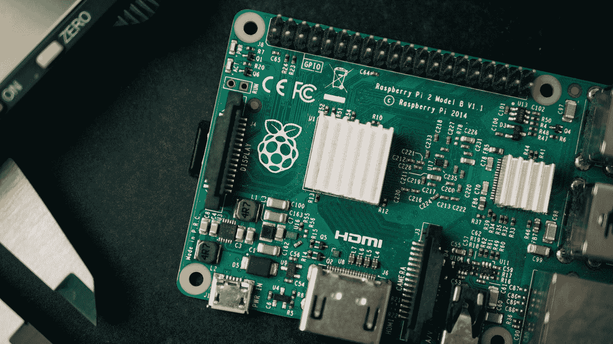
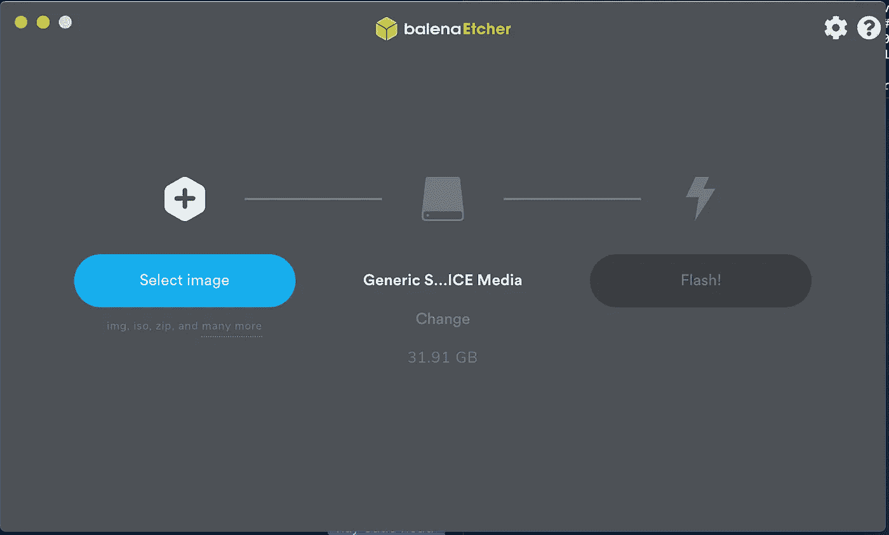

# 用树莓皮为你的整个家庭网络屏蔽广告

> 原文：<https://levelup.gitconnected.com/block-ads-for-your-entire-home-network-with-a-raspberry-pi-ff861eaee630>

## 我如何使用树莓 Pi 为我的整个网络创建一个 DNS sinkhole



哈里森·布罗德本特在 [Unsplash](https://unsplash.com?utm_source=medium&utm_medium=referral) 上的照片

去年我生日的时候得到了一个树莓派，并且一直*遭受分析麻痹*，试图弄清楚我想用它做什么。

我最近遇到了一些叫做 Pi-hole 的开源软件，号称有能力为你的整个网络屏蔽广告。不知所措的是，我不得不看看这是如何工作的，所以下面是我如何设置我的树莓 Pi 来充当所有与广告相关的事情的黑洞。你不仅会体验到一个(大多数情况下)无广告的互联网，而且像智能电视和其他“粗略的”分析工具也不能把它们的数据发送回家。**万岁隐私！**

如果您有任何问题，请在下面留下您的回复，或者随时给我发[推文！](http://twitter.com/jeffmorhous)

# 第一步:收购🖥硬件公司

Raspberry Pi 是一台非常便宜的电脑，这使得它成为完成这一特定任务的绝佳选择。为了您的方便，我将在下面列出我购买的每件商品的附属链接。

我有 [**树莓 Pi Model 3 Model B**](https://www.amazon.com/gp/product/B01LPLPBS8/ref=as_li_tl?ie=UTF8&tag=jeffmorhous-20&camp=1789&creative=9325&linkCode=as2&creativeASIN=B01LPLPBS8&linkId=f500311a42eb9157e8bb09d28fbbdb0d) ，大概 50 美元。事实上，我买了一套有电源和盒子的工具，你可能也想这样做。这是无线的，所以我不需要适配器。然而，如果你买一个没有 WiFi 的型号，你需要用以太网电缆将其连接到你的路由器上，或者买一个 WiFi 适配器。

你还需要一张 [**microSD 卡**](https://www.amazon.com/gp/product/B073JYVKNX/ref=as_li_tl?ie=UTF8&tag=jeffmorhous-20&camp=1789&creative=9325&linkCode=as2&creativeASIN=B073JYVKNX&linkId=df3f3cfdac52cbe11f25e46a1c32d62e) 来存储操作系统(稍后会有更多介绍)。如果你的电脑没有 SD 读卡器，你需要一个 [**SD 读卡器**](https://www.amazon.com/gp/product/B00W02VHM6/ref=as_li_tl?ie=UTF8&tag=jeffmorhous-20&camp=1789&creative=9325&linkCode=as2&creativeASIN=B00W02VHM6&linkId=68cd82405719a6437a054f482d20e3ed) 。

如果你还没有，你需要一个简单的键盘。我假设你有某种 HDMI 显示器，比如相对现代的电视，但如果你没有，你也需要它。*(有一种方法可以不用键盘，鼠标，甚至是屏幕来设置 Pi。这就是所谓的无头设置，如果你这样做了，那么你可以直接跳到步骤 4)*

# **第二步:安装操作系统👨‍💻**

树莓酱非常简单。你可以选择你的操作系统，我用的是 Linux 操作系统的开源端口 **Raspbian** 。[你可以在这里找到下载的内容](https://www.raspberrypi.org/downloads/raspbian/)——这需要一点时间，所以请点击下载并随意阅读。

将您的 microSD 卡直接或通过任何必要的适配器放入计算机。重要的一点是，我用的是 mac，所以我在这里的说明也是如此。如果你使用的是 Windows，这里有一些更通用的说明。

[下载 balenaEtcher 帮助我们在 SD 卡上安装 Raspbian。](https://www.balena.io/etcher/)运行。dmg 安装并启动它。



我机器上的 balenaEtcher

点击蓝色的“选择图像”，并找到。你下载的 Raspbian 的 iso 文件。确保中心选择设置为您的 SD 卡，并点击闪存！同样，这可能需要一分钟⏰

最后，弹出您的 SD 卡，并将其放入您的 Pi。插入显示器/电视、键盘和鼠标

# 步骤 3:自定义一些 Pi 设置

Pi 将询问您的国家和时区，然后更改默认密码——出于安全原因，您肯定希望这样做。接下来，您的 Pi 可能想要更新。同样，为了安全起见，让它这样做吧。这可能是最长的一次等待。

## 您还需要启用 SSH，这样就可以远程控制 Pi😃

为此，单击左上角的图标打开饼图中的终端。运行以下命令来访问 ssh(所有这些都应该在您的 pi 终端上运行，而不是在您的主计算机上)

```
sudo apt get install ssh
```

启用它

```
sudo /etc/init.d/ssh start
```

将它设置为每次使用启动时启用 ssh

```
sudo update-rc.d ssh defaults
```

要获得您的 Pi 的 IP 地址，运行

```
hostname -I
```

## 现在，我们切换回您的 mac 终端，在那里运行以下命令

```
ssh pi@YOUR.PI.IP.ADDRESS
```

答对了，输入你的密码，你就可以远程访问你的树莓派了。

注意:更改您的默认 SSH 端口也是一个好主意，但是我们不会在这里讨论它。

# 步骤 4:安装墩孔

在您的 Pi 终端或通过 SSH 连接到 Pi 的计算机终端中，从 Pi-hole 的网站运行以下命令来安装它:

```
curl -sSL https://install.pi-hole.net | bash
```

安装程序将运行并询问一堆问题。选择默认值是可以的，但是可以像我一样随意定制。

当安装程序完成时，它会显示您选择的密码。记下并复制它，然后通过执行以下命令更改 web dashboard 密码:

```
pihole -a -p
```

# 步骤 5:配置设备或路由器

现在你的 Pi-hole 作为一个 DNS 服务器，我们需要确保你的设备使用它，而不是你的 ISP。您可以在每个设备的基础上这样做，但我建议在您的路由器上更改它。这样，每次网络上的设备发出 DNS 请求时，它都会首先通过这个孔。

这一步很具体到路由器的品牌，就不赘述了。本质上，你需要告诉你的路由器把你的端口当作一个 DNS 服务器，而不是你的 ISP。您还应该为您的 Pi 保留一个静态 IP 地址，以确保它的 IP 不会改变，因为这会破坏您的设置。

瞧，享受你的无广告互联网吧！🙌

# 可选:Pi-hole 如何工作🎓

普通的广告拦截器允许加载广告，只是将它们隐藏起来。一旦你打开并运行了 Pio-hole，广告将会在它们开始下载之前就停止不动了。

Pi-hole 是一个非常特殊的 [DNS 天坑](https://en.wikipedia.org/wiki/DNS_sinkhole)。DNS 代表域名系统，它是将名称(如 medium.com)连接到 IP 地址([104.16.120.127](https://myip.ms/info/whois/104.16.120.127))的协议，这是网站/服务器在互联网上真正生存的地方。

DNS sinkhole 代替您通常的 DNS 提供商提供错误的结果。这几乎破坏了你的互联网——太棒了！有了 Pi-hole，所有不是广告的东西都会被转发给你的 DNS 提供商，*但是*如果域名在 Pi-hole 的黑名单上(这是为你们当中最书呆子定制的)，那么 Pi-hole 就会发回一个假的 IP 地址。

所以你访问一个网站，它加载。接下来，网站向其广告提供商索要广告，Pi-hole 说“什么广告提供商？那是不存在的。”然后你的广告就没了。这实际上可以加快你的网络，因为你不会使用太多的带宽。

一个有趣的注意是 Pi-hole 不会杀死 youtube 广告，因为 youtube 从相同的 DNS 提供其内容和广告，所以杀死 youtube 广告也会杀死 youtube。

如果你喜欢这个，请通过鼓掌、关注我这里、[或在 twitter 上](http://twitter.com/jeffmorhous)告诉我😎

如果你发现了一些看起来不对劲的地方，请在评论中告诉我！