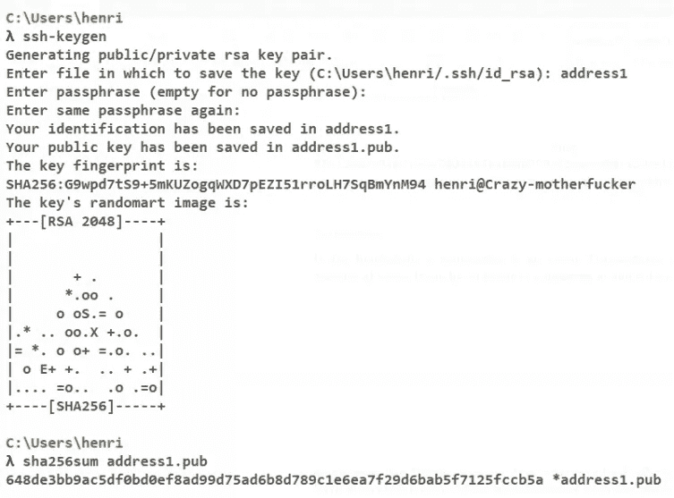
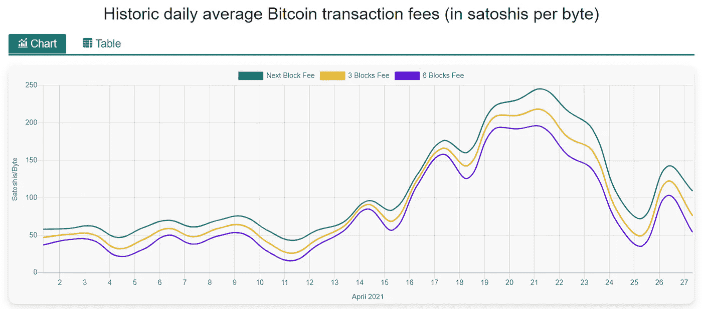

# 区块链地址、交易、交易费用

> 原文：<https://levelup.gitconnected.com/blockchain-addresses-transactions-and-transaction-fees-f540c4ed6bc7>

让我们来看看使区块链成为区块链的一些要素。在本节中，我们将从地址开始，即什么是区块链地址、交易和交易费用、区块、区块是如何形成的、智能合约等等。在第一篇文章中，我们将特别关注地址、交易和交易费用。

最后，这些文章的目的是让你成为区块链的专家，对吗？

这将变得更加专业，但请耐心听我说。好吗？

# 地址

在区块链中，地址是与实体、钱包或智能合同相关联的唯一标识符。它们通常由 26 到 35 个字符的字母数字字符串组成。在比特币的情况下，地址是从 ECDSA 私钥生成的公钥的 160 位散列。

地址和公钥可以与任何人共享，没有安全限制。另一方面，私钥是不能共享的，应该保持安全(除非你想失去所有的钱)。

在大多数区块链中，地址源自公钥，创建地址有 3 个简单的步骤:

*   1-创建私钥(ECDSA)
*   2-从私钥中取出公钥(公钥基础设施总是有私钥/公钥对)
*   3-散列公钥以生成地址

尽管我们将在另一篇文章中深入探讨 ECDSA 键，但还是让我们看看如何在命令行中实现这一点。根据区块链的不同，地址生成可能会稍微复杂一点，但大致就是这样。

打开你的命令行，开始做一些无聊的事情。要打开计算机上的命令行，请单击 Windows 图标并键入“cmd ”,然后按回车键。如果您是 Mac 用户，您可以打开“应用程序”文件夹，然后打开“实用工具”并双击“终端”，或者按下 Command 空格键来启动 Spotlight 并键入“终端”。

然后，以下命令将创建一个新的 RSA 密钥对。生成密钥对后，可以运行 SHA256 哈希算法来生成地址。

```
ssh-keygensha256sum publickey.pub
```



长哈希 97e 75487 c 0 AFC 7 c 54 e 7d 0 a 463 bafd 6a 099 a 55 C4 CAC 8d 1130 ce 1 db 5714 eeb ad 7 a 是唯一地址！几乎不可能生成相同的地址。

哦，你可能还会问 randomart 图像是什么。这是您生成的密钥的图形表示。您的私钥将始终具有相同的 randomart 图像。这个想法是，人类可以很容易地识别图像中是否有变化，而在一个长的十六进制字符串中识别变化会比较困难。你可以很容易地看到以前的 randomart 看起来有点像一棵树。但是，如果您检查您的 RSA 密钥，它看起来像一个 dong，您就知道有问题了！

# 交易

在区块链，一笔交易就是一个事件。交易不一定意味着价值的转移。它可以是 Alice 发送给 Bob 的事件、消息或一些数据。然而，在区块链，像比特币一样，交易确实是指以加密货币形式进行的价值转移。这些转移发生在从一个地址到另一个地址。

在大多数区块链中，事务将包括值、消息、发送者、接收者、它所属的块、时间戳和所有事务数据的散列。然后，事务被一起打包成块。唯一的例外是 DLT 技术或哈希图，在这种技术中，事务按顺序进行哈希处理，而不是存储在块中。

# 交易费用

区块链中的验证节点(也称为挖掘器)需要执行一些工作，以便将事务包含在区块链中。因此，他们需要有做这项工作的动机，这种动机可以以交易费的形式支付。

交易费用并不取决于交易金额的大小。无论你是转移价值 100 美元还是 100，00 0，00 0 美元的比特币，交易费用都差不多。在区块链中，影响交易费用的是以字节为单位的交易规模，而不是价值的大小。比特币交易大小平均为 500 字节，用户根据大小和他希望交易多快被纳入区块链支付交易费。矿工从事务内存池中选择事务，优先选择支付最高费用的事务。因此，如果用户希望他的交易被包含在下一个块中，他将不得不支付更高的费用来“贿赂”矿工首先获得交易。


你可以把区块链的街区当成卡车。或者载客量有限的列车。每辆卡车可以装载 1000 公斤货物。司机是一只贪婪的狗，试图最大化每辆卡车的报酬。您发送的每个包裹的价格将取决于包裹的重量。如果你的包裹更重，你需要付给卡车司机更多的钱，以确保你的包裹被包括在下一辆卡车里。是的，这也是区块链的工作方式。继续读，我会再讲几页这个。



来源[https://privacypros.io/tools/bitcoin-fee-estimator/](https://privacypros.io/tools/bitcoin-fee-estimator/)

在比特币中，交易费用以 Satoshi/Byte 计量，其中一个 Satoshi 对应 0.00000001 个比特币。

在 2021 年 4 月，包括下一个块中的交易(10 分钟内)的平均交易费用是 180 Satoshi/字节:

180 聪/字节* 500 字节= 90000 聪= 0.0009 BTC

按照 2021 年 4 月下旬的 BTC/美元汇率，约为 54 美元，确实非常昂贵。但是，您可以将交易费用降低到该价值的 1/4。如果你愿意等待 1 个小时或更长时间来确认你的交易，任何接近 5 美元的价格都可以。

请注意，矿工迟早会拿起低费用的交易，但他们可能需要几个小时才能被纳入区块链。如果你支付的价格非常低，矿商甚至可能需要几天时间才能完成交易。

在区块链，交易费也是避免网络垃圾邮件或拒绝服务攻击的一个重要特征。在这种攻击中，攻击者会用虚拟事务淹没网络，以耗尽区块链资源并阻塞整个网络。DoS 或 DDoS 攻击通常不会发生在区块链，如比特币，因为费用会使攻击极其昂贵和不可行。

**🚀关注我，并查看我的🧱·区块链的书和课程:**

**📖** [**解除连锁图书— Kindle 和 Paperbac**](https://www.amazon.com/dp/B091CYTX37/ref=sr_1_1?dchild=1&keywords=unblockchain&qid=1617186443&s=digital-text&sr=1-1) **k**

**👨‍🎓** [**取消冻结**](https://www.udemy.com/course/blockchain-deep-dive-from-bitcoin-to-ethereum-to-crypto/?referralCode=B8463EE382E6D313304B)