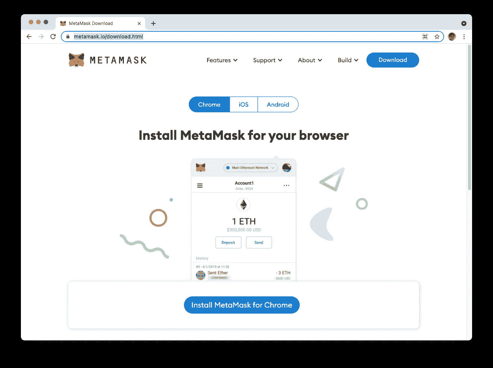
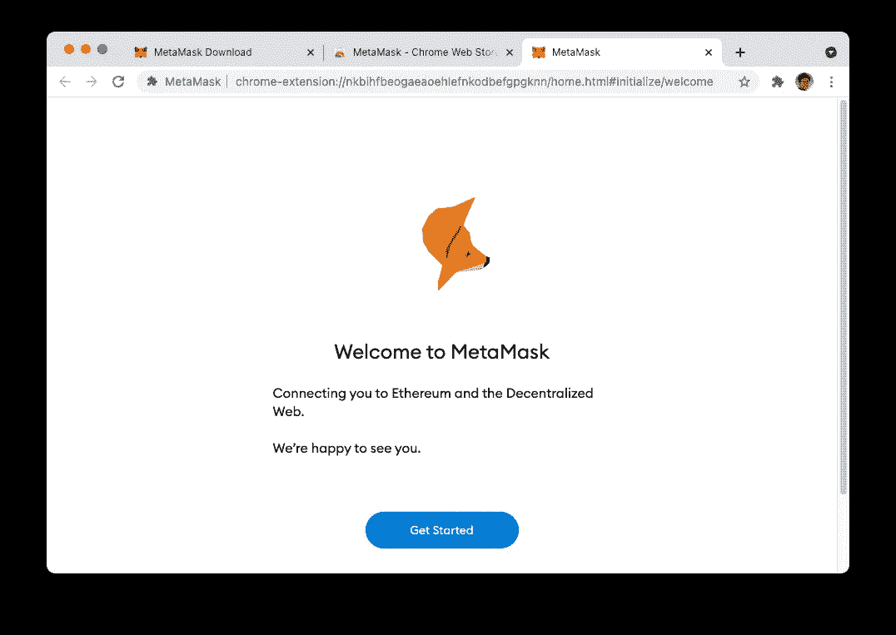
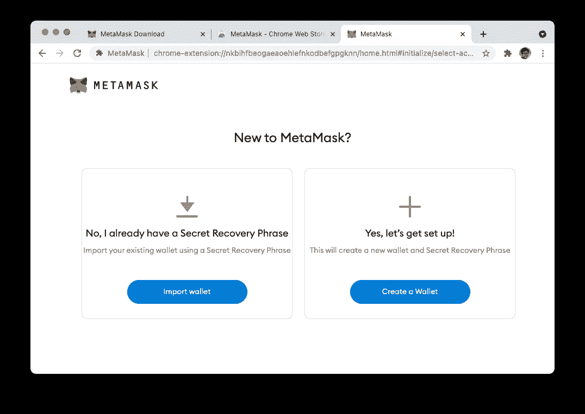

# 区块链系列—元掩模入门

> 原文：<https://levelup.gitconnected.com/blockchain-series-getting-started-with-metamask-46fb51a52c3>

## 了解如何使用元掩码安装以太坊钱包

[Zoltan·塔斯](https://unsplash.com/@zoltantasi?utm_source=medium&utm_medium=referral)在 [Unsplash](https://unsplash.com?utm_source=medium&utm_medium=referral) 上的照片

区块链是过去几年最热门的词汇之一。随着最近比特币价格的飙升，它现在再次引起了业内的极大兴趣。正是考虑到这一点，我决定写一系列关于区块链的文章。解释区块链是如何工作的超出了本文的范围，有许多文章/书籍可以做这项工作，包括一些由您真诚撰写的文章:

*   [https://www . code mag . com/Article/1805061/Understanding-block chain-A-初学者指南-以太坊-智能-合同-编程](https://www.codemag.com/Article/1805061/Understanding-Blockchain-A-Beginners-Guide-to-Ethereum-Smart-Contract-Programming)

*   [https://www . Amazon . com/Beginning-ether eum-Smart-Contracts-Programming/DP/1484250850](https://www.amazon.com/Beginning-Ethereum-Smart-Contracts-Programming/dp/1484250850)

对于这篇文章，我想从最终用户的角度来解决这个问题——如何安装一个以太坊钱包，这样你就可以开始探索区块链了。

安装以太坊钱包最简单的方法是使用你已经有的东西——一个网络浏览器，和一个名为 **MetaMask** 的免费钱包。

# 什么是元掩码

元蒙版是一个非常有用的工具，它在让你进入区块链世界的过程中扮演着重要的角色。简而言之，MetaMask 是一个以太坊钱包，允许您:

*   创建在各种以太网中使用的帐户
*   维护您帐户的私钥，以便您可以导出它们或导入新帐户
*   在各种以太坊网络之间切换，以便您的帐户可以反映每个网络的正确余额
*   在账户之间进行交易
*   将乙醚从一个帐户转移到另一个帐户
*   在元掩码帐户中持有令牌
*   在区块链浏览器 Etherscan 上查看您的详细交易

# 安装 MetaMask Chrome 扩展

首先，元掩码仅适用于:

*   ios
*   机器人
*   网络浏览器——Chrome、Firefox、Brave 和 Edge

体验它最简单的方法是使用网络浏览器。对于本文，我使用了 Chrome。启动 Chrome 并导航至[https://metamask.io/download.html](https://metamask.io/download.html):

点击**为 Chrome 安装 meta mask**按钮，你将被带到 *Chrome 网络商店*。点击**添加到 Chrome** :

Chrome 会用如下警告提示你。点击**添加扩展名**:

您现在应该会看到下面的屏幕。点击**开始**:

# 设置账户

如果您是第一次使用元掩码，请点击**创建钱包**:

> 如果您在另一台计算机上安装了元掩码，您可以将现有帐户导入到当前计算机中。我会在另一篇文章中谈到这一点。

通读条款和条件，如果您同意，请点击**我同意**:

接下来，创建一个密码来保护您的帐户。完成该步骤后，点击**创建**。

您可以观看一个短片，了解如果您忘记了密码，如何找回您的帐户。完成后，点击下一步的**。**

您现在将显示您的**秘密恢复短语**。**秘密恢复短语**是允许您恢复和还原所有帐户的一组单词。这组短语是你需要牢牢记住的东西。我个人建议你打印出来锁在安全的地方。

要显示您的秘密恢复短语，请单击*锁*图标:

你现在可以看到你的秘密恢复短语。点击**下一个**:

现在将要求您确认您的秘密恢复短语。按照出现的顺序点击页面底部的单词。

> 所选单词的顺序很重要。如果顺序不正确，拖动单词重新排列。

完成单词排列后，点击**确认**。就是这样！您的帐户现在已经设置好了！

# 使用元掩码扩展

在 Chrome 浏览器的右上角，您应该会看到 MetaMask 图标。点击它:

点击*引脚*图标。

在出现的弹出窗口中，单击“x”将其关闭。

您现在可以看到默认的**账户 1** :

# 查看可用网络

默认情况下，MetaMask 连接到*真实*以太坊网络(被称为 **Mainnet** )。这是你处理真正的乙醚的地方，一些重要的钱在这里交易。

你可以切换到一些其他的测试网络，在那里你可以不用真正的*以太*来实验以太坊。

> 以太是便于以太坊网络操作的令牌(货币)。

在 MetaMask 中，点击**以太坊网络**，您将看到您可以连接的测试网络列表:

选择 **Ropsten 测试网络**:

> **Ropsten 测试网络**(也称为“以太坊测试网”)是一个以太坊测试网络，允许在 Mainnet(主以太坊网络)上部署之前进行区块链开发测试。这是我最喜欢的了解区块链的测试网络。

# 拿些乙醚

令人兴奋的部分来了——得到一些醚(尽管不是真正的醚),这样我们就可以学习如何用它来执行事务。

在 MetaMask 中，点击**购买**图标:

向下滚动页面并点击**获取乙醚**:

你将被重定向到一个**超屏蔽乙醚龙头**。 **MetaMask 乙醚龙头**是一个“滴”免费乙醚的网页。它为开发人员提供了测试以太网，这样他们就可以获得它们并在 testnet 上测试智能合约。

> 我将在另一篇文章中讨论智能合约。

要获得免费乙醚，点击**从水龙头**请求 1 乙醚按钮:

> 注意:MetaMask 乙醚龙头有时很古怪。您可能会得到类似于" ***错误:500 {"error ":"用户贪婪—已经有太多乙醚*** "(如果您的帐户中已经有一些乙醚)，或者" ***被限制费率…稍后再试*** "(如果您尝试连续点击按钮太多次)。有时它会起作用，有时没有好的理由它就不起作用。

您将被要求使用 MetaMask 连接您的帐户。点击**下一个**:

点击**下一个**:

现在，您应该会在页面底部看到一个交易链接:

> 注:如果没有反应，请再次单击绿色按钮。可以多次点击绿色按钮，会出现多个交易链接。每笔交易(如果成功的话)会给你一个乙醚。

点击交易链接将显示 **Etherscan** 上的交易详情:

> 以太扫描是一个区块链浏览器，你可以查看区块链上发生的交易的细节。

过一会儿(14 秒到几分钟)，你会看到一笔乙醚存入你的账户:

> 根据今天的乙醚价格，每乙醚 4707 美元。耶，你现在多了 4707 美元！(至少在测试网上)

# 创建新帐户

默认情况下，MetaMask 随一个帐户一起安装。但是，您可以根据需要创建任意多个。

要创建新账户，点击账户图标并选择**创建账户**:

如果愿意，您可以更改帐户名。点击**创建**:

现在将创建您的新帐户。

观察**账户 2** 下列出的账户地址。你可以点击复制图标将地址复制到你的剪贴板上，这样在下一节你就可以发送一些乙醚到这个账户。

> 我的账户 2 有如下地址—0x1cc 025d 9 a 1741 b 51 FD 5 de 6003884 DC 264 f 149 ADC。如果你想让你的朋友转一些乙醚给你，这是你给他们的地址。如果你想送我一些乙醚，请便！

# 将乙醚从一个帐户发送到另一个帐户

请注意，您的新帐户 2 没有乙醚，因此这是学习如何将乙醚从一个帐户发送到另一个帐户的好时机。在本练习中，您将从**账户 1** 向**账户 2** 发送乙醚。

首先，选择**账户 1** :

点击**发送**:

发送乙醚有两种方式:

*   输入您要发送到的帐户的帐户地址(如果您要发送到不属于您的另一个帐户，这很有用)
*   点击**在我的账户间转移**查看您在本地 MetaMask 安装中拥有的账户

让我们试试第一种方法。输入**账户 2** 的地址，并指定您要发送多少乙醚。既然我只有 1 乙醚，那我就只送 0.1 乙醚吧。指定 0.1 并点击下一个的**:**

在该页面中，您将看到预计的*油费*，以及将从您的账户中扣除的总金额。点击**确认**:

> 就像你的汽车需要汽油才能工作一样，每笔交易都要消耗乙醚，被亲切地称为**汽油费**。天然气费支付给开采包含您的交易的区块的矿工节点。你为交易支付的油费金额影响你的交易完成的快慢。

您现在将看到交易待定:

> 有趣的是，你可以点击上面的加速按钮，让传输更快。然而，这将导致更高的燃气费。

过一会儿，当交易被确认时，您将看到从帐户 1 中扣除的乙醚:

您现在可以切换到帐户 2 并查看其余额:

# 摘要

在本文中，您开始使用 MetaMask，以及如何使用它来创建帐户，切换到 Ropsten testnet，获得一些免费的 ether，以及在帐户之间转移 ether。如果你在从 **MetaMask 乙醚龙头**获取时遇到问题，请留下你的帐户地址。我会送你一些！

 [## 加入媒介与我的介绍链接-李伟孟

### 作为一个媒体会员，你的会员费的一部分会给你阅读的作家，你可以完全接触到每一个故事…

weimenglee.medium.com](https://weimenglee.medium.com/membership)