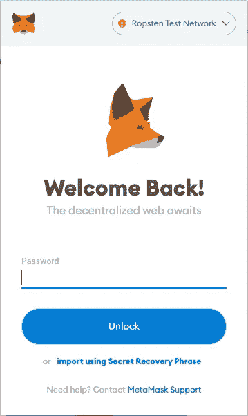

# 区块链系列 MetaMask 如何创建账户

> 原文：<https://levelup.gitconnected.com/blockchain-series-how-metamask-creates-accounts-a8971b21a74b>

## 了解 MetaMask 如何使用秘密恢复短语来创建您的帐户以及如何恢复它们。

马库斯·斯皮斯克在 [Unsplash](https://unsplash.com?utm_source=medium&utm_medium=referral) 上的照片

在我的上一篇文章中，我展示了如何通过安装 MetaMask 这样的加密钱包来开始使用加密货币(在某种程度上也是区块链)。

来源:https://en.wikipedia.org/wiki/MetaMask

 [## 区块链系列—元掩模入门

### 了解如何使用元掩码安装以太坊钱包

levelup.gitconnected.com](/blockchain-series-getting-started-with-metamask-46fb51a52c3) 

如果您已经这样做了，那么是时候了解幕后发生了什么，特别是 MetaMask 如何创建您的帐户，以及如果您丢失了密码，如何恢复您的帐户。在这篇文章中，我将试图解释事情是如何工作的，而不是深入到密码学的具体细节。

> 我将在另一篇文章中讨论密码学。

# 秘密恢复短语

让我们从**秘密恢复短语**开始。当您第一次安装 MetaMask 时，您会看到一个 12 个单词的列表，称为机密恢复短语。MetaMask 使用一种称为 **BIP39** 的规范来生成这 12 个单词。

> **BIP** 代表**比特币改进提案**。BIP39 建议使用助记短语(一组易于记忆的单词)作为一种手段，在您的帐户受到威胁或丢失时找回您的帐户。MetaMask 称这个助记短语为**秘密恢复短语**。

**秘密恢复短语**中的这 12 个单词是从 2048 个单词的列表中生成的。2048 个单词的完整列表可以从这里找到:[https://github . com/bit coin/bips/blob/master/bip-0039/English . txt](https://github.com/bitcoin/bips/blob/master/bip-0039/english.txt)。

> BIP39 使用 12 或 24 个单词的助记短语，这取决于具体实现。使用 BIP39 的硬件分类帐包括分类帐 Nano S 和 Trezor Model One。

莱杰纳米的硬件钱包

Trezor Model One 硬件钱包

> 机密恢复短语中单词的顺序很重要。

机密恢复短语中的每个单词都有一个与之关联的数字。这些数字用于形成一个种子整数，然后用于创建一组公钥/私钥。下图对此进行了总结:

## 生成公钥/私钥对和以太坊地址

在上一节中，我提到了使用种子整数可以生成一个公钥/私钥对。密钥对是这样生成的:

*   通过使用 **SHA256** 散列函数，使用种子整数(从秘密恢复短语中获得)生成私钥
*   使用 **ECDSA** ( *椭圆曲线签名*)算法从私钥中导出对应于私钥的公钥。
*   根据导出的公钥，计算一个 **keccak256** 哈希
*   从 keccak256 散列中，取最后 20 个字节(即 40 个十六进制)，以“0x”为前缀，这就是您的以太坊地址

> 查看[https://www . royal fork . org/2017/12/10/eth-graphical-address/？ref=hackernoon.com](https://www.royalfork.org/2017/12/10/eth-graphical-address/?ref=hackernoon.com) 了解更多详情。

# 创建默认帐户

使用从种子整数创建的公钥/私钥对，元掩码现在可以创建您的第一个帐户(默认情况下在安装元掩码时创建)。如前所述，您的第一个帐户是从 keccak256 散列中生成的。

在内部，MetaMask 使用您在安装阶段提供的密码加密您的私钥，并将其存储在浏览器的数据存储中。它不会将它们存储在云上。

下图总结了 MetaMask 如何生成您的私钥、导出帐户地址以及将您的私钥存储在浏览器存储区内部。

# 创建附加帐户

有趣的部分来了。元掩码如何创建额外的帐户(在第一个默认帐户之后)？原来 MetaMask 利用了第一个帐户的私钥，并用它来生成一组子密钥，然后用这些子密钥来生成它们各自的公钥，以此类推。下图总结了这一步骤:

这就是为什么你的帐户可以恢复，只要你有你的秘密恢复短语。这就引出了你必须知道的非常重要的一点— **保护好你的秘密恢复短语！**一旦您泄露了秘密恢复密码，任何人都可以访问您的帐户。不用说，你的加密货币将在一瞬间消失！

# 恢复元掩码中的帐户

现在您已经了解了 MetaMask 如何创建帐户，让我们来测试一下这个知识，看看如果您忘记了 MetaMask 帐户的密码，并且需要从您的机密恢复短语中恢复帐户，会发生什么情况。

在 MetaMask 中，将要求您登录。假设您忘记了密码，需要恢复您的帐户。为此，请单击“**使用机密恢复短语**导入”链接:

注:如果您没有看到如上所示的锁定屏幕，请单击帐户按钮(圆圈图标)并单击**锁定**返回登录屏幕:

您现在将看到以下页面，您可以在其中输入 12 个字的秘密恢复短语。您还需要输入新密码来保护您的帐户。输入信息后，点击**恢复**:

就是这样！您的帐户将全部恢复。

> 请注意，MetaMask 将自动恢复所有非零余额的帐户。如果您的帐户余额为 0，MetaMask 不会自动为您添加该帐户。相反，您需要在 MetaMask 中创建一个新帐户，之前余额为 0 的帐户将会出现。此外，元掩码只能恢复您使用元掩码创建的帐户，如果您从其他来源导入了帐户，则必须手动添加该帐户。

此外，确保选择正确的网络(例如 Ropsten 测试网络)，以便查看正确的天平。

# 摘要

我希望这篇文章揭示了 MetaMask 幕后的一些工作原理。敬请关注更多关于以太坊和智能合约的文章！

 [## 加入媒介与我的介绍链接-李伟孟

### 作为一个媒体会员，你的会员费的一部分会给你阅读的作家，你可以完全接触到每一个故事…

weimenglee.medium.com](https://weimenglee.medium.com/membership)