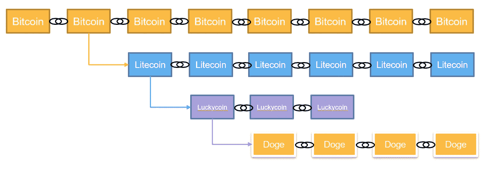

# 区块链软叉，硬叉，硬叉

> 原文：<https://levelup.gitconnected.com/blockchain-soft-forks-hard-forks-and-harder-forks-23bdf88b04ce>

叉子是你用来吃食物的东西。哦，等等，在这种情况下，我们谈论的是区块链。叉子是对区块链的更新。协议的变化可能会导致分叉。在区块链，更新永远不能追溯。

> *我将叹口气讲述这件事*
> 
> *某个年代久远的地方:*
> 
> *一片树林里分出两条路，而我——*
> 
> *我选择了人迹较少的一条，*
> 
> 这使得一切都不同了。
> 
> 罗伯特·弗罗斯特没有选择的路

那么…什么是软叉和硬叉？先说软的。

**软叉**

软叉例如是塑料叉。开玩笑😊软派生是向后兼容的派生，这意味着更新与以前的版本兼容，或者与仍在运行旧版本的节点兼容。这些更新仅代表一种软分叉，只要它们继续遵守协议规则。

*   软分叉是向后兼容的
*   在软分叉之后，运行先前版本的节点仍然可以交互和添加新的块，只要它们遵守规则

**硬叉**

硬分叉是一个更新，它不是向后兼容的。更新到新协议的节点将不再与以前的版本兼容，并将创建区块链的新分支。更新到新协议的节点不能处理以前协议中的事务。

*   硬分叉没有向后兼容性
*   所有节点都必须升级到新版本，否则区块链将一分为二
*   不接受升级的节点将与接受升级的节点不兼容

例如，比特币频繁更新，代表软分叉，它们被称为 BIP——比特币改进提案。然而，在 2017 年，当一些开发者决定提议将比特币块大小从 1 MB 增加到 8 MB 时，出现了一个硬分叉。继续运行前一版本的节点继续运行比特币协议。采用将块大小增加到 8 MB 的变化的节点创建了一个单独的区块链，称为比特币现金。这个分叉创造了两个截然不同的区块链:比特币和一个新的区块链，比特币现金。

叉子的另一个有趣的例子。Dogecoin 是一个叉或幸运币，是莱特币的一个叉，是比特币的一个叉。最终，dogecoin 获得了这些区块链的一些特征。

Dogecoin 继承了他的父母区块链的精华:来自 Luckycoin 的 1 分钟块，来自 Litecoin 的 Scrypt 挖掘算法(比比特币的 SHA-256 更有效)，以及来自比特币的 1MB 块大小。

在我看来，Dogecoin 是一种卓越的技术，它是一种更好的支付用例(至少与比特币相比)。Dogecoin 也证明了自己是一种非常有弹性的加密货币，这可能是它在 2021 年 5 月初达到 900 亿市值的原因之一(是的，还有柴犬迷因和埃隆马斯克的推文)。

# 福克斯和 51%攻击

当一个人或一个团体试图通过获取超过 50%的网络计算能力来获得对网络的控制时，就会发生 51%的攻击。

为了更好地理解 51%攻击是如何发生的，我们需要考虑一些假设。我们知道:

1.  区块链没有中央集权
2.  矿工跟踪交易有效性
3.  挖掘器将新事务附加到区块链，并向区块链挖掘器/节点广播新块
4.  矿工遵循最长链规则
5.  根据现有的共识机制，51%或更多的矿工达成共识
6.  51%的攻击只会发生在未经许可的区块链。对于许可的区块链，这不是一个问题，因为共识机制是不同的，参与者的身份在网络中是已知的，并且网络的治理也将保护它

51%的攻击发生在坏人获得区块链 51%的开采权时，这是区块链最著名的安全漏洞之一。

区块链和区块链的百分比可能不同，但在比特币的例子中，如果一个坏演员可以获得 51%的挖掘权或哈希率，他就可以获得共识机制的控制权，并最终试图重写交易。一旦攻击者获得了区块链共识的控制权，他就可以开始垄断区块开采，并开发自己版本的区块链。他将能够进行重复支出、反向交易，并阻止其他矿商确认交易。

当矿工的数量增加时，对 51%攻击的弹性增加，但是较小的工作证明区块链可能被暴露。2018 年，一些加密货币成为 51%攻击的受害者:例如，Verge、Zencash 和以太坊经典就是其中的一些受害者。攻击者通过这些攻击获利超过 2000 万美元。

然而，进行这些攻击是非常昂贵的。仅仅是尝试对比特币区块链网络进行 51%的攻击，每天就要花费超过 2500 万美元的设备和超过 1500 万美元的电力。将特定区块链调整难度的频率带入等式也是必要的。例如，在比特币区块链中，每 2016 个区块(大约 2 周，考虑到每个区块平均每 10 分钟被开采一次)，整个区块链使用一些聪明的数学来决定下一个 2016 个区块继续每 10 分钟开采一个新区块的“难度”，这是基于区块被发现的速度，在过去的 2016 个区块中平均得出的。

这对于 51%的攻击者来说将是一个优势，考虑到挖掘一个新区块的难度对于攻击者来说将保持两周不变。然而，一些区块链调整难度要快得多，DigiShield 也被添加到许多区块链中，包括比特币现金、以太坊、Zcash、Dogecoin、Startcoin 等等。DigiShield 允许每个区块的挖掘难度进行调整，根据需要增加或减少难度，并降低 51%的攻击可行性。

同样重要的是，即使攻击者成功发动了 51%的攻击，大多数矿工也会通过将攻击者排除在网络之外来转移计算能力。这意味着，即使有人成功进行了 51%的攻击，他也不会长期控制网络，因为大多数矿工会转移计算能力，让攻击者独自一人。

# 比特币 SV 51%攻击比特币现金

2018 年 11 月，Craig Write 和一群比特币 SV 支持者希望通过对比特币现金网络 51%的攻击来创建一个硬分叉。他们希望将数据块限制从 32 MB 增加到 128 MB，推出一个具有更大数据块大小的竞争版本。

虽然两个链都可以干净利落地分裂成一个硬分叉，但比特币 SV 的支持者希望比特币 SV 成为唯一的幸存者。

为此，比特币 SV 计划接管比特币现金哈希权力，并以敌对的方式彻底消灭该协议，汇集足够的资源来创建 51%的攻击。通过这次攻击，理论上，他们可以通过挖掘空区块给矿工额外的奖励，阻止矿工在比特币现金网络中采矿，并转向比特币 SV。

比特币社区的许多知名人士都加入了比特币现金方面的战争，包括的联合创始人吴(比特币挖矿最大的计算机芯片和 ASIC 公司)和比特币现金的联合创始人罗杰·维尔(Roger Ver)。为了应对哈希战争，并防止 51%的攻击会杀死比特币现金区块链，比特大陆在一段时间内为网络分配了 90 000 个 Antminer S9 设备。比特币 SV 获得了几个矿池的支持，但没有获得足够的支持，并在 51%的攻击中失败。

比特币现金 VS 比特币 SV 散列率。来源:www.bitinfocharts.com

这场战争导致两个链都损失了数百万美元(约 2000 万美元)，比特币 SV 最终宣布从比特币现金网络中分离出来，放弃了敌意收购。

这是一个关于区块链治理冲突如何导致社区主导的 51%攻击的有趣案例研究..

**🚀关注我，也查看我的🧱·区块链的书和课程:**

**👨‍🎓** [**Fintech、云和网络安全课程**](https://www.udemy.com/course/fintech-technologies-cloud-and-cybersecurity/?referralCode=F1D4EA005A2881735A36)

**📖** [**取消连锁图书— Kindle 和 Paperbac**](https://www.amazon.com/dp/B091CYTX37/ref=sr_1_1?dchild=1&keywords=unblockchain&qid=1617186443&s=digital-text&sr=1-1) **k**

**👨‍🎓** [**【取消冻结】科目**](https://www.udemy.com/course/blockchain-deep-dive-from-bitcoin-to-ethereum-to-crypto/?referralCode=B8463EE382E6D313304B)