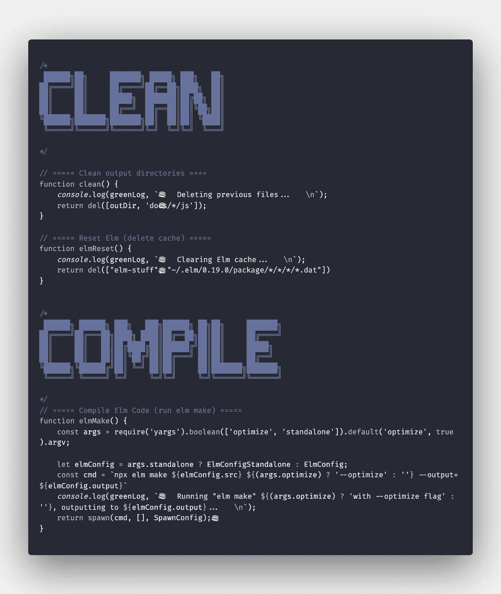

# 块状注释:提高代码可读性的简单方法

> 原文：<https://levelup.gitconnected.com/blocky-block-comments-an-easy-way-to-improve-code-readability-563122cd9f75>

## 如此简单有效，然而你可能从未见过它们。

总有一些东西会在你工作的第一天脱颖而出。对我来说，这是一个坐在我后面的工程师的疯狂设置。他有三台显示器(当然有一台是纵向的)，一个机械键盘，一个未来感十足的鼠标，巨大的耳机……你知道，全套设备。

不过，这还不是我最感兴趣的。我最注意到的是分散在他代码中的一些东西——看起来几乎像是

**

*代码中的艺术？这就是我每次转身在这个工程师的监视器上看到的！*

*也许你和我想的一样:搞什么 **$#！*** 那是看起来很时髦的文字吗？当然，我问了一下，他解释了这是什么。*

*快进几个月，我在我的代码中向我的同事解释这种艺术。现在，我正在与你分享这种艺术。*

**

*等等，我是要你把艺术字放在代码里？它可能看起来有点像艺术字，但我保证它要好得多！[来源。](https://mentalfloss.com/article/88512/wordart-generator-transports-your-text-back-90s)*

# *什么*

*我把它们叫做*横幅评论*，或者*块状评论*。我不知道，我不擅长记名字。不管怎样，它们就像它们看起来的那样:大块的文本，包裹在块注释中。*

*也许我应该叫他们*大块评论*？*

# *为什么*

*好吧，那你为什么要用这些呢？*

***更好的代码组织***

*使用*横幅注释*的主要原因是为了提高代码的可读性和组织性。使用它们将代码分成逻辑块。对于用 TypeScript 编写的 Express 应用程序，我可能会创建类似于*类型、常量、初始化、路由、助手、*等部分。*

*显然，您希望模块化您的代码，并将其中一些部分分离到它们自己的文件中，但是您只能模块化这么多。这些注释将帮助您在单个文件中创建模块化！*

***更快的代码导航***

*也许你已经用常规注释在代码中创建了分部。当你滚动你的代码时，很难找到一个单独的注释，但是你永远不会错过一个大块的注释！*

*如果你使用**小地图**，不仅在滚动时更容易找到代码，而且*横幅注释*的效果也非常好。瞬间轻松跳转到您正在寻找的代码。简直是天作之合！*

**

*轻松浏览您的代码！如果你喜欢使用小地图，加分。*

*美化你的代码，让它脱颖而出*

*你代码中的每个*块状注释*都是艺术杰作。美丽，体贴，永恒。*

*好吧，也许这有点夸张，但我个人认为它们看起来很不错。他们一定会让你的代码独一无二，出类拔萃，谁不喜欢呢？我的工作中有无数人问我关于我代码中的注释，当他们走过我的办公桌时无耻地偷看我的显示器——这是一个很好的谈话开始！*

# *怎么做*

*希望我已经让你相信*块状评论*很棒。或者至少值得给他们一次机会。那么，如何开始使用它们呢？*

*这个块状文本是由一个名为 [*FIGlet*](http://www.figlet.org/) 的程序生成的，该程序于 1995 年首次发布。从它的官方网站来看，它被描述为“*一个将普通文本变成大号字母的程序*”。相当简单！事实上，FIGlet 支持数百种不同的“字体”，尽管大多数字体作为块注释看起来不太好。我使用的字体叫做 ***ANSI Shadow*** ，我强烈推荐这种字体来做这类评论。*

*你可以想象，你可以使用一个在线工具来生成这些，然后将其复制到你的代码中。然而，作为(懒惰的)开发人员，我们要比那复杂得多！我的意思是，谁有时间切换到浏览器，导航到一个站点，输入一些文本注释，然后粘贴到他们的代码中？*

*这就是为什么几乎每个主要的 IDE/代码编辑器都有一个用于生成 FIGlet 文本的扩展！就这么简单。*

**

*使用编辑器扩展创建横幅评论很容易！*

*对于 VS 代码，我发现 [ASCIIDecorator](https://marketplace.visualstudio.com/items?itemName=helixquar.asciidecorator) 是最好的扩展。对于 Atom，请尝试使用 [figlet 扩展](https://atom.io/packages/figlet)。对于任何其他 IDE/编辑器，您应该能够通过快速搜索 FIGlet 扩展来轻松找到。如果它不存在，你可以使用一个[在线生成器](http://patorjk.com/software/taag/)，一个 [CLI](https://www.npmjs.com/package/figlet) ，或者为你自己写一个 FIGlet 的端口！*

## *免责声明*

*我会提到*横幅评论*看起来不同，取决于你的主题/字体/编辑器。我发现它们在大多数编辑器上看起来相当不错，但是在某些地方，比如在 GitHub 上，它们看起来有点滑稽。这里有一个快速对比:*

**

*它在流行的德古拉主题的 VS 代码中的样子。*

*它在 GitHub 上的样子。诚然，不是最好的。*

```
*/*
██████╗ ██╗      ██████╗  ██████╗██╗  ██╗██╗   ██╗
██╔══██╗██║     ██╔═══██╗██╔════╝██║ ██╔╝╚██╗ ██╔╝
██████╔╝██║     ██║   ██║██║     █████╔╝  ╚████╔╝ 
██╔══██╗██║     ██║   ██║██║     ██╔═██╗   ╚██╔╝  
██████╔╝███████╗╚██████╔╝╚██████╗██║  ██╗   ██║   
╚═════╝ ╚══════╝ ╚═════╝  ╚═════╝╚═╝  ╚═╝   ╚═╝How it looks in a Medium code block. Not that you would ever do this.
*/*
```

# *结论*

*说真的，我发现这些注释对组织我的代码非常有帮助。我不是唯一的一个——这在我以前的工作中已经成为一种趋势！许多团队在我的代码中看到这些注释后，将它们纳入了他们的代码库。*

*仔细想想，您可能已经在代码中做了类似的事情。使用注释来分隔代码段是一个很好的做法——您可能已经尝试过这样的做法(或者使用`=`或`*`字符来代替):*

```
*/*
------------------------------------------------------------------
This is a comment that stands out!
But I hate making them.
I'm never consistent with the number of '-' characters I put.
And then the comment blocks are different sizes and look ugly.
And I'm too lazy to fix them.
So I just don't bother.
------------------------------------------------------------------
*/*
```

**横幅评论*基本上都是这些的更好版本！*

*我希望你和我一样觉得这些评论很有用。也许你也可以让它们成为你工作中的流行趋势！或者，也许你想告诉我他们有多丑，有多烂…我想那也可以。*

*不管怎样，*

```
*████████╗██╗  ██╗ █████╗ ███╗   ██╗██╗  ██╗███████╗      
╚══██╔══╝██║  ██║██╔══██╗████╗  ██║██║ ██╔╝██╔════╝      
   ██║   ███████║███████║██╔██╗ ██║█████╔╝ ███████╗      
   ██║   ██╔══██║██╔══██║██║╚██╗██║██╔═██╗ ╚════██║      
   ██║   ██║  ██║██║  ██║██║ ╚████║██║  ██╗███████║      
   ╚═╝   ╚═╝  ╚═╝╚═╝  ╚═╝╚═╝  ╚═══╝╚═╝  ╚═╝╚══════╝      

███████╗ ██████╗ ██████╗                                 
██╔════╝██╔═══██╗██╔══██╗                                
█████╗  ██║   ██║██████╔╝                                
██╔══╝  ██║   ██║██╔══██╗                                
██║     ╚██████╔╝██║  ██║                                
╚═╝      ╚═════╝ ╚═╝  ╚═╝                                

██████╗ ███████╗ █████╗ ██████╗ ██╗███╗   ██╗ ██████╗ ██╗
██╔══██╗██╔════╝██╔══██╗██╔══██╗██║████╗  ██║██╔════╝ ██║
██████╔╝█████╗  ███████║██║  ██║██║██╔██╗ ██║██║  ███╗██║
██╔══██╗██╔══╝  ██╔══██║██║  ██║██║██║╚██╗██║██║   ██║╚═╝
██║  ██║███████╗██║  ██║██████╔╝██║██║ ╚████║╚██████╔╝██╗
╚═╝  ╚═╝╚══════╝╚═╝  ╚═╝╚═════╝ ╚═╝╚═╝  ╚═══╝ ╚═════╝ ╚═╝*
```