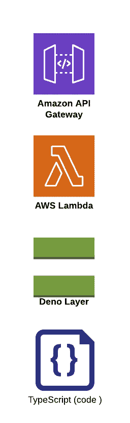
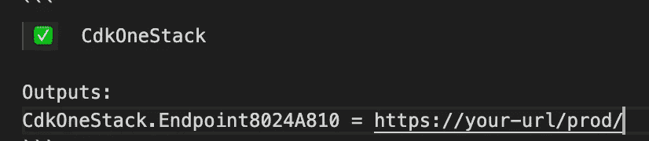
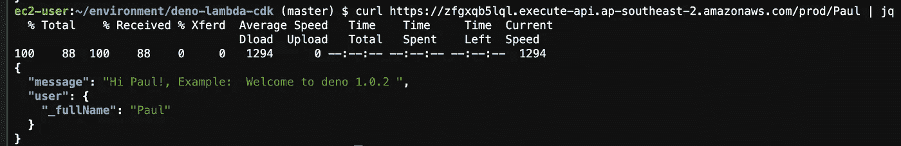

# 使用 AWS CDK 和 TypeScript 部署 Deno 层

> 原文：<https://levelup.gitconnected.com/blog-md-9bd47be8b3ad>

我关注 Deno 和 AWS CDK 已经有一段时间了，在 JavaScript 中使用强类型很好，但是 transpilers 有一点点开销。Deno 去掉了这一点，允许使用 TypeScript 而无需编译。让我们看看如何使用 CDK 部署 Deno 层。

这是一个示例项目，展示了:

*   AWS CDK
*   以打字打的文件
*   在 CDK 项目中部署新层，并部署将使用该层的功能。

**要求**

*   https://nodejs.org/en/download/
*   AWS CDK

*   AWS 帐户
*   本地凭证(或使用云 9)
*   jq:[https://stedolan.github.io/jq/](https://stedolan.github.io/jq/)

**简介**

这个示例使用 CDK 来部署 Deno 层、使用该层的 Lambda 函数以及公开 http 端点的 API 网关。CDK 堆栈项目仍然使用编译的 TypeScript，但是您可以在“tsconfig.json”中看到/src/program 被排除，这意味着我们不需要编译测试文件。

**堆栈**

该堆栈包括:

*   API 网关
*   λ函数
*   启用 Deno 运行时的 Lambda 层
*   打字稿程序

首先将 [repo](https://github.com/kukielp/deno-lambda-cdk) 和 cd 复制到文件夹中，然后运行:

这将安装依赖项，并开始监控 CDK 堆栈类型脚本文件，并将它们编译成普通的 JavaScript。请密切关注终端，因为它会在您进行更改和保存时编译堆栈代码，您将能够在运行前发现错误。

**CDK 的地层**

我们如何在 CDK 定义一个层？我决定不在这个例子中构建运行时，而是展示如何部署构建的运行时。我从[https://github.com/hayd/deno-lambda/releases](https://github.com/hayd/deno-lambda/releases)下载了最新版本，并将内容解压到 src/layer 文件夹中。这些文件是运行演示所需。在 CDK，我们定义了一个新的层次:

**λ函数:**

我们可以看到 AWS 提供了“λ”。当我们利用自定义运行时，使用的“Runtime.PROVIDED”值。

代码将来自 src/program 文件夹，在本例中是一个名为“name.ts”的文件。该文件直接部署为 TypeScript 文件。当我们创建函数时，我们在上面定义的层中传递(该值将是该层的 ARN)。处理程序是文件的名称(如名称)

**API 网关**

**样本程序**

这个示例程序非常简单，使用了面向对象的“person”示例，我们创建了一个 Person，它显示了私有变量，并使用了一个 getter 和一个构造函数。

**展开**

当您准备好部署时，运行“cdk 引导”，然后运行“cdk 部署”

输出将类似于:

CdkOneStack 在:"/bin/cdk-one.ts "中定义。如果需要，您可以更改堆栈的名称:

**调用你的函数！**

curl[https://Your-URL/prod/Your-Name-Here](https://your-url/prod/Your-Name-Here)| jq

回购:[https://github.com/kukielp/deno-lambda-cdk](https://github.com/kukielp/deno-lambda-cdk)