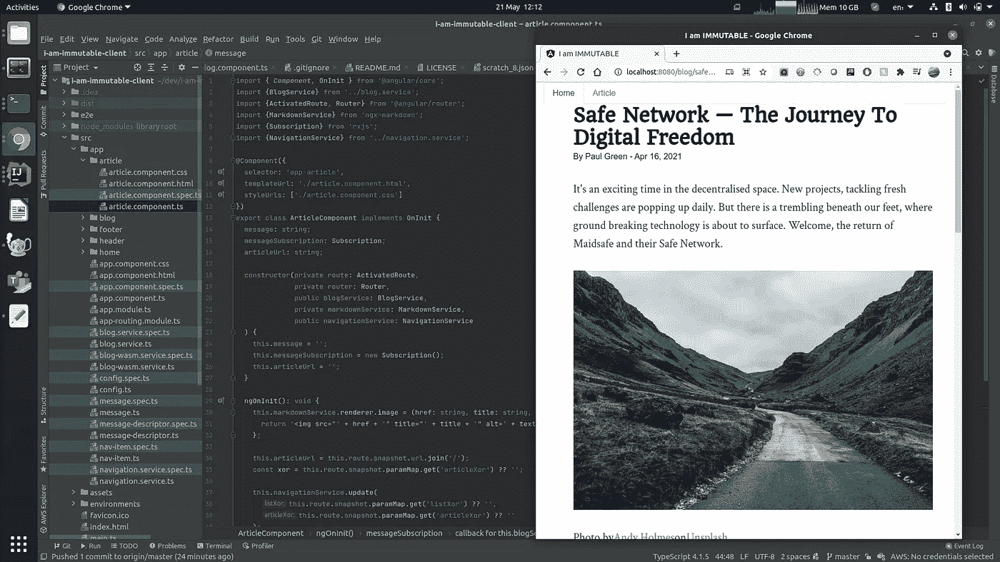
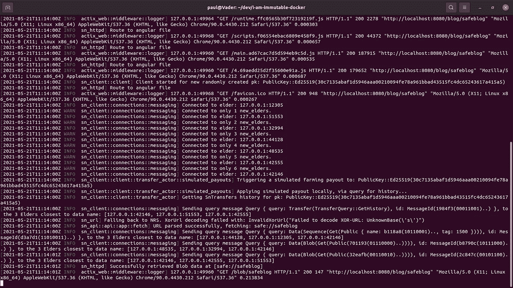
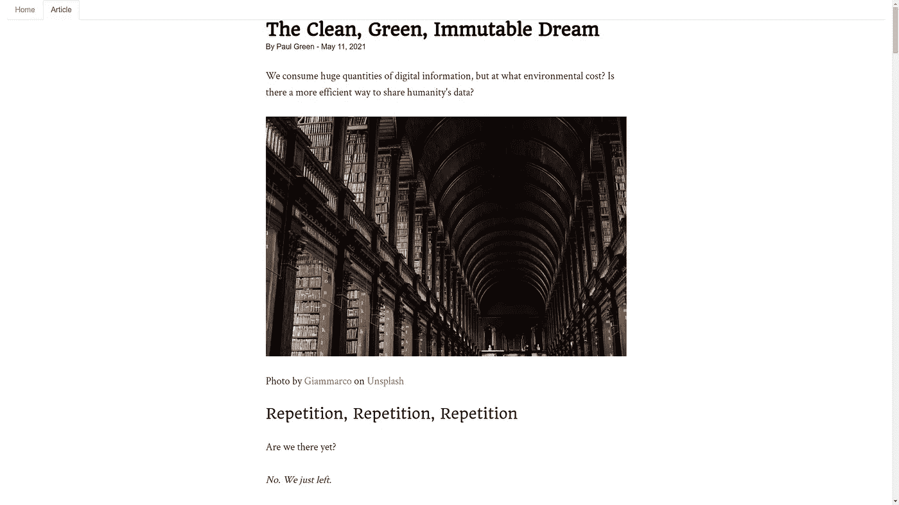
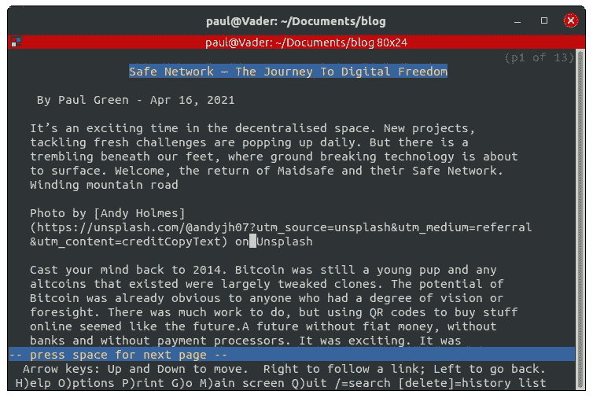

# 与 IMIM 和安全网络一起写博客

> 原文：<https://levelup.gitconnected.com/blogging-with-imim-and-safe-network-8acbf3a62f56>

安全网络上的抵制审查的博客也逐渐清晰起来。进入 IMIM，你的安全网络博客的门户网站。



作者照片——IMIM 博客在行动

# 什么是安全网络？

我以前讨论过安全网络，所以简单地说，它是一个覆盖在传统互联网上的自主数据网络。它提供了不可变和永久的数据访问和存储。所有东西在传输过程中和静止时都是加密的。它采用分散和分布式设计，以确保数据得到安全保存，随时可以在需要时访问。

部署的技术值得一看。发展在区块链出现之前就开始了，并且朝着去中心化的目标走了一条完全不同的道路。该网络目前正在经历一系列测试网络迭代，以消除错误，并为黄金时间做好准备。

[](/safe-network-the-journey-to-digital-freedom-a3b471cc0c8f) [## 安全网络——数字自由之旅

### 我们的脚下颤抖着，那里出现了突破性的技术。欢迎，安全网络，带来…

levelup.gitconnected.com](/safe-network-the-journey-to-digital-freedom-a3b471cc0c8f) 

# 厉害！怎么用？

最新的测试网有一个 CLI(命令行界面)，这对测试核心功能非常有用。CLI 并不是可用性的终极标准，许多人会被推迟。如果你是技术人员，这是一个强大的工具，可以让安全网络屈从于你的意志。

其他人呢？这不可能只是书呆子的安全访问。它需要奶奶证明。(领导安全网络开发的团队)计划完成一个原生浏览器，它很像一个普通的 clear net 网络浏览器。在之前的测试网络中完成了概念验证，一旦最新的测试网络稳定，将为其量身定制。

# 丢人！我讨厌克里斯！

等等！一切都没有失去！会有很多人没有安装安全网络客户端。还会有更多没有安装原生浏览器的。只有少数人有足够的勇气尝试 CLI。没关系。我们可以通过混合安全网络应用来弥合这一差距。

通过创建混合安全网络应用，我们可以在不牺牲可访问性的情况下，帮助实现核心原则。这些混合应用程序可以通过 clear net 访问，但只能从安全网络访问数据。简而言之，它们可以有两个界面——一个使用本机安全浏览器，另一个使用常规的 web 浏览器。

一个应用程序可以感知它是从哪种类型的浏览器打开的。如果本地浏览器访问不可用，它可以通过网关与安全网络对话。这些网关提供了一个标准的 HTTP 接口，所有的 web 浏览器都可以与之对话。它们还可以向安全网络存储数据或从安全网络中检索数据。

# 太好了！但是网关不是集中化了吗？

看情况。如果只有一个访问特定数据的网关，它将是集中的。如果可以选择任何一个网关来访问特定的数据，那就更不用说了。如果特定的数据也可以在没有网关的情况下被本地访问，那么几乎不可能。

混合应用应该最大限度地访问数据。他们应该提供更多的访问数据的方式，而不是更少的访问数据的方式。他们应该尝试释放数据，而不是试图垄断数据。任何人都应该能够运行网关。

我们想要大门*的方式*，而不是大门*的看守者*。


Nikola Knezevic 在 [Unsplash](https://unsplash.com/s/photos/gate?utm_source=unsplash&utm_medium=referral&utm_content=creditCopyText) 上拍摄的照片

# 好吧，那么什么是'*我是不可改变的'*？

*我是不变的*(或简称 IMIM)是一个博客应用，可以从安全的网络中检索文章。最初，它通过 HTTP 与 IMIM 服务器(网关)进行交互，后者又与安全网络进行通信。具体来说，IMIM 是一个万维网门户，用于访问存储在安全网络上的博客。

该应用程序可以读取以 Markdown 格式存储的文章。IMIM 检索降价文本，并即时将其转换为 HTML，以便在网络浏览器上呈现。Markdown 是一种简单的格式化语法，对人友好。您可以创建链接，包括图像、格式化文本等等。这给了我们写优雅文章所需的所有要素。

当物品存储在安全网络上时，生成唯一的、不可变的 URL。这被称为 XOR URL。这些 XOR URLs 总是指向完全相同的数据，因为它们是哈希算法的产物。这意味着它们可以被无情地缓存，因为内容保证是预期的。

XOR URLs 很棒，但是它们可能很难记住——它们本质上是一个哈希摘要，一个看起来随机的数字和数字串。使用 NRS(名称解析服务)，这些 XOR URLs 可以被赋予一个更友好的 NRS URL，就像 DNS 在 clear net 上做的那样。XOR 和 NRS URL 都是安全 URL 的子集。换句话说，安全的 URL 可以是 XOR 或 NRS URL，并将解析为数据的相同底层位置。

要将文章链接到博客，可以将它们的安全 URL 添加到配置文件中。这些配置文件是 JSON 格式的，也存储在一个安全的 URL 中。配备了 IMIM 配置安全网址，浏览器可以下载相关文章。

URL 类型示例:

**异或 URL:**safe://hy 8 oyeyq 7 oh h8 r 78s 5 jietuo 4 ecdfrkopy 1 ig 798 fi 6 ucgk 14 jzijm 9 w

**NRS 网址:**安全://friendlyname

**安全网址:**异或网址或 NRS 网址



作者照片——IMIM 服务器检索安全网络数据

# web 浏览器如何读取安全的 URL？

当从 clear net 运行时，IMIM 应用程序会将安全的 URL 转换为 IMIM 服务器的 URL。然后，它将这些 URL 发送到 IMIM 服务器以检索数据。文章中的任何安全 URL 都会被动态转换为 IMIM 服务器的 URL，包括图片。这使得 IMIM 应用程序可以从安全的网络上无缝地呈现文章及其所有图像。

因为数据是通过安全的 URL 存储在 Markdown 和 JSON 的组合中的，所以其他安全的网络应用程序也可以使用它们。例如，您可以通过 CLI 直接下载它们。将来，一个本地的安全浏览器也可以直接访问它们。这*扩大了文章的受众*，确保了*每个人*的访问。

# IMIM 是如何设计的？

IMIM 客户端是一个 Angular⁴应用程序，任何 web 开发人员都很熟悉。Angular 支持轻松读取 JSON 和 Markdown，同时高度可扩展。它是成熟的、经过实战检验的，应该能与任何能运行网络浏览器的设备兼容。这包括智能手机、平板电脑或笔记本电脑。

IMIM 服务器使用基于 Actix⁶的 sn_HTTPd⁵，这是一个用 Rust 编写的 web 框架和 http 服务器。这直接链接到安全网络客户端库，它也是用 Rust 编写的。在整个 IMIM 服务器上使用 Rust 降低了复杂性和不兼容性。Actix 是最流行和高性能的基于 Rust 的 web 框架之一，它将为托管 IMIM 服务提供一个强大的平台。

检索一篇文章的生命周期是这样的:

1.  IMIM 客户端向 IMIM 服务器发送 IMIM 配置请求。
2.  IMIM 服务器解析请求，检索 IMIM 配置数据，然后将其返回给 IMIM 客户端。
3.  IMIM 客户端解析 IMIM 配置，然后发送一个或多个对相关文章的请求。
4.  IMIM 服务器解析请求，检索 IMIM 文章数据，然后将其返回给 IMIM 客户端。
    答:如果请求的是一个 NRS URL，CacheControl 头被设置为短暂缓存数据。
    b .如果请求的是 XOR URL(不可变的), CacheControl 头被设置为主动/无限缓存。
5.  IMIM 客户端将文章格式化为 HTML 格式，并呈现给用户的浏览器。

[](/the-clean-green-immutable-dream-e34f23b0d4e) [## 干净、绿色、永恒的梦

### 我们消费了大量的数字信息，但是以什么为环境代价呢？有没有更有效的方法来…

levelup.gitconnected.com](/the-clean-green-immutable-dream-e34f23b0d4e) 

# 我如何查看博客和添加文章？

要访问 IMIM 的博客，网址如下所示(本地托管):

```
[http://localhost:8080/](http://localhost:8080/)blog/<blog_name>/article/<article_xor>
```

*blog_name* 应该是一个指向 IMIM 配置的 NRS URL。虽然可以使用 XOR URL，但是不可能向博客添加或更新任何文章。使用 NRL URL 允许用新的或修改的文章更新 IMIM 配置，上传到 XOR URL，然后链接到博客的 NRS URL。

*article_xor* 是一个没有 *safe://* 前缀的 XOR URL。这引用了相关 XOR URL 上的 Markdown 文章。建议使用 XOR URLs，因为它们具有不可变的特性，可以被无限缓存。

想了解更多关于建立 IMIM 博客的信息，请看一下 [i-am-immutable-client 自述](https://github.com/traktion/i-am-immutable-client/blob/master/README.md)。



# 未来有什么功能规划？

IMIM 目前是一个只读客户端应用程序。要添加内容，必须通过 CLI 完成。对于最初的原型版本来说，这已经足够了，但是添加写访问权限将是理想的。

目前，公开托管 IMIM 服务器也太开放了。虽然安全网络对检索数据不收费，但传统的云主机会收费。这将需要收紧，使公共托管可行。

以上两个问题都可以通过使用安全网络钱包来解决，安全网络钱包可以由博客所有者创建和充值。然后，这个钱包可以用来间接支付托管费和直接写入数据。其他 clear net 博客所熟悉的用户体验将成为可能。

创建一个本地浏览器客户端也是可取的，一旦安全网络浏览器再次运行，这将被完成。同一个 IMIM 客户端将被简单地更新，以感知正在使用的平台，然后使用定制的模块检索博客配置和文章。

如果您只能访问安全网络 CLI，该怎么办？嗯，你总是可以通过 *pandoc* 和 *lynx* 发布降价文章！

```
safe cat safe://hy8oyeyqyrgwdy3jkhmgm67id4hdtc8ymnozoi8x95cjr4gazqrawx9pqoe | pandoc -t html | lynx –stdin
```



# 哇！我来试一下！

感谢您的阅读，请务必阅读！下面的 [IMIM 客户端](https://github.com/traktion/i-am-immutable-client)、 [server⁵](https://github.com/traktion/sn_httpd) 和 [docker⁸](https://github.com/traktion/i-am-immutable-docker) 存储库中的 README.md 文件将帮助您开始。还有一个安全的网络社区论坛线程，可能会有帮助。

在撰写本文时，我们处于测试网络之间，因此只能使用本地测试网络。当下一个公共测试网络上线时，我一定会创建我的 IMIM 博客来测试它！

[1]安全网首页
[https://safenetwork.tech/](https://safenetwork.tech/)

[2]降价指南
[https://www.markdownguide.org/](https://www.markdownguide.org/)

【3】我是不可改变的(IMIM)客户端
【https://github.com/traktion/i-am-immutable-client】T4

[4]棱角分明的框架
[https://angular.io/](https://angular.io/)

[5]SN _ https 框架(针对 IMIM 服务器)[https://github.com/traktion/sn_httpd](https://github.com/traktion/sn_httpd)

[6] Actix Web 框架
[https://actix.rs/](https://actix.rs/)

[7] IMIM 安全网社区论坛话题
[https://safenet Forum . org/t/I-am-immutable-Safe-blog-app/34857](https://safenetforum.org/t/i-am-immutable-safe-blog-app/34857)

[8]https://github.com/traktion/i-am-immutable-docker IMIM Docker 设置和本地安全网络脚本
T18

[9] Pandoc —一种通用文档转换器
https://pandoc.org/ T21

[10] Lynx CLI 网络浏览器
[https://lynx.invisible-island.net/](https://lynx.invisible-island.net/)