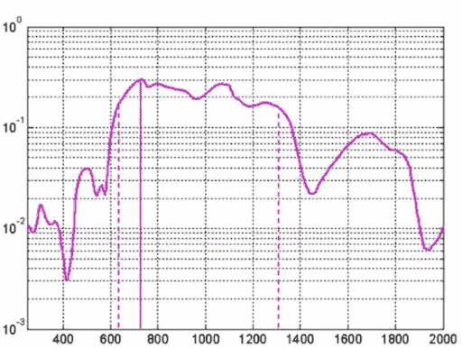
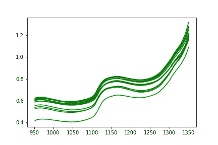
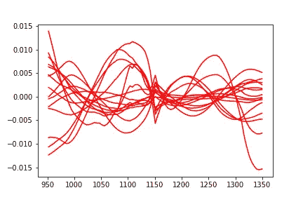
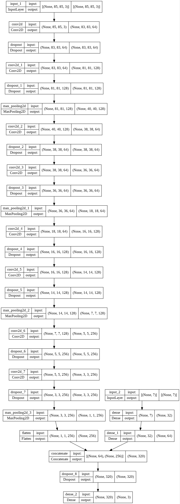
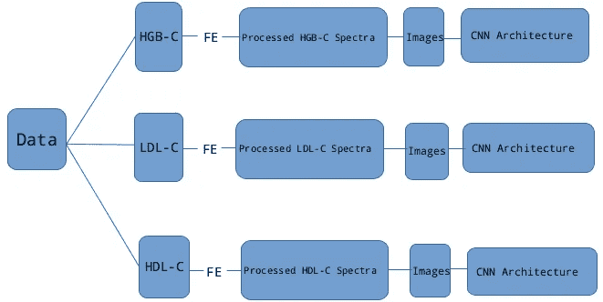

# 血液光谱图像分类

> 原文：<https://levelup.gitconnected.com/blood-spectroscopy-to-image-classification-a3c39e61c4f1>



资料来源:津迪。非洲

临床环境中的血液分析是通过从不同患者收集血液样本，然后进行不同的血液测试来完成的。使用 NIR 光谱学，给定波长范围内的光束被导向样品。根据样品的化学成分(分子结构)，光会被不同程度地衰减，部分被吸收或反射。光谱吸收强度数据可以在表征生物样品化学组成的不同波长(生物窗口)上获得。



未处理的光谱

# **津迪问题定义**

> “为此，你可以建立机器学习模型，根据光谱数据对样品中特定化学化合物的水平进行分类。”~津迪

# **数据处理管道**

这类问题中的一个关键挑战是除了光谱读数的高特征维度之外的重复读数。

为了节省计算资源，吸光度强度的中值在所有样本捐赠 id 中进行聚合。这样可以消除重复读数，从而减少样本量(训练+测试)。

实验结果表明，中值聚合方法优于均值聚合技术(我的假设是，这可能是由于数据中存在异常值和高方差)。

# **数据准备和光谱预处理**

使用纯化合物的化学特征，通过计算所有纯化学特征与全谱读数的相关性，从全谱读数中提取特征化学模式。

由于血红蛋白是血液中大多数化学化合物的主要载体，因此与感兴趣的化学成分相比，在化合物中观察到的信号强度更高。

此外，在特定波长观察到高度的信号重叠，使得波长选择和成分隔离的问题更加棘手。



样品预处理光谱

> **化学成分模式信息**

我使用其相应的纯化学信号分离单个化学成分的方法包括计算并从血红蛋白(主要载体)的相关信号中减去干扰化合物的相关信号信息

```
from scipy import signaldef compute_correlation(whole, sub):
  """ compute correlation matrix 
      whole : spectral reading
      sub : pure chemical signature """ whole_mean = whole.mean() whole = whole - whole_mean sub   = sub - whole_mean corr = signal.correlate(whole, sub, mode = 'same') return corr
```

为了获得具有高信噪比的有效代谢物信息，在计算中利用了针对读数的所有纯化学信号相关信息。

***高密度脂蛋白胆固醇(HDL-C)信号*** :为了获得净 HDL-C 信号强度信息，从每次读取的血红蛋白相关矩阵中减去葡萄糖和脂肪相关信号。

```
net_hdl_corr = hgb_corr - (fat_corr + glu_corr)
```

***【低密度脂蛋白胆固醇(LDL-C 信号)*** :为了获得净 LDL-C 信号强度信息，每次读取时，仅从血红蛋白相关矩阵中去除葡萄糖相关。在这种情况下，脂肪被区别对待，因为高脂肪含量与高 LDL-C 高度相关。脂肪(甘油三酯)可被视为 LDL-C 合成的必要前体。

```
net_ldl_corr = ldl_corr  - glu_corr
```

***血红蛋白(HGB)信号*** :为了获得净 HGB-C 信号强度信息，从每次读取的全局血红蛋白相关矩阵中去除葡萄糖和脂肪(类似于 HDL-C)

```
net_hgb_corr = hgb_corr  - (fat_corr + glu_corr)
```

> ***实验光谱预处理总结和一些要点***

*   *选择应用于数据的信号预处理效果的“正确”顺序*

—实验结果表明，执行一系列标准正态变量(SNV)缩放，然后执行扩展平均散射校正(EMSC)缩放，可以获得更好的结果。

*   *将一阶导数 Savitsky-Golay(SG)平滑应用于预处理信号提供了最佳结果。*

—实验结果表明，二阶 SG 平滑引入了过多的噪声，因此导致性能比一阶 SG 平滑更差

—基本平滑效果(无导数)和原始光谱信息没有提供改进。

—使用偏最小二乘回归(PLSR)的波长选择没有增加改进

—最后，数据扩充(在转换为图像数据之前)并没有提高模型性能。

# **将光谱信息转换成图像**

经过处理的信号信息被编码为不同类型的图像，即，格拉米角和场(GASF)和格拉米角差场(GADF)以及马尔可夫转移场(MTF)

这些成像技术包括在极坐标系统而不是经典的笛卡尔系统中表示净信号信息

从处理后的信号计算的 3 个不同的图像被连接以形成 3 通道复合图像

-如需详细解释，请考虑阅读本文。

# **模型建筑**

*   模型由一个 VGG 风格的模型架构组成，它接受两个输入——图像和元特征
*   元特征包括扫描仪环境变量(温度+湿度),以及工程特征——聚类、主成分和一阶 SG 平滑光谱的标准差。
*   Softmax 是跨所有卷积隐藏层使用的激活函数。



模型摘要

# **培训**

*   在 3 个不同数据集的训练阶段，保持统一的模型架构设计。
*   每个模型的每个数据集类型使用 10 重分层交叉验证方案。

# **总之**



方法概述

> 最后备注:血液样本的 NIR 光谱数据的预处理和图像的光谱变换的适当组合可以受益于使用二维卷积神经网络的图像识别的优点。这种方法产生了 0.6095 的最佳准确度分数，比 0.5616 的基准准确度提高了大约 8.5%。

# **参考文献**

[1]我的知识库—([https://github . com/dr cod/Blood-Spectroscopy-class ification-using-Deep-Learning](https://github.com/DrCod/Blood-Spectroscopy-Classification-using-Deep-Learning))。点击找到完整解决方案[的链接。](https://github.com/DrCod/Blood-Spectroscopy-Classification-using-Deep-Learning/blob/main/Final%20Solution%20Implementation.ipynb)

[2]改进分类和插补的成像时间序列([https://www.ijcai.org/Proceedings/15/Papers/553.pdf](https://www.ijcai.org/Proceedings/15/Papers/553.pdf))—我强烈推荐阅读这篇论文。

[3] [pyts](https://github.com/johannfaouzi/pyts.git) —一个用于时间序列分类的开源 python 包。

[4] [ChemUtils](https://github.com/EBjerrum/Deep-Chemometrics/blob/master/ChemUtils.py) —一个用于化学计量学数据预处理和分析的开源 python 工具。

[5]罗翰([https://www.kaggle.com/ubitquitin/tsc-exploration](https://www.kaggle.com/ubitquitin/tsc-exploration))利用 LSTMs 和卷积神经网络(CNN)进行时间序列分类(TSC)探索

[6]扩展乘法信号增强(EMSA) —模型实现结构改编自 VGG 风格的架构，见[此处](https://github.com/BioSpecNorway/EMSA/blob/fce4a35fd8dc58687096130bc2794e63e1719b9f/src/spectra_vgg.py)

[7]基于近红外光谱的软骨完整性分类([https://github.com/ioafara/ML-DL-NIR-spectral-analysis](https://github.com/ioafara/ML-DL-NIR-spectral-analysis/)

[8] bloods.ai 血液光谱分类挑战赛([https://zindi . Africa/competitions/bloods ai-Blood-Spectroscopy-class ification-Challenge](https://zindi.africa/competitions/bloodsai-blood-spectroscopy-classification-challenge))