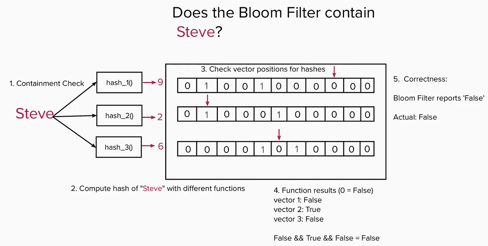

# 布鲁姆过滤器:解释和应用系统的视觉效果

> 原文：<https://levelup.gitconnected.com/bloom-filters-visuals-for-explanation-and-applied-systems-b58fb3cf524>

bloom filter 数据结构允许您添加元素和检查包含性，就像集合一样。他们保证有 0%的假阴性率。然而，问题是它们的假阳性率非常低(0-2%)，这取决于添加元素的量。简而言之，当 bloom filter 告诉你它不包含元素时，你可以相信它是正确的，但当它说是的，它确实包含元素时，它实际上只是一种可能。

那么为什么会有人用布隆滤镜而不用 set 呢？被配置成支持大量独特元素的布隆过滤器将具有比容纳相同数量的独特元素的集合更小的空间占用量数量级。这种为节省大量空间而进行的精度上的小折衷最终对某些系统优化非常有用。

让我们探索一些视觉效果，展示它们是如何工作的，以及它们可以应用于何处来提供价值的例子。

# 添加元素

在我们的例子中，我们将使用一个 bloom filter 并添加“Peter”和“Sam”字符串元素。

bloom filter 的工作方式是获取元素，将它们运行 N 个不同的哈希函数，每个函数都带有一个伴随的位向量，然后根据观察到的哈希将伴随向量中的位置设置为真。一旦位置翻转为真(1)，就不会再设置回假(0)。

对于 Peter 来说，这些函数产生散列 2、6 和 7。它将从 0 → 1 设置这些位置。对于位置 5、2 和 5 的 Sam 也是如此。

不同散列函数的数量 N 以及位向量的长度通常在实现中基于配置的容量和最大允许错误率进行反向工程。容量是我们期望布隆过滤器能够看到的不同元素的数量。

# 密封检查

现在让我们看看它如何确定它是否包含一个元素。

在 Mary 的例子中，当我们通过散列函数运行它时，我们得到散列值 3、8 和 1。在我们添加的内容中，没有一个位置被设置为 True，所以我们为包含报告 False。这是正确的回答。

对于 Steve，我们得到散列 9、2 和 6。第二个函数为 Steve 生成的散列与我们之前添加 Sam 时生成的散列冲突，这导致该检查报告为 True。

幸运的是，因为其他两个函数产生的散列在它们各自的向量位置上显示了假值，所以 bloom filter 仍然会正确地为整体包含检查报告假值。在我们的例子中，所有三个检查必须在逻辑上结合在一起，以产生一个整体的遏制真值。

在马克的例子中，由于运气不好，2、6 和 5 的哈希值恰好与彼得和萨姆的早期添加相冲突。在这种情况下，布隆过滤器将在每个位向量上看到真，并错误地报告包含为真，而事实上布隆过滤器从未看到元素“标记”。

这就是小错误率产生的原因。

如果我们正在检查 Peter 或 Sam，检查将看到这些实体的所有位置都设置为 True，并正确地响应包含的 True。然而，在一般情况下，向量位置可能已经被具有冲突散列的某个其他元素设置为真，所以我们不一定相信任何答案是 100%准确的。

好消息是，该结构根据其设计，绝不会意外地声明某个元素实际上不在系统中(假阴性)。一旦我们添加了一个元素，正确的向量位置就会翻转为真，并且永远不会翻转回假。

那么，当您不能总是信任正匹配的包含准确性时，这种结构对实际系统有什么用呢？

我们有时可以利用 bloom filter 的小空间需求和零假阴性承诺来尝试和避免做不必要的工作。

# 布隆过滤器应用的几个例子

# 1.内部连接/半连接欺骗

如果在 Spark 中内部连接两个数据集，一个是大型数据集，一个是中型数据集，其中混洗连接是不可避免的，我们可以使用 bloom filter 来避免从大型表中混洗在中型表中没有匹配的行。使用一个集合来包含所有的密钥可能不适合机器内存，所以这是 bloom filter 可以大放异彩的地方。

任何通过布隆过滤器的误报都将在内部连接过程中被丢弃。

# 2.Chrome 不安全/恶意网址客户端检查。

Chrome 有一个 bloom 过滤器来检查客户端的 URL 是否绝对没有恶意。任何误报(bloom filter 认为是恶意的 URL，但实际上不是)将只需要后续的远程服务检查，并浪费一点时间来验证它们。

这比每次检查远程服务都被频繁告知 URL 是安全的要好。将不安全的 URL 存储在驻留在浏览器内存中的集合中是不切实际的，因为需要空间来保存每个唯一的 URL。

# 3.通过跳过存储文件来节省行磁盘 I/O。

检索给定行的列族详细信息有时需要读取磁盘上的多个存储文件。bloom filter 可以省去扫描存储文件的麻烦，这些文件没有任何与给定行相关的信息。

# 来源:

1.  布隆过滤器连接。https://issues.apache.org/jira/browse/SPARK-32268
2.  谷歌安全浏览:【https://developers.google.com/safe-browsing/ 
3.  Nice Bloom Filter 应用程序[https://web . archive . org/web/2010 10 27012345/http://blog . alexyakunin . com/2010/03/nice-Bloom-Filter-Application . html](https://web.archive.org/web/20101027012345/http://blog.alexyakunin.com/2010/03/nice-bloom-filter-application.html)
4.  阿帕奇 h base:[https://hbase.apache.org/](https://hbase.apache.org/)
5.  HBase 布鲁姆过滤器:【https://issues.apache.org/jira/browse/HBASE-1200 
6.  布鲁姆滤镜是如何用在 h base:【https://www.quora.com/How-are-bloom-filters-used-in-HBase 

# 分级编码

感谢您成为我们社区的一员！在你离开之前:

*   👏为故事鼓掌，跟着作者走👉
*   📰查看[升级编码出版物](https://levelup.gitconnected.com/?utm_source=pub&utm_medium=post)中的更多内容
*   🔔关注我们:[Twitter](https://twitter.com/gitconnected)|[LinkedIn](https://www.linkedin.com/company/gitconnected)|[时事通讯](https://newsletter.levelup.dev)

🚀👉 [**加入升级人才集体，找到一份神奇的工作**](https://jobs.levelup.dev/talent/welcome?referral=true)