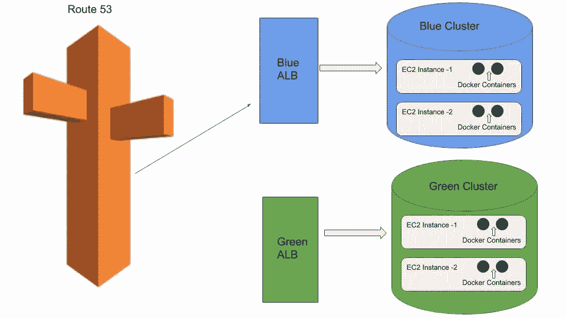
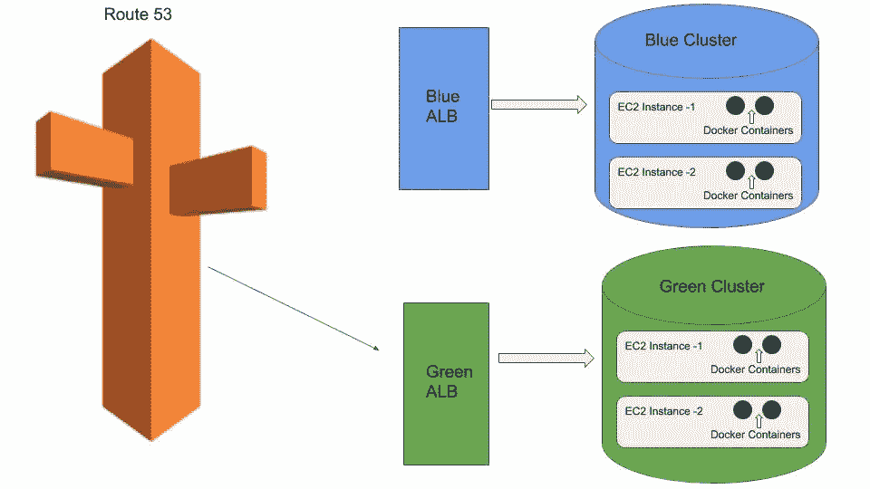
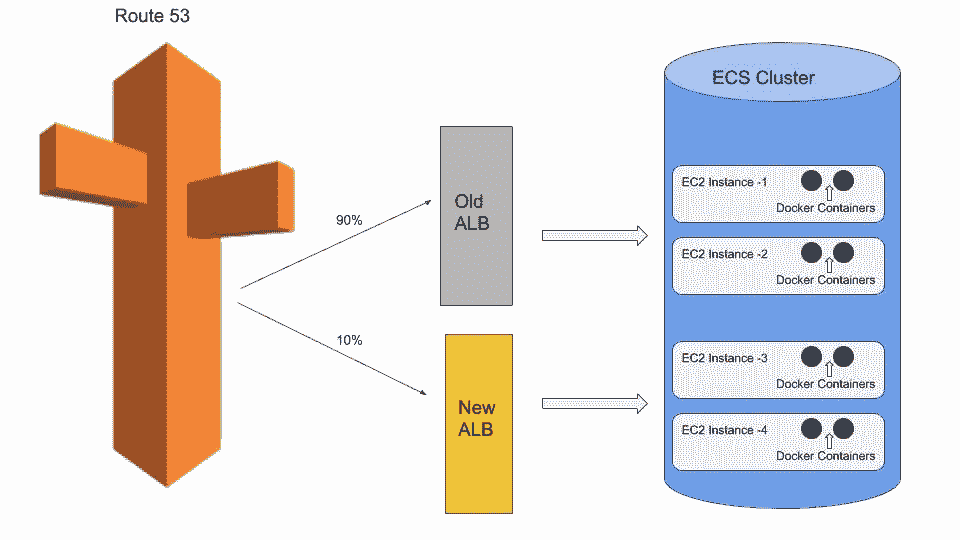
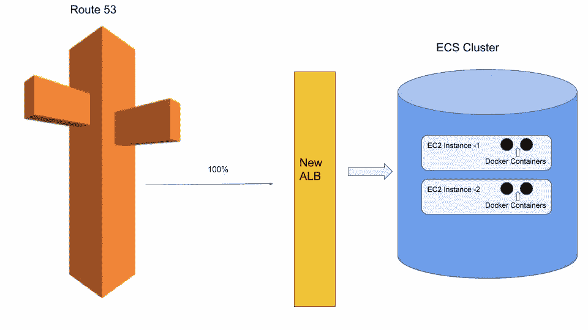

# 蓝绿色搭配金丝雀部署——一种新颖的方法

> 原文：<https://levelup.gitconnected.com/blue-green-with-canary-deployment-a-novel-approach-2cee77ff564d>

是的，你没看错。我想谈谈金丝雀与蓝绿色的结合。

通常，我们看到的部署要么是淡黄色，要么是蓝绿色。在本文中，我想花点时间谈谈蓝绿与金丝雀部署的前景和可能性。我将使用 AWS 术语解释这篇文章。

使用的术语:

a.docker——一个容器化的平台，用于构建映像并像容器一样运行代码

b.AWS 集群——部署在 EC2 实例上的 AWS 服务的逻辑分组

c.AWS 服务—负责由 ECS 管理的 docker 容器成功运行的任务。

首先，让我们从基础开始:

> **什么是蓝绿部署？**

蓝绿色部署是一种部署机制，其中并行设置了两个相同的堆栈(AWS 集群),称为蓝色和绿色，其中只有一个堆栈接收活动流量(为此假设为蓝色),而另一个堆栈处于空闲状态。

随着新的生产版本的推出，新的代码部署将在非活动的绿色集群上进行。一旦部署完成，我们看到环境是稳定的，所有 docker 容器都已启动并积极运行，经由路由 53 的流量现在被系统地从蓝色路由到绿色，从而使绿色成为新的活动集群，而将蓝色淘汰为非活动状态。

这种方法在无法承受停机时间的生产系统和被认为非常关键的应用程序中非常有效。如果由于任何不可预见的问题而需要回滚发布，那么将流量从绿色(新)反转为蓝色(旧)是很容易的，因为旧的堆栈随时可用。

之前:蓝色为活动状态

之后:绿色表示活动

这种方法的缺点是可维护性和成本。

我们需要维护两个集群(蓝色和绿色)，并且并行维护这两个集群，从而使我们的服务器成本显著翻倍(EC2s 和 ALB 花费了大量资金)。

人们可能会质疑这样一个事实，即在大量观察新部署的稳定性之后，旧的集群可以被删除。这种方法是可行的，但是通常被认为是非常麻烦的，大多数人倾向于保留两个集群。

> **什么是金丝雀部署？**

Canary 部署是另一种类型的部署，在现有集群上使用新的 docker 容器进行新的部署(根据您的 ASG 策略，可能是新的 EC2 实例)。新的部署将有自己的 ALB 和自己的目标组。使用路由 53，流量以递增的百分比转出给用户。

增量方法降低了它对真实客户产生影响的风险。

一旦新的部署完成，流量就在节流的基础上被路由到新的容器。使用 Route 53 加权记录，我们可以调整流量，并决定只将 10%的流量发送到使用新 ALB 的新容器。一旦事情看起来不错，我们可以定期增加重量，直到它达到 100:0。使用这种方法，即使在节流过程中出现问题，我们也可以轻松地回滚到旧版本，并确保只有一小部分(这里是 10 个)用户受到新版本的影响。

一旦验证结果良好，就需要删除旧容器和旧 ALB(包括目标组),并确保整个流量现在被路由到指向新容器的新 ALB。

这种方法对于不太重要的应用程序是可取的，因为我们正在限制可能受到影响的新用户的流量。由于没有旧集群的开销，成本显著降低。无需维护旧的 ALB、旧的 ECS 群集或旧的实例，所有内容在验证后都会被清理。

金丝雀:在部署期间

部署后的金丝雀

这种方法的一个主要问题是回滚。尽管我们在软件开发生命周期中采取了所有的验证和预防措施，但是在一段规定的时间后，系统仍有可能不稳定，代码中的新特性也会突然出现。

例子包括:

I .内存泄漏——不要让我开始讨论这个问题，因为没有直接的方法来解决内存泄漏问题。内存泄漏可能有多种原因，通常需要几天时间来识别和解决内存泄漏问题。在此过程中，当新版本中的问题得到修复时，您可能希望回滚到旧版本。我们不能在 Canary 中这样做，因为旧版本已被删除。

二。弹性问题—区域隔离导致的连接故障以及一个区域的服务器相对于另一个区域的故障是一个常见问题。尽管有自动故障转移功能，但连接性和弹性有时会是个问题。

三。客户对该功能不满意——这可能是一种罕见的情况，但结果可能是发布的新功能没有满足客户的期望，这可能会促使我们立即回滚到旧版本。

那么，临时的解决方案是什么呢:构建和部署旧版本的代码，并重新经历旧版本的整个管道和发布过程(批准和可怕的繁文缛节)。如果定期发布新功能，这个过程可能会很乏味。

> 那么，蓝绿搭配金丝雀是怎么回事呢？

我在这里的想法是提供一个简单的解决方案，我试图将两个部署过程合二为一。

> 你会问，我们如何做到这一点

Canary 部署完成后，不要删除旧的 ALB 和 EC2 实例。这样我们就模仿了蓝绿色模型，但是在同一个集群中使用了金丝雀模型。

保留旧的服务(容器)将帮助我们立即实现回滚，并帮助我们快速实现我们想要的。

这一步还将帮助我们减少维护额外的非活动集群的开销，对于纯蓝绿色模式，我们认为这种开销非常昂贵。

尽管如此，我们仍然有一个 EC2 实例闲置的问题，旧的 docker 容器仍然在我们的钱包里。我们需要通过适当地调整我们的自动伸缩组和 docker 容器的内存分配来解决这个问题，并在一个 EC2 实例中挤进尽可能多的容器。

我不会在这里给出确切的数字，但出于一个想法的目的，我们可以考虑这个场景:

为实例保留 20%的内存缓冲区，如果我们需要 3 个具有 30%内存的 docker 容器，那么我们需要 2 个 EC2 实例，其中一个具有 2 个分配了 60% + 20%(缓冲区)内存的 docker 容器，另一个 EC2 实例分配了 30% + 20%(缓冲区)。因此，我们总共为 2 个 EC2 实例付费(纯粹的金丝雀方法)

我们的解决方案:如果我们可以将 docker 内存减少到 24%，那么我们将在一个 EC2 实例中分配 72% + 20%(缓冲区)的内存，现在我们可以使用另一个 EC2 实例来托管旧代码，并将其压缩到同一个集群中。

这只是我上面给出的一个例子，你需要根据你的要求进行相应的微调。

我希望我的这篇文章有助于理解各种部署模型。快乐编码..！！

如果你喜欢这篇文章，请尽可能多地在页面底部拍手。它鼓励我写更多。