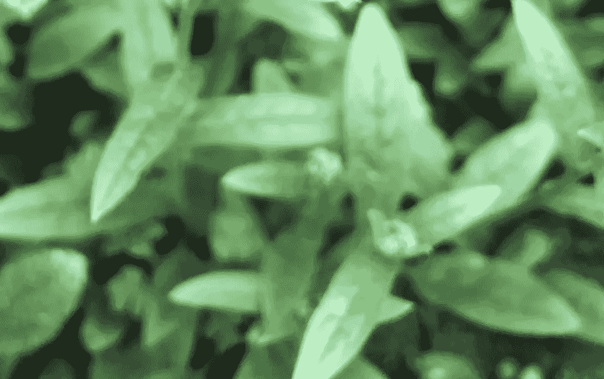

# 模糊的图像

> 原文：<https://levelup.gitconnected.com/blurred-images-75b69e6ece40>



最近，在 C 语言中完成一个函数时，[我的任务](https://cs50.harvard.edu/x/2020/psets/4/filter/less/)是平均位图中每个像素及其周围像素的红色、绿色和蓝色值，以使图像看起来模糊。一个名为“image”的二维数组通过指定的高度和宽度被传递到函数中，它必须循环转换每个像素。我必须找到的平均值是循环中当前正在转换的像素的一行和一列中每个像素的颜色值。

这意味着，如果像素在二维数组的一个角上(例如，想象一个四列长和四列宽的正方形)，那么平均值将是四个像素的值。如果像素在边上，那么它将是六个像素。如果它既不是角也不是边，那么它将是九个像素(包括具有要转换的值的像素、它左边的像素、它右边的像素、它正下方的像素、它上方的像素以及在它上面和下面的行中与左边和右边成对角线的像素，在原始图像内形成一个 3×3 的正方形)。

**制作副本**

我要做的第一件事是创建一个空的嵌套数组，它将存储稍后用于转换图像的值。我必须这样做的原因是，如果我直接转换数组中的颜色值，那么随着循环的进行，取的平均值将是这些转换后的值，而不是原始值。下面的第三个数组长度为 3，因为这是存储新颜色值的位置，红色的平均量在 0 位置，蓝色的平均量在 1 位置，绿色的平均量在 2 索引位置。在函数结束时，一旦 finalArray 充满了取自平均值的新值，就会再次循环“image ”,存储在 finalArray 中的颜色值将取代原始值。

```
int finalArray [height][width][3];
```

**回环回环**

该函数从一个初始嵌套循环开始；外部“for 循环”的设置如下:

```
for (int i = 0; i < height; i++)
```

内部循环开始于:

```
for (int p = 0; p < width; p++)
```

内部循环允许在外部循环移动到下一列之前循环行中的每个项目。

**指定条件**

经过反复试验，我将问题分解为三个主要的 if/else 语句，其中嵌套了更多的 if/else if 语句。

第一个条件是

```
if (p == 0)
```

在这种情况下，还有另外三种情况:

```
if (i == 0)else if (i == height - 1)else if (0 < i < height - 1)
```

如果' p '和' I '都是零，这意味着循环在左上角。如果' p '是零，而' I '是高度- 1，那么循环在左下角。如果“p”是零，而“I”大于 1 但小于高度减 1，则该循环在顶部边缘。

这个模式在另外两个条件下继续(p ==下一个的宽度- 1，0 < p < width - 1 for the one after that) and their own nested if/else if statements to cover the whole bitmap.

This is the first ‘if’ statement, with all of the variables having been initialized earlier on. The variables ‘middleRed’, ‘middleBlue’, and ‘middleGreen’ are the same for all of the conditions here and later in the function, because they are for the current pixel in the loop. That is why they come before the first ‘if’ statement — so they have a wider scope.

```
middleRed = image[i][p].rgbtRed;
middleBlue = image[i][p].rgbtBlue;
middleGreen = image[i][p].rgbtGreen;if (p == 0)
            {
                rightRed = image[i][p + 1].rgbtRed;
                rightBlue = image[i][p + 1].rgbtBlue;
                rightGreen = image[i][p + 1].rgbtGreen;bottomRightRed = image[i + 1][p + 1].rgbtRed;
                bottomRightBlue = image[i + 1][p + 1].rgbtBlue;
                bottomRightGreen = image[i + 1][p + 1].rgbtGreen;topRightRed = image[i - 1][p + 1].rgbtRed;
                topRightBlue = image[i - 1][p + 1].rgbtBlue;
                topRightGreen = image[i - 1][p + 1].rgbtGreen;belowRed = image[i + 1][p].rgbtRed;
                belowBlue = image[i + 1][p].rgbtBlue;
                belowGreen = image[i + 1][p].rgbtGreen;aboveRed = image[i - 1][p].rgbtRed;
                aboveBlue = image[i - 1][p].rgbtBlue;
                aboveGreen = image[i - 1][p].rgbtGreen;//top left corner
                if (i == 0)
                {
                    averageRed = (middleRed + rightRed + bottomRightRed + belowRed) / 4.0;
                    averageBlue = (middleBlue + rightBlue + bottomRightBlue + belowBlue) / 4.0;
                    averageGreen = (middleGreen + rightGreen + bottomRightGreen + belowGreen) / 4.0;
                }//bottom left corner
                else if (i == height - 1)
                {averageRed = (middleRed + rightRed + topRightRed + aboveRed) / 4.0;
                    averageBlue = (middleBlue + rightBlue + topRightBlue + aboveBlue) / 4.0;
                    averageGreen = (middleGreen + rightGreen + topRightGreen + aboveGreen) / 4.0;
                }//left side edge
                else if (0 < i < height - 1)
                {
                    averageRed = (middleRed + rightRed + bottomRightRed + topRightRed + aboveRed + belowRed) / 6.0;
                    averageBlue = (middleBlue + rightBlue + bottomRightBlue + topRightBlue + aboveBlue + belowBlue) / 6.0;
                    averageGreen = (middleGreen + rightGreen + bottomRightGreen + topRightGreen + aboveGreen + belowGreen) / 6.0;
                }}
```

Then, later on in the function, the averageRed, averageBlue, and averageGreen values for the pixel are rounded and added to finalArray.

```
finalArray[i][p][0] = round(averageRed);
finalArray[i][p][1] = round(averageBlue);
finalArray[i][p][2] = round(averageGreen);
```

**最终循环**

在所有“image”循环完毕且“finalArray”已满后，将运行与前一个循环具有相同结构的另一个嵌套循环，以将“image”中的红色、蓝色和绿色值设置为等于存储在 finalArray 中相应位置的平均值。

```
for (int v = 0; v < height; v++){for (int l = 0; l < width; l++){image[v][l].rgbtRed = finalArray[v][l][0];
            image[v][l].rgbtBlue = finalArray[v][l][1];
            image[v][l].rgbtGreen = finalArray[v][l][2];}}
```

瞧啊。你现在有一个模糊的图片。但这次是故意的。