# 基于机器学习的体重指数预测

> 原文：<https://levelup.gitconnected.com/body-mass-index-prediction-with-machine-learning-5f277ff531f5>


图片由 Pixabay 提供

# 什么是身体质量指数(身体质量指数)？

身体质量指数(身体质量指数)是一种用你的身高和体重来衡量你的体重是否健康的方法。

身体质量指数的计算方法是用成年人的体重(公斤)除以身高(米)的平方。例如，25 的身体质量指数意味着 25 千克/平方米。

***公式:体重(kg) /【身高(m)]^2***

# 身体质量指数山脉

对于大多数成年人来说，理想的身体质量指数在 18.5 到 24.9 之间。

对于 2 至 18 岁的儿童和青少年，身体质量指数的计算考虑了年龄和性别以及身高和体重。

如果你的身体质量指数是:

*   低于 18.5——你体重偏轻
*   介于 18.5 和 24.9 之间——你属于健康体重范围
*   介于 25 和 29.9 之间——你属于超重范围
*   在 30 到 39.9 之间——你属于肥胖范围

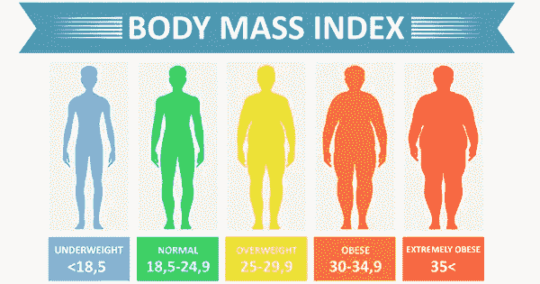

图片由[https://www . CDC . gov/healthy weight/assessing/BMI/adult _ BMI/index . html](https://www.cdc.gov/healthyweight/assessing/bmi/adult_bmi/index.html)

**研究目的 *:
从我们掌握的数据出发，对一个人属于哪种类型的身体质量指数进行分类。***

# **数据集发现**

它使用的数据集可以在 [Kaggle](https://www.kaggle.com/yersever/500-person-gender-height-weight-bodymassindex) 上找到，包含:500 人的体重指数、体重和性别，其中身高和体重是随机生成的，体重指数是用身体质量指数公式计算的。

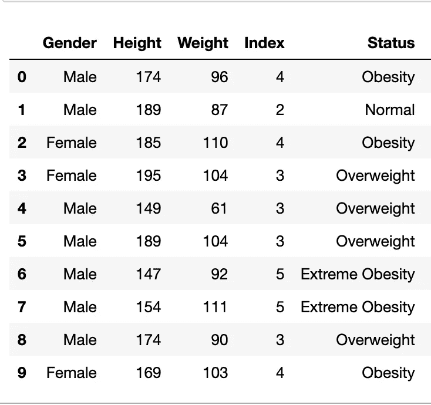

在原始数据集中，我添加了**状态**列，它显示了与**索引**列中的值相比的身体质量指数类别，这些值是:
*0=极弱:身体质量指数< 16*

*1 =弱:16 <身体质量指数< 18.5*

*2 =正常:18.5 <身体质量指数< 24.9*

*3=超重:25 <身体质量指数< 29.9*

*4 =肥胖:30 <身体质量指数 34.9*

*5=极度肥胖:身体质量指数>35*这样，数据的分析和可视化更容易理解。

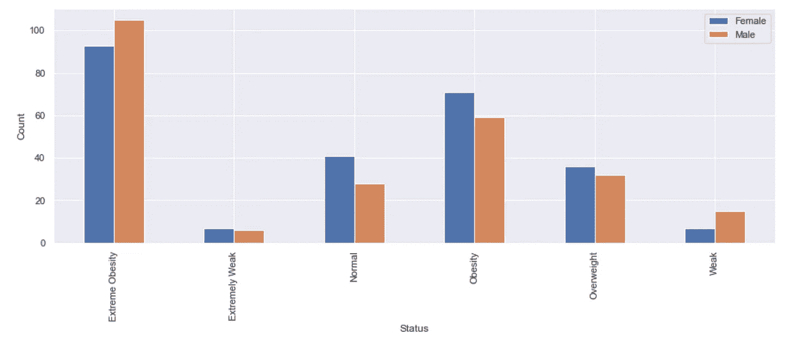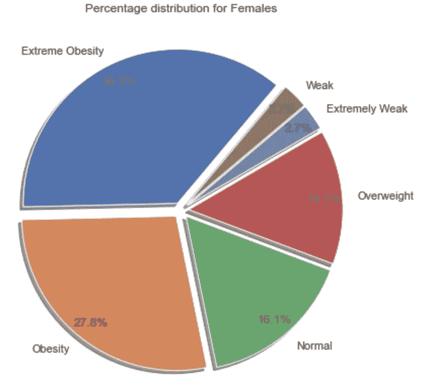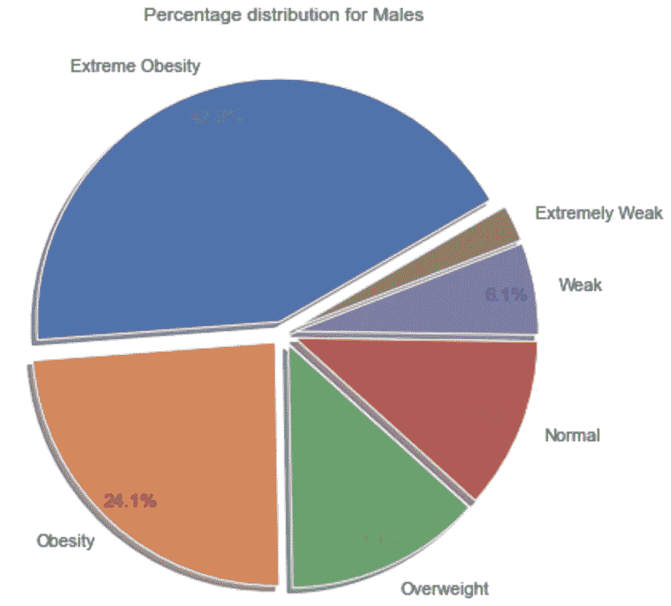

通过分析现有数据，在按性别划分的人群分布中，我们可以看到男性比女性更极端肥胖，而肥胖和正常人群中女性的比例更高，女性比男性更超重。

在下面的图片中，我们可以看到体重和身高状态趋势的柱状图。

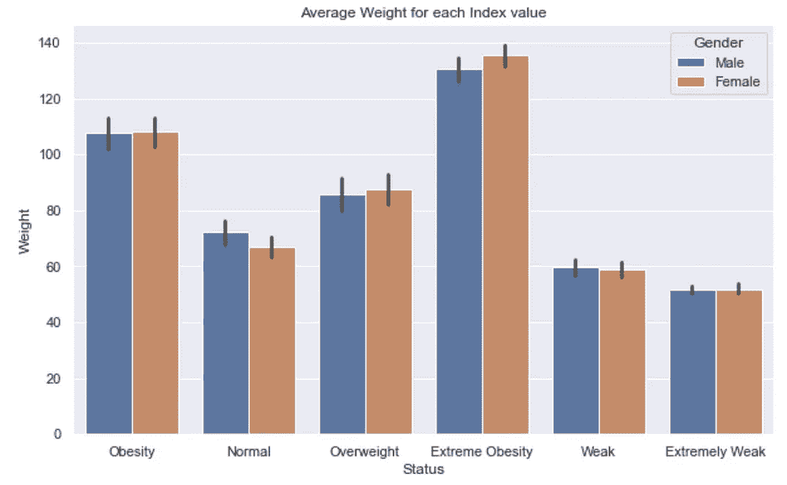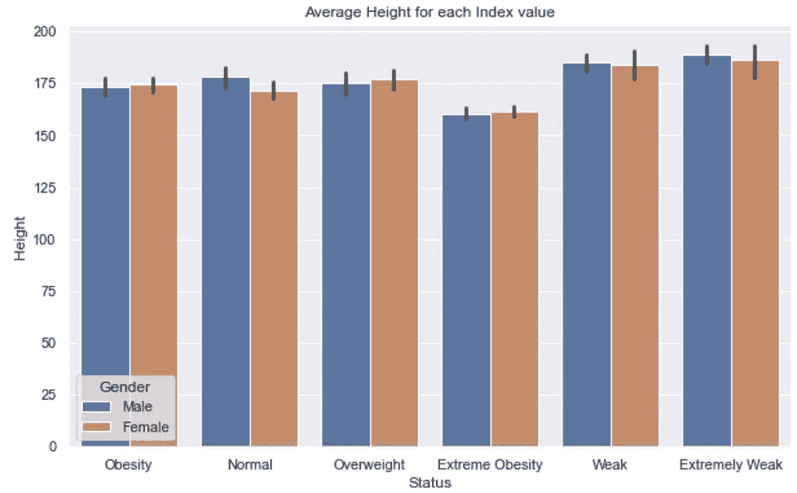

散点图显示数据中所有点的不同类别

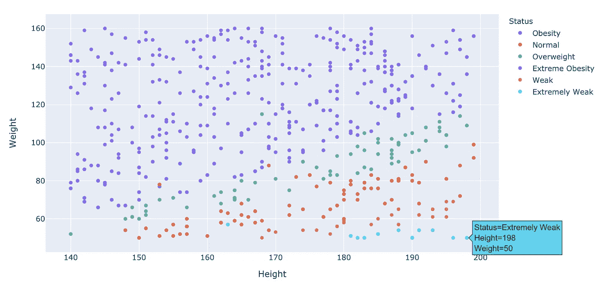

散点图，带有描述单个点的示例

区分男性和女性的三维散点图，其中:性别 _m_f=1 表示男性，性别 _m_f=0 表示女性

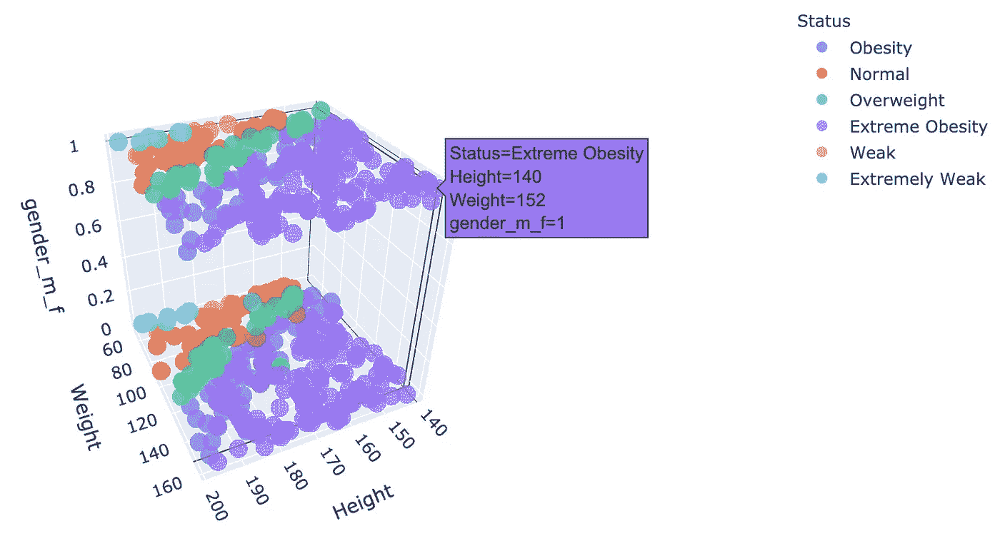

三维散点图，带有单点描述示例

# 机器学习

为了建立我们的预测模型，我们需要采取以下步骤:

**1**-分配我们的数据实例和目标值(X 和 y 列)

**2**-特征缩放并将数据分割成训练集和测试集

**3**-训练我们的模特

**4**-测试和评估模型

**1**-考虑到原始数据集，我们将**索引**列作为“目标”变量 **y** ，而剩余的列将是我们的 **X** 预测值。此外，给**性别**列分配任意数字，例如 1 代表女性，0 代表男性(类似于布尔值/真值)以区分它们。

**2**-在许多机器学习算法中，为了让所有特征都处于相同的地位，我们需要进行缩放，以便一个重要的数字不会仅仅因为它们的大小而影响模型。

第一步，我将数据分为训练集和测试集，然后，使用标准的定标器技术，假设数据在每个特征内呈正态分布，并对其进行定标，使分布以 0 为中心，标准偏差为 1

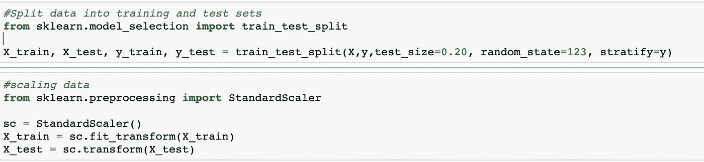

**3**——在训练模型之前，我们必须考虑到我们将要应用分类算法的类别是不平衡的。

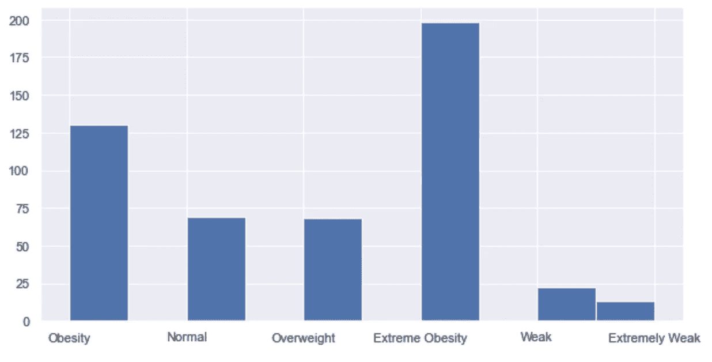

如何提高性能？
有各种各样的技术可以提高不平衡数据集的性能，我选择了 SMOTE(合成少数过采样技术)，这是一种过采样方法。它创造了少数民族的合成样本。它从少数类中随机选取一个点，并计算该点的 k-最近邻。合成点被添加到所选点及其相邻点之间。

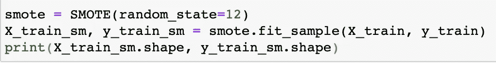

```
Original training set: X_train= (400, 3), y_train= (400,)Training set after SMOTE: X_train_sm= (954, 3),y_train_sm= (954,)
```

# **分类算法**

**培训模式**

在这项研究中，使用我们的训练集，我训练了 5 个监督机器学习分类算法，我们必须进行多类分类:

**1-** [**逻辑回归多项式**](https://en.wikipedia.org/wiki/Multinomial_logistic_regression) 是一种将逻辑回归推广到多类问题的分类方法，即具有两个以上可能的离散结果。也就是说，在给定一组独立变量的情况下，它是一种用于预测分类分布的因变量的不同可能结果的概率的模型。

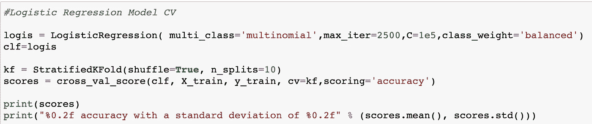

逻辑回归和交叉验证

**2-** [**随机森林**](https://en.wikipedia.org/wiki/Random_forest) **用于多类**在本研究中被选中，因为
与其他分类算法相比，它在医疗保健数据集中提供了最高的预测率。随机森林使用平均来提高预测精度和控制过度拟合，可以处理大量的要素，并且有助于估计哪些变量对正在建模的基础数据很重要。

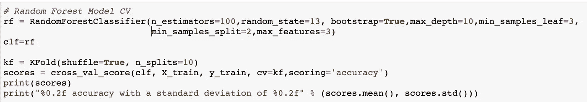

随机森林和交叉验证

**3-** [**梯度提升分类器**](https://en.wikipedia.org/wiki/Gradient_boosting) 是一组机器学习算法，将许多弱学习模型结合在一起，创建一个强预测模型，可以直接处理多类问题。决策树通常在做梯度提升时使用。

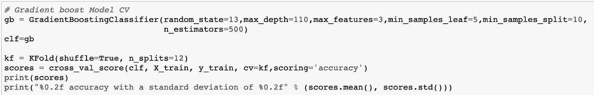

梯度提升和交叉验证

**4-** [**支持向量机**](https://en.wikipedia.org/wiki/Support-vector_machine) **用于多类分类:** SVM 是一种监督机器学习技术，广泛应用于模式识别和分类问题。在 Python 中，根据一对一方案处理多类支持，其中每个分类器将两个不同类的点分开，并且包括所有一对一分类器导致多类分类器。

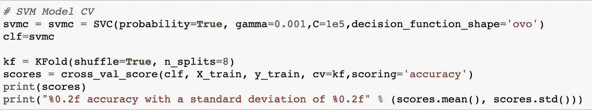

SVM 和交叉验证

**5-** [**带 Tensorflow 的神经网络**](https://www.tensorflow.org/) **:** 人工神经网络(ANNs)受生物系统中信息处理和分布式通信节点的启发，人工神经网络与生物大脑有各种不同。具体来说，神经网络倾向于静态和符号化，而大多数生命体的生物大脑是动态的(可塑的)和模拟的。

为了我们的研究，我们建立了一个具有两个隐藏层的多层感知器。我们这次的架构会在输入层有神经元= **X_Train_sm** ，在 2 个隐藏层有 **64 个神经元**，在输出层有 **6 个**。我们也将改变激活功能，以 ReLu，并将使用亚当优化。我们的模型将如下所示:

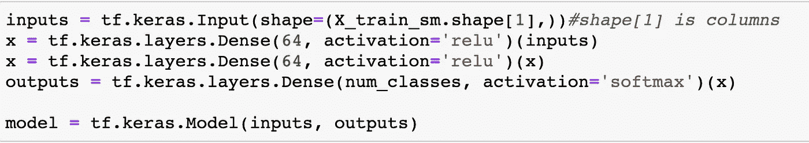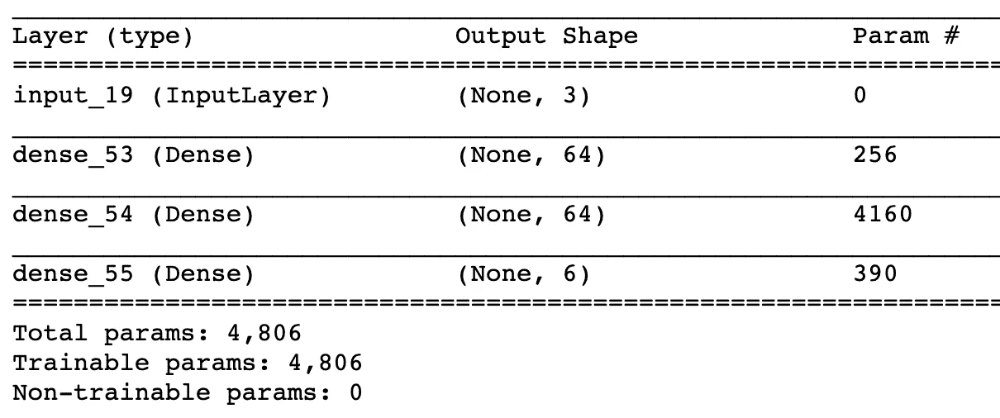

神经网络模型

在训练模型之前，我们需要配置学习过程，这是通过 compile 方法完成的。

Compile 方法接收三个参数:一个**优化器。**我们使用 **Adam** 这是一种优化算法，可以用来代替经典的随机梯度下降过程，根据训练数据迭代更新网络权重。一个 l **oss 功能**。这是模型试图最小化的目标。指标列表。对于任何分类问题，您都需要将其设置为 metrics =['**accuracy '**]。

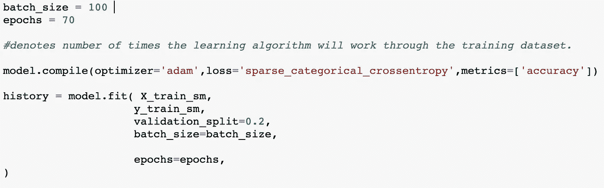

# **测试和评估模型**

我训练了每个模型，并使用网格搜索微调了它们的超参数，每个模型都有一系列必须设置的超参数，使用默认值是不可取的，它们通常不会给出好的结果。在我通过他们的**准确性评估和比较了他们的性能之后。**

混淆矩阵检测分类器预测中的 **TP** (真阳性) **TN** (真阴性) **FP** (假阳性) **FN** (假阴性)的计数。

从混淆矩阵中，我们可以推导出 A **精确度**,其由校正预测的总和除以预测总数给出，对角线是 TP 的计数，因此这些值越高，模型的预测能力越好。

**准确度= TP+TN/TP+FP+FN+TN**

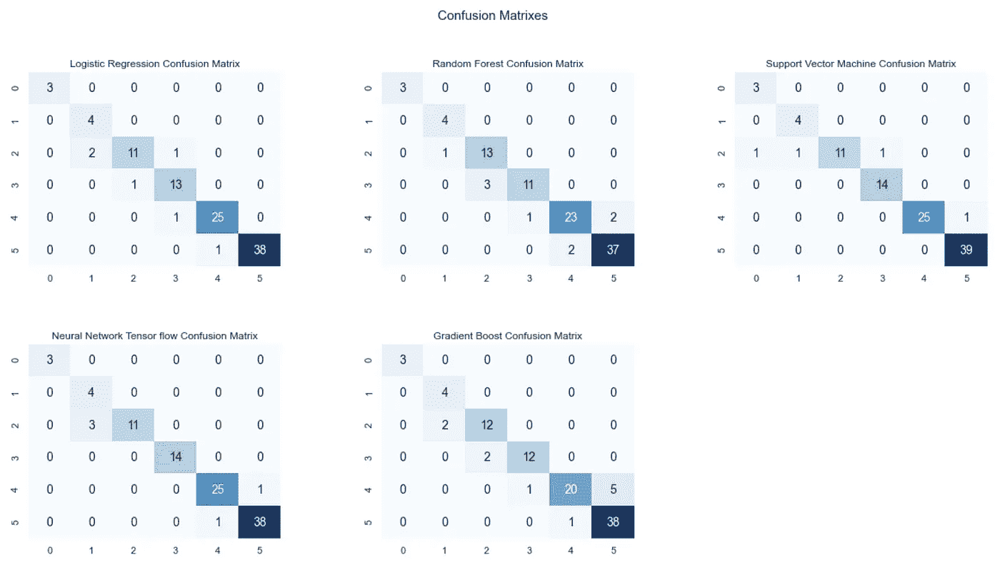

混淆矩阵

我们可以看到，我们从混淆矩阵中找到的 TP 或 FP 都在彼此接近的类别之间，即:在相距很远的极度肥胖和正常之间没有错误分类。

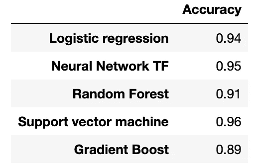

修正表

从混淆矩阵和准确性来看，最好的分类器是 SVM 和神经网络，但我认为如果我们有更多的数据，用神经网络我会有更好的结果。 ***通常 tensorflow 神经网络只在有大量数据时使用，但在这种情况下，我只想使用它，*并且我只强调**、**、用于教育目的、**，因为对于多类问题，强烈建议使用它。

**第二步:**作为这项研究的延续，在下一篇文章中，我将尝试在数据集上添加新的特征，比如瘦质量和脂肪质量，这肯定会使我在精度上有所损失，但在计算成本上有所收获。

# **现在我想用自己的数据来测试模型:**

性别=0 是男性
身高=181
体重=72

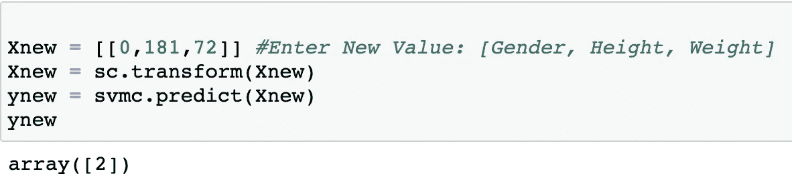

模型测试

**指数 2 代表正常:哇！这很有效，我的 BMI 指数很好，❤**

# **结论**

当然，未来的研究应该在更大的数据收集上进行，包含更多的特征，如血液数据，瘦质量指数和脂肪质量指数或人们一天中走的步数，以防止超重相关的疾病。

我希望你觉得这篇阅读有用并且可以理解，建议被接受。

## **参考书目和灵感来源**

[](https://www.nhs.uk/common-health-questions/lifestyle/what-is-the-body-mass-index-bmi/) [## 什么是身体质量指数(身体质量指数)？

### 身体质量指数(身体质量指数)是一种用你的身高和体重来衡量你的体重是否健康的方法。身体质量指数…

www.nhs .英国](https://www.nhs.uk/common-health-questions/lifestyle/what-is-the-body-mass-index-bmi/) [](https://www.kaggle.com/yersever/500-person-gender-height-weight-bodymassindex) [## 500 人性别-身高-体重-体重指数

### 随机生成身高和体重，计算体重指数

www.kaggle.com](https://www.kaggle.com/yersever/500-person-gender-height-weight-bodymassindex) [](https://towardsdatascience.com/all-about-feature-scaling-bcc0ad75cb35) [## 关于特征缩放的所有内容

### 扩展数据以提高机器学习模型的性能

towardsdatascience.com](https://towardsdatascience.com/all-about-feature-scaling-bcc0ad75cb35) [](https://towardsdatascience.com/how-to-handle-smote-data-in-imbalanced-classification-problems-cf4b86e8c6a1) [## 不平衡分类问题中 SMOTE 数据的处理

### 知道陷阱在哪里以及如何避免它们

towardsdatascience.com](https://towardsdatascience.com/how-to-handle-smote-data-in-imbalanced-classification-problems-cf4b86e8c6a1) [](https://towardsdatascience.com/machine-learning-multiclass-classification-with-imbalanced-data-set-29f6a177c1a) [## 机器学习——不平衡数据集下的多类分类

### 具有不平衡数据集的多个类的分类问题提出了不同于二元分类的挑战…

towardsdatascience.com](https://towardsdatascience.com/machine-learning-multiclass-classification-with-imbalanced-data-set-29f6a177c1a) [](https://antoniocastiglione-9550.medium.com/machine-learning-algorithms-for-coronary-heart-disease-prediction-ec25f4d7ee42) [## 用于冠心病预测的机器学习算法

### 简介:

antoniocastiglione-9550.medium.com](https://antoniocastiglione-9550.medium.com/machine-learning-algorithms-for-coronary-heart-disease-prediction-ec25f4d7ee42) [](https://antoniocastiglione-9550.medium.com/5-books-to-start-being-a-good-data-scientist-64fec6c3bf73) [## 成为优秀数据科学家的 5 本书

### 本世纪最性感的职业

antoniocastiglione-9550.medium.com](https://antoniocastiglione-9550.medium.com/5-books-to-start-being-a-good-data-scientist-64fec6c3bf73)