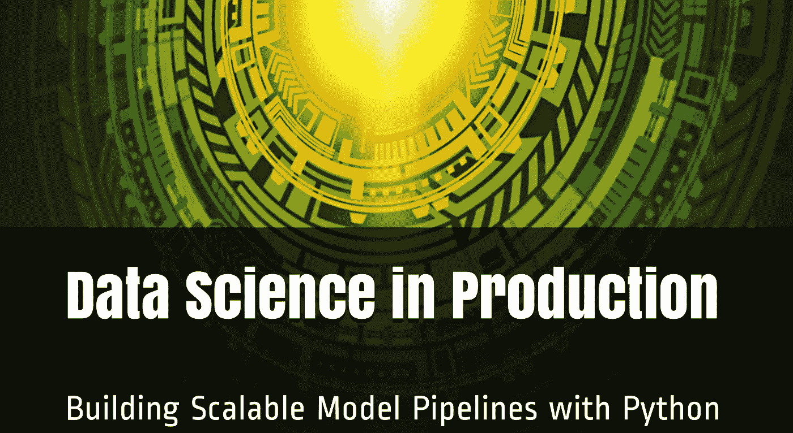

# 新书发布会:“生产中的数据科学”

> 原文：<https://levelup.gitconnected.com/book-launch-data-science-in-production-54b325c03818>

我最近自己出版了一本关于用 Python 构建数据科学工作流的书。这本书的目标是为读者提供云计算环境和大规模机器学习管道的实践经验。我将用[五个 w 和](https://en.wikipedia.org/wiki/Five_Ws) 的方法来描述这个项目。

## 谁

> 这本书的目标读者是谁？

本书面向希望构建可扩展到云中大规模部署的体验学习工具的数据科学学生和从业者。它是一本数据科学 201 书籍，建立在许多关于 Python 生态系统的伟大文本之上，包括关于[熊猫](https://www.amazon.com/Python-Data-Analysis-Wrangling-IPython/dp/1449319793)、 [scikit-learn](https://www.amazon.com/Hands-Machine-Learning-Scikit-Learn-TensorFlow/dp/1492032646) 和 [Keras](https://www.amazon.com/Deep-Learning-Python-Francois-Chollet/dp/1617294438) 的著作。它侧重于将简单模型扩展到分布式、容错和流式部署的应用示例。考虑到所涵盖的主题的广度，它提供了构建管道的不同方法的体验，而不是深入讨论特定的工具。

## 当...的时候

> 这本书什么时候能买到？

现已上市！该书的数字版于 2019 年 12 月 31 日发布到 Leanpub，平装版于 2019 年 1 月 1 日发布到亚马逊。

## 在哪里

> 在哪里可以找到这本书和辅助材料？

这本书有电子版和平装版。如果你对其他格式感兴趣，请联系我。

*   [数字(PDF)](https://leanpub.com/ProductionDataScience) : Leanpub
*   [彩色平装](https://www.amazon.com/dp/165206463X):亚马逊
*   [代码示例](https://github.com/bgweber/DS_Production) : GitHub
*   [样本(PDF)](https://github.com/bgweber/DS_Production/raw/master/book_sample.pdf) : GitHub

GitHub 存储库包含 Jupyter 笔记本和 Python 脚本，用于书中涉及的示例。

## 为什么

> 我为什么要写一本关于 Python 的技术书？

在过去的十年里，我在多家公司工作，面试了 100 多名数据科学候选人。我在数据科学产品组合中看到的一个缺口是使用云平台(如 AWS 和 GCP)的应用经验。虽然公司经常限制数据科学和分析团队访问这些平台，但这些工具的知识正成为专注于构建大规模数据产品的角色的先决条件。在 [ODSC 西部 2019](https://towardsdatascience.com/building-an-applied-science-portfolio-9f25da61fb45) 上，我谈到了为应用科学家角色建立一个组合，其中你需要展示大规模数据集、云计算环境和端到端管道的经验。这本书为我提供了一个机会，让我可以展示我一直提倡有抱负的数据科学家学习的许多工具的专业知识。我还想写一本书，作为建立我的应用科学作品集的一种方式。

## 什么

> 这本书的内容是什么？

以下是本书涵盖的主题，并附有相关章节摘录:

1.  [**简介**](https://towardsdatascience.com/data-science-in-production-13764b11d68e) :本章将激励 Python 的使用并讨论应用数据科学的学科，呈现全书中使用的数据集、模型和云环境，并提供自动化特征工程的概述。
2.  [**模型作为 web 端点**](https://towardsdatascience.com/models-as-web-endpoints-162cb928a9e6) :本章展示了如何使用 Web 端点来消费数据，并使用 Flask 和 Gunicorn 库将机器学习模型作为端点。我们将从 scikit-learn 模型开始，并使用 Keras 设置深度学习端点。
3.  [**模型作为无服务器函数**](https://towardsdatascience.com/models-as-serverless-functions-7930a70193d4) :本章将建立在前一章的基础上，展示如何使用 AWS Lambda 和 GCP 云函数将模型端点设置为无服务器函数。
4.  [**可重现模型的容器**](https://towardsdatascience.com/using-docker-kubernetes-to-host-machine-learning-models-780a501fda49) :这一章将展示如何使用容器通过 Docker 部署模型。我们还将探索使用 ECS 和 Kubernetes 进行扩展，以及使用 Plotly Dash 构建 web 应用程序。
5.  [**模型管道的工作流工具**](https://towardsdatascience.com/pyspark-for-data-science-workflows-843350e4c90e) :本章重点介绍使用 Apache Airflow 调度自动化工作流。我们将建立一个模型，从 BigQuery 中提取数据，应用模型，并保存结果。
6.  [**批量建模的 PySpark**](https://towardsdatascience.com/pyspark-for-data-science-workflows-843350e4c90e):本章将向读者介绍使用 Databricks 社区版的 PySpark。我们将构建一个批处理模型管道，从数据湖中提取数据，生成要素，应用模型，并将结果存储到非 SQL 数据库中。
7.  [**用于批量建模的云数据流**](/scaling-scikit-learn-with-apache-beam-251eb6fcf75b) :本章将介绍云数据流的核心组件，并实现一个批量模型管道，用于从 BigQuery 读取数据，应用 ML 模型，并将结果保存到云数据存储中。
8.  [**流模型工作流程**](https://towardsdatascience.com/streaming-scikit-learn-with-pyspark-c4806116a453) :本章将向读者介绍 Kafka 和 PubSub 在云环境下的流消息。阅读完这些材料后，读者将了解如何使用这些消息代理来创建具有 PySpark 和数据流的流模型管道，从而提供近乎实时的预测。

## 怎么

> 我是如何创作并出版这本书的？

对于这本书，我使用了 Leanpub 平台来分享我撰写的草稿。我希望使用这种开放式的写作方法可以帮助读者在文本开发过程中提供反馈，但总的来说这并没有提供太多的方向。当你发布早期版本时，这个平台有助于确定你的读者规模，但我没有达到图书论坛提供有用的编辑反馈的规模。

我使用 [bookdown](https://leanpub.com/) 包将 markdown 中创作的内容翻译成格式良好的输出。像 bookdown 这样的软件包使得自助出版书籍变得更加实际，因为许多排版工作是由工具处理的，而不需要手工操作。当使用 bookdown 编写全文时，您可能偶尔需要利用原始的 Latex 命令，例如指定边距细节，但是这个库提供的功能非常值得学习如何处理边缘情况。

从创作的角度来看，在编写任何文本之前，我首先清空了一个详细的目录。我确定了我想要涵盖的概念和工具，然后以线性方式写了这本书。我的一般方法是一次写一章，从写我想覆盖的代码段开始，然后创作章节内容。

感谢您阅读到最后，我希望您发现本文的内容对构建数据科学投资组合有用！

本·韦伯是 Zynga 的一名杰出的数据科学家。我们正在[招聘](https://www.zynga.com/job-listing-category/data-analytics-user-research/)！