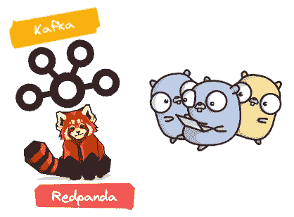

# 使用 Redpanda 和 Go 增强您的 Kafka 集成测试🚀

> 原文：<https://levelup.gitconnected.com/boosting-your-kafka-integration-tests-using-redpanda-with-go-247e4276c61d>

## 以 testcontainers 和 dockertest 为例

> 集成测试是编排测试。他们不测试业务规则。更确切地说，它们测试的是组件组合在一起的效果。它们是管道测试，确保组件正确连接，并且可以清晰地相互通信。[【1】](https://www.amazon.com/Clean-Coder-Conduct-Professional-Programmers/dp/0137081073)

大家好！在这篇文章中，我想谈谈 [**、Redpanda**](https://redpanda.com/) ，以及我们将如何在我们的集成测试中以两个流行的库为例来实现它； [**testcontainers**](https://github.com/testcontainers/testcontainers-go) 和 [**dockertest**](https://github.com/ory/dockertest) 。

> **TL；DR**:[https://github . com/abdulsamiteleri/integration-tests-with-red panda](https://github.com/Abdulsametileri/integration-tests-with-redpanda)

图:地鼠想学习如何实现 Redpanda

## 什么是 Redpanda🤔

**Redpanda** 是一个 Kafka 兼容的流数据平台，速度快 10 倍，硬件效率高 6 倍。它也是无 JVM、无 ZooKeeper、 [Jepsen 测试](https://redpanda.com/blog/redpanda-official-jepsen-report-and-analysis/)，并且源代码可用。[【2】](https://redpanda.com/)

## 我为什么要用 Redpanda🤔

有了 Redpanda 的这些优秀属性，我们可以轻松地在测试中使用它，而无需运行 Kafka 和 Zookeeper 容器。(更好的启动时间和无故障)。此外，由于它的兼容性，不需要更改 Kafka 所在的任何生产代码。

正如我们已经知道的，编写和维护集成测试是困难的。我们希望尽快得到这些测试的结果。在用 Redpanda 替换了我们的集成测试之后，我们的测试比旧的 Kafka 测试工作得非常快。所以我想和你分享🔥

在进入实现细节之前，我想通知你；我将用一个漂亮的测试库[作证](https://github.com/stretchr/testify)*(suite 和 assert 包)*。所以如果你没有任何经验，我强烈建议你去看看。

注意:我将为每个`*(TestContainerWrapper, DockerTestWrapper)*`创建一个包装器结构，并主要编写我们需要的三个方法:`RunContainer`、`CleanUp`、`GetBrokerAddresses`。

注 2:我想测试两个功能，以确保我的应用程序可以成功地生成 Kafka 消息和使用 Kafka 消息。

我们开始吧！

## 👉用 testcontainers 实现

首先，在我们的集成测试开始工作之前，我们必须确保我们的设置过程已经完成并准备好继续。

我们的测试套件如下所示。我们创建了`TestContainerWrapper`结构，并将其用于套件生命周期方法。

首先，我们可以专注于`RunContainer`实现。

在提供了 Redpanda 映像和版本之后，我们公开了 **9092** 端口。**小心；这个公开的端口号是从容器的角度来看的！**从主机的角度来看*，* Testcontainers 在一个随机的空闲端口上公开它。这是为了避免本地运行的软件或并行测试运行之间可能出现的端口冲突。[【3】](https://www.testcontainers.org/features/networking/)。因此，我们需要获得映射端口 **9092** 来从我们的主机连接代理。

我们使用默认的`redpanda start`命令。有几个不同的参数:这要看你测试的是什么等等。Redpanda 容器以*开头——dev-container*。在此模式下，[默认情况下会传递几个其他参数。](https://github.com/redpanda-data/redpanda/blob/36902e558294680e6d89e501a80e4e09811bc815/src/go/rpk/pkg/cli/cmd/redpanda/start.go#L1062)

我将 true 传递给了`AutoRemove`标志，因此容器将在停止时从主机中移除。

最后，我曾经给我的错误 [*(%w)*](https://go.dev/blog/go1.13-errors) 添加了额外的上下文，以了解哪个流引发了错误。

上面没有具体的逻辑。在我们的集成测试完成之后，我们应该终止我们的容器。我总是尝试使用`context.WithTimeout`来完成这类任务。`Terminate`方法应使其在最多 5 秒内返回。

## 👉用 Dockertest 实现

因为套件生命周期与 testcontainer 部分相同，所以我跳过了这一部分。

乍一看，您意识到我们实现了我们的自由端口实现，并将其与我们的容器集成在一起。因为没有暴露的随机主机端口作为 testcontainer，所以我们应该自己做。

`ExposedPorts`为容器的透视图。

`PortBinding`用于提供容器和主机端口的映射绑定。

我们还需要显式地设置`[advertise-kafka-addr](https://www.confluent.io/blog/kafka-listeners-explained/)`来提供从我们的主机到容器的连接。为什么我们不在 testcontainer 部分设置它🤔。这是因为容器 9092 端口在内部暴露给了空闲的随机主机端口。但是在这里，如果我们不提供这个，我们必须作为主机的 9092 端口连接。所以我们不想使用静态主机端口进行并行运行。

我们还提供了一个`retryFunc`来了解我们的容器是否准备好了。RetryFunc 尝试连接 Kafka brokers，如果连接成功建立，我们可以继续前进，或者尝试用可调退避时间重新连接。

在`cleanUp`端，我们清除我们的容器，从 docker 中删除容器和链接的卷。

## 我们的测试🚀

我总是试着把我的测试和给定时间分开。它的意思是，在某种情况下，当某种行为被执行时，就会发生一系列的后果。

我还尝试用下划线来命名我的测试。这样，通过搜索 go test 输出，很容易找到失败的函数。

**源代码:**[https://github . com/abdulsamiteleri/integration-tests-with-red panda](https://github.com/Abdulsametileri/integration-tests-with-redpanda)

感谢您的阅读💛；你也可以看看我的其他文章。

*   [卡夫卡例外 Cronsumer](https://medium.com/trendyol-tech/kafka-exception-c-r-onsumer-37c459e4849d)
*   [让我们使用 Go](https://itnext.io/lets-implement-a-real-time-package-tracking-app-with-rabbitmq-and-web-socket-using-go-80f5a5ca5c55) 通过 RabbitMQ 和 Web socket 实现一个实时包裹跟踪应用程序
*   [让我们使用 Go 实现基本的服务发现](https://itnext.io/lets-implement-basic-service-discovery-using-go-d91c513883f6)
*   [我如何使用 pure Go 构建一个版本控制系统(VCS)](/how-was-i-build-a-version-control-system-vcs-using-pure-go-83ec8ec5d4f4)
*   [将 Grafana 通知与 GitLab 管道集成，使用 Go 重新启动 Debezium 任务](https://medium.com/modanisa-engineering/integrating-grafana-notifications-with-gitlab-pipeline-to-restart-debezium-tasks-using-go-1378c9eaf7b8)
*   [键盘锁简介](https://medium.com/codex/introduction-to-keycloak-227c3902754a)

## 参考

[1]《干净的程序员:职业程序员的行为准则》

[2]https://redpanda.com

[3][https://www.testcontainers.org/features/networking/](https://www.testcontainers.org/features/networking/)

[https://www.confluent.io/blog/kafka-listeners-explained/](https://www.confluent.io/blog/kafka-listeners-explained/)