# Bootstrap 5.0 表单字段备忘单

> 原文：<https://levelup.gitconnected.com/bootstrap-5-0-form-field-cheat-sheet-8c7832692f6b>

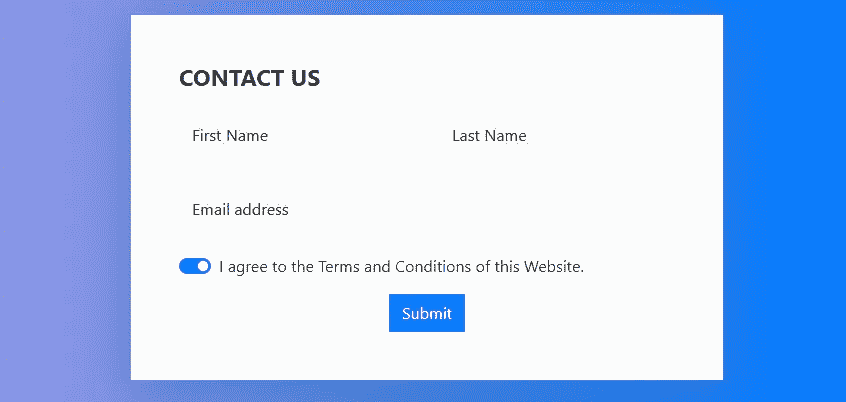

Bootstrap 表单样式具有定制的显示，可跨设备和浏览器提供一致的字段呈现。

最近 Bootstrap 推出了 5.0。此更新包括额外的表单字段，如颜色选择器和数据列表输入。

# **在 HTML 文件中设置 Bootstrap 5.0**

*如何使用 Bootstrap 5.0 CDN*

```
<!doctype html>
<html lang="en">
  <head>
    <!-- Required meta tags -->
    <meta charset="utf-8">
    <meta name="viewport" content="width=device-width, initial-scale=1"> <!-- Bootstrap CSS -->
    <link href="https://cdn.jsdelivr.net/npm/bootstrap@5.0.0-beta1/dist/css/bootstrap.min.css" rel="stylesheet" integrity="sha384-giJF6kkoqNQ00vy+HMDP7azOuL0xtbfIcaT9wjKHr8RbDVddVHyTfAAsrekwKmP1" crossorigin="anonymous"> <title>Bootstrap 5.0 Forms Cheatsheet</title>
  </head>
  <body> <!-- Option 1: Bootstrap Bundle with Popper -->
    <script src="https://cdn.jsdelivr.net/npm/bootstrap@5.0.0-beta1/dist/js/bootstrap.bundle.min.js" integrity="sha384-ygbV9kiqUc6oa4msXn9868pTtWMgiQaeYH7/t7LECLbyPA2x65Kgf80OJFdroafW" crossorigin="anonymous"></script> </body>
</html>
```

你可以选择使用 CDN 或者通过[下载](https://getbootstrap.com/docs/5.0/getting-started/download/)框架来设置 Bootstrap 5.0。

Bootstrap 5.0 快速入门指南列出了免费的开源 CSS 和 JS CDNs。

将 CSS CDN 添加到`<head>`元素，并在`</body>`元素结束之前添加 JS bundle 脚本。

# **如何创建 HTML 表单**

**表格元素**

*如何使用<表单>元素*

```
<!doctype html>
<html lang="en">
<head>
  <!-- Required meta tags -->
  ... <!-- Bootstrap CSS -->
  ... <title>Bootstrap 5.0 Form Field Cheatsheet</title>
</head>
<body> <form> </form> <!-- Option 1: Bootstrap Bundle with Popper -->
  ... </body>
</html>
```

要创建一个 HTML 表单，使用嵌套在`<body>`元素中的`<form>`元素。

# **如何在 HTML 表单中添加输入内容**

**输入元素**

*如何将* `*<input>*` *元素添加到* `*<form>*` *元素*

```
<form>
   <input>
</form>
```

接下来，在表单中嵌套一个`<input>`元素。

input 元素是一个空的单行表单字段。

*如何给输入元素添加占位符*

```
<form>
  <input placeholder="Text Input">
</form>
```

要添加占位符文本，请添加`placeholder`属性值。

**类型属性**

分配给 HTML `<input>`元素的 type 属性定义了表单字段。常见值包括文本、电子邮件、密码和复选框。

类型属性并不特定于引导表单字段。

*正文*

```
<input type="text">
```

属性`type`创建一个单行文本字段。如果没有提供类型，它也是默认属性。

*电子邮件*

```
<input type="email">
```

类型属性值`email`用于电子邮件地址。它不允许提交任何带有@的输入。

*复选框*

```
<input type="checkbox">
```

最后一个类型值是`checkbox`。该值创建一个小的、可检查的方形框。

*提交*

```
<input type="submit">
```

要将提交按钮添加到表单中，请使用 type 属性值`submit`。

有关所有 22 个有效 HTML 属性类型值的更多信息，请访问[w3schools.com](https://www.w3schools.com/tags/att_input_type.asp)。

**Textarea 元素**

*如何将< textarea >元素添加到< form >元素*

```
<form>
   <textarea rows="4" cols="50"><textarea>
</form>
```

或者选择在`<form>`元素中嵌套一个`<textarea>`元素。

textarea 元素是一个多行表单字段。

rows 和 cols 属性是可选的。

**选择元素**

*如何将<选择>元素添加到<表单>元素*

```
<form>
   <select>
     <option value="A">A</option>
     <option value="B">B</option>
     <option value="C">C</option>
     <option value="D">D</option>
   </select>
</form>
```

一个`<select>`元素也是一个`<form>`元素的有效字段。

select 元素从嵌套在`<select>`元素中的选项标签创建一个下拉列表。

**标签元素**

```
<form>
  <label for="textInput">Name</label>
  <input type="text" id="textInput">
</form>
```

`<label>`元素定义了 input 和 textarea 元素的标签。

该元素用于帮助屏幕阅读器在元素被聚焦时大声读出标签。

它还通过使标签成为切换输入的一部分来增加复选框的点击区域。

然而，只有当`for`属性值与输入的`id`值相同时，这个特性才起作用。

# **引导表单字段**

**表单-控件类属性值**

```
<form>
  <input type="..." class="form-control">
</form>
```

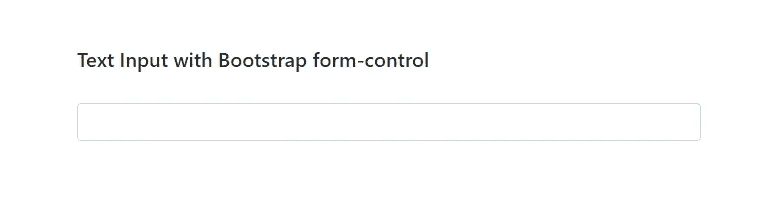

Bootstrap 类属性值`form-control`定制`<input>`和`<textarea>`元素的样式、大小和焦点状态。

**表单-标签类属性值**

```
<form>
  <label for="textInput" class="form-label">Name</label>
  <input type="text" id="textInput" class="form-control">
</form>
```

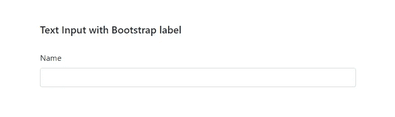

Bootstrap 的 class 属性值`form-label`用`margin-bottom: .5 rem`的 CSS 声明来样式化表单标签。

**表格文本下方输入**

```
<form>
  <label for="inputPassword5" class="form-label">Password</label>
  <input type="password" id="inputPassword5" class="form-control" aria-describedby="passwordHelpBlock">
  <div id="passwordHelpBlock" class="form-text">
    Your password must be 8-20 characters long, contain letters and numbers, and must not contain spaces, special characters, or emoji.
  </div>
</form>
```

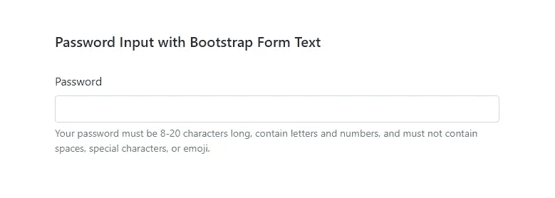

类 form-text 放在一个`<div>`、`<span>`、`<smaller>`或任何其他 HTML 元素中。

一定要添加属性类`aria-describedby`以确保当用户进入控件时辅助技术会宣布文本。

**引导文本字段**

```
<form>
  <label for="textInput" class="form-label">Name</label>
  <input type="text" class="form-control" id="textInput">
</form>
```

要创建一个引导文本字段，添加一个`input`元素，将`type`属性值设置为`text`，将 class 属性值设置为`form-control`。

**自举文本区**

```
<form>
  <label for="exampleFormControlTextarea1" class="form-label">Example textarea</label>
  <textarea class="form-control" id="exampleFormControlTextarea1" rows="4"></textarea>
</form>
```

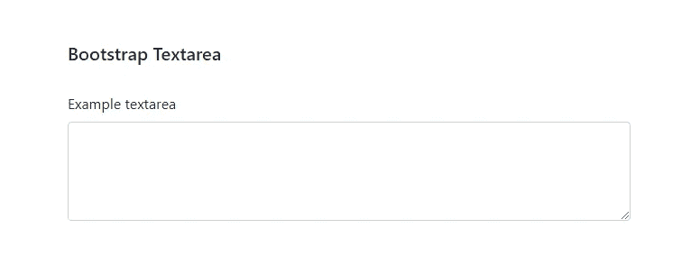

Bootstrap textarea 的工作方式与输入类似，但是`rows`属性是 field 元素的可选值。

**自举文件上传输入**

*单个文件上传输入*

```
<form>
  <label for="formFile" class="form-label">File input example</label>
  <input class="form-control" type="file" id="formFile">
</form>
```

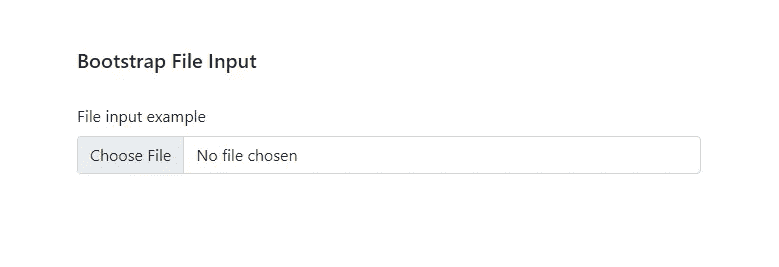

默认引导文件上传输入的格式类似于任何其他表单输入，但必须将`type`指定为`file`。

*多个文件输入*

```
<form>
  <label for="formFileMultiple" class="form-label">Multiple files input example</label>
  <input class="form-control" type="file" id="formFileMultiple" multiple>
</form>
```

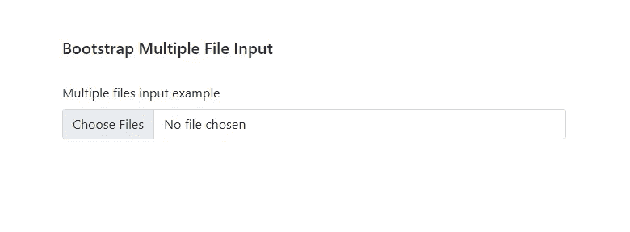

要支持多个文件上传，请将属性`multiple`添加到输入元素中。

**引导选择字段**

```
<form>
  <select class="form-select">
    <option value="1">One</option>
    <option value="2" selected>Two</option>
    <option value="3">Three</option>
  </select>
</form>
```

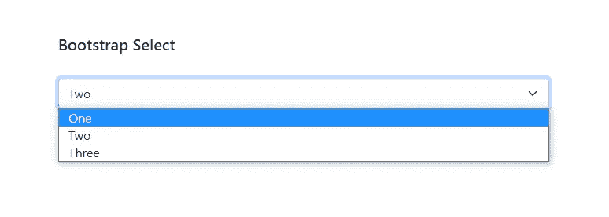

Bootstrap 表单选择需要自己的自定义类属性值 `form-select`。在`<select>`元素内，嵌套`<option>`元素。

要将已选择的选项作为默认选项，请将属性值`selected`添加到开始选项元素标签中。

**自举检查、无线电、开关**

*复选框*

```
<form>
  <div class="form-check">
    <input class="form-check-input" type="checkbox" value="" id="flexCheckDefault" checked>
    <label class="form-check-label" for="flexCheckDefault">
      Checkbox
    </label>
  </div>
</form>
```

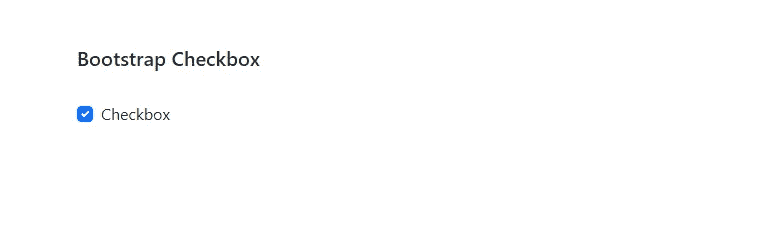

要创建一个 Bootstrap 复选框，创建一个带有`form-check` class 属性值的 division 元素。

用`form-check-input`的`type`属性值`checkbox`和`class`属性值嵌套一个输入元素。

然后添加一个`<label>`，其中`class`属性值`form-check-label`仍然嵌套在表单检查部分中。

以这种方式格式化后，复选框和标签将内嵌显示，并且复选框已被预先选中。

*收音机*

```
<form>
  <div class="form-check">
    <input class="form-check-input" type="radio" name="flexRadioDefault" id="flexRadioDefault1">
    <label class="form-check-label" for="flexRadioDefault1">
    Radio
    </label>
  </div>
</form>
```


自举无线电需要输入`type`属性作为`radio`。其他一切都保持不变。

*开关*

```
<form>
  <div class="form-check form-switch">
    <input class="form-check-input" type="checkbox" id="flexSwitchCheckDefault">
    <label class="form-check-label" for="flexSwitchCheckDefault">Switch checkbox input</label>
  </div>
</form>
```

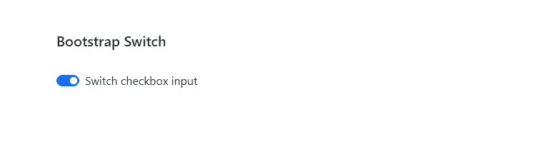

引导开关类似于复选框，唯一的区别是除了添加到 division 元素的`form-check`之外，还有`form-switch`类属性值。

输入类型属性值将保持`checkbox`。

**自举范围**

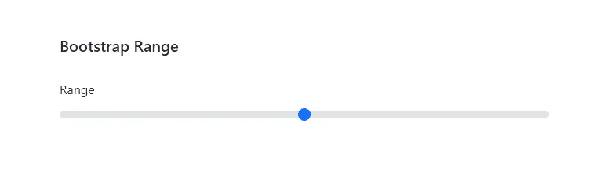

*自举最小值和最大值*

```
<form>
  <label for="customRange" class="form-label">Min/max range</label>
  <input type="range" class="form-range" min="0" max="10" id="customRange">
</form>
```

引导范围使用类型属性值`range`和类属性值`form-range`。最大值和最小值是可选属性。

*自举步骤*

```
<form>
  <label for="customRange" class="form-label">Step range</label>
  <input type="range" class="form-range" min="0" max="10" step="2" id="customRange">
</form>
```

`step`属性值是引导范围滑块的另一个可选属性。

# **新的 Bootstrap 5.0 表单字段**

**自举 5 按钮**

*单一切换按钮*

```
<form>
   <input type="checkbox" class="btn-check" id="btn-check" autocomplete="off">
   <label class="btn btn-primary" for="btn-check">Button toggle</label>
</form>
```

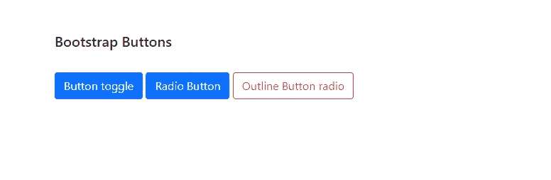

Bootstrap 5.0 创建了一组切换按钮，提供了与复选框输入相同的功能。

*单选按钮*

```
<form>
   <input type="radio" class="btn-check" id="btn-check" autocomplete="off">
   <label class="btn btn-primary" for="btn-check">Radio Button</label>
</form>
```

Bootstrap 还提供了具有 class 属性值 `radio`的按钮，以及创建 outline 按钮的选项。

*单选按钮*

```
<form>
   <input type="radio" class="btn-radio" name="options-outlined" id="danger-outlined" autocomplete="off">
   <label class="btn btn-outline-danger" for="danger-outlined">Outline Button radio</label>
</form>
```

您还可以选择创建一个 outline 按钮，可以是单选或复选框类属性值。

有关引导按钮的更多信息，请访问[前三大 CSS 框架](https://www.ordinarycoders.com/blog/article/top-3-css-frameworks)。

**Bootstrap 5 浮动标签**

```
<form>
  <div class="form-floating mb-3">
    <input type="text" class="form-control" id="floatingTextInput" placeholder="John Smith">
    <label for="floatingTextInput">Name</label>
  </div>
  <div class="form-floating mb-3">
    <input type="email" class="form-control" id="floatingEmailInput" placeholder="name@example.com">
    <label for="floatingEmailInput">Email address</label>
  </div>
</form>
```

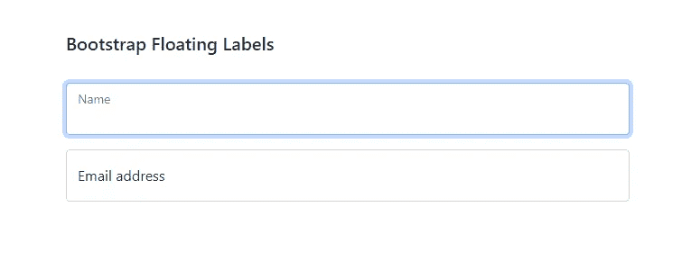

`form-floating`是一个新的类属性值，用于在输入字段上浮动标签。这个新的类属性值要求每个输入元素都有一个`placeholder`，并且在`input`元素之后有一个 `label`元素，这样它才能正常工作。

**Bootstrap 5 颜色拾取器**

```
<form>
  <label for="exampleColorInput" class="form-label">Color picker</label>
  <input type="color" class="form-control form-control-color" id="exampleColorInput" value="#007bff" title="Choose your color">
</form>
```

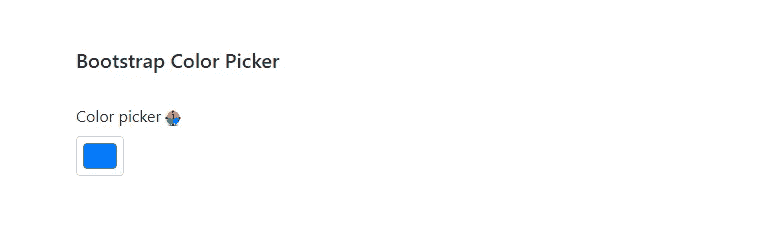

从 Bootstrap 5.0 开始，HTML 输入类型属性 `color`被赋予了一个自定义的类属性值`form-control-color`。

**引导 5 数据表**

```
<form>
  <input class="form-control" list="datalistOptions" id="exampleDataList" placeholder="Type to search a status...">
  <datalist id="datalistOptions">
     <option value="New">
     <option value="Old">
     <option value="Pending">
     <option value="Deleted">
   </datalist>
</form>
```

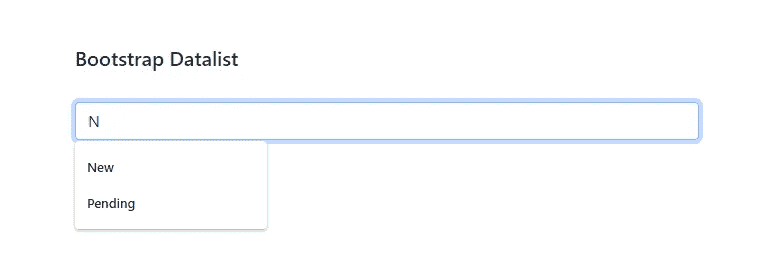

除了颜色选择器，Bootstrap 5 还提供了一个样式化的`datalist`元素，保持了其他输入的`form-control`样式。

要创建一个 datalist，为搜索栏添加一个带有 `list`属性值的`<input>`元素。这个值应该是附加到紧接其后添加的`datalist`元素的`id`。

最后，将`options`嵌套在 datalist 元素中。

# **布尔属性**

*只读*

```
<input class="form-control" type="text" placeholder="Readonly input here..." aria-label="readonly input example" readonly>
```

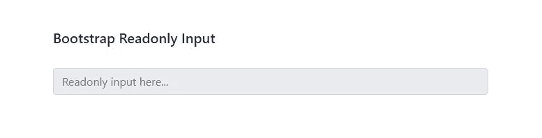

要添加只读输入，将`readonly`布尔属性添加到输入元素，以防止修改输入值。输入将保留光标和焦点特征。

*只读纯文本*

```
<input class="form-control-plaintext" type="text" placeholder="Readonly plain text..." aria-label="readonly plain text example" readonly>
```

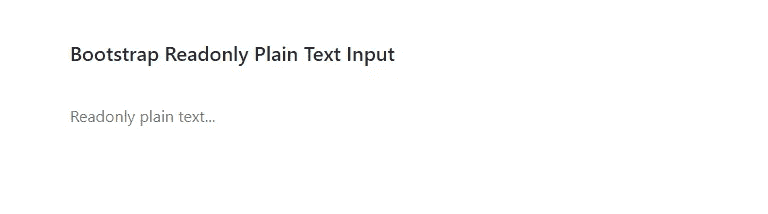

要以纯文本的形式显示只读输入，添加 class 属性值`form-control-plaintext`。

*禁用*

```
<input class="form-control" id="disabledInput" type="text" placeholder="Disabled input here..." disabled>
```

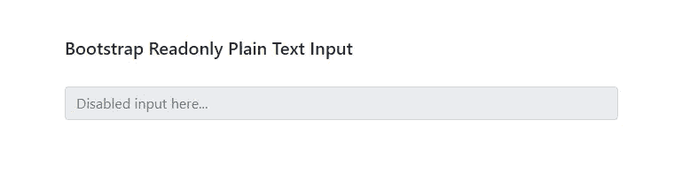

如果您希望禁用表单输入来防止用户交互，那么可以将`disabled`属性添加到 input 元素中。

# **呈现 Django 引导表单**

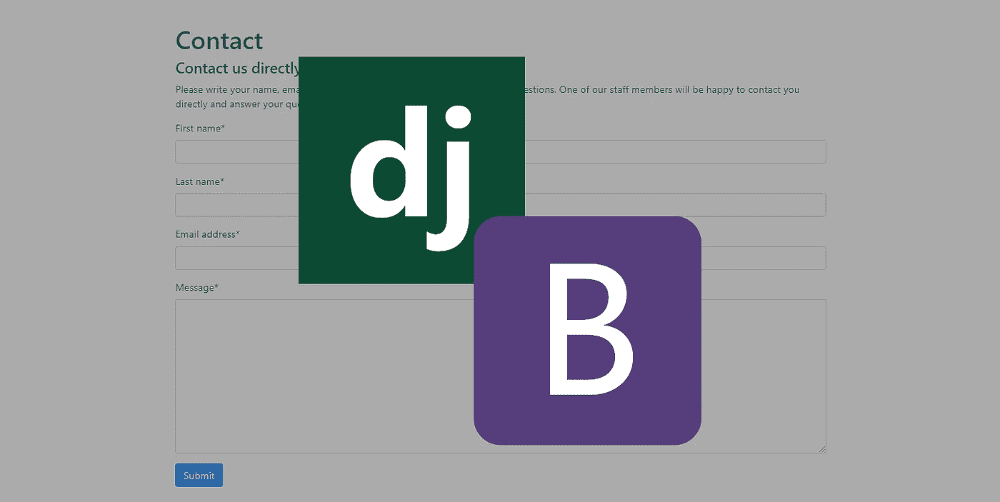

如果您正在使用 Django，并且希望使用引导表单字段来呈现 Django 表单，请查看文章[呈现 Django 引导表单](https://www.ordinarycoders.com/blog/article/render-a-django-form-with-bootstrap)。

# **Bootstrap 5 表单域模板**

*1 号模板*

```
<!doctype html>
<html lang="en">
<head>
  <!-- Required meta tags -->
  <meta charset="utf-8">
  <meta name="viewport" content="width=device-width, initial-scale=1"> <!-- Bootstrap CSS -->
  <link href="https://cdn.jsdelivr.net/npm/bootstrap@5.0.0-beta1/dist/css/bootstrap.min.css" rel="stylesheet" integrity="sha384-giJF6kkoqNQ00vy+HMDP7azOuL0xtbfIcaT9wjKHr8RbDVddVHyTfAAsrekwKmP1" crossorigin="anonymous"> <title>Bootstrap 5.0 Forms Cheatsheet</title>
</head>
<body>
  <div class="container p-5">
   <h5 class="pb-4">Bootstrap Form Template #1</h5>
   <div class="card mx-3 mt-n5 shadow-lg" style="border-radius: 10px; border-left:8px #007bff solid; border-right: none; border-top:none; border-bottom:none">
    <div class="card-body">
      <h4 class="card-title mb-3 text-primary text-uppercase">Contact</h4>

      <form>
        <div class="row">
          <div class="col">
            <div class="form-floating mb-3">
              <input type="text" class="form-control" id="floatingTextInput1" placeholder="John">
              <label for="floatingTextInput1">First Name</label>
            </div>
          </div>
          <div class="col">
            <div class="form-floating mb-3">
              <input type="text" class="form-control" id="floatingTextInput2" placeholder="Smith">
              <label for="floatingTextInput2">Last Name</label>
            </div>
          </div>
        </div>
        <div class="form-floating mb-3">
          <input type="email" class="form-control" id="floatingEmailInput" placeholder="name@example.com">
          <label for="floatingEmailInput">Email address</label>
        </div>
        <div class="form-check form-switch mb-3">
          <input class="form-check-input" type="checkbox" id="flexSwitchCheckChecked" checked>
          <label class="form-check-label" for="flexSwitchCheckChecked">I agree to the Terms and Conditions of this Website.</label>
        </div>
        <button type="submit" class="btn btn-primary">Submit</button>
      </form>
    </div>
  </div>
</div> <!-- Option 1: Bootstrap Bundle with Popper -->
<script src="https://cdn.jsdelivr.net/npm/bootstrap@5.0.0-beta1/dist/js/bootstrap.bundle.min.js" integrity="sha384-ygbV9kiqUc6oa4msXn9868pTtWMgiQaeYH7/t7LECLbyPA2x65Kgf80OJFdroafW" crossorigin="anonymous"></script> </body>
</html>
```

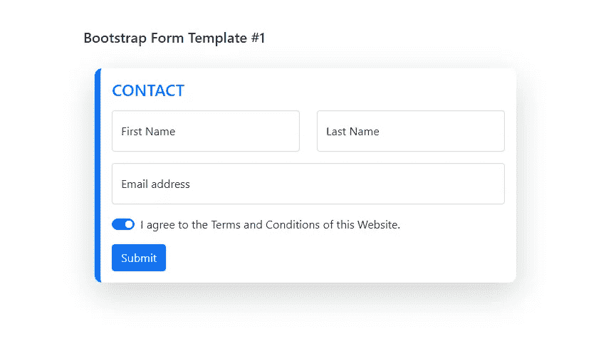

*模板#2*

```
<!doctype html>
<html lang="en">
<head>
  <!-- Required meta tags -->
  <meta charset="utf-8">
  <meta name="viewport" content="width=device-width, initial-scale=1"> <!-- Bootstrap CSS -->
  <link href="https://cdn.jsdelivr.net/npm/bootstrap@5.0.0-beta1/dist/css/bootstrap.min.css" rel="stylesheet" integrity="sha384-giJF6kkoqNQ00vy+HMDP7azOuL0xtbfIcaT9wjKHr8RbDVddVHyTfAAsrekwKmP1" crossorigin="anonymous"> <title>Bootstrap 5.0 Forms Cheatsheet</title>
  <style>
    .banner {
      background:linear-gradient(to left, #007bff, #9198e5);
    }
    .form-control{
      background:#F2F2F2;
      border-radius:0px;
      border:none;
    }
  </style>
</head>
<body>
  <div class="banner">
    <div class="container p-5">
    <h5 class="pb-4">Bootstrap Form Template #2</h5>
   <div class="card mx-3 mt-n5 shadow-lg" style="border-radius:0px; border:none">
    <div class="card-body p-5">
      <h4 class="card-title mb-3 text-dark text-uppercase" style="font-weight:700">Contact Us</h4> <form>
        <div class="row">
          <div class="col">
            <div class="form-floating mb-3">
              <input type="text" class="form-control" id="floatingTextInput1" placeholder="John">
              <label for="floatingTextInput1">First Name</label>
            </div>
          </div>
          <div class="col">
            <div class="form-floating mb-3">
              <input type="text" class="form-control" id="floatingTextInput2" placeholder="Smith">
              <label for="floatingTextInput2">Last Name</label>
            </div>
          </div>
        </div>
        <div class="form-floating mb-3">
          <input type="email" class="form-control" id="floatingEmailInput" placeholder="name@example.com">
          <label for="floatingEmailInput">Email address</label>
        </div>
        <div class="form-check form-switch mb-3">
          <input class="form-check-input" type="checkbox" id="flexSwitchCheckChecked" checked>
          <label class="form-check-label" for="flexSwitchCheckChecked">I agree to the Terms and Conditions of this Website.</label>
        </div>
        <div class="text-center">
        <button type="submit" class="btn btn-primary" style="border-radius:0px">Submit</button>
      </div>
      </form>
    </div>
  </div>
</div>
</div> <!-- Option 1: Bootstrap Bundle with Popper -->
<script src="https://cdn.jsdelivr.net/npm/bootstrap@5.0.0-beta1/dist/js/bootstrap.bundle.min.js" integrity="sha384-ygbV9kiqUc6oa4msXn9868pTtWMgiQaeYH7/t7LECLbyPA2x65Kgf80OJFdroafW" crossorigin="anonymous"></script> </body>
</html>
```

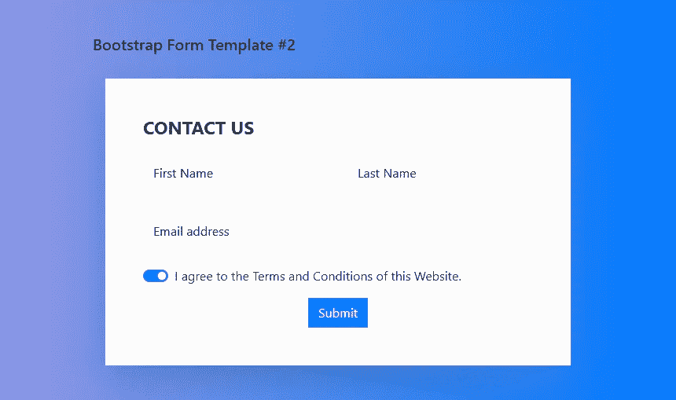

以上是两个简单的入门模板。如果你正在寻找更多的设计灵感，请查看[定制 HTML 用户登录表单](https://www.ordinarycoders.com/blog/article/custom-user-login-forms)。

【https://www.ordinarycoders.com】最初发表于[](https://www.ordinarycoders.com/blog/article/bootstrap5-form-fields-cheatsheet)**。**