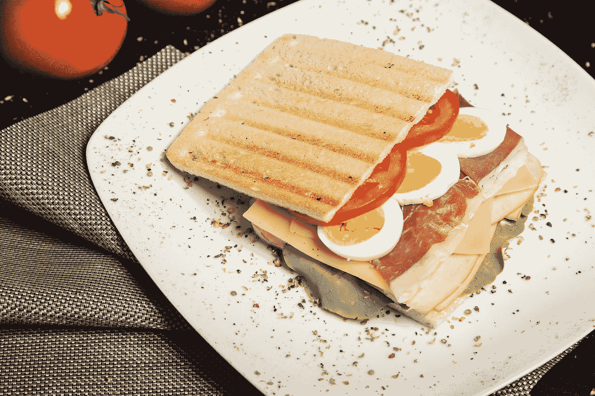
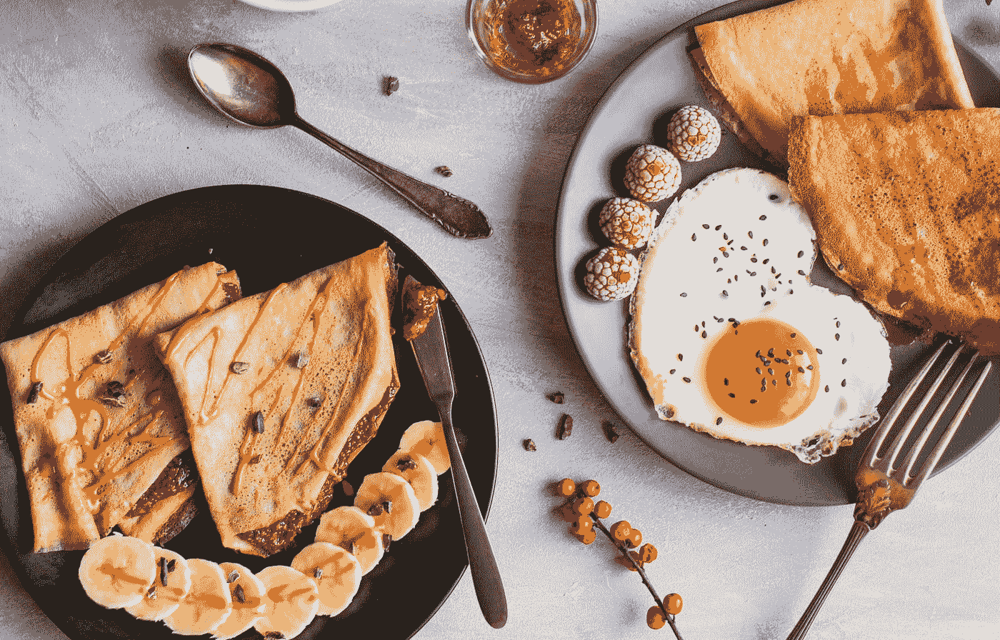

# 引导程序 5 —按钮组

> 原文：<https://levelup.gitconnected.com/bootstrap-5-button-groups-add29414bb53>



照片由[索菲娅·列夫琴科](https://unsplash.com/@sofelini?utm_source=medium&utm_medium=referral)在 [Unsplash](https://unsplash.com?utm_source=medium&utm_medium=referral) 上拍摄

**写这篇文章时，Bootstrap 5 处于 alpha 状态，可能会更改。**

Bootstrap 是任何 JavaScript 应用程序的流行 UI 库。

在本文中，我们将看看如何用 Bootstrap 5 添加按钮组。

# 按钮组

按钮组让我们将一系列按钮组合在一行上。

要添加一个，我们可以写:

```
<div class="btn-group">
  <button type="button" class="btn btn-secondary">left</button>
  <button type="button" class="btn btn-secondary">center</button>
  <button type="button" class="btn btn-secondary">right</button>
</div>
```

我们用`.btn-group`类来创建按钮组。

同样，我们可以使用`.active`类来突出显示一个按钮。

例如，我们可以写:

```
<div class="btn-group">
  <button type="button" class="btn btn-secondary active">left</button>
  <button type="button" class="btn btn-secondary">center</button>
  <button type="button" class="btn btn-secondary">right</button>
</div>
```

这也适用于链接:

```
<div class="btn-group">
  <a href="#" class="btn btn-secondary active">left</a>
  <a href="#" class="btn btn-secondary">center</a>
  <a href="#" class="btn btn-secondary">right</a>
</div>
```

`active`类既可以处理按钮，也可以处理链接。

# 轮廓样式

按钮组可以有轮廓样式，而不是背景色。

例如，我们可以写:

```
<div class="btn-group">
  <a href="#" class="btn btn-outline-secondary">left</a>
  <a href="#" class="btn btn-outline-secondary">center</a>
  <a href="#" class="btn btn-outline-secondary">right</a>
</div>
```

我们在每个按钮上都有`btn-outline-secondary`类来绘制按钮轮廓。

# 按钮工具栏

要将按钮组组合在一起，我们可以添加按钮工具栏。

例如，我们可以写:

```
<div class="btn-toolbar">
  <div class="btn-group mr-2">
    <button type="button" class="btn btn-primary">1</button>
    <button type="button" class="btn btn-primary">2</button>
    <button type="button" class="btn btn-primary">3</button>
  </div>
  <div class="btn-group mr-2">
    <button type="button" class="btn btn-primary">4</button>
    <button type="button" class="btn btn-primary">5</button>
    <button type="button" class="btn btn-primary">6</button>
  </div>
  <div class="btn-group">
    <button type="button" class="btn btn-primary">7</button>
    <button type="button" class="btn btn-primary">8</button>
  </div>
</div>
```

我们用带有`btn-toolbar`类的 div 来添加按钮组。

然后我们在里面有按钮组。

我们添加`mr-2`来增加一些右边的空白。

# 胶料

按钮组的大小可以更改。

`btn-group-*`类可以让我们改变大小。

例如，我们可以写:

```
<div class="btn-group btn-group-lg">
  <button type="button" class="btn btn-primary">1</button>
  <button type="button" class="btn btn-primary">2</button>
  <button type="button" class="btn btn-primary">3</button>
</div>
```

添加带有大按钮的按钮组。

这是用`btn-group-lg`类完成的。

要制作一个带有小按钮的按钮组，我们可以写:

```
<div class="btn-group btn-group-sm">
  <button type="button" class="btn btn-primary">1</button>
  <button type="button" class="btn btn-primary">2</button>
  <button type="button" class="btn btn-primary">3</button>
</div>
```

这是用`btn-group-sm`类完成的。

# 嵌套

按钮组可以嵌套。

例如，我们可以写:

```
<div class="btn-group">
  <button type="button" class="btn btn-secondary">left</button>
  <button type="button" class="btn btn-secondary">center</button> <div class="btn-group">
    <button type="button" class="btn btn-secondary dropdown-toggle" data-toggle="dropdown">
      Dropdown
    </button>
    <ul class="dropdown-menu">
      <li><a class="dropdown-item" href="#">foo</a></li>
      <li><a class="dropdown-item" href="#">bar</a></li>
    </ul>
  </div>
</div>
```

我们将一个按钮组放在另一个按钮组中，这样我们就可以在代码中添加一个下拉菜单。

下拉菜单在一个按钮组中。

我们有一个下拉开关按钮和一个菜单按钮。

# 铅垂变化

我们可以让按钮组与`btn-group-vertical`类垂直。

垂直按钮组不支持拆分按钮下拉列表。

要添加一个，我们可以写:

```
<div class="btn-group-vertical">
  <button type="button" class="btn btn-secondary">left</button>
  <button type="button" class="btn btn-secondary">center</button> <div class="btn-group">
    <button type="button" class="btn btn-secondary dropdown-toggle" data-toggle="dropdown">
      Dropdown
    </button>
    <ul class="dropdown-menu">
      <li><a class="dropdown-item" href="#">foo</a></li>
      <li><a class="dropdown-item" href="#">bar</a></li>
    </ul>
  </div>
</div>
```

我们只是添加了`btn-group-vertical`类来使其垂直。



照片由 [Claudia Crespo](https://unsplash.com/@clau_clau?utm_source=medium&utm_medium=referral) 在 [Unsplash](https://unsplash.com?utm_source=medium&utm_medium=referral) 拍摄

# 结论

按钮组允许我们在一个容器中添加多个按钮。

我们可以嵌套它们并向它们添加下拉菜单。