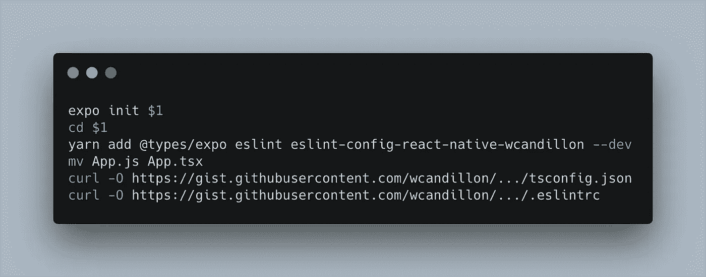

# 2019 年启动 React 原生项目

> 原文：<https://levelup.gitconnected.com/bootstrapping-a-react-native-project-in-2019-24dbfcb6db30>

说到创建一个新的 React 原生项目，最近发生了很多变化。过去支持开箱即用的 Expo 现在支持 TypeScript。Babel 现在也支持 TypeScript。蛋糕上的樱桃:ESLint 现在也支持解析 TypeScript 文件。感觉就像梦想成真。

下面是我用来创建新的 React 本地项目的脚本。

[我的初始化脚本](https://gist.github.com/wcandillon/3e86494b9145e499fbdb0d6f4a72abb0)

首先，我们使用`expo init`创建项目。然后我们添加了 eslint 包和一个插件，我用它来保存我所有林挺的真实来源。虽然您可能会使用自己的默认规则，但是插件库[还是值得一看的:这是一个关于如何在 TypeScript 文件上配置 ESLint 支持的很好的例子。我们还需要`@types/expo`包。](https://github.com/wcandillon/eslint-config-react-native-wcandillon)

下一步，我们将`App.js`重命名为`App.tsx`。然后我们下载两个文件:`tsconfig.json`用于类型检查配置，而`.eslintrc`用于林挺配置。

[ts config . JSON 文件](https://gist.github.com/wcandillon/10f40b913f1c63f357169b97473f9eb2)

在`tsconfig.json`中，我们将`noEmit`设置为 true: TypeScript 现在只是一个类型检查器。巴别尔负责编译。`moduleResolution`需要设置为 node，以便模块解析与 React 本机模块解析一对一匹配。现在，`allowSyntheticDefaultImports`需要设置为 true，因为 React 本机类型定义仍然依赖 React 的合成默认导入。在`include`中，我们添加了我们需要的 web speech API 类型定义，以便 Expo 类型定义能够正常工作。为了让 web speech API 定义正常工作，我们需要将 React 和 React 本机类型定义添加到`types`属性中。这是因为 web 语音 API 定义依赖于 React Native 定义的类型。

世博会仍然需要一些改进，但是看起来社区已经在它上面了😀

最后，不要忘记在 VSCode 设置中将 ESLint 配置为 lint TypeScript 文件。

将 TypeScript 文件添加到 eslint.validate 设置中。

## 瞧啊！

希望你会发现这些信息很有用。你以类似的方式引导你的 React 本地项目吗？你有什么小技巧和窍门？期待着阅读它们。

想开发你最好的应用吗？检查一下[反应原生元素](https://react-native.shop/elements)。

 [## 学习 React Native -最佳 React Native 教程(2019) | gitconnected

### 十大 React Native 教程-免费学习 React Native。课程由开发者提交并投票…

gitconnected.com](https://gitconnected.com/learn/react-native)