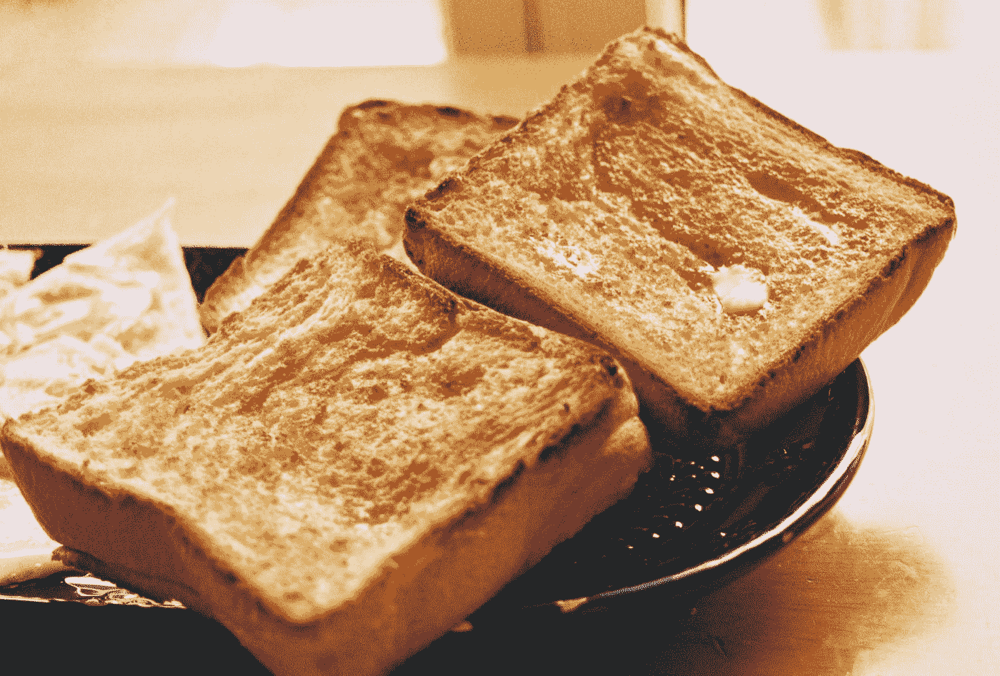
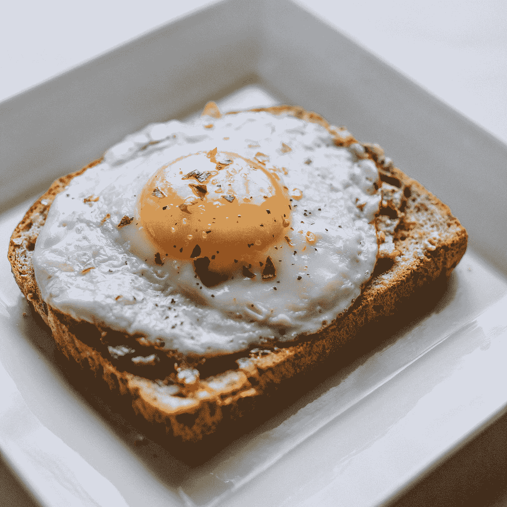

# BootstrapVue —时间选择器国际化和祝酒

> 原文：<https://levelup.gitconnected.com/bootstrapvue-time-picker-internationalization-and-toasts-b736c62378f7>



照片由 [Yukiko Kanada](https://unsplash.com/@okikuy0930?utm_source=medium&utm_medium=referral) 在 [Unsplash](https://unsplash.com?utm_source=medium&utm_medium=referral) 上拍摄

为了制作好看的 Vue 应用，我们需要设计组件的样式。

为了使我们的生活更容易，我们可以使用内置样式的组件。

在本文中，我们看看如何设置时间选择器的地区。

我们也看看如何展示祝酒词。

# 时间选择器国际化

我们可以用 locale prop 设置时间选择器的区域设置。

例如，我们可以写:

```
<template>
  <div id="app">
    <b-time v-model="value" locale="de" v-bind="labels"></b-time>
    <p>{{value}}</p>
  </div>
</template>
<script>
export default {
  name: "App",
  data() {
    return {
      value: "",
      labels: {
        labelHours: "Stunden",
        labelMinutes: "Minuten",
        labelSeconds: "Sekunden",
        labelIncrement: "Erhöhen",
        labelDecrement: "Verringern",
        labelSelected: "Ausgewählte Zeit",
        labelNoTimeSelected: "Keine Zeit ausgewählt"
      }
    };
  }
};
</script>
```

对于德语，我们将`locale`设置为`'de'`。

然后我们用`v-bind='labels'`为标签设置道具。

现在我们看到所有时间选择器控件的德语标签。

# 小时周期

不同地区的小时周期可能不同。

`h12`是一种小时制，使用 1 到 12 表示小时。

`h23`是一种小时制，使用 0 到 23 表示小时。

`h11`是一种小时制，使用 0 到 11 表示小时。

`h24`是使用 1 24 小时制的小时制。

# 强制 12 小时或 24 小时接口

我们可以将`hour12`设置为`true`来强制时间选择器显示 12 小时。

如果是`false`，它会显示 24 小时。

它是以 0 还是 1 开头取决于区域设置。

我们可以写:

```
<template>
  <div id="app">
    <b-time v-model="value" hour12></b-time>
    <p>{{value}}</p>
  </div>
</template>
<script>
export default {
  name: "App",
  data() {
    return {
      value: ""
    };
  }
};
</script>
```

强制小时选择器具有 12 小时。

# 烤面包

我们可以用`b-toast`组件显示推送通知。

例如，我们可以写:

```
<template>
  <div id="app">
    <b-button variant="primary" @click="$bvToast.show('toast')">Show toast</b-button>
    <b-toast id='toast' title="Hello">Hello.</b-toast>
  </div>
</template>
<script>
export default {
  name: "App"
};
</script>
```

我们创建一个调用`$bvToast.show(‘toast’)`来打开一个祝酒词的按钮。

参数是 toast 的 ID 值。

toast 是用`b-toast`方法创建的。

`title`道具是标题的内容。

标签之间的内容就是 toast 的内容。

标题是可选的，但应该包括在内。

右上角还有一个关闭按钮，用来关闭吐司。

我们可以用`no-close-button`道具禁用它。

标题栏是显示的，除非我们不给它标题并设置`no-close-button`属性。

可以启用自动隐藏。

当我们悬停在文本上时，倒计时将暂停。

我们可以通过将`no-hover-pause`属性设置为`true`来禁用它。

将`solid`杆设置为`true`可禁用透明度。

# 按需祝酒

我们可以用`this.$bvToast.toast`方法创建一个祝酒词。

例如，我们可以写:

```
<template>
  <div id="app">
    <b-button @click="makeToast()">Show toast</b-button>
    <b-button @click="makeToast(true)">Show appended toast</b-button>
  </div>
</template>
<script>
export default {
  name: "App",
  methods: {
    makeToast(append = false) {
      this.$bvToast.toast(`hello`, {
        title: `toast ${append ? "appended": ''}`,
        autoHideDelay: 5000,
        appendToast: append
      });
    }
  }
};
</script>
```

我们可以使用`this.$bvToast.toast`方法创建一个祝酒词。

第一个论点是祝酒词的内容。

第二个是具有各种选项的对象。

`title`属性设置标题。

`autoHideDelay`设置 toast 显示的持续时间，单位为毫秒。

`appendToast`如果是`true`，会在其他吐司下面显示。

# 选择

祝酒词可以有很多选择。

道具让我们改变标题。

道具让我们改变透明度。如果这是`true`就没有透明度。

`variant`道具让我们改变道具的样式。

例如，我们可以写:

```
<template>
  <div id="app">
    <b-button @click="makeToast()">Show toast</b-button>
  </div>
</template>
<script>
export default {
  name: "App",
  methods: {
    makeToast() {
      this.$bvToast.toast(`hello`, {
        title: 'toast',
        autoHideDelay: 5000,
        variant: 'success'        
      });
    }
  }
};
</script>
```

因为我们将`variant`设置为`'success'`，所以吐司的背景将会是绿色的。

`variant`的其他可能值包括`'primary'`、`'secondary'`、`'danger'`、`'warning'`和`'info'`。



本·科尔德在 [Unsplash](https://unsplash.com?utm_source=medium&utm_medium=referral) 拍摄的照片

# 结论

时间选择器的区域设置和标签可以更改。

小时选择器可以有 12 小时或 24 小时，这取决于我们的选择。

祝酒词很容易用内置方法添加。