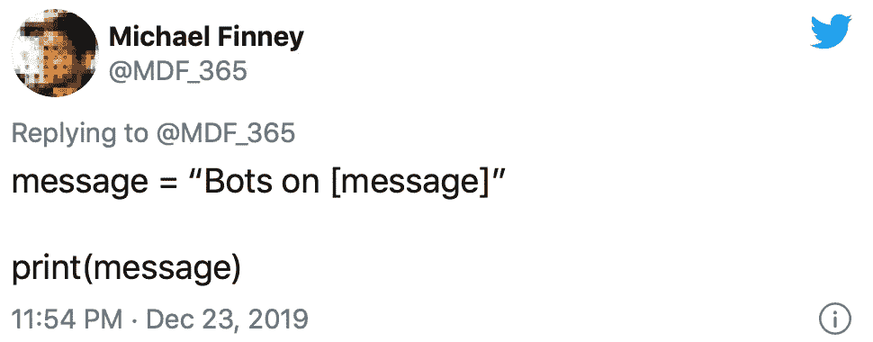

# 推特上的机器人

> 原文：<https://levelup.gitconnected.com/bots-on-bots-on-bots-on-twitter-918fa69c023c>

如果你倾向于社交网络和信息，Twitter API 是一个游乐场。构建一个基本的机器人通过后端功能与平台交互是学习一些基本功能的有趣方式。有几种不同的方式来触发机器人和时间线活动，但我将给出依赖 Python 语言来实现事情的例子。

2018 年初，我买了一个 Raspberry Pi，开始为几个项目制作原型，并开始进行初步实验，学习用 Python 编写代码。这包括部署 Tweepy 之类的包，Tweepy 是一个便于通过帐户凭证与 Twitter API 进行交互的包。

我的第一个练习是创建图像拼贴，让一个休眠了几年的老账户[狂野西部类比](http://twitter.com/WildWestAnalogy)发布。

该脚本的当前迭代从一个文件夹中随机选择我的一张照片，它还从一个数组中随机选择一个短语，既可以作为文本发送 tweet，也可以用西式字体写在图像的顶部。这是一个非常简单的过程，但却是对生成艺术的一个很好的尝试。我从社交媒体和线下的人们那里众包了这些短语。

在确认了我能够通过 API 向账户发布信息后，我决定转向参与。当该账户最初创建时，它主要关注短语“像狂野的西部”的实例，这是一个常用的习语。因此，下一个脚本 ping 搜索功能，找到包含这些词的 5 条推文，然后转发它们。同样，非常简单——我使用 Twitter API 已经很多年了，不想依赖域或主要数据管理。

观察语言使用如何随着时间的推移而演变是很有趣的，我想我看到了一些通过该帐户转发收集的趋势。你认为这个观察准确吗:

我的 RPI 是不可移动的，所以我所有的工作都必须在家里完成，这限制了我在没有额外障碍的情况下激发灵感或触发机器人的时间。因此，为了过渡到移动设备，更容易触发活动或尝试代码调整，我开始在 iOS 上使用 Pythonista。这也需要从 Tweepy Python 包切换到 Twython。这里没有太多的技术，这需要一些额外的过程，反复试验，以及一个已经遇到同样问题的朋友的提示。

我的写作风格可能最好被描述为“跑和枪”。我经常在我的 Notes 应用程序中记下随机的想法或短语，将概念充实成完整的句子，或者在一个不相关的活动中尝试在 Dropbox 纸上整理段落。非线性思考和编辑是你的朋友。正是这种向移动的转变让我开始考虑释放一小队机器人来探索 Twitter 上更多的语言用法。

下一个项目需要另一个帐户(因为我不想跨流)来深入研究新的主题。[罗马成语](http://twitter.com/RomanIdiom)推出来探索以下短语的用法:

*   “罗马不是一天建成的”
*   “入乡随俗”
*   “条条大路通罗马”

该脚本是基本的，只需对要转发的每个短语的 5 个实例进行三次查询。我没有花太多时间去评估人们是如何使用这些短语的，因为账户上每天的即时聊天记录是平时的三倍。我的总体感觉是，前两者被用作一种津贴，一种允许我们调整自己或以外国方式行事的方式。第三个表达我觉得是指权力集中。

今年早些时候，当我开始考虑写这篇文章时，我推出了最后一个专注于语言的机器人。它被称为[时髦的陈词滥调](http://twitter.com/TrendyCliche)，到目前为止只转发了使用短语“振动检查”的帖子。我相信我们今年春天经历的医疗编码事件已经悄悄地让这种陈词滥调偃旗息鼓了——尽管我们仍然看到“vibes”的重复使用。

这些年来，我为不同的项目或兴趣开设了相当多的 Twitter 账户，我渴望在其中部署脚本，以增加我对特定信息的接触或增加对某个主题的参与。这包括 [Rustbelt Innovators](http://twitter.com/RustInnovation) (搜索特定大都市地区的技术/商业/创业帖子) [SpeakerCone](http://twitter.com/TheSpeakerCone) (搜索包括各种艺术风格的帖子)[我自己的个人资料](http://twitter.com/MDF_365)与 1893 年芝加哥哥伦布博览会相关的帖子。

我不打算给这么多关于我对机器人开发的想法背景，但我们在这里。这很有希望解释我为什么一直这样做，并描绘了一幅在 Twitter 上放置一个机器人所需的松散画面。在下一部分中，我将演示这个过程，这样您也可以使用脚本。

你也可以观看这篇文章的视频:

## 🔽如何创建一个 TWITTER 机器人🔽

[**继续第二部分学习“如何创建推特机器人**](https://medium.com/@mdf_365/how-to-create-a-twitter-bot-b94d8abaabc8)