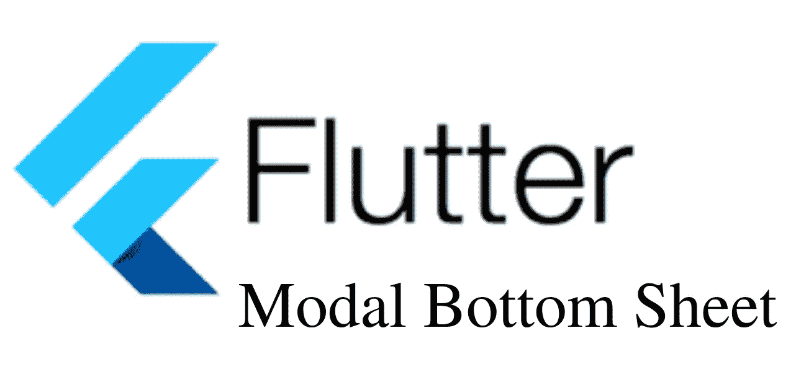
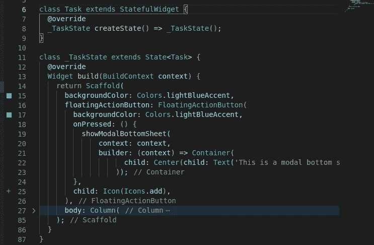
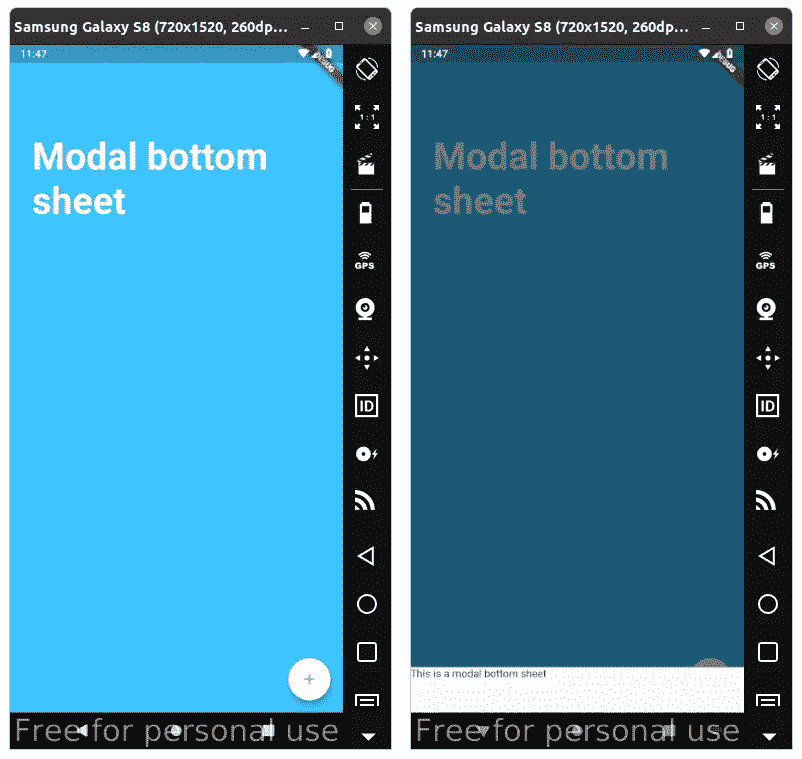
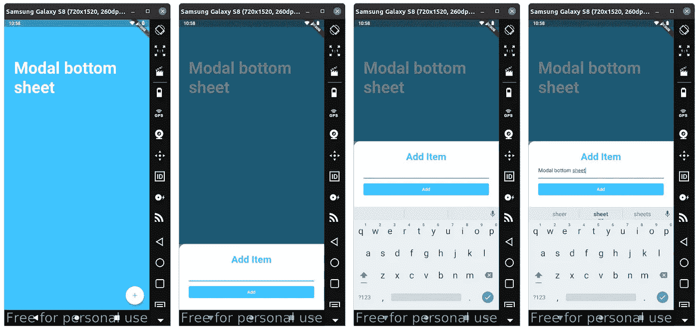

# 底部表单小部件

> 原文：<https://levelup.gitconnected.com/bottom-sheet-widget-e63e4606ba8c>

向 flutter 应用程序添加底板



## 底板的类型

*持久底板*

***持久底部表单***
它显示补充应用程序主要内容的信息，即使当用户与应用程序的其他部分交互时也保持可见。可以使用 ScaffoldState.showBottomSheet 函数或通过指定 Scaffold.bottomSheet 构造函数参数来创建和显示它。

***模态底层***
它是菜单或对话框的替代品，阻止用户与应用程序的其余部分进行交互。可以使用 showModalBottomSheet 函数创建和显示它。

我们将创建一个模态底板:

我们将使用 showModalBottomSheet <t>函数。</t>

WidgetBuilder 是创建小部件的函数的签名，例如 [StatelessWidget.build](https://api.flutter.dev/flutter/widgets/StatelessWidget/build.html) 或 [State.build](https://api.flutter.dev/flutter/widgets/State/build.html) 。

在您的类中的 scaffold 小部件内。添加一个操作按钮，用户点击该按钮可以打开底部的工作表。

```
floatingActionButton: FloatingActionButton(
 backgroundColor: Colors.lightBlueAccent,
 onPressed: () {
   showModalBottomSheet(context: context, builder: buildBottomSheet);
 },
 child: Icon(Icons.add),
),
```

创建一个窗口小部件，当点击浮动动作时将显示该窗口小部件。这是一个函数。

```
Widget buildBottomSheet(BuildContext context) {
    return Container(
      child: Center(child: Text('This is a modal bottom sheet')),
    );
  }
```

使用箭头功能改进功能

```
Widget buildBottomSheet(BuildContext context) => Container(
child: Center(child: Text('This is a modal bottom sheet')),
);
```

我们还可以通过向 floatingActionButton 添加方法来进一步简化

```
floatingActionButton: FloatingActionButton(
        backgroundColor: Colors.lightBlueAccent,
        onPressed: () {
          showModalBottomSheet(
              context: context,
              builder: (BuildContext context) => Container(
                    child: Center(child: Text('This is a modal bottom sheet')),
                  ));
        },
        child: Icon(Icons.add),
 ),
```

因为我们在创建类时已经传递了 BuildContext

```
Widget build(BuildContext context) 
```

您可以移除我们传递给 floatingActionButton 的

```
builder: (context) => Container(
                    child: Center(child: Text('This is a modal bottom sheet')),
```



## 按钮点击时显示文本的完整模式底部表单

点击一个浮动按钮，就会显示一段文字

```
import 'dart:ui';
import 'package:flutter/material.dart';class BottomSheetWidgetText extends StatelessWidget {
  [@override](http://twitter.com/override)
  Widget build(BuildContext context) {
    return Scaffold(
      backgroundColor: Colors.lightBlueAccent,/// tap thisfloating button to open the Bottom Sheet
      floatingActionButton: FloatingActionButton(
        backgroundColor: Colors.white,
        onPressed: () {
          showModalBottomSheet(
              context: context,
              builder: (context) => Container(
                  height: 60, child: Text('This is a modal bottom sheet')));
        },
        child: Icon(
          Icons.add,
          color: Colors.lightBlueAccent,
        ),
      ),/// page containing the floating button
      body: Column(
        crossAxisAlignment: CrossAxisAlignment.start,
        children: [
          Container(
            child: Padding(
              padding: const EdgeInsets.only(
                  top: 60.0, left: 30.0, bottom: 30.0, right: 30.0),
              child: Column(
                crossAxisAlignment: CrossAxisAlignment.start,
                children: <Widget>[
                  SizedBox(
                    height: 60.0,
                  ),
                  Text('Modal bottom sheet',
                      style: TextStyle(
                        color: Colors.white,
                        fontSize: 50.0,
                        fontWeight: FontWeight.w700,
                      )),
                ],
              ),
            ),
          ),
        ],
      ),
    );
  }
}
```



## 在按钮点击时显示表单的完整模式底部表单

```
import 'dart:ui';
import 'package:flutter/material.dart';class BottomSheetWidget extends StatefulWidget {
  BottomSheetWidget({Key? key}) : super(key: key);
  [@override](http://twitter.com/override)
  _BottomSheetWidget createState() => _BottomSheetWidget();
}class _BottomSheetWidget extends State<BottomSheetWidget> {
  [@override](http://twitter.com/override)
  Widget build(BuildContext context) {
    return Scaffold(
      backgroundColor: Colors.lightBlueAccent,/// tap thisfloating button to open the Bottom Sheet
      floatingActionButton: FloatingActionButton(
        backgroundColor: Colors.white,
        onPressed: () {
          showModalBottomSheet(
              context: context,
              isScrollControlled: true,
              builder: (context) => SingleChildScrollView(
                  padding: EdgeInsets.only(
                      bottom: MediaQuery.of(context).padding.bottom),
                  child: AddItem()));
        },
        child: Icon(
          Icons.add,
          color: Colors.lightBlueAccent,
        ),
      ),/// page containing the floating button
      body: Column(
        crossAxisAlignment: CrossAxisAlignment.start,
        children: [
          Container(
            child: Padding(
              padding: const EdgeInsets.only(
                  top: 60.0, left: 30.0, bottom: 30.0, right: 30.0),
              child: Column(
                crossAxisAlignment: CrossAxisAlignment.start,
                children: <Widget>[
                  SizedBox(
                    height: 60.0,
                  ),
                  Text('Modal bottom sheet',
                      style: TextStyle(
                        color: Colors.white,
                        fontSize: 50.0,
                        fontWeight: FontWeight.w700,
                      )),
                ],
              ),
            ),
          ),
        ],
      ),
    );
  }
}/// form to display in the bottom sheet
class AddItem extends StatefulWidget {
  [@override](http://twitter.com/override)
  _AddItemState createState() => _AddItemState();
}class _AddItemState extends State<AddItem> {
  [@override](http://twitter.com/override)
  Widget build(BuildContext context) {
    return Container(
        color: Color(0xff757575),
        child: Container(
            padding: EdgeInsets.all(30.0),
            decoration: BoxDecoration(
              color: Colors.white,
              borderRadius: BorderRadius.only(
                topLeft: Radius.circular(20.0),
              ),
            ),
            child: Column(
              crossAxisAlignment: CrossAxisAlignment.stretch,
              mainAxisAlignment: MainAxisAlignment.spaceBetween,
              children: [
                Text(
                  'Add Item',
                  textAlign: TextAlign.center,
                  style: TextStyle(
                      color: Colors.lightBlueAccent,
                      fontSize: 30.0,
                      fontWeight: FontWeight.w700),
                ),
                TextField(
                  decoration: InputDecoration(
                    enabledBorder: UnderlineInputBorder(
                      borderSide:
                          BorderSide(color: Colors.lightBlueAccent, width: 3.0),
                    ),
                  ),
                ),
                SizedBox(
                  height: 10,
                ),
                TextButton(
                    onPressed: () {},
                    style: ButtonStyle(
                      backgroundColor: MaterialStateProperty.all<Color>(
                          Colors.lightBlueAccent),
                    ),
                    child: Text(
                      'Add',
                      style: TextStyle(color: Colors.white),
                    ))
              ],
            )));
  }
}
```



本视频中的内容略有不同，但 ***模态底板的工作原理与*** 相同

## 编码快乐！！！！！！！！！！！！！！！！！！！！！！！！！！