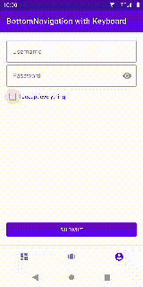

# Android 屏幕键盘的底部导航行为

> 原文：<https://levelup.gitconnected.com/bottomnavigation-behavior-with-an-on-screen-keyboard-on-android-ec6b28ad8638>

## 或者如何用`WindowInsetsCompat`隐藏底部导航组件


Max Kleinen 在 [Unsplash](https://unsplash.com?utm_source=medium&utm_medium=referral) 上拍摄的照片

在 Android*上实现带有底部导航和屏幕键盘的 UX 流应该很容易。但是就像你们大多数人已经知道的那样，它不是。底部导航占用了屏幕底部的大量空间。当键盘不可用时，这不是问题，一切看起来都很好。但当屏幕键盘出现时，它会在屏幕底部占据更多空间，如果它与导航一起显示，就没有空间留给任何内容了。因此，我们希望并需要用键盘覆盖底部导航，只显示内容。*

在 *AndroidManifest.xml* 中的`***windowSoftInputMode***`属性的定义为我们提供了两个选项，`*adjustPan*`和`*adjustResize*`，以提供对屏幕上内容的可访问性，可能在键盘本身下面。这是一个老话题，你已经找到了关于它的好文章，所以我不会深入讨论这两个选项。对我来说,`*adjustPan*`永远不够，所以我总是选择`*adjustResize*`来获得对内容和键盘出现时的行为的更多控制。但是这本身并没有隐藏底部导航。

从*Android*API*level**30**开始，`[WindowInsets.Type.*ime*()](https://developer.android.com/reference/android/view/WindowInsets.Type#ime())`可以用来获取屏幕键盘是否显示的信息。使用`[WindowInsetsCompat.*isVisible*()](https://developer.android.com/reference/androidx/core/view/WindowInsetsCompat#isVisible(int))` *(* 适用于*androidx . core****1 . 5 . 0****)*该信息也适用于 API 等级 **29** 及以下*(目前为*直到 API 等级 **23** *)* 。要隐藏你的`MainActivity`的`mainNavigation`，你只需要设置一个`OnApplyInsetsListener`来对插入的变化做出反应。*

```
**window*.*decorView*.setOnApplyWindowInsetsListener **{** view, insets **->** val insetsCompat = toWindowInsetsCompat(insets, view)
    mainNavigation.*isGone* = insetsCompat.isVisible(ime())
    view.onApplyWindowInsets(insets)
**}***
```

*在同样的范围内，只要不需要输入法，就可以自动隐藏屏幕键盘。当当前聚焦的视图不是一个`EditText`或任何派生类型时，这是最常见的情况。您只需要用条件 hide 语句实现一个`OnGlobalFocusChangeListener`。*

```
**window*.*decorView*.*viewTreeObserver*.addOnGlobalFocusChangeListener **{** oldView, newView **->** if (newView !is EditText) imm.hideSoftInputFromWindow(
        (oldView ?: newView)?.*windowToken* ?: window.*attributes*.token,
        0 // *or* HIDE_IMPLICIT_ONLY
    )
**}***
```

**

*有了这两个监听器，你将能够在你的`MainActivity`或包含`BottomNavigation`视图的主屏幕范围内处理所有相关的屏幕键盘变化。*

*为此，我在 *Kotlin* 中创建了一个小而简单的实用程序来提供扩展函数`hideKeyboardOnFocusChange()`和`setOnKeyboardVisibilityChangeListener()`*

*[](https://github.com/tynn-xyz/Hoppa#keyboard) [## tynn-xyz/Hoppa

### Hoppa 是一个用于 AndroidX 和 Kotlin Android 扩展的微型实用程序扩展。它减少了代码重复…

github.com](https://github.com/tynn-xyz/Hoppa#keyboard)*