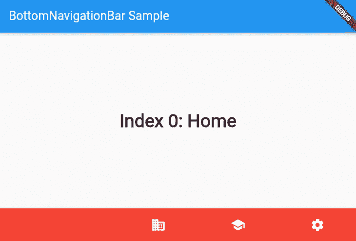

# Flutter 中的 BottomNavigationBar 小部件

> 原文：<https://levelup.gitconnected.com/bottomnavigationbar-widget-in-flutter-1517c4ecfaf8>

BottomNavigationBar 是一个显示在应用程序底部的材质小部件，用于在少量视图中进行选择。这个数字通常在 3 到 5 之间。所以它给了我们一个在给定页面间导航的机会。


可能会看到一个典型的 BottomNavigationBar 小部件，它包含上面的三个底部导航栏项目。在使用它之前有一些事情要知道。首先，使用 BottomNavigationBar 需要一个脚手架对象。第二，底部导航栏项目包含文本标签、图标或两者形式的多个项目。项目的长度必须至少为两个，并且每个项目的图标和标题/标签不得为空。你是说“我只想用图标”吗？我们也会到达那里。



我们可以随心所欲地定制底部导航栏及其项目。例如，可以根据选定或未选定的状态自定义背景颜色、文本大小和颜色。上面有一个定制的底部导航栏的例子，下面是它的代码。


在这个代码示例中，我们有一个 material 应用程序和一个在屏幕上看到的有状态小部件。我们已经创建了一个`_selectedIndex`变量来引用我们当前选择的页面索引。之后，我们创建了文本样式对象`optionStyle`和包含小部件的列表`_widgetOptions`。请记住，所有这些只是为了在屏幕上显示我们选择的底部导航栏项目。我们的底部导航栏部分现在开始。首先，我们使用 BottomNavigationBar 小部件来响应 Scaffold 中的`bottomNavigationBar:`。之后，我们创建了一个名为 items 的数组。此项目数组包含 BottomNavigationBarItems。正如我们在代码中看到的，每个项目都有自己的图标、标签和背景颜色，这些属性给了我们快速定制的变化。在项目之后，我们将 currentIndex 赋给我们创建的`_selectedIndex`变量，更改所选项目的颜色，并将函数赋予 ontap 属性。原来如此。这是一个自定义底部导航栏的基本代码。这里还有很多我们没有用到的定制选项。

# 常用的 BottomNavigationBar 属性

*   background color→BottomNavigationBar 本身的颜色。
*   current index 项目的当前索引。
*   elevation→BottomNavigationBar 的 z 坐标。
*   IconSize→所有项目图标的大小。
*   on tap→点击其中一个项目时调用。
*   selected fontsize→所选项目的字体大小。
*   unselected fontsize→未选中项目的字体大小。
*   选择编辑项目颜色→所选项目的颜色。
*   unselectedItemColor→未选中项目的颜色。
*   selectedLabelStyle→所选项目的文本样式。
*   unselectedLabelStyle→未选中项的 TextStyle。
*   showSelectedLabels→所选项目的标签的可见性。
*   showunseledlabels→未选定项目标签的可见性。

```
Quick tip: If we don’t want to show any labels, set the showSelectedLabels and showUnselectedLabels properties false for that.
```