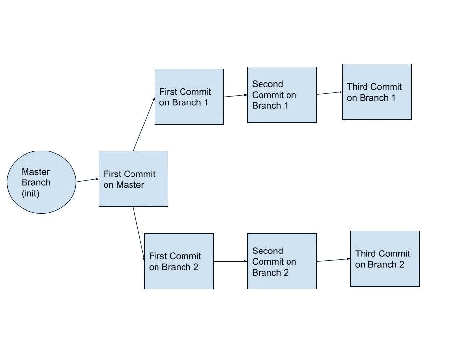
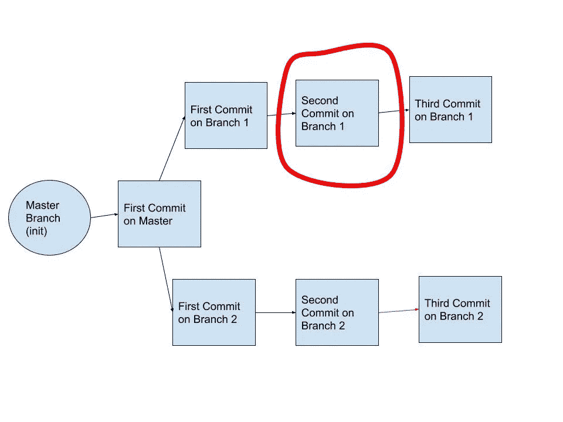
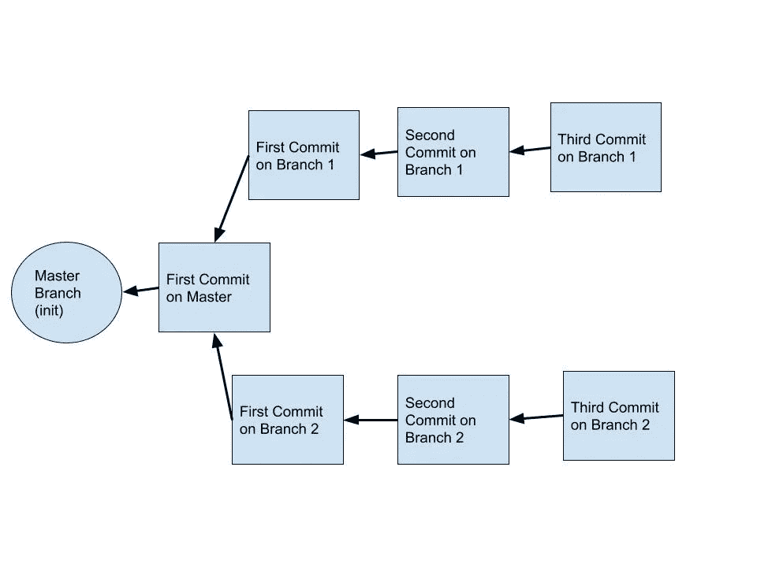
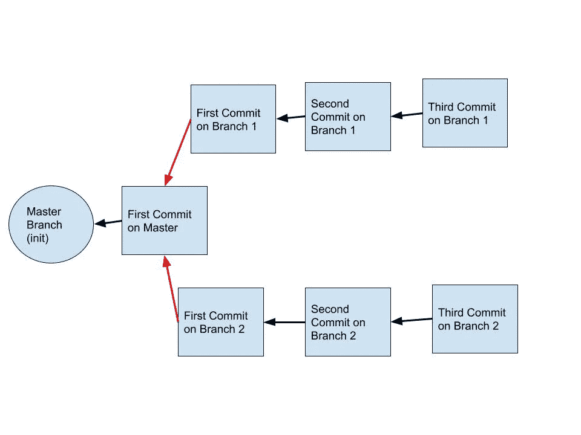
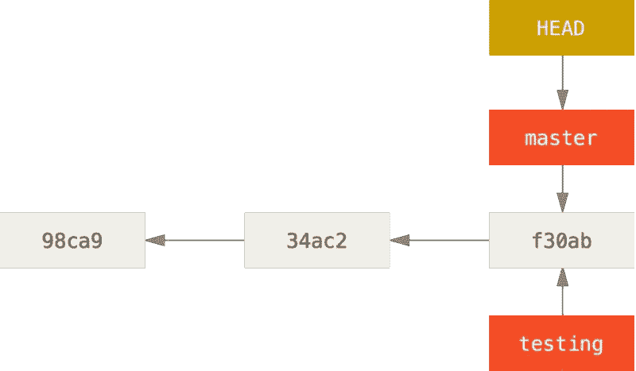

# 分支和删除分支

> 原文：<https://levelup.gitconnected.com/branching-out-and-deleting-branches-a9a7ffdec4df>

颤抖的白杨——植树节博客

在将 g it 分支合并回主分支之前，创建 git 分支进行编码是一个很好的做法，但是您知道您也应该考虑删除那些旧的分支吗？

我正在清理我的代码，这时我突然想到在将 git 分支与主分支合并后是否可以重用它。

在我寻求明确答案的过程中，我发现我需要更好地理解一些关键概念，比如:Git、提交、分支等等。

# Git 是什么？

这是一个用于源代码管理的版本控制系统，其中代码的每个副本或报告都有提交和更改的完整历史。

基本上，您可以处理一个项目的多个版本，每个版本都有自己的分支。想象几个分支相互平行。

并行的分支

你也可以通过进一步的分支回到一个旧版本的状态。例如，在分支 1 上提交 3 个中的第 2 个。

分支 1 上的提交#2

你可以在这里阅读更多关于 Git 的内容— [**亚特兰蒂斯教程**](https://www.atlassian.com/git/tutorials/what-is-git)

注意:这不同于 GitHub，GitHub 是 Git 的在线代码托管平台。这对于共享代码和在项目中与他人合作特别有用。

为了更好地了解如何使用 GitHub，请阅读本 [**简单指南**](https://guides.github.com/activities/hello-world/)

# 什么是 Git 提交？

我过去认为提交仅仅是保存我们的更改，并添加一些关于工作特性和/或所做更改的信息。

基本命令如下:`git commit -m 'the commit message here'`

但是，我明白了还有更多。

提交指向提交时代码的状态。

它还“包含作者的姓名和电子邮件地址、您键入的消息，以及指向直接出现在该提交之前的一个或多个提交(其父级)的指针:初始提交的零个父级，正常提交的一个父级，以及由两个或多个分支合并而成的提交的多个父级。”(Git-SCM)

想象一个指针，它随着该分支上的每次提交而向前移动，因此它总是指向最后一次提交。

每个提交都指向它的前任

是的，这里事情变得有点抽象，但是要知道每个提交都指向它的前一个提交。

查看提交历史:`git log`

这显示了到您所在分支的提交历史

# 什么是分支？

Git-SCM 很好地总结了这一点:

> “几乎每个 VCS 都有某种形式的分支支持。分支意味着你偏离了开发的主线，继续工作而不打乱主线。”

这条主线是一个名为“主”的分支。默认情况下,`git init`命令创建这个分支。如果你真的想的话，你可以改名字，但是大多数人都不在乎。

把它想象成复制那个分支到你分叉的地方。然后，在决定是否将其合并回主分支之前，您可以继续在该分支副本上编码。

这样做的主要好处是可以安全地处理分支副本，而不会破坏主分支或干扰团队成员的代码。

帮助我理解分支的一个场景是当我想为一个项目尝试两种不同的风格/配色方案时；一个暖色，一个冷色。因此，我创建了两个不同的分支，分别命名为“温暖”和“凉爽”来测试它。我的团队喜欢哪个就合并到主分支。

# 创建新分支

`git branch nameofnewbranch`

该命令创建一个名为“nameofnewbranch”的新分支，但不会将您切换到该分支。这意味着，如果在创建这个新分支时您在主分支上，那么您仍然在主分支上。因此，所有提交和更改都将发生在主分支，直到您切换到不同的分支。

`git checkout nameofnewbranch`

这个命令会将您切换到名为“nameofnewbranch”的分支。

或者，如果你想尝试一些花哨的速记:
`git checkout -b nameofnewbranch`

这将一气呵成；创建分支并切换到它。

其他命令:

`git branch`
这会告诉你你在哪个分支上，旁边标有*号。

`git status`
这告诉你你在哪个分支上，以及是否有任何文件没有被添加和/或更改没有被提交。

一个新的分支有自己的指针，随着该分支上的每次提交而向前移动。

这个新分支也指向它所分支的提交。

他们分支的承诺

你当前所在的分支也有一个特殊的指针，叫做头。

通过`git checkout nameofbranch`切换会将头部移动到该分支。

提交时，磁头将向前移动。

Git 供应链管理负责人

阅读更多关于这方面的内容会让我晕头转向。我现在不打算担心它，但如果你敢，你可以潜得更深: [**Git Head**](https://www.javatpoint.com/git-head#:~:text=The%20HEAD%20points%20out%20the,transferred%20to%20the%20new%20branch.)

转向另一个分支相关的主题…

# **分支切换**

`git checkout nameofbranch`

现在，请记住，如果您在提交所做的更改之前切换到不同的分支，它们将会跟随您到另一个分支。未提交的变更还没有绑定到特定的分支或版本，因此它们可以自由地跟随您。

为了让变更停留在期望的分支中，您需要首先提交它们(当然，在您希望它们被提交的同一个分支上)。

或者，如果您尝试切换分支，但它不允许您这样做，这可能是因为您当前所在的分支和您尝试切换到的分支之间存在太多差异。

这主要是当当前分支上的更改还没有被提交，并且它们不容易被转移到您要切换到的分支时的问题。基本上，它们是不兼容的，Git 会阻止你破坏你的代码。

解决方案# 1

`git add .`
这将添加所有文件并存放所有更改以供提交。

`git commit -m "the commit message"`

解决方案 2

`git stash`

如果你以后会切换回这个分支，在提交之前继续更多的工作，暂时把它们藏起来可能是一个好的选择。

(要恢复更改，请运行`git stash apply`

# 隐藏

我承认，当我因为前面讨论的场景而无法在分支之间切换时，我还没有准备好进行有意义的提交，所以我只是运行了 stash 命令，而没有完全理解它。当时，这只是一个权宜之计，这样我就可以切换到不同的分支机构。

Atlassian 将 git stash 定义为临时存储“您对工作副本所做的更改，以便您可以处理其他内容，然后回来重新应用它们。如果您需要快速切换上下文并处理其他事情，但是您正在进行代码更改，还没有做好提交的准备，那么隐藏是很方便的。”

对我当时的目的来说，这似乎是个完美的解决方案。但是，由于我只是盲目地进入这个领域，而且是编码新手，我不认为我曾经回去运行`git stash apply`来带回改变。

另外，对于像我这样的编码新手，另一个警告是，要小心多次使用 git stash，因为每个 stash 都会被存储。管理多个仓库并在我的工作流程中使用它们是我将来要探索的事情。

 [## git 存储-保存更改| Atlassian Git 教程

### git stash 暂时搁置(或隐藏)你对工作副本所做的修改，这样你就可以做别的东西了…

www.atlassian.com](https://www.atlassian.com/git/tutorials/saving-changes/git-stash#:~:text=The%20git%20stash%20command%20takes,them%20from%20your%20working%20copy) 

根据一些研究，一些开发人员似乎还在犹豫是否应该隐藏更改而不是提交。提交现在对我来说更容易理解。

另外，更多带有有意义的提交消息的提交使得返回到代码中的某个点变得更加容易。

# 合并

当一个分支上的所有特性和代码都在您想要的位置时，您就可以将它合并到主分支中了。

切换到主分支:`git checkout master`

然后运行:`git merge nameofbranch`

您可能会在控制台框中看到一些活动，包括文件的更改、插入和删除。

如果您要合并的分支是在主分支中的提交之前(或上游)提交的，它也可能会说“快进”。因此，Git 向前“快进”指针。

所有的提交现在也被合并到主分支中。

现在，让我们假设你正在一个分支上工作，但是不得不暂停工作去处理另一个特性。一个好的工作流习惯是返回到主分支并创建一个新的分支副本。处理该分支，并将其合并回主文件。

对主分支所做的这些新的更改不会自动地被引入到任何其他没有涉及的分支中。

如果你不认为这在以后会是一个问题，你可以继续在你之前工作的分支上工作。

如果您认为有合并冲突的潜在可能，或者只是感觉更轻松，那么您可以通过运行`git merge master`将主分支合并到您的工作分支中来引入新的变更。

# 删除

最后，我们回到手头的原始问题。

git 分支与主分支合并后可以重用吗？

我对在我早期的项目中重用 git 分支感到内疚。我会在主服务器上创建 1 或 2 个分支，然后在合并回主服务器之前，继续重用它们作为一个正在进行的工作的临时区域。然后，我会返回到这些分支，开发更多的功能，并从头再来。

在一个好的工作流程中，一旦特征分支合并回主特征分支，它就会被删除。

`git branch -d thebranchname`

如果你想从 GitHub 中删除远程分支，可以在分支选项卡中或者从命令行进行:`git push origin --delete thebranchname`

应该为您处理的每个新特性创建新的分支。

如果你没有想出分行名称的超级创意和/或想要重复使用同一个分行名称，那也没关系。

删除一个分支来创建一个同名的新分支似乎有点傻。

回想一下分支和提交是如何工作的，重要的不是名称，而是每个新分支都指向您要分支的分支的提交(或状态)。

生命周期较长的分支可能会导致合并冲突的问题，尤其是在与团队协作的情况下。

分支和主分支彼此偏离得越远，它们的“共同祖先”提交就越远。

当您完成一个分支并将其合并到主文件中时，请删除它。

可以从主分支上的最近提交中产生新的分支。

此外，虽然在将分支合并到主分支后保留它们是可以的，但它们会开始堆积。如果你在离开一段时间后又回到这个项目，或者有人加入进来做一些工作，这看起来会很令人生畏。

省掉你试图记住你为什么保留那个分支或者是否需要在它上面做更多工作的麻烦。完成后删除分支。

打开电锯

# 最后的话

在寻找答案的过程中，我不得不学习更多关于 Git、分支和提交的知识，以及它们是如何相互联系的。

我需要学习更多的 git 命令(以便正确使用)。我也不断地遇到“重定基础”提交和/或“重定基础”的想法，以将变更从一个分支集成到另一个分支。

我也没有触及拉请求，因为我还没有做一个。它似乎主要在团队环境中使用，其中一个人将执行需要团队中其他成员批准的拉请求。一旦获得所有人的批准，它将引发一系列事件，如合并和可能删除分支机构。

因此，一个问题打开了一扇通向更多问题和主题的大门。

老实说是从这篇文章开始的。

 [## 为什么要删除旧的 Git 分支？

### 发布日期:2017 年 6 月 20 日删除不再使用的 git 分支是一种常见的内务处理惯例…

ardalis.com](https://ardalis.com/why-delete-old-git-branches/) 

它引导我在理解 git、分支等等之前尝试理解 git pulls。

## 其他来源

 [## Git -基本分支和合并

### 切换到您的生产分支。创建一个分支来添加修补程序。测试完成后，合并热修复分支，然后…

git-scm.com](https://git-scm.com/book/be/v2/Git-Branching-Basic-Branching-and-Merging)  [## Git -简而言之就是分支

### 几乎每个 VCS 都有某种形式的分支支持。分支意味着你偏离了开发的主线…

git-scm.com](https://git-scm.com/book/en/v2/Git-Branching-Branches-in-a-Nutshell)  [## Git 重用分支或删除并重新创建

### 我最近接到一个任务，给我正在做的一个项目添加一个特定的功能。由于此功能依赖于旧代码…

stackoverflow.com](https://stackoverflow.com/questions/32006894/git-reuse-branch-or-delete-and-create-again)  [## GitFlow 简介

### GitFlow 是 Git 的一个分支模型，由 Vincent Driessen 创建。它吸引了很多关注，因为它是…

datasift.github.io](https://datasift.github.io/gitflow/IntroducingGitFlow.html)  [## 什么是 GitHub？GitHub 初学者入门

### 想知道 GitHub 是什么？在这篇文章中，我们会给你一个 GitHub、Git 和版本控制的入门介绍…

kinsta.com](https://kinsta.com/knowledgebase/what-is-github/)