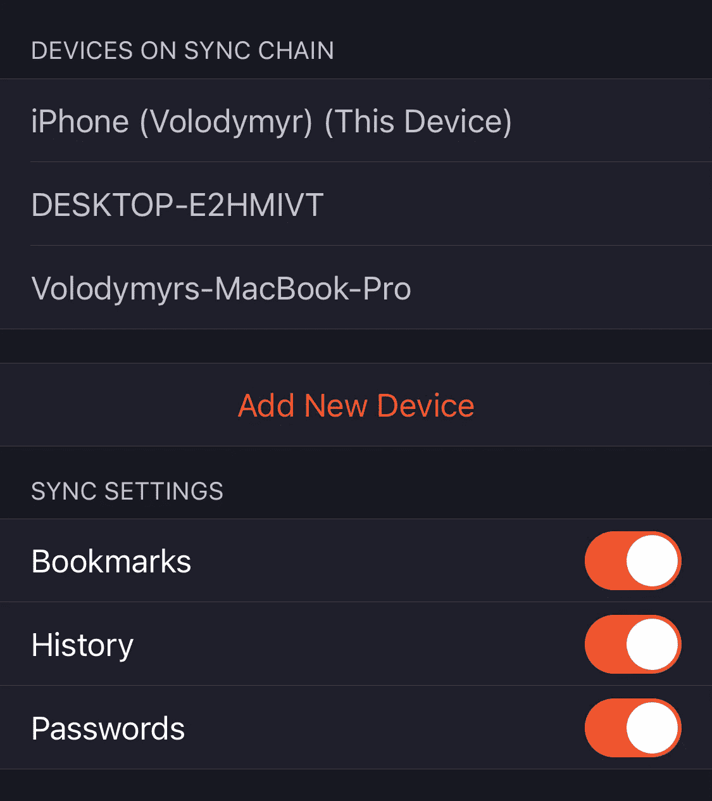

# 勇者 vs 火狐。谁是最好的隐私浏览器？

> 原文：<https://levelup.gitconnected.com/brave-vs-firefox-who-is-the-best-privacy-browser-ba5a7aab23c8>

## 按性能、隐私和功能对浏览器进行比较

图标由 [Rubaitul Azad](https://unsplash.com/@rubaitulazad) 绘制

也许我有问题，但我喜欢不时地比较不同的应用程序，以确保我使用的是满足我需求的最佳软件。浏览器也不例外。我用的是两台不同的笔记本电脑，分别安装了 Mac OS 和 Windows。还有，我用 iPhone。所以对我来说，平台之间的同步、提供最佳性能和保证隐私是至关重要的。所以我要从这三个角度来回顾一下。

> Brave 是一个相对较新的浏览器，由 JavaScript 的创始人和 Mozilla 的联合创始人 Brendan Eich 开发。它被作为 Chrome 的替代品推向市场，因为它更快、更安全。另一方面，Firefox 是一款开源浏览器，自 2002 年就已经问世。

# 多台设备同步

我将从这个不受欢迎的话题开始，因为目前，我正在使用 Brave 浏览器，我的设备之间的同步有很大的问题。

> 更新
> 
> iOS 上的 Brave 现在有了标签同步功能！因此，现在很容易打开在另一台设备上打开的网站。

**iOS 设备上的勇敢浏览器**几乎是一个独立的应用。

勇敢的 iOS 同步设置

如你所见，勇敢的手机浏览器只能同步书签、历史和密码。但是《勇敢者》中的历史是一个非常有限的故事。因此，为了成为一个真正的私人浏览器，他们删除了所有的谷歌服务，并使用 Chromium API，它只能监听 URL 栏的变化。不幸的是，这意味着他们在历史中只跟踪直接在地址栏中输入的站点。因此，不同网站之间的导航和从其他应用程序打开的网站将不会被跟踪。**因此，历史记录几乎是空的，其他设备也不知道在每个设备上打开了什么。**

此外，iOS 浏览器甚至没有共享当前标签页的功能。因此，你必须使用第三方软件来继续在桌面上进行移动浏览。反之亦然，不可能将 URL 从桌面传递到移动设备。因此，它在桌面之间工作得更好，但移动应用程序的功能有限。

iOS 上的 Firefox 同步设置

Firefox 在同步方面没有问题。你可以看到任何设备访问过的任何历史页面，在实时打开的标签中查看，在设备之间传递当前页面，当然，还可以同步书签和密码。

Firefox 在这场战斗中领先，所以让我们给他 5 分，给 Brave 分，因为以牺牲功能为代价的隐私不是最好的解决方案。

**火狐** : 5
**勇者** : 2

# 表演

浏览器的性能很大程度上取决于运行它的硬件。我已经可以说，Brave 在 Mac OS 和 Windows，甚至 iOS 上的启动和感觉都比 Firefox 快。

但是感觉是主观的，所以让我们进行基准测试，看看数字上的差异。我将在配有 M1 和 16GB 内存的 MacBook Pro 上运行测试。

我刚刚谷歌了浏览器基准，并选择了两个最先进的。

## JetStream2

JetStream 2 运行 64 个子测试。分数越大越好。您可以使用[下面的链接](https://browserbench.org/JetStream)阅读更多关于测试和测量您的浏览器的信息。

火狐得了 131.8 分。

勇敢取得了 198.6 分。

如你所见，根据 JetStream2 基准测试,**比火狐**快 40%。现在我们来看看 Basemark Web 3.0。

## Basemark Web 3.0

没有关于这个基准测试做了多少测试的信息，但是它测试了你的浏览器在使用不同技术和框架的网络应用上的表现。您可以使用[下面的链接](https://web.basemark.com/)阅读更多关于测试和测量您的浏览器的信息。

火狐得了 1059.8 分。

勇敢得了 1557.2 分。

**几乎 47%的 Brave 比火狐**快。

我需要说，我真的感受到了现实生活中浏览的不同，但我没想到勇敢是如此显着更快。**平均相差 43.5%** 。

老实说，在我们的比较中，给 Brave 5 分，给 Firefox 少 40%。

**火狐** : 3
**勇者** : 5

现在让我们来谈谈隐私，因为这两个浏览器可能是市场上最隐私的。

# 隐私比较

这个话题非常有趣，因为只有在使用 Brave 一段时间后，我才意识到在线隐私的价值。

> 例如，当我在 Chrome 或 Safari 中搜索任何健康症状，并且忘记在隐名模式下运行搜索时，我的游戏将会结束。在那次搜索之后，我会在接下来的几天里在网上到处看最好的诊所或药物。

为了比较隐私，我们可以使用特殊的网站来计算有多少广告和追踪器被浏览器拦截。最著名的是 [Adblock-tester](https://adblock-tester.com/) 。

勇敢的浏览器配有集成的 AdBlock。所以你甚至不需要安装任何额外的扩展。

100 分中有 93 分变得勇敢了。没有安装扩展。

100 分中有 26 分得到了火狐。没有安装扩展。

当然，每个人都可以安装额外的扩展，并为他们两个实现 100 分。但是这种差异在手机上变得更加明显。

在 iOS 上，无法为第三方浏览器安装扩展(仅适用于 Safari)。所以我们可以依赖浏览器的预装拦截功能。

iOS 版 Brave mobile 获得 97 分(满分 100 分)

Brave 在手机上拦截的广告和追踪器比在桌面上还要多！

iOS 版的 Brave mobile 仅获得 100 分中的 34 分

而且我们也不可能在 iOS 版火狐中改善我们的隐私。Firefox 发布了一个单独的浏览器 Firefox Focus，改进了隐私和跟踪功能。但是这个浏览器就像是微服模式。它不支持标签、书签或同步。所以不能作为默认浏览器使用。

反正就算是火狐福克斯也得了 73 分满分 100 分。

火狐关注 iOS 获得 73 分(满分 100 分)

看起来勇敢的普通标签比火狐焦点更安全😅。不过当然了，别忘了，勇者浏览器也有微服模式。

> 此外，勇敢的桌面可以与集成 Tor 浏览器一起启动，用于超级匿名浏览。

**火狐** : 2
**勇者** : 5

## 结论

如果 Brave browser 改进了移动同步，或者至少集成了一个在另一个设备上打开当前标签页的功能，它将是真正理想的浏览器！尽管如此，如果你需要在多个平台上使用一个浏览器，它还是胜过 Firefox。

总分:
**火狐** : 10
**勇者** : 12

## 更新

iOS 上的 Brave 现在有了标签同步功能！因此，现在很容易打开在另一台设备上打开的网站。

嗨！非常感谢您阅读我的文章！如果你不是一个中型成员，但想支持我，你可以通过[点击这个链接](https://golosay.medium.com/membership)来支持我。中型会员将允许你阅读我的帖子和其他人的帖子。再次感谢大家的支持！