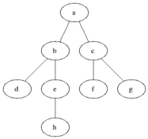
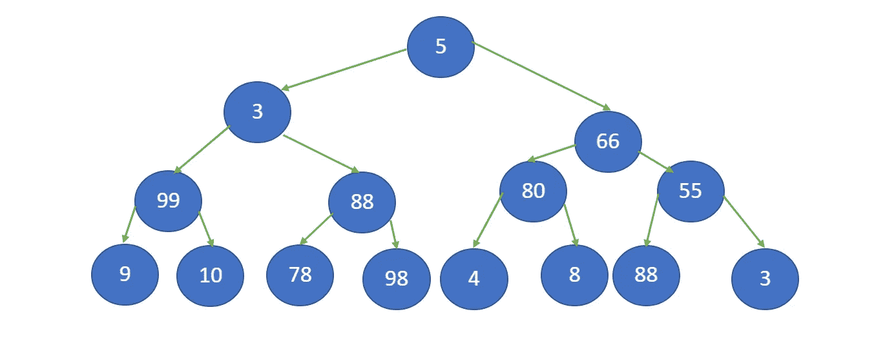
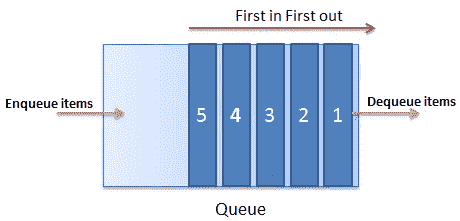
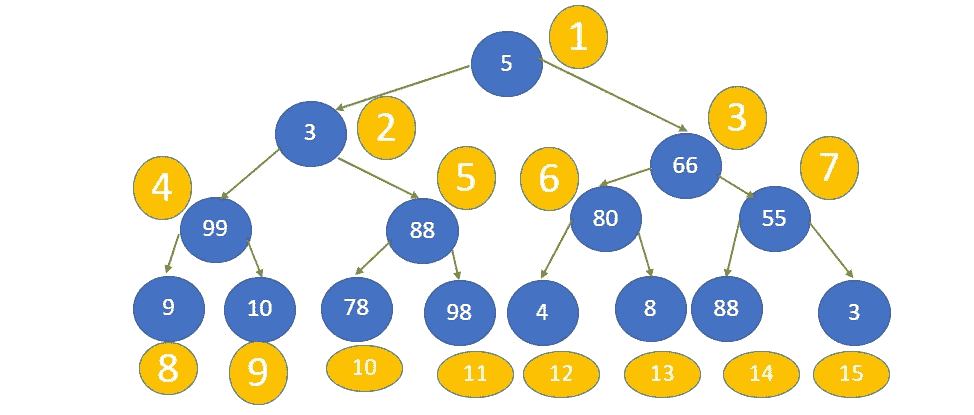
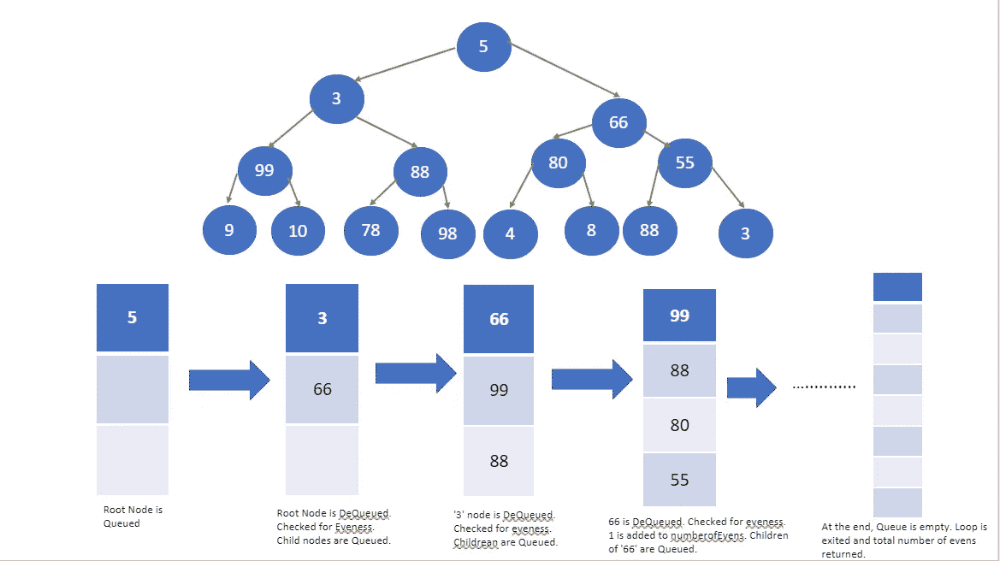

# 广度优先搜索算法

> 原文：<https://levelup.gitconnected.com/breadth-first-search-algorithms-e0910d35c434>

## 遍历节点树

最常见和最有用的算法之一是广度优先搜索算法。该算法涉及遍历或搜索树或图数据结构中的节点或数据点。这些算法经常出现在技术面试中，是理解更高级问题的垫脚石。广度优先搜索的优秀之处在于它适用于各种不涉及树或图的问题，例如对数组排序、查找数字组合的最大和以及查找图中两个节点之间的最短距离。

搜索

## 广度优先搜索

面包优先搜索是一种控制从树或图中的一个节点移动到另一个节点的算法。搜索的顺序是根据树的深度。换句话说，搜索算法从顶层根节点开始，然后移动到第二层，搜索那里的每个节点。然后，该算法进行到下一个较低的级别，并重复直到它到达最深的节点。下图是主要思路。

该算法通过深度进行搜索

从上面看，我们可以看到算法从根节点开始。根节点是图中链接到所有其他节点的第一个节点。在这种情况下，标记为“a”的节点是根节点。从这里开始，我们从一个节点移动到另一个节点，探索树的每一层。因此，顺序是:
a->b->c->d->e->f->g->h

我们如何在实践中做到这一点？首先，让我们用伪代码来布局算法，为我们提供一个基本的轮廓。

1.  创建队列(FIFO)
2.  将第一个节点或根排入队列
3.  当队列不为空时出列
4.  当每个节点出队时，它被标记为已访问
5.  对于标记为已访问的每个节点，将它的所有子节点
6.  继续，直到树达到它的目标，但是，定义。

让我们通过看一个具体的例子来更详细地讨论这在解决一个问题时意味着什么。

问题:给定一个包含整数的节点树。求节点中偶数的总数。

输入:整数树的根节点

输出:树的所有节点中偶数的数量。

让我们以下面的树作为输入:

整数存储在节点中的树

看上面的树，我们可以看到这棵树有四层，总共 15 个节点。这个问题要求我们按顺序访问每个节点，通过层次或层次顺序遍历向树的更深处移动。当算法遍历树时，它应该计算访问的偶数的数量，并在最后返回该数量。

## 长队

队列(先进先出)

为了进一步理解这个过程是如何工作的，我们必须在我们的系统中引入另一个元素:队列。队列是一组有序的数据，通过在其末端添加一个元素并从另一端移除一个元素来改变。简单来说，队列是 FIFO(先进先出)结构。添加到队列一端的项目是“入队”；而从另一端移除的元素是“出列”

队列数据结构

现在，让我们将这些要素结合起来，一步一步地讨论如何解决这个问题。下图显示了节点树以及在 BFS 算法中节点需要被访问的顺序。在上面的算法中被访问可能意味着许多不同的事情，这取决于具体的问题。我们可以寻找特定的数据点，或者从许多不同的节点收集数据。在跟踪路径的情况下，我们可能需要将一个节点标记为已访问，以确保同一个节点不会被覆盖两次。无论哪种方式，目标都是按顺序访问所有节点，并提取必要的信息来解决问题。

整数节点树以及 BFS 算法访问它们的顺序。

解决问题的基本伪代码如下。

1.  过程 find evens
    a . number of evens = 0
    b .创建空队列
    C .入队根节点
    D .循环-当队列不为空时
    i .出队节点
    ii .如果节点中的数字是偶数，计数器
    iii 加 1。将节点
    的所有子节点排队，返回事件总数

该图显示了算法遍历树时队列中节点的顺序

因为该算法在逐层遍历树时检查每个节点。如果数字是偶数，算法将递增计数器变量。当循环最终因队列为空而退出时，该函数返回' numberofevens '变量，即…9。

## 时间和空间复杂性

广度优先搜索算法的时间和空间复杂度比你想象的更简单。由于空间的复杂性，我们需要的内存包括树本身和队列。因此，所需的总内存与节点数量成正比。因此，空间复杂度为 O(n)。

时间复杂度取决于访问了多少个节点以及每个节点被访问了多少次。对于这种类型的问题，最好的情况是算法在第一个节点 O(1)中找到所需的元素。在最坏的情况下，算法访问每个节点:O(n)；平均案例场景:O(n/2)。综上，时间和空间复杂度是线性的，与树中的节点数成正比:O(n)。

## 结论

本文是对广度优先搜索算法的简短概述和介绍。这篇文章绝不是这种算法的许多应用和变体的详尽细节。对于进一步的研究，我推荐以下资源:

[可汗学院](https://www.khanacademy.org/computing/computer-science/algorithms/breadth-first-search/a/the-breadth-first-search-algorithm)

[GeeksforGeeks](https://www.geeksforgeeks.org/breadth-first-search-or-bfs-for-a-graph/)

[教程要点](https://www.tutorialspoint.com/data_structures_algorithms/breadth_first_traversal.htm)

[USFCA](https://www.cs.usfca.edu/~galles/visualization/BFS.html)