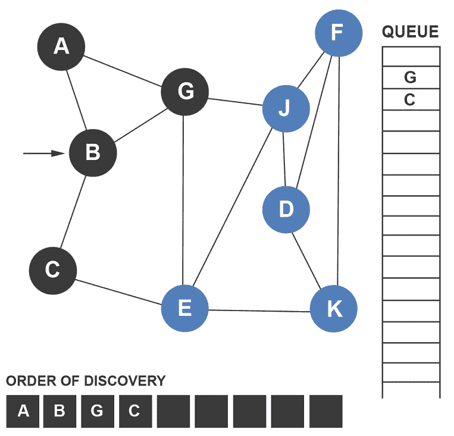
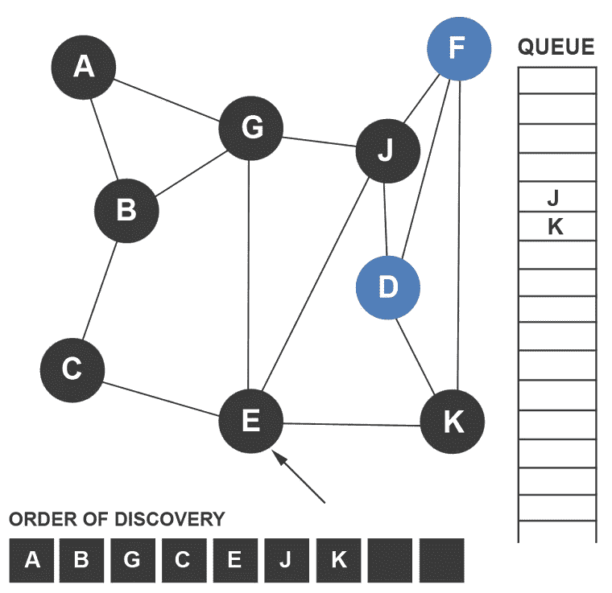
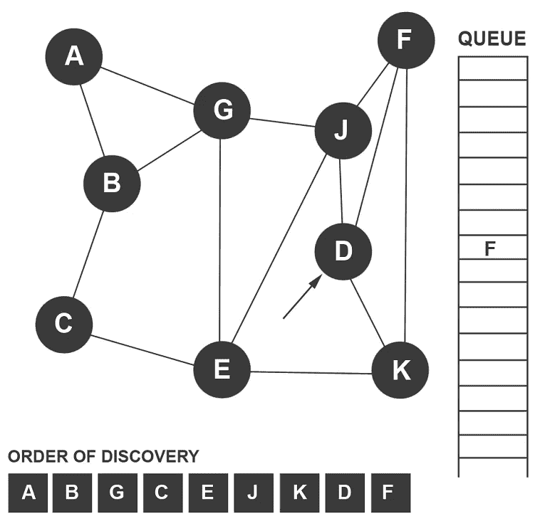

# 广度优先搜索(BFS)算法直观解释

> 原文：<https://levelup.gitconnected.com/breadth-first-search-bfs-algorithm-visually-explained-8dec1f514a6e>

宽度优先搜索算法类似于深度优先搜索算法，只是它使用队列而不是堆栈。BFS 在技术上与 DFS 相反，因为 BFS 算法在回溯探索较浅的节点之前首先探索最深的节点。元素可以入队或出队。队列基于先进先出原则(FIFO)工作，这意味着首先入队的元素将首先出队。BFS 是这样工作的:

*   选择第一个节点
*   浏览所有未访问的节点，并将它们排队
*   一旦从第一节点访问了所有未访问的相邻节点，就使第二节点出队
*   移动到下一个排队的节点并重复该过程

让我们来看看广度优先搜索算法。

BFS 算法做的第一个操作是选择顶点 A 作为起点。为什么是顶点 A？因为那是我们决定开始的顶点。顶点 A 被添加到发现列表中，并被设置为当前节点。当前节点用箭头表示。它被标记为已访问，但没有排队。

与其相邻的顶点 B 和 G 按字母顺序排列。顶点 B 被添加到发现列表中，随后是顶点 g。这两个顶点都被标记为已访问。

由于没有额外的、未被发现的相邻节点，顶点 a 的发现阶段就完成了。由于顶点 B 首先入队，所以它现在出列并被选为继续遍历的节点。

该过程重复进行。来自当前节点的所有相邻的、未被访问的顶点被排队。顶点 B 有一个未被发现的节点:顶点 C。顶点 C 被排队，添加到发现列表，并标记为已访问。

由于没有额外的、未被发现的相邻节点，顶点 b 的发现阶段就完成了。由于顶点 G 是下一个入队的，所以它现在出列并被选为继续遍历的节点。

来自顶点 G 的所有相邻的、未被访问的顶点被排队。顶点 G 有两个未被发现的节点:顶点 E 和 j。这两个顶点都被排队，添加到发现列表，并标记为已访问。

由于没有额外的、未被发现的相邻节点，顶点 g 的发现阶段就完成了。由于顶点 C 是下一个入队的，所以它现在出列并被选为继续遍历的节点。

没有额外的、未被发现的相邻节点，因此顶点 c 的发现阶段就完成了。由于顶点 E 是下一个入队的，所以它现在出列并被选为继续遍历的节点。

来自顶点 E 的所有相邻的、未被访问的顶点被排队。顶点 E 有一个未被发现的节点:顶点 K。顶点 K 被排队，添加到发现列表，并被标记为已访问。

没有额外的、未被发现的相邻节点，因此这完成了顶点 e 的发现阶段。因为顶点 J 是下一个入队的，所以它现在出列并被选择作为继续遍历的节点。

来自顶点 J 的所有相邻的、未被访问的顶点被排队。顶点 J 有两个未被发现的节点:顶点 D 和 f。这两个顶点都被排队，添加到发现列表，并标记为已访问。

尽管该算法已经发现了图中的所有节点，但是直到队列为空时才能完成。从顶点 J 没有额外的、未被发现的相邻节点；这就完成了顶点 j 的发现阶段。因为顶点 K 是下一个入队的，所以它现在出队并被选为继续遍历的节点。

没有额外的、未被发现的相邻节点，因此顶点 k 的发现阶段就完成了。由于顶点 D 是下一个入队的，所以它现在出列并被选择作为继续遍历的节点。

没有额外的、未被发现的相邻节点，因此这完成了顶点 d 的发现阶段。因为顶点 F 是下一个入队的，所以它现在出列并被选择作为继续遍历的节点。

没有额外的、未被发现的相邻节点，因此这完成了顶点 f 的发现阶段。由于队列是空的，这完成了遍历过程。

如果你喜欢你所读的，我的书，**【算法的说明性介绍】，涵盖了这个算法和更多。**

**

*Dino Cajic 目前是 [LSBio(寿命生物科学公司)](https://www.lsbio.com/)、[绝对抗体](https://absoluteantibody.com/)、 [Kerafast](https://www.kerafast.com/) 、 [Everest BioTech](https://everestbiotech.com/) 、 [Nordic MUbio](https://www.nordicmubio.com/) 和 [Exalpha](https://www.exalpha.com/) 的 IT 负责人。他还是我的自动系统公司的首席执行官。他有十多年的软件工程经验。他拥有计算机科学学士学位，辅修生物学。他的背景包括创建企业级电子商务应用程序、执行基于研究的软件开发，以及通过写作促进知识的传播。*

*你可以在 [LinkedIn](https://www.linkedin.com/in/dinocajic/) 上联系他，在 [Instagram](https://instagram.com/think.dino) 上关注他，或者[订阅他的媒体出版物](https://dinocajic.medium.com/subscribe)。*

*阅读迪诺·卡吉克(以及媒体上成千上万的其他作家)的每一个故事。你的会员费直接支持迪诺·卡吉克和你阅读的其他作家。你也可以在媒体上看到所有的故事。*