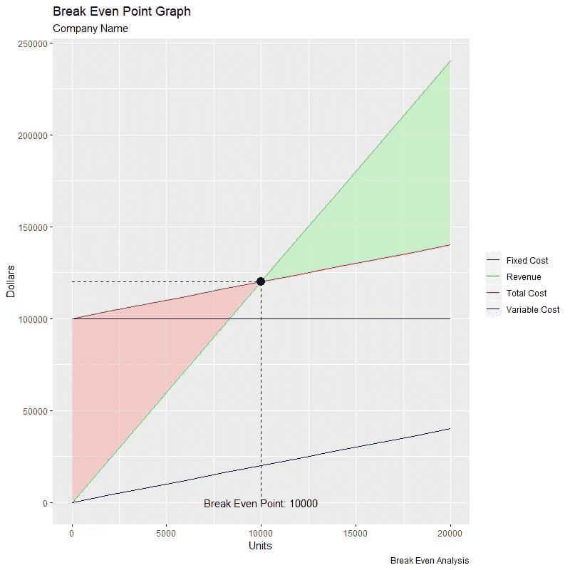

# 盈亏平衡点

> 原文：<https://levelup.gitconnected.com/break-even-point-349bef8e9604>

## r 代表财务分析

## 用 R 理解基本的金融概念

图片由 Ibrahim Rifath 提供，可在 [Unsplash](https://unsplash.com/photos/OApHds2yEGQ)

# 成本分析

公司必须卖出多少产品才能避免亏损？在下一个付款到期日之前出售这样数量的产品可行吗？公司必须提供多少服务才能开始获得利润？公司需要多长时间才能收回给定时间内的成本？

所有这些都是每一个企业家和策划经理必须事先了解的问题，以评估业务的可行性并确定其连续性。

通过成本分析，企业家和管理者能够识别降低成本的机会领域，目的是获得更多利润，或者在更糟的情况下，继续经营而没有重大损失，希望迅速实现财务复苏。因此，清楚地了解不同类型的成本及其对企业盈利能力的作用变得很重要。

## 固定成本

固定成本是指那些**独立于**生产单位数量的成本(即在给定的时间内保持固定)。固定成本的例子包括:租金、折旧、摊销、保险、财产税、工资、设备租金和法律费用。

## 可变成本

可变成本是那些**依赖于**生产的单位数量的成本(即与生产水平成正比)。可变成本的一些例子包括:交货和运输费用，基本原材料，公用事业和零部件。

## 总成本

总成本就是固定成本和可变成本的总和。

## 边际贡献

边际贡献代表每个产品在扣除可变成本后对支付固定成本的贡献。边际贡献可以通过以下公式计算:

## 盈亏平衡点

代表为了使收入等于总成本而需要销售的单位数量。此时，公司或组织没有损失或利润。单位盈亏平衡点可通过以下公式计算:

上述公式仅适用于可变成本为**线性**的情况(即不考虑规模经济或不经济)。

在下面的例子中，我们来计算一家公司的盈亏平衡点(单位),这家公司生产的产品售价为 12 美元，可变成本为 2 美元，固定成本为 100，000 美元。我们来看看 R 代码！

盈亏平衡点图示例

根据上面获得的图表，盈亏平衡点(即收入行和总成本行之间的交叉点)是 10，000 个单位。此时，公司不会有任何亏损或盈利。盈亏平衡点左侧的红色阴影区域代表亏损，而右侧的绿色阴影区域代表盈利。

如果该公司希望减少需要销售的单位数量以达到收支平衡，它可以考虑分析以下策略:

*   重新协商固定成本(例如，与房东重新协商租金金额)
*   降低可变成本(例如，优化原材料成本、更换供应商、重新协商交付和运输费用)
*   提高售价

公司必须根据其目标来确定以前的战略在多大程度上是可行的，并选择最好的一个来执行。但是，所选择的策略不应对需求(即售出的单位数量)产生负面影响。

例如，如果客户不愿意为产品支付更高的价格，即使盈亏平衡所需的单位会减少，公司也将更难达到盈亏平衡。同样，如果公司决定降低可变成本，但这最终会对产品质量产生负面影响，客户的需求也可能会下降。出于这些原因，最好的策略是在不损害产品质量、品牌形象和客户需求的情况下降低成本。

# **总结思路**

成本分析对任何公司来说都是一项至关重要的任务。它们的业务连续性取决于它们的盈利能力(即它们产生的收入超过成本的能力)。有能力合理管理成本并有谈判能力与供应商协商付款频率的公司更有可能成功经营。

本文探讨了如何使用 R [ggplot2](https://cran.r-project.org/web/packages/ggplot2/ggplot2.pdf) 包来构建可视化的盈亏平衡点图。虽然可能有其他工具和软件用于金融和经济分析，但 R 是一个很好的选择，因为它是一个对金融分析师、工程师和企业家有用的免费开源软件。

*— —*

*如果你觉得这篇文章有用，欢迎在* [*GitHub*](https://github.com/rsalaza4/R-for-Financial-Analysis/blob/master/Break%20Even%20Point.R) *上下载我的个人代码。你也可以直接在 rsalaza4@binghamton.edu 给我发邮件，在*[*LinkedIn*](https://www.linkedin.com/in/roberto-salazar-reyna/)*上找到我。有兴趣了解工程领域的数据分析、数据科学和机器学习应用的更多信息吗？通过访问我的媒体* [*个人资料*](https://robertosalazarr.medium.com/) *来探索我以前的文章。感谢阅读。*

罗伯特