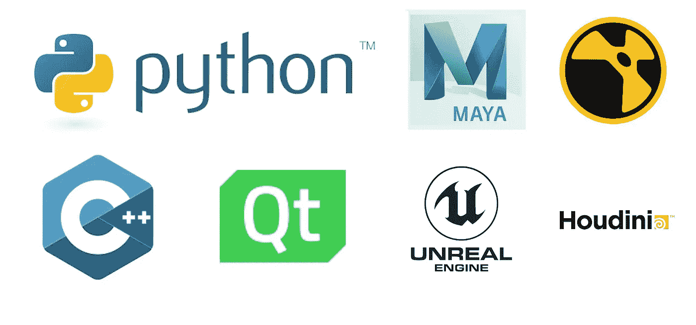

# 作为软件开发人员打入视觉特效/动画行业

> 原文：<https://levelup.gitconnected.com/break-into-the-visual-effects-animation-industry-as-a-software-developer-d32592bbb202>

## 给从事 VFX 和动画职业的开发者的建议

银河边缘。克里斯蒂安·克罗克在 [Unsplash](https://unsplash.com/photos/ShY6Jn6n9jQ) 上拍摄的照片

作为一名软件开发人员，我曾在几家视觉特效和动画公司工作过，在找工作和准备面试时，这个行业和科技世界的其他行业之间存在一些差异。

当你进入软件工程师的职业生涯时，你可能会面临一个十字路口，是申请一家大型科技公司(脸书、苹果、亚马逊、网飞和谷歌)还是一家视觉效果、动画或游戏行业的公司。在娱乐业寻求职业所需的准备与典型的“硅谷”计算机科学面试大不相同。我下面列出的建议并不代表所有公司，而是从个人经验中总结出来的一般建议。这里有一些建议可以帮助你实现在视觉特效/动画行业开始职业生涯的目标。

# 你不需要破解编码面试

是的，没错。你可以深呼吸一下，把你的《破解编码面试》课本放到一边。你不再需要花费你的夜晚和周末在线练习编码问题。

准备 FAANG 面试需要长时间在诸如 [leetcode](https://leetcode.com/) 、 [hackerrank](https://www.hackerrank.com/) 等平台上练习编码问题，并用 [pramp](https://www.pramp.com/#/) 进行模拟面试练习。准备工作可能需要几周甚至几个月的时间，这取决于你的计算机科学背景。有完整的在线课程和业务致力于帮助潜在的求职者准备这些大型技术面试。通常，这些公司更看重你在面试中的编码表现，而不是经验，这可能直接等同于你为面试做了多少准备。

与其花费数小时甚至数天去研究这些特定的问题，不如把这些时间投入到你感兴趣的项目中？

在视觉特效/动画行业，经验比能够在运行中反转二叉树更有价值。虽然理解算法和数据结构以及系统设计是基于课程和经验的，但在面试中，不太可能只根据编写白板问题来评估你。在面试之前，确定你曾经参与过并且引以为豪的项目。在你的 GitHub 站点上展示它们，并且能够谈论实现的技术细节。激情、真正的兴趣和实践经验会给面试官留下深刻印象。

# 作业

除了必修的计算机科学课程，比如数据结构、算法和软件设计，选修一门专门的图形课程会让你有所进步。了解渲染、光线跟踪器、着色器、几何处理、3D 建模和动画如何工作，将有助于您在工作中成功处理现实世界的问题。

参加一两门线性代数课程也非常重要。线性代数的基础，包括向量空间和矩阵，在处理 3D 空间中的一系列问题时经常出现。

# 技术

作者图片

Python 和 C++是视觉特效和动画行业中无处不在的语言。需要熟悉的标准库包括 Qt 和 OpenGL。尝试 3D 数字内容创作软件，找出您感兴趣的内容。如果你对动画感兴趣，下载试用版的 [Maya](https://www.autodesk.com/products/maya/overview?support=ADVANCED) 或者获得学生许可证，学习如何用 python 和 C++构建插件并与 Maya API 交互。如果你对合成感兴趣，我建议你尝试一下 [Nuke](https://www.foundry.com/products/nuke) ，并再次学习如何构建插件和与 API 交互。

如果你对游戏感兴趣，了解一下游戏引擎是如何工作的。尝试构建自己的引擎，或者更加熟悉使用和开发[虚幻引擎](https://www.unrealengine.com/en-US/)、 [Unity](https://unity.com/) 或[子弹物理引擎](https://pybullet.org/wordpress/)。

*不要只关注前端或后端。全栈是关键。*

# 参加会议

参加会议，如 [Siggraph](https://www.siggraph.org/) 或[游戏开发者大会(GDC)](https://www.gdconf.com/) ，是了解该领域最新创新并与该行业的研究人员和开发者社区建立联系的绝佳方式。这是找到你感兴趣的研究领域的好方法。此外，这些会议有招聘会，在那里你可以和每个公司的代表交谈，以更好地了解职位的种类，并最终申请！

# 结论

申请视觉特效和动画行业的职位时，期望与大的科技公司不同。通过将你的面试准备和时间集中在与行业相关的项目和技术上，你有希望在这个行业找到你梦想的工作。祝你好运！