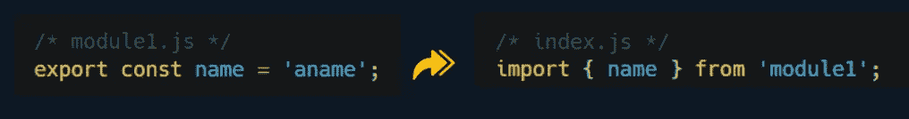
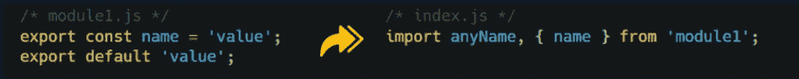
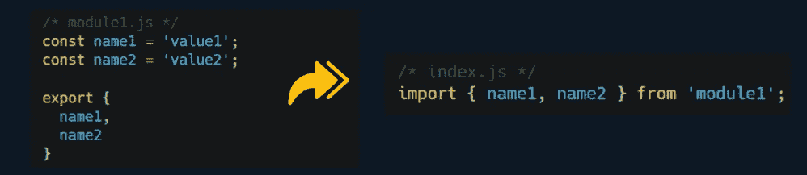
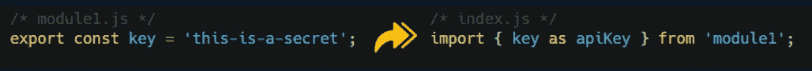
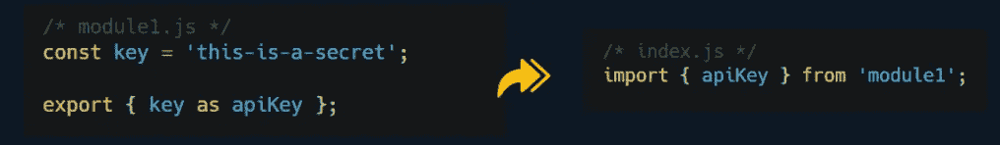
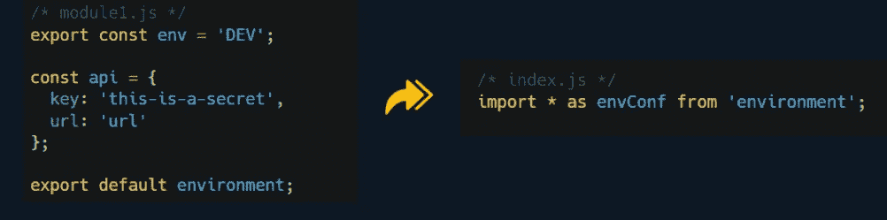

# 把你的应用分成几个盒子！

> 原文：<https://levelup.gitconnected.com/break-your-app-into-boxes-e876937e3206>

## JavaScript 中的模块

作者:FAM

## 你好👋

是时候学习你发展所需的基本知识了。JS 中的模块！

# 💣问题是

在实际应用中，代码行的数量不断增长。将所有内容放在一个文件中是不可能维护和阅读的。

组织是解决这个问题的关键。这就是模块的工作。

# 解决方案:JS 模块

> 模块是一个导出代码的文件

应用程序中的模块用于根据功能将代码分离到不同的文件中。

## -模块内容

JS 模块可能包含 ***变量，对象*** ， ***函数*** ， ***类***…等等。

## -模块使用

因此，在主程序内部，当你需要一个特定的功能时，你只需要从专用于该功能或任务的模块(文件)中导入即可。

作者:FAM

在这里找到上面例子的**源代码**:

 [## 2022-网络计划/第 4 章/主 famzila 模块/2022-网络计划

### 在 GitHub 上创建一个帐户，为 famzila/2022-WEB 程序开发做出贡献。

github.com](https://github.com/famzila/2022-WEB-PROGRAM/tree/main/Chapter4/module) 

## 模块可以用不同的方式导出其代码:

*   **名称导出**

作者:FAM

*   **默认导出:**带`***default***`关键字，不需要任何名称。你想怎么命名就怎么命名:

作者:FAM

*   **默认+命名导出**

作者:FAM

*   **列表出口**

作者:FAM

*   **重命名导入**

作者:FAM

*   **重命名导出**

作者:FAM

*   **全部导入**

作者:FAM

# 基于➕模块的应用优势

*   更好的可维护性
*   组织和可读性
*   该应用程序变得可摇动。您导入您需要的东西，去掉其余的，这将导致更小的包大小，从而获得更好的性能。
*   模块允许你把你的代码分解成单独的文件(比如拼图)。
*   减少开发人员的调试难题😉

今天就到这里，看阿雅🙋

如果您有任何问题或反馈，请点击评论或通过 LinkedIn 联系我— **我洗耳恭听！**

[**想请我喝杯咖啡吗？☕️**](https://www.buymeacoffee.com/fatimaamzil)

> 让我们为 2022 年打造一个更好的‘我们’！

## 了解有关 2022 年网络快车计划的更多信息:

I- [通用网络知识](https://medium.com/geekculture/2022-web-program-chapter-n-1-is-done-499fb0707220?source=your_stories_page----------------------------------------)

[II-网页框架:HTML](https://famzil.medium.com/your-html-essentials-69d9b2349355?source=your_stories_page----------------------------------------)

[III-网页样式:CSS](https://medium.com/geekculture/recap-of-the-css-chapter-ae388d51e564?source=your_stories_page----------------------------------------)

## IV- Web 交互:JavaScript

*   [异步代码](https://javascript.plainenglish.io/can-the-web-live-without-asynchronous-code-7f61fe2e862e?source=your_stories_page----------------------------------------)
*   [这个](https://medium.com/geekculture/this-for-developers-5dc91d499677?source=your_stories_page----------------------------------------)
*   [变量](https://medium.com/codex/js-variables-what-you-need-to-know-fb8994ed9d0d?source=your_stories_page-------------------------------------)
*   [范围&吊装](https://javascript.plainenglish.io/js-mechanism-you-should-know-12431e094103?source=your_stories_page-------------------------------------)
*   [操作员](https://javascript.plainenglish.io/js-operators-3511c8545719?source=your_stories_page-------------------------------------)
*   [关闭](https://famzil.medium.com/js-closures-99666fe36a6a?source=your_stories_page-------------------------------------)
*   [高阶函数](https://famzil.medium.com/whats-hof-in-javascript-9fb68a9c3f6f?source=your_stories_page-------------------------------------)
*   [对象&方法](https://famzil.medium.com/objects-in-javascript-64fa3e82765f?source=your_stories_page-------------------------------------)
*   [数组，设置&贴图](https://javascript.plainenglish.io/data-structures-in-js-9a13f7aa82b3?source=your_stories_page-------------------------------------)
*   [功能&箭头功能](https://famzil.medium.com/arrow-functions-in-js-235b5ade3958?source=your_stories_page-------------------------------------)
*   [超时&间隔](https://famzil.medium.com/timing-events-in-javascript-d44c24ed8641?source=your_stories_page-------------------------------------)
*   [破坏&蔓延](https://famzil.medium.com/destructuring-spread-syntax-in-js-d9260a725c99)
*   [承诺](https://famzil.medium.com/how-javascript-promises-you-e0039fe341ba?source=your_stories_page-------------------------------------)
*   [异步，等待](https://famzil.medium.com/making-async-code-looks-like-sync-code-in-js-b0f5133e14ae)

> ***模块***

*   班级
*   ES6+语法

 [## 2022 网络计划启动！

### 改变来自心态和习惯

medium.com](https://medium.com/geekculture/2022-web-program-is-launched-f38a3280af1a) 

与想成为 web 开发人员的人分享该程序！这将有助于保持进步，并在旅途中互相帮助。

> 如果你喜欢我的文章， [**订阅**](https://famzil.medium.com/subscribe) 获取我的最新。如果你自己喜欢体验媒介，可以考虑通过[**注册会员**](https://famzil.medium.com/membership) 来支持我和其他成千上万的作家。它只需要每月 5 美元，它支持我们，作家，你也有机会用你的作品赚钱。当然，你可以随时取消会员资格。通过注册[这个链接](https://famzil.medium.com/membership)，你将直接用你的一部分费用来支持我，不会花你更多的钱。如果你这样做了，万分感谢！

让我们**联系上** [**中**](https://medium.com/@famzil/)**[**Linkedin**](https://www.linkedin.com/in/fatima-amzil-9031ba95/)**[**脸书**](https://www.facebook.com/The-Front-End-World)**[**insta gram**](https://www.instagram.com/the_frontend_world/)**[**YouTube**](https://www.youtube.com/channel/UCaxr-f9r6P1u7Y7SKFHi12g)**或**********

**** [## 通过我的推荐链接——FAM 加入 Medium

### 作为一个媒体会员，你的会员费的一部分会给你阅读的作家，你可以完全接触到每一个故事…

famzil.medium.com](https://famzil.medium.com/membership)****