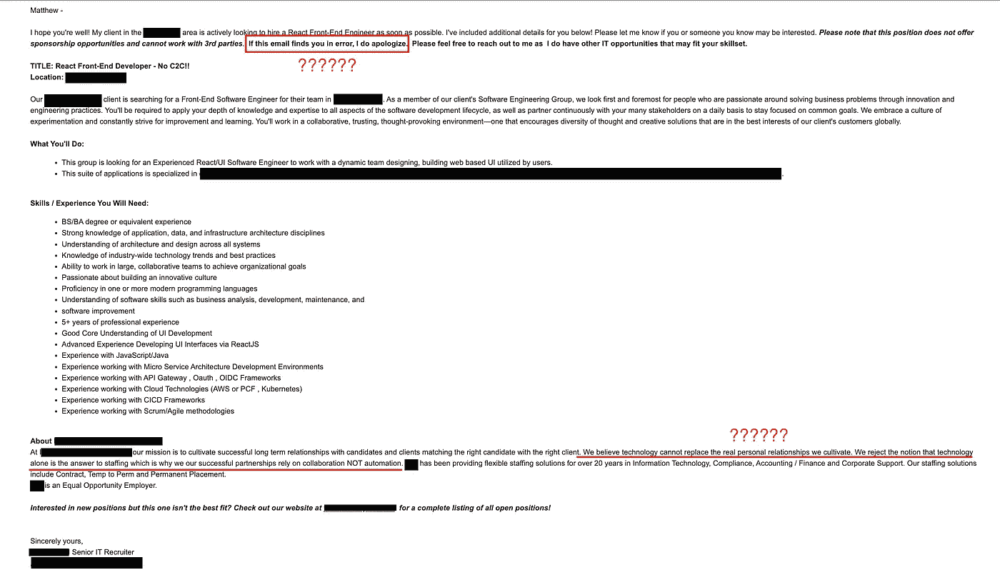

# 破解一封(非常糟糕的)科技招聘人员的冰冷邮件

> 原文：<https://levelup.gitconnected.com/breaking-down-a-very-bad-tech-recruiters-cold-email-b4a022fd67e0>

## 对一封冷漠邮件的全面而热情的分析

埃里克·麦克林在 [Unsplash](https://unsplash.com/s/photos/you%27ve-got-mail?utm_source=unsplash&utm_medium=referral&utm_content=creditCopyText) 上的照片

如果你读了[我的上一篇文章](/how-not-to-recruit-a-software-engineer-c05bffbb1793?sk=5fa536d881a4f4e9f11e6ad348215d69)，我对软件工程行业普遍存在的招聘方式有一点点批判。我的帖子包括我收到的一封冷冰冰的电子邮件的细目，为什么它没有考虑到我的时间，以及它如何让我想起我刚开始时收到的冰冷电子邮件的艰巨任务。

好吧，我有另外一个给你——而且更好(或者更差，取决于你如何看待事情)。让我们直接开始吧。

下面是某人发给我的一封电子邮件的截图，你可以告诉*真的*花时间确保他们包括了工作要求的所有内容。他们太专注于全面的要求，以至于他们似乎忘记了…这对候选人有什么好处。

我为小字体道歉。你看，邮件正文是如此的*大、*如此的*全面、*如此的*详细，以至于我不得不在我的电脑上把它缩小才能看到全部内容。如果你看不到突出显示的部分，别担心，我会解释的。*

首先，在给我任何工作细节之前，他们道歉了？

我不记得上一次(如果有的话)我收到一份以道歉开头的工作描述(或者包括道歉)，说“如果这封邮件发现你有错……”如果你找我来担任这个角色，它怎么会发现我有错呢？这不像他们可能使用自动服务来发送这个爆炸。

是吗？

当然不是！在底部(也用红色突出显示)，他们特别声明:

> 我们相信技术不能取代我们培养的真实的人际关系。我们拒绝技术本身就是解决人员配备问题的答案的观点，这就是为什么我们(原文如此)我们成功的伙伴关系依赖于协作而不是自动化。

哇！很高兴他们澄清了这个问题。我仍然不能很好地解释为什么这样一封“私人”邮件会错误地传到我这里，但是让我们继续。

第二个问题，也可能是最令人炫目的，他们说 ***字面上没有*** 关于报酬或福利的内容。

他们谈了一点公司的情况，列出了每一个需求(其中之一是“软件改进”)。我真的很担心他们会错过那个！)，甚至是底部那个可爱的小标语，上面写着他们优先考虑个人关系，认为自动化本身不是解决方案。

但是，工资呢？

健康保险？

披萨派对？

但是说真的，很遗憾他们没有为福利或薪水写任何东西。不然我怎么知道它是“竞争性的”还是“DOE”的？

第三个缺陷，他们在需求中提到(作为一名 React 开发人员)，候选人需要“精通一门或多门现代编程语言。”我是说，这不是不合理的要求。我想如果我要成为一名拥有 5 年专业经验的 React 开发人员，我应该*至少*懂 JavaScript。

第四，他们*字面上*要求“JavaScript/Java 经验”稍微深入一点。他们真的*需要*来(单独)指定候选人，他将是一名 React 开发人员，希望有 5 年的专业经验，需要有…

*   一种或多种现代编程语言
*   JavaScript 使用经验
*   Java 使用经验

这就引出了第五点。“JavaScript/Java”？我只需要其中一个吗？他们认为他们可以互换吗？剧透警告:[他们不是](https://www.guru99.com/difference-between-java-and-javascript.html)。

最后，在底部，他们有一个漂亮的小纸条，上面写着…

> 对新职位感兴趣，但这个职位不是最合适的？请访问我们的网站，查看所有空缺职位的完整列表。

在一封关于求职的邮件中包含这一点本身并不坏。有时候，这封冷冰冰的邮件是有根据的、经过研究的、全面的。这是一封很棒的邮件，但是你对这份工作不感兴趣，或者你觉得自己不符合所有的要求。

公平。

但是对于这封邮件，为什么呢？为什么你要特意给我发一封非常“私人”的、*肯定不是自动的、*措辞糟糕、不太合适的电子邮件呢？这是一封私人邮件，他们希望不会发现我的错误，*和*这可能不是最好的选择？

不过没关系！因为之后*他们*告诉*我*去查看*他们*的网站，以防*他们*在向我推销这份工作时做得不好(基本上违背了我的意愿)。真是明里暗里 ***我*** *向你***借了钱，原因不明，而* ***我*** *现在要求* ***你*** *向* ***Venmo 我*** *要这笔钱**

*我已经对这些普通的，喷雾和祈祷，含糊不清的薪水冰冷的电子邮件感到恼火，但是*这个？软件工程就业市场的新进入者将会看到这一点(希望有不同的经验要求)并失去脑细胞。**

*更糟糕的是:他们会感到有压力去寻找这个可怜的借口，因为他们渴望得到一份工作，这比申请另一份你可能永远不会再有回音的工作好得多。*

## *摘要*

*很抱歉这么说，但我觉得我现在处于一个独特的位置，凭借我所拥有的经验和工作保障，我可以对这些招聘人员举起一面镜子，提醒他们在电子邮件的另一端还有人。*

*他们也只是给了技术招聘人员一个不公正的评价。我曾与优秀的招聘人员共事过(其中一位让我找到了现在的工作)。这些招聘人员真正充当了工程师的代言人，同时也有效地填补了有需要的公司的职位空缺。*

*虽然我不确定，但我敢打赌他们也是最成功的招聘者。*

*你是一个感觉不同的招聘人员还是工程师？不要害怕让我在评论中听到它！*

*[***升级您的免费 Medium 会员资格***](https://matt-croak.medium.com/membership) *并接收各种出版物上数千名作家的无限量、无广告的故事。这是一个附属链接，你的会员资格的一部分帮助我为我创造的内容获得奖励。**

**您也可以通过电子邮件* *订阅，每当我发布新内容时，您都会收到通知！**

**谢谢！**

# *参考*

* [## 如何不招软件工程师

### 时间是我们最宝贵的财富；不要浪费它

levelup.gitconnected.com](/how-not-to-recruit-a-software-engineer-c05bffbb1793)  [## Java 与 JavaScript:Java 和 JavaScript 的主要区别

### Java vs JavaScript 教程:你将学习 Java 和 JavaScript 的区别，特性，应用，优势…

www.guru99.com](https://www.guru99.com/difference-between-java-and-javascript.html)*