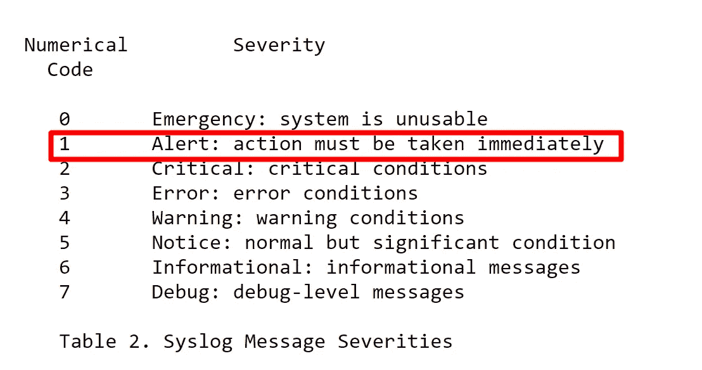
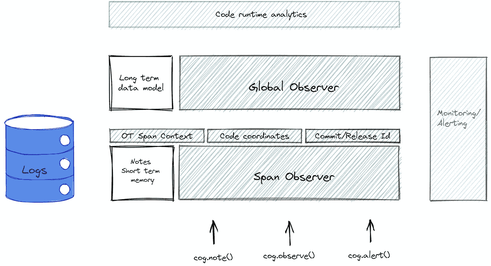
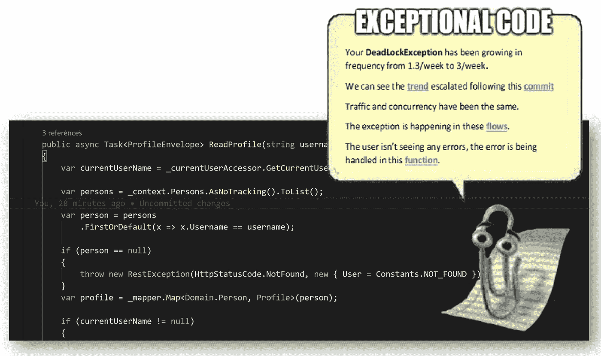

# 打破编码中的第四堵墙

> 原文：<https://levelup.gitconnected.com/breaking-the-fourth-wall-in-coding-189055955c85>

## 日志和跟踪是媒介，绝对不是消息

> 在[之前的一篇文章](/ci-cd-cf-the-devops-toolchains-missing-link-b5c88caf6282)中，我解释了为什么我认为我们应该关心*持续反馈*以及为什么它是 DevOps 生态系统中不知何故从未被开发的一个元素。今天，我想讨论一下我们目前在代码中使用的反馈，以及如何改进它。

对于任何不熟悉这个概念的人来说，“打破第四堵墙”是指演员突然转向观众并眨眼，承认他们的存在，甚至直接对他们说话的那一刻。这是对演员和观众之间不成文契约的小小违反。毕竟，我们期望的交流类型是纯单向的。

我们居住的两个现实，一个是虚构的，一个是希望真实的，不应该发生冲突。仅仅承认观众的存在是一种事实上的元剧，但它也可以是剧本的一个伟大的叙事工具。

为什么我要花这么多时间在一篇面向开发者的文章中描述人物和故事？我们的代码在生产中执行脚本指令。可观察性是我们如何在运行时戏剧展开后扮演观众。如果我们能改善这种交流，我们就能创造更好的系统，更容易维护和发展。[实际上，我碰巧看到了许多其他有用的写作和代码之间的相似之处，但这可能是另一篇文章的主题。]

那么这与我们今天所做的有什么不同呢？当然，我们有跟踪和日志可以用来提供关于我们的测试和生产环境中正在发生的事情的信息。我们甚至有平台可以筛选这些日志，并识别海量数据的趋势。这难道不能让开发人员了解正在发生的事情吗？第四堵墙已经破了吗？

不。至少我是这么认为的。我觉得我们缺少三个元素来使我们与运行时的交流有效:**意图**、**上下文**和**反应**。我在这篇文章中的目标是提供一个固执己见的替代方法和平台基础。我觉得我们现在需要更新我们的假设，因为我们不仅仅是像过去几十年中日志所做的那样将消息写入文件。请记住，这些想法仍在形成中，所以请对所有事情持保留态度，无论措辞多么果断:)

## logger.error('here2 ')

我最近碰到了这条特定的线，但是我已经看到了数百次这种模式的变体。当日志成为函数的内部跟踪时，使用“我们在这里”日志类型。它是一些调试尝试或先发制人地放置标志发布消息的产物。它有时可能相当合理，但经常被滥用，被投机性地添加，并且很少保持一致。

`logger.error('we are here doing that')`有两个问题。第一个是缺乏背景，我将在这篇文章的后面详述。另一个问题更加深入，它与我们的日志方法中根本没有的东西有关: **intent** 。为了澄清，我们可以问这样一个问题:为什么日志消息的作者决定将此消息归类为“错误”？

答案当然是肯定的——所以它会显示在日志中！“错误”或“致命”通常是您可以使用的最高级别的严重性/详细程度。这是一种让你的日志脱颖而出或者避免被过滤的方法。这个答案引出了一个更大的问题，一个始于四十年前的问题。

## 跟踪|调试|信息|警告|错误

80 年代发明的旧的[系统日志](https://en.wikipedia.org/wiki/Syslog#Severity_level)格式引入了我们今天知道的基本“严重性”级别。有趣的是，最初的版本也有一个“紧急”的严重性和其他一些挑剔的水平，后来从使用中消失了。这种格式的问题是，今天它错误地将两种不同的关注点结合在一起— **冗长性**和**严重性。我们甚至有一个可疑的模糊术语——日志级别。**

思考:所有重要的事情都是“错误”吗？我们真的需要将一行归类为“错误”来引起注意吗？如果我们确实发现了足以成为“错误”或“警告”的重大事件，我们会期望发生什么？它是否应该只是日志中的一行，以便某个人以后查看？无论我们选择哪种方法，日志背后的意图都会在翻译中丢失。

最初的系统日志格式实际上有一个“警报”严重级别，定义为:“必须立即采取行动”:

来源:[https://datatracker.ietf.org/doc/html/rfc5424](https://datatracker.ietf.org/doc/html/rfc5424)

如果日志描述了一个需要“立即行动”的事件，会发生什么情况，我该怎么做？我可能很想利用日志的严重性，但是正如我们看到的，它实际上是伪装的冗长。如果这还不够，日志往往会变得凌乱不堪，被遗留的痕迹和平台消息所污染。我还没有去过一个工程组织，在那里一个“错误”级别的新条目会引起轰动。如果我想立即行动，日志不会让我去那里。

## 可观测性的反演

让我们暂时忘记日志和跟踪这两个术语，想想这些特定的代码行给我们带来的机会。这是执行工作流的一部分，可以完全访问它的变量和状态，只是等待一些拍摄时间。我们有十秒钟的时间，在这段时间里，演员将目光投向观众，对形势进行敏锐的观察，我们如何才能最好地利用这段时间呢？

关键是我在前面的例子中提到的:*意图。*我们想要完成什么？我们希望手中的信息如何处理？

我想建议三个有用的**动词**或功能来表达不同的可能意图。这些是对**跟踪|信息|警告|错误**严重性的直接替代。这些新的动词或函数都有不同的参数、功能和期望。我希望在阅读完这个例子后，你会同意我的观点，这将提供真正的价值。

对于这个例子，以及接下来的例子，我们需要一个占位符对象来操作和调用这些函数。由于“logger”不再胜任这项任务，我们将在示例代码中使用一个虚构的对象来操作。现在，我们姑且称之为‘cog’，简称‘T6’认定【T7’。这些接口都是模拟的，是用来传达方法和好处的。

## 注意()

我们从取证用例开始。我们的目标是获取信息，不是因为它有什么重要的意义，而是因为如果我们发现问题，它可能是相关的。可以说，我们正在为将来的调试会话存放一个挖掘工件。严重性无关紧要。因为我们只想记录事实和数据，所以界面变得更加简洁:

有几件事很突出。首先，冗长消失到哪里去了？“坚持”是怎么回事？要完全回答这个问题，我们需要给出更多关于容器对象的角色以及它允许我们实现什么的剧透。请再坚持一会儿，直到我们讨论其余的动词。

我想指出的是，将“信息”与我们想作为证据保留的任何背景或人工制品分离的重要性。由于我们不再将它视为传统意义上的日志，我们可以考虑一种比提交到文件的文本行更现代的数据结构。从分析的角度来看，这将使我们能够标准化这些参数，并更容易地比较不同的*注释*，即使它们没有标准化，或者如果我们决定更改消息文本。

信息金块是重要的，但它们真正为我们服务的地方是在对一些其他问题的调查中。输入我们的第二个动词。**观察。**

**观察**用例是关于我们不确定但值得继续观察和跟进的数据。当我在这篇文章的研究中查看不同公共存储库中的日志时，这些是我遇到的大多数用例。这可能是正在处理的内部错误，一些预期的或低影响的异常，或者只是我们没有预料到的情况。

请注意我们是如何将保存任何笔记和工件与注意到我们需要跟踪的行为分离开来的。通过这样做，我们可以解决当今伐木业的一个大问题。大多数法医日志是完全无趣的，直到他们。也就是说，在执行路径的更深处，异常或有趣的事件会使到目前为止收集的所有信息突然变得重要。

使用这种方法，我们可以保存我们**认知**上下文中的所有笔记，并决定是否只在有趣的事情发生时才保留它！当然还有更多。但是让我们先总结一下我们的词汇。准备好下一个也是最后一个动词了吗？

在代码中有一些特定的位置，你知道如果这样那样的事情发生了，就该担心了。数据不一致带来的财务影响、安全问题、关键流程受损以及各种其他场景，都是开发人员的噩梦。**报警**动词集成到可观察性/监控解决方案中。根据严重程度，它实际上会吸引人们注意力的系统。

这里也一样，因为我们一直在跟踪特定跨度内的所有取证(如果我们使用 OpenTelemetry)。这种新的数据结构将更加适合捕获应用程序级别的分析，因为它结合了度量日志和遥测数据以及与工件的链接，并且已经可以对类似的数据集进行聚类，并显示哪些流受到了影响，而哪些没有。我们将能够自动进行比较，看看是什么让失败的跨度与成功的跨度相似或不同。

## 变成一个反应式的观察平台

是的，那升级得相当快…虽然我想更逐渐地呈现这个新架构，但现在没有选择，只能在这个阶段放下窗帘，引入超越这个“认知”引擎的概念。这是后端，将使基于意图的产品开发沟通成为可能。这是一张餐巾纸示意图，不需要太深入，但我会用它来阐明我所建议的范围:

本质上，最终结果将是一个平台，它可以处理持续的取证数据输入和行为观察，提供相关的上下文，并继续跟踪和学习所提供的示例，如我们所述进行反馈。输出将不是文件或数据库中的日志行(尽管日志仍将被转发到日志记录系统)，而是一个分析数据模型，它可以直接映射回 IDE 或通过其自己的仪表板进行访问。

超越特定的加班时间范围，长期数据模型将允许我们回答这样的问题:异常的频率有什么不同吗？堆栈跟踪和通向它的流程中有什么变化吗？在性能或错误方面对最终用户有新的影响吗？哪些跨度出现了此错误，它们在来源、数据或环境方面有何相似之处？该数据模型可用于创建趋势、警报，并与提交标识符或并发度量等上下文相关联。

实际的用户界面可能会有所不同，在这个截图的制作过程中没有任何剪辑被破坏

以上是我们可以在代码中使用的信息类型的概念化(和戏剧化)，以便在上下文中查看信息**，并在设计我们的软件时应用有用的分析。此外，由于我们本质上是在与一个有状态的系统进行通信，因此我们可以通过“添加到我的观察列表”、“创建和跟踪问题”(关联所有相关信息)，甚至“添加升级条件”等指令来影响观察结果。**

## 摘要

不久前，有人向我介绍了“反应式收藏”，最近我在看[这个项目](https://github.com/reactivemarbles/DynamicData)。众所周知，反应式集合很难调试和排除故障，但它却非常强大。它们反转了控制流，这样我们就可以从源代码开始，以事件驱动的方式添加功能层，而不是从外向内迭代集合。

从架构上来说，这类似于从外到内分析可观测性数据(如现有工具所做的)和创建观察和观察器处理数据并向外发出事件之间的方法变化。从平台的角度来看，它还为我们提供了更好的数据，因为当问题发生时，我们的观察者存在于代码中，而不是试图从消息和日志中重建事件。

最后，这里有一个机会。在非结构化日志、跟踪数据、基础设施、数据指标和用户分析之间，我们可以开始考虑未来的数据模型，以高效和**可查询的**方式存储信息。一种活的、开放的数据结构格式，远远优于文件中的字符串，可以表示消费者和代码之间双向通信的有状态应用程序。

如果这些看起来存在，它可能仍然存在…我已经开始招募团队来推动这些开源项目，希望我们很快会有更多真正的代码来讨论。和往常一样，如果你有兴趣成为其中的一员，我的邮箱是 roni.dover@gmail.com 或 Twitter 上的@doppleware。很想听听你的想法！

编辑 4/13 :我实际上能够和一个小团队围绕这些想法开始一个开源项目。来看看[这里](https://github.com/digma-ai/digma)！

## 关于上下文的结语

关于日志记录和可观察性，我还想讨论一个话题。对背景的需求。

考虑我们讨论过的“我们在这里做那件事”的信息:“这里”在哪里？我们需要的最简单的上下文类型是在代码中自我定位的能力。令人惊讶的是，这不是微不足道的。当然，有些日志会添加类名或方法名，但是提交标识符或版本呢？如果我们没有把日志放在它被编写的上下文中的钥匙，怎么可能跟踪日志呢？

下一级上下文是该日志所属的整体流。该日志文件是哪个请求流的一部分？例如，如果使用 OpenTelemetry，包含[跨度上下文](https://opentelemetry.lightstep.com/core-concepts/context-propagation/)是有意义的。使用适当的仪器，可以帮助我们将日志放在正在执行的操作的整体范围内。

最后，我们需要了解一些我们正在调查的内容的背景。是什么促使我们调查这条信息，它们之间有什么联系？是安全问题吗？性能问题？一只难以捉摸的虫子？这一区间的特定数据与我们收集的其他数据有何不同或相似之处？

没有上下文的信息会让我们慢下来，很难进行有意义的对话。不幸的是，今天的日志框架并没有以一种使收集它变得容易的方式进行检测。这是可以做到的，但总是定制工作需要优先于其他紧急任务。我经常看到日志缺少这些关键的部分。

如果你已经坚持了这么久，你肯定应该成为这个项目的一部分:)感谢你接受所有这些想法。同时，保持冷静和…

